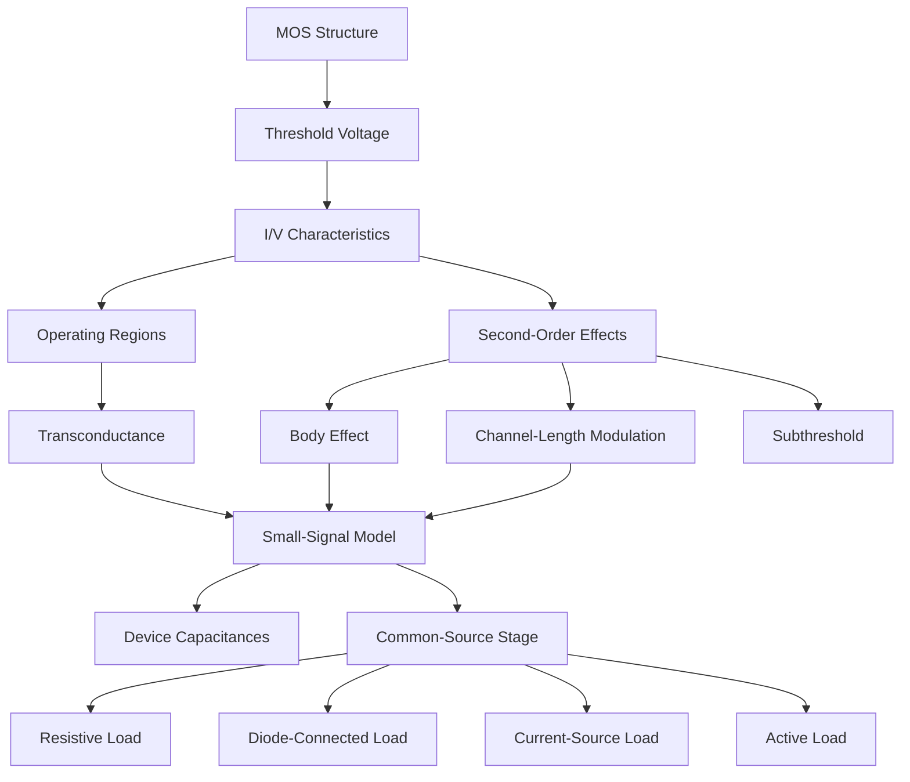

# 🗺️ Analog IC Study Roadmap

> **Your Guide to Mastering Chapters 2-3 for the Exam**

---

## 📚 Concept Flow Diagram

---

## 🎯 Topic Priority Matrix

Based on analysis of **3 question papers**, here's what to focus on:

| Priority | Topic | Marks | Study Time |
|----------|-------|-------|------------|
| 🔴 **CRITICAL** | Cox calculations | 10M × 3 | 30 min |
| 🔴 **CRITICAL** | Transconductance (kn, βn, gm) | 10M × 3 | 45 min |
| 🔴 **CRITICAL** | Drain current with body effect | 10M × 3 | 45 min |
| 🔴 **CRITICAL** | Rn/Rp resistance | 10M × 2 | 30 min |
| 🔴 **CRITICAL** | CMOS process & layout | 10M × 2 | 30 min |
| 🟡 **HIGH** | Small-signal gain | 10M × 1 | 45 min |
| 🟡 **HIGH** | Operating region ID | 10M × 1 | 20 min |
| 🟢 **MEDIUM** | SPICE parameters | 10M × 1 | 15 min |

---

## 📖 Recommended Study Order

### Day 1: Foundations (2-3 hours)
1. ✅ [08_formula_sheet_ultimate.md](08_formula_sheet_ultimate.md) — Quick overview of all formulas
2. ✅ [01_mos_device_physics.md](01_mos_device_physics.md) — Structure, regions, symbols
3. ✅ [02_iv_characteristics.md](02_iv_characteristics.md) — Core I/V equations

### Day 2: Core Concepts (2-3 hours)
4. ✅ [03_transconductance.md](03_transconductance.md) — All gm expressions
5. ✅ [04_second_order_effects.md](04_second_order_effects.md) — Body effect, CLM
6. ✅ [05_device_models.md](05_device_models.md) — Capacitances, small-signal

### Day 3: Circuit Applications (2-3 hours)
7. ✅ [06_common_source_stage.md](06_common_source_stage.md) — All CS configurations
8. ✅ [07_worked_problems.md](07_worked_problems.md) — ALL question paper solutions

### Exam Day: Quick Review (30 min)
- [08_formula_sheet_ultimate.md](08_formula_sheet_ultimate.md) only
- Focus on boxed formulas

---

## ⚡ Quick Concept Connections

| When you see... | You need... | Found in... |
|-----------------|-------------|-------------|
| tox, εox, ε0 | Cox formula | [Formula Sheet](08_formula_sheet_ultimate.md#oxide-capacitance) |
| μn, Cox, W/L | kn, βn | [Transconductance](03_transconductance.md) |
| γ, 2φF, VSB | Body effect VTH | [Second-Order](04_second_order_effects.md) |
| VGS, VDS, VTH | Region check → ID | [I/V Chars](02_iv_characteristics.md) |
| Ron, Rn, Rp | Deep triode | [Formula Sheet](08_formula_sheet_ultimate.md#on-resistance) |
| gm, rO, gmb | Small-signal | [Device Models](05_device_models.md) |
| Av, RD, gain | CS Stage | [CS Stage](06_common_source_stage.md) |

---

## 📝 Exam Strategy

### Before the Exam
1. Memorize the 3 forms of gm
2. Know Cox calculation cold
3. Practice body effect VTH problems
4. Review sign conventions

### During the Exam
1. **First 5 min**: Scan all questions, identify topics
2. **Start with**: Calculation questions (Cox, gm, ID)
3. **Leave for last**: Descriptive questions (layout, process)
4. **Always check**: Units, region of operation, signs

### Common Mistakes to Avoid
- ❌ Forgetting to convert tox units (Å → cm)
- ❌ Using wrong region equation
- ❌ Ignoring body effect when VSB ≠ 0
- ❌ Wrong sign for PMOS VTH

---

## 📊 Files in This Study Guide

| File | Content | Pages Covered |
|------|---------|---------------|
| [01_mos_device_physics.md](01_mos_device_physics.md) | Structure, regions, symbols | 26-29 |
| [02_iv_characteristics.md](02_iv_characteristics.md) | VTH, ID equations | 29-38 |
| [03_transconductance.md](03_transconductance.md) | gm, kn, βn | 38-39 |
| [04_second_order_effects.md](04_second_order_effects.md) | Body effect, CLM, subthreshold | 39-44 |
| [05_device_models.md](05_device_models.md) | Layout, caps, small-signal, SPICE | 44-55 |
| [06_common_source_stage.md](06_common_source_stage.md) | All CS configurations | 64-79 |
| [07_worked_problems.md](07_worked_problems.md) | ALL exam questions solved | — |
| [08_formula_sheet_ultimate.md](08_formula_sheet_ultimate.md) | Complete formula reference | All |
