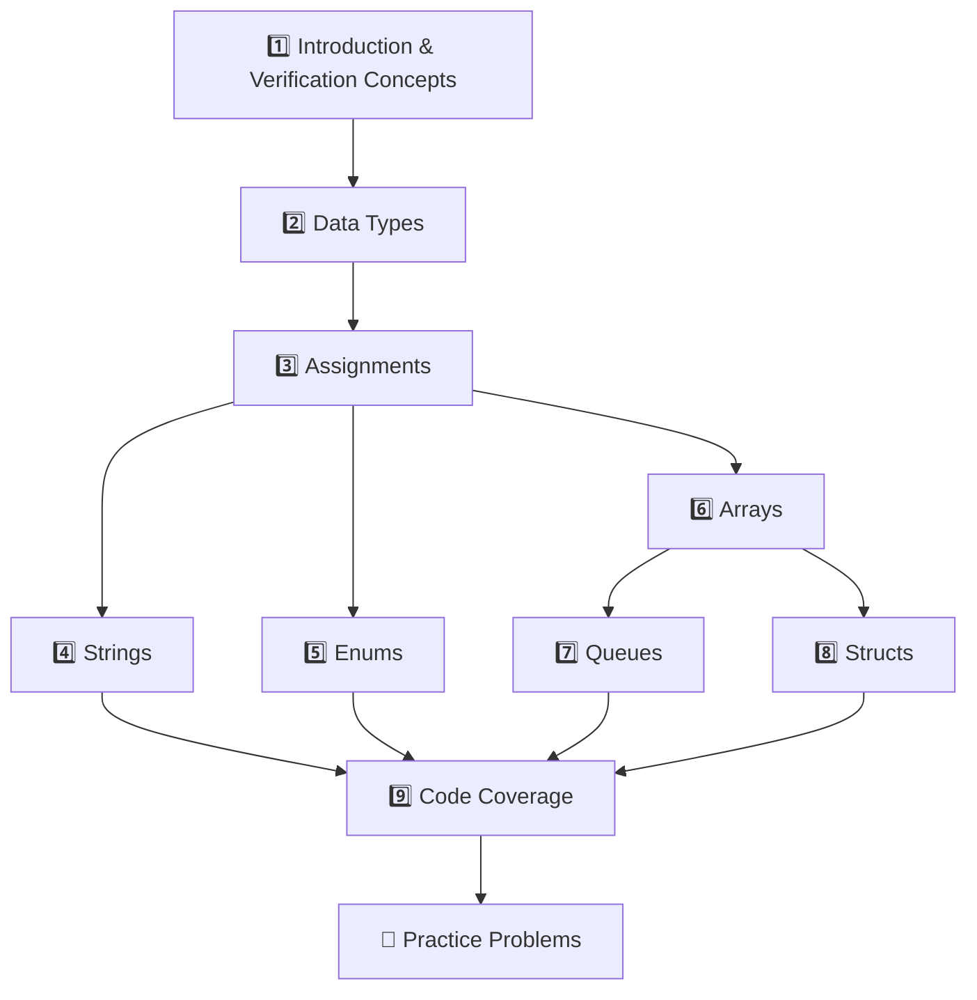

# 📚 HDL Verification Study Guide

> Your complete roadmap for mastering **SystemVerilog HDL Verification and Methodologies**

---

## 🗺️ Learning Roadmap

Follow this order to build a strong foundation before tackling advanced topics:

---

## 📖 Topic Quick Reference

| # | Topic | Key Concepts | Time | Notes File |
|---|-------|--------------|------|------------|
| 1 | **Introduction** | Verification importance, testbenches, DUT | 30 min | [[01_Introduction]] |
| 2 | **Data Types** | wire, reg, logic, int vs integer | 45 min | [[03_Data_Types]] |
| 3 | **Assignments** | Blocking (=), Non-blocking (<=), procedural vs continuous | 30 min | [[04_Assignments]] |
| 4 | **Strings** | String operations, concatenation, comparison | 30 min | [[05_Strings]] |
| 5 | **Enums** | typedef enum, first(), last(), next() methods | 30 min | [[06_Enums]] |
| 6 | **Arrays** | Packed, unpacked, dynamic arrays | 45 min | [[07_Arrays]] |
| 7 | **Queues** | Queue operations, slicing, push/pop | 30 min | [[08_Queues]] |
| 8 | **Structs** | Packed vs unpacked structs with arrays | 20 min | [[09_Structs]] |
| 9 | **Code Coverage** | Statement, branch, toggle, FSM coverage | 45 min | [[02_Code_Coverage]] |
| 10 | **Practice** | Assignment questions with solutions | 2 hrs | [[10_Practice_Problems]] |

**Total Study Time:** ~6-7 hours for core concepts

---

## 📁 Original Reference Materials

> [!TIP]
> After completing the organized notes, refer to these original PDFs for deeper understanding:

### Primary References (Study in This Order)

| When to Use | File | Description |
|-------------|------|-------------|
| **After Topic 1** | `Module_1_introduction.pdf` | Detailed verification concepts, testbench architecture |
| **After Topic 9** | `Module_2_code coverage.pdf` | Deep dive into coverage types and strategies |
| **During Practice** | `Assignment-=1.pdf` | All 10 practice questions with guidelines |

### Comprehensive Reference (Use Anytime)

| File | Pages | Use Case |
|------|-------|----------|
| `System Verilog-2-310.pdf` | 309 | **Main reference** - Use when you need detailed syntax or advanced features |
| `0bb67d98-8de0-40ef-8547-b7ec64607223.pdf` | 182 | Additional comprehensive reference |

> [!NOTE]
> Keep these PDFs handy! The organized notes cover the essentials, but these references have the complete details.

---

## 🎯 Exam Preparation Strategy

### Week Before Exam
1. ✅ Complete all topic notes (Topics 1-9)
2. ✅ Attempt all practice problems without looking at solutions
3. ✅ Review code coverage concepts (frequently tested!)

### Day Before Exam
1. 📝 Review the Quick Reference table above
2. 💻 Run through code examples in `Code_Examples/` folder
3. 🔍 Focus on: Data Types differences, Array types, Queue operations

### Key Topics to Memorize
- [ ] Difference between `wire`, `reg`, and `logic`
- [ ] When to use `=` vs `<=`
- [ ] Packed vs Unpacked array differences
- [ ] Queue built-in methods (push_back, pop_front, etc.)
- [ ] Types of code coverage

---

## 📂 Code Examples

Practice these SystemVerilog programs:

| File | Topics Covered |
|------|---------------|
| `Code_Examples/enum_examples.sv` | Enum declaration, typedef, iteration methods |
| `Code_Examples/queue_examples.sv` | Queue operations, slicing, concatenation |
| `Code_Examples/array_examples.sv` | Dynamic arrays, filtering with conditions |
| `Code_Examples/string_examples.sv` | String processing, vowel counting |

---

## 🔗 Navigation

**Start here:** [[01_Introduction]]

**Jump to practice:** [[10_Practice_Problems]]

---

*Last updated: January 29, 2026*
