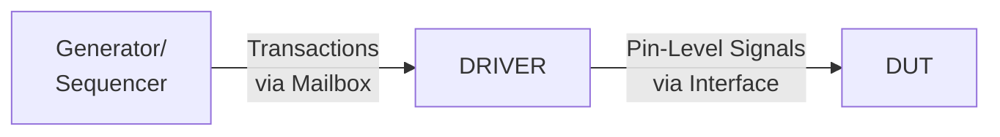

>[!info] Assignment Details:-
>**Name**: Rikhil Nellimarla
>**Registration** Number: 23BEC7030 
>**Course Name**: HDL Verification
>**Slot**: F1 + TF1

---

## Question 1(a): Role of Driver in Layered Testbench

**Question:** Briefly discuss about the role of driver while configuring a layered testbench to verify any DUT. Clearly discuss about input and output flow for "Driver" component.

### Answer

The **Driver** is a critical component in a layered testbench architecture that acts as the bridge between the abstract transaction-level stimulus and the pin-level signals of the DUT (Design Under Test).

#### Role of Driver

1. **Transaction to Signal Conversion**: The driver receives high-level transactions from the generator/sequencer and converts them into pin-level signal activity that the DUT can understand.

2. **Protocol Implementation**: It implements the timing and protocol requirements of the interface, ensuring signals are driven according to specification.

3. **Synchronization**: The driver synchronizes with the DUT's clock and handles timing constraints.

4. **Abstraction Layer**: It provides abstraction between verification components and the physical interface.

#### Input and Output Flow



**Input Flow (to Driver):**
- Receives transaction objects from the Generator/Sequencer via a mailbox
- Each transaction contains abstract stimulus information (addresses, data, commands)
- The driver uses `mailbox.get()` to fetch transactions

**Output Flow (from Driver):**
- Converts transaction fields to actual signal values
- Drives signals through a virtual interface connected to the DUT
- Follows the protocol timing (clock edges, setup/hold times)
- May also send driven transactions to other components (like scoreboard) for checking

---

## Question 1(b): SystemVerilog vs Verilog HDL for Verification

**Question:** Which features of the System Verilog make it preferable over Verilog HDL when verification of a DUT is the main objective? Briefly discuss about them.

### Answer

SystemVerilog offers numerous verification-centric features that make it superior to traditional Verilog HDL:

| Feature | Description |
|---------|-------------|
| **Object-Oriented Programming** | Classes, inheritance, polymorphism enable reusable, modular testbenches |
| **Constrained Random Verification** | `rand`, `randc`, `constraint` blocks for automatic stimulus generation |
| **Functional Coverage** | `covergroup`, `coverpoint`, `cross` for measuring verification completeness |
| **Assertions** | SVA (SystemVerilog Assertions) for property checking and protocol verification |
| **Dynamic Arrays** | Dynamic, associative arrays, and queues for flexible data structures |
| **Mailboxes & Semaphores** | Built-in IPC mechanisms for testbench synchronization |
| **Program Block** | `program` block provides race-free testbench execution |
| **Interfaces** | Bundles signals and provides modports for cleaner connectivity |
| **Clocking Blocks** | Handles timing and synchronization elegantly |
| **String Data Type** | Native string support for logging and message handling |
| **Typedef & Enum** | Enhanced type definitions for code readability |

**Key Advantages:**
1. **Randomization**: Enables constrained-random testing to find corner cases
2. **Coverage-Driven Verification**: Quantifies what has been tested
3. **Reusability**: OOP enables building verification IP libraries
4. **Productivity**: Higher abstraction reduces lines of code

---

## Question 2: 2D Array Processing with Dynamic Array

**Question:** Write a SV program to create a 2D array with the following rows: {14, 10, 15, 3}, {12, 30, 16, 9}, and {7, 9, 15, 10}. Extract elements from this 2D array that are divisible by 3 but not divisible by 2 and store them in a dynamic array. Finally, display the contents of the original 2D array and the resulting dynamic array, using loops and conditional statements for processing.

### Solution

```verilog
module q2_2d_array;

  int arr_2d[3][4] = '{
    '{14, 10, 15, 3},
    '{12, 30, 16, 9},
    '{7,  9,  15, 10}
  };

  int dyn_arr[];
  int count = 0;

  initial begin
    $dumpfile("dump.vcd");
    $dumpvars(0, q2_2d_array);

    $display("Original 2D Array:");
    for (int i = 0; i < 3; i++) begin
      $write("Row %0d: ", i);
      for (int j = 0; j < 4; j++) begin
        $write("%0d ", arr_2d[i][j]);
      end
      $display("");
    end

    // Count elements divisible by 3 but not by 2
    for (int i = 0; i < 3; i++) begin
      for (int j = 0; j < 4; j++) begin
        if ((arr_2d[i][j] % 3 == 0) && (arr_2d[i][j] % 2 != 0))
          count++;
      end
    end

    // Allocate and fill dynamic array
    dyn_arr = new[count];
    count = 0;
    
    for (int i = 0; i < 3; i++) begin
      for (int j = 0; j < 4; j++) begin
        if ((arr_2d[i][j] % 3 == 0) && (arr_2d[i][j] % 2 != 0)) begin
          dyn_arr[count] = arr_2d[i][j];
          count++;
        end
      end
    end

    $display("\nDynamic Array (div by 3, not by 2):");
    for (int i = 0; i < dyn_arr.size(); i++)
      $display("dyn_arr[%0d] = %0d", i, dyn_arr[i]);

    $finish;
  end

endmodule
```

### Expected Output
```
Original 2D Array:
Row 0: 14 10 15 3 
Row 1: 12 30 16 9 
Row 2: 7 9 15 10 

Dynamic Array (div by 3, not by 2):
dyn_arr[0] = 15
dyn_arr[1] = 3
dyn_arr[2] = 9
dyn_arr[3] = 9
dyn_arr[4] = 15
```

![[Pasted image 20260201000000.png]]

---

## Question 3: String Processing - Vowels and Consonants

**Question:** Write a SV program to process the string str1 = "We are appearing for CAT examination". Create two new strings: str2, containing all the vowels, and str3, containing all the consonants from str1, ignoring spaces. Compare the sizes of str2 and str3, and display which string has more characters and the difference in size. Additionally, count and display the total number of spaces in str1.

### Solution

```verilog
module q3_string_processing;

  string str1 = "We are appearing for CAT examination";
  string str2 = "";
  string str3 = "";
  int space_count = 0;
  byte c;

  initial begin
    $dumpfile("dump.vcd");
    $dumpvars(0, q3_string_processing);

    $display("Original String: %s", str1);

    for (int i = 0; i < str1.len(); i++) begin
      c = str1[i];
      
      if (c == " ") begin
        space_count++;
      end
      else if (c == "a" || c == "e" || c == "i" || c == "o" || c == "u" ||
               c == "A" || c == "E" || c == "I" || c == "O" || c == "U") begin
        str2 = {str2, string'(c)};
      end
      else if ((c >= "a" && c <= "z") || (c >= "A" && c <= "Z")) begin
        str3 = {str3, string'(c)};
      end
    end

    $display("\nVowels (str2): %s", str2);
    $display("Length of str2: %0d", str2.len());

    $display("\nConsonants (str3): %s", str3);
    $display("Length of str3: %0d", str3.len());

    $display("\nTotal spaces in str1: %0d", space_count);

    if (str2.len() > str3.len()) begin
      $display("\nstr2 (vowels) has more characters");
      $display("Difference: %0d", str2.len() - str3.len());
    end
    else if (str3.len() > str2.len()) begin
      $display("\nstr3 (consonants) has more characters");
      $display("Difference: %0d", str3.len() - str2.len());
    end
    else begin
      $display("\nBoth have equal characters");
    end

    $finish;
  end

endmodule
```

### Expected Output
```
Original String: We are appearing for CAT examination

Vowels (str2): eaeaeaiooAeaiaiou
Length of str2: 17

Consonants (str3): Wrpprngfrctxmntn
Length of str3: 16

Total spaces in str1: 5

str2 (vowels) has more characters
Difference: 1
```
![[Pasted image 20260201003302.png]]

---

## Question 4: Enumerated Data Types with Fruits

**Question:** Write a SV program to assign numbers {3, 6, 4, 5, 2} to five fruits {Apple, Orange, Guava, Grapes, and Mango} using an enumerated data type. Use typedef to give the enumerated data type a new name, fruits. Create a variable of this type and assign Grapes as its current value. Display the values of the first and last members of the enumeration, and also display the name of the current value (i.e., Grapes).

### Solution

```verilog
module q4_enum_fruits;

  typedef enum int {
    Apple  = 3,
    Orange = 6,
    Guava  = 4,
    Grapes = 5,
    Mango  = 2
  } fruits;

  fruits current_fruit;
  fruits first_fruit;
  fruits last_fruit;

  initial begin
    $dumpfile("dump.vcd");
    $dumpvars(0, q4_enum_fruits);

    current_fruit = Grapes;

    first_fruit = current_fruit.first();
    last_fruit  = current_fruit.last();

    $display("All Fruits:");
    $display("Apple = %0d", Apple);
    $display("Orange = %0d", Orange);
    $display("Guava = %0d", Guava);
    $display("Grapes = %0d", Grapes);
    $display("Mango = %0d", Mango);

    $display("\nFirst member: %s = %0d", first_fruit.name(), first_fruit);
    $display("Last member: %s = %0d", last_fruit.name(), last_fruit);
    $display("Current value: %s = %0d", current_fruit.name(), current_fruit);

    $finish;
  end

endmodule
```

### Expected Output
```
All Fruits:
Apple = 3
Orange = 6
Guava = 4
Grapes = 5
Mango = 2

First member: Apple = 3
Last member: Mango = 2
Current value: Grapes = 5
```
![[Pasted image 20260201003439.png]]

---

## Question 5(a): Queue Operations with Strings

**Question:** Write a SV program to create a queue (q1) of string elements {"AB", "BC", "CA", "CB", "BA"}. Declare two additional queues (q2 and q3) and store the first two and last three elements of q1 into q2 and q3, respectively. Add two more elements {"CD", "DC"} to q2 and {"EF", "FE"} to q3. Finally, display the elements of all three queues, excluding the first element of each queue.

### Solution

```verilog
module q5a_queue_operations;

  string q1[$] = '{"AB", "BC", "CA", "CB", "BA"};
  string q2[$];
  string q3[$];

  initial begin
    $dumpfile("dump.vcd");
    $dumpvars(0, q5a_queue_operations);

    $display("Initial q1:");
    foreach (q1[i]) $display("q1[%0d] = %s", i, q1[i]);

    // First two elements to q2
    q2 = q1[0:1];

    // Last three elements to q3
    q3 = q1[$-2:$];

    // Add elements to q2
    q2.push_back("CD");
    q2.push_back("DC");

    // Add elements to q3
    q3.push_back("EF");
    q3.push_back("FE");

    $display("\nq1 (excluding first):");
    for (int i = 1; i < q1.size(); i++)
      $display("q1[%0d] = %s", i, q1[i]);

    $display("\nq2 (excluding first):");
    for (int i = 1; i < q2.size(); i++)
      $display("q2[%0d] = %s", i, q2[i]);

    $display("\nq3 (excluding first):");
    for (int i = 1; i < q3.size(); i++)
      $display("q3[%0d] = %s", i, q3[i]);

    $finish;
  end

endmodule
```

### Expected Output
```
Initial q1:
q1[0] = AB
q1[1] = BC
q1[2] = CA
q1[3] = CB
q1[4] = BA

q1 (excluding first):
q1[1] = BC
q1[2] = CA
q1[3] = CB
q1[4] = BA

q2 (excluding first):
q2[1] = BC
q2[2] = CD
q2[3] = DC

q3 (excluding first):
q3[1] = CB
q3[2] = BA
q3[3] = EF
q3[4] = FE
```
![[Pasted image 20260201003627.png]]

---

## Question 5(b): Packed vs Unpacked Arrays & Dynamic Array Resizing

**Question:** With appropriate examples, discuss the difference between packed and unpacked arrays. How is the size of a dynamic array increased during run time?

### Answer

#### Packed Arrays

**Packed arrays** are stored as contiguous bits in memory. They can be used in arithmetic operations.

```verilog
bit [7:0] packed_byte;           // 8-bit packed array
bit [3:0][7:0] packed_2d;        // 32 bits total
logic [31:0] word;               // 32-bit packed vector
```

**Characteristics:**
- Stored contiguously in memory
- Dimensions specified BEFORE the variable name
- Can be sliced and used in expressions

#### Unpacked Arrays

**Unpacked arrays** store each element separately in memory.

```verilog
int unpacked_arr[4];             // 4 integers stored separately
bit data[8];                     // 8 separate bits
logic [7:0] memory[0:255];       // 256 bytes, unpacked
```

**Characteristics:**
- Elements stored in separate memory locations
- Dimensions specified AFTER the variable name
- Cannot be directly used in arithmetic expressions

#### Comparison Table

| Aspect | Packed Array | Unpacked Array |
|--------|--------------|----------------|
| Memory | Contiguous bits | Separate elements |
| Syntax | `bit [7:0] a;` | `bit a[8];` |
| Arithmetic | Yes | No |

#### Dynamic Array Resizing

Dynamic arrays can be resized at runtime using `new[]`:

```verilog
int dyn_arr[];

initial begin
  dyn_arr = new[3];              // Create with 3 elements
  dyn_arr = '{1, 2, 3};
  
  dyn_arr = new[5](dyn_arr);     // Resize to 5, keep old values
  
  dyn_arr = new[7];              // Resize to 7, lose old values
  
  dyn_arr.delete();              // Free memory
end
```

**Key Points:**
- `arr = new[N]` - Creates array of size N, loses old data
- `arr = new[N](arr)` - Creates array of size N, **copies old data**
- `arr.delete()` - Frees memory

---

## Question 6: Dynamic Array with "with" Clause

**Question:** Write a program to create a dynamic array containing the first 15 multiples of 7 as its elements. Using the "with" clause and built-in functions, perform the following tasks:
(a) Store the elements which are greater than 20 but less than 80 into a queue and display it.
(b) Store and display the indices of the elements that are divisible by 5.
(c) Store the indices and values of all odd numbers into two separate queues and display their items.

### Solution

```verilog
module q6_dynamic_array_with;

  int multiples[];
  int q_between[$];
  int q_div5_idx[$];
  int q_odd_idx[$];
  int q_odd_val[$];

  initial begin
    $dumpfile("dump.vcd");
    $dumpvars(0, q6_dynamic_array_with);

    // Create first 15 multiples of 7
    multiples = new[15];
    foreach (multiples[i])
      multiples[i] = (i + 1) * 7;

    $display("First 15 Multiples of 7:");
    foreach (multiples[i])
      $display("multiples[%0d] = %0d", i, multiples[i]);

    // (a) Elements > 20 and < 80
    q_between = multiples.find with (item > 20 && item < 80);
    $display("\n(a) Elements > 20 and < 80:");
    foreach (q_between[i])
      $display("%0d", q_between[i]);

    // (b) Indices of elements divisible by 5
    q_div5_idx = multiples.find_index with (item % 5 == 0);
    $display("\n(b) Indices divisible by 5:");
    foreach (q_div5_idx[i])
      $display("Index %0d -> Value %0d", q_div5_idx[i], multiples[q_div5_idx[i]]);

    // (c) Odd numbers - indices and values
    q_odd_val = multiples.find with (item % 2 != 0);
    q_odd_idx = multiples.find_index with (item % 2 != 0);
    $display("\n(c) Odd numbers:");
    for (int i = 0; i < q_odd_idx.size(); i++)
      $display("Index %0d -> Value %0d", q_odd_idx[i], q_odd_val[i]);

    $finish;
  end

endmodule
```

### Expected Output
```
First 15 Multiples of 7:
multiples[0] = 7
multiples[1] = 14
multiples[2] = 21
...
multiples[14] = 105

(a) Elements > 20 and < 80:
21
28
35
42
49
56
63
70
77

(b) Indices divisible by 5:
Index 4 -> Value 35
Index 9 -> Value 70
Index 14 -> Value 105

(c) Odd numbers:
Index 0 -> Value 7
Index 2 -> Value 21
Index 4 -> Value 35
Index 6 -> Value 49
Index 8 -> Value 63
Index 10 -> Value 77
Index 12 -> Value 91
Index 14 -> Value 105
```
![[Pasted image 20260201003749.png]]

---

## Question 7: Vowel Counting in Two Strings

**Question:** There are two strings given as str1 = "We are students of VIT university" and str2 = "This is HDL verification". Write a program to count number of vowels in both the strings. Then, using conditional statement, check whether str1 or str2 has more number of vowels. Display the difference between their vowel counts as well.

### Solution

```verilog
module q7_vowel_count;

  string str1 = "We are students of VIT university";
  string str2 = "This is HDL verification";
  int count1 = 0;
  int count2 = 0;
  byte c;

  initial begin
    $dumpfile("dump.vcd");
    $dumpvars(0, q7_vowel_count);

    $display("str1: %s", str1);
    $display("str2: %s", str2);

    // Count vowels in str1
    for (int i = 0; i < str1.len(); i++) begin
      c = str1[i];
      if (c == "a" || c == "e" || c == "i" || c == "o" || c == "u" ||
          c == "A" || c == "E" || c == "I" || c == "O" || c == "U")
        count1++;
    end

    // Count vowels in str2
    for (int i = 0; i < str2.len(); i++) begin
      c = str2[i];
      if (c == "a" || c == "e" || c == "i" || c == "o" || c == "u" ||
          c == "A" || c == "E" || c == "I" || c == "O" || c == "U")
        count2++;
    end

    $display("\nVowels in str1: %0d", count1);
    $display("Vowels in str2: %0d", count2);

    if (count1 > count2) begin
      $display("\nstr1 has more vowels");
      $display("Difference: %0d", count1 - count2);
    end
    else if (count2 > count1) begin
      $display("\nstr2 has more vowels");
      $display("Difference: %0d", count2 - count1);
    end
    else begin
      $display("\nBoth have equal vowels");
    end

    $finish;
  end

endmodule
```

### Expected Output
```
str1: We are students of VIT university
str2: This is HDL verification

Vowels in str1: 11
Vowels in str2: 7

str1 has more vowels
Difference: 4
```
![[Pasted image 20260201004005.png]]

---

## Question 8: Enum with Colors and Loop Traversal

**Question:** Write a SV program to declare an enum named "Colors" with the following members and values: red=0, green, blue=4, yellow, white=10, and black. Use a for loop with the first and next methods to display the name and value of each color. Additionally, implement functionality to check if a specific color (e.g., yellow) exists in the "Colors" enum and display a message indicating whether it exists or not.

### Solution

```verilog
module q8_colors_enum;

  typedef enum int {
    red    = 0,
    green,
    blue   = 4,
    yellow,
    white  = 10,
    black
  } Colors;

  Colors color;
  bit found = 0;

  initial begin
    $dumpfile("dump.vcd");
    $dumpvars(0, q8_colors_enum);

    $display("Colors Enum:");

    color = color.first();
    for (int i = 0; i < color.num(); i++) begin
      $display("%s = %0d", color.name(), color);
      color = color.next();
    end

    // Check if yellow exists
    color = color.first();
    for (int i = 0; i < color.num(); i++) begin
      if (color == yellow) begin
        found = 1;
        break;
      end
      color = color.next();
    end

    $display("");
    if (found)
      $display("yellow EXISTS in Colors enum");
    else
      $display("yellow does NOT exist");

    $finish;
  end

endmodule
```

### Expected Output
```
Colors Enum:
red = 0
green = 1
blue = 4
yellow = 5
white = 10
black = 11

yellow EXISTS in Colors enum
```
![[Pasted image 20260201004219.png]]

---

## Question 9: Associative Array for Quiz Scores

**Question:** Design a SV program that keeps track of quiz scores for students. Use an associative array where each key is a student's name (string) and the value is their quiz score (int). Traverse the array using a loop to determine and display the names of the students with the highest and lowest scores.

### Solution

```verilog
module q9_quiz_scores;

  int scores[string];
  string name;
  string highest_name, lowest_name;
  int highest_score, lowest_score;
  bit first = 1;

  initial begin
    $dumpfile("dump.vcd");
    $dumpvars(0, q9_quiz_scores);

    // Add scores
    scores["Alice"]   = 85;
    scores["Bob"]     = 92;
    scores["Charlie"] = 78;
    scores["Diana"]   = 95;
    scores["Eve"]     = 72;

    $display("Student Scores:");
    if (scores.first(name)) begin
      do begin
        $display("%s: %0d", name, scores[name]);
      end while (scores.next(name));
    end

    // Find highest and lowest
    if (scores.first(name)) begin
      do begin
        if (first) begin
          highest_score = scores[name];
          lowest_score = scores[name];
          highest_name = name;
          lowest_name = name;
          first = 0;
        end
        else begin
          if (scores[name] > highest_score) begin
            highest_score = scores[name];
            highest_name = name;
          end
          if (scores[name] < lowest_score) begin
            lowest_score = scores[name];
            lowest_name = name;
          end
        end
      end while (scores.next(name));
    end

    $display("\nHighest: %s with %0d", highest_name, highest_score);
    $display("Lowest: %s with %0d", lowest_name, lowest_score);

    $finish;
  end

endmodule
```

### Expected Output
```
Student Scores:
Alice: 85
Bob: 92
Charlie: 78
Diana: 95
Eve: 72

Highest: Diana with 95
Lowest: Eve with 72
```
![[Pasted image 20260201004500.png]]

---

## Question 10: Queue Manipulation Operations

**Question:** Write a SV program using qa = {3, 6, 9, 12} and qb = {2, 4, 6, 8}. Create qc using the first 3 elements of qa and last of qb. Insert 50 at the beginning of qc and delete its 3rd element. Create qd by merging qa and qb in reverse, alternating elements. Display all queues after each step.

### Solution

```verilog
module q10_queue_manipulation;

  int qa[$] = '{3, 6, 9, 12};
  int qb[$] = '{2, 4, 6, 8};
  int qc[$];
  int qd[$];

  initial begin
    $dumpfile("dump.vcd");
    $dumpvars(0, q10_queue_manipulation);

    $display("Step 1 - Initial:");
    $display("qa = %p", qa);
    $display("qb = %p", qb);

    // Create qc: first 3 of qa + last of qb
    qc = qa[0:2];
    qc.push_back(qb[$]);
    $display("\nStep 2 - qc created:");
    $display("qc = %p", qc);

    // Insert 50 at beginning
    qc.push_front(50);
    $display("\nStep 3 - After insert 50:");
    $display("qc = %p", qc);

    // Delete 3rd element (index 2)
    qc.delete(2);
    $display("\nStep 4 - After delete 3rd:");
    $display("qc = %p", qc);

    // Create qd: merge reversed qa and qb, alternating
    for (int i = 0; i < qa.size(); i++) begin
      qd.push_back(qa[qa.size()-1-i]);
      qd.push_back(qb[qb.size()-1-i]);
    end
    $display("\nStep 5 - qd created:");
    $display("qd = %p", qd);

    $display("\nFinal State:");
    $display("qa = %p", qa);
    $display("qb = %p", qb);
    $display("qc = %p", qc);
    $display("qd = %p", qd);

    $finish;
  end

endmodule
```

### Expected Output
```
Step 1 - Initial:
qa = '{3, 6, 9, 12}
qb = '{2, 4, 6, 8}

Step 2 - qc created:
qc = '{3, 6, 9, 8}

Step 3 - After insert 50:
qc = '{50, 3, 6, 9, 8}

Step 4 - After delete 3rd:
qc = '{50, 3, 9, 8}

Step 5 - qd created:
qd = '{12, 8, 9, 6, 6, 4, 3, 2}

Final State:
qa = '{3, 6, 9, 12}
qb = '{2, 4, 6, 8}
qc = '{50, 3, 9, 8}
qd = '{12, 8, 9, 6, 6, 4, 3, 2}
```
![[Pasted image 20260201004606.png]]

---

