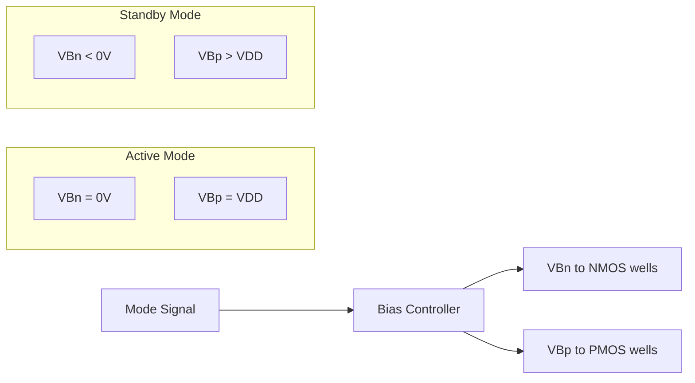

# Variable Threshold CMOS (VTCMOS) Circuits

## Learning Objectives
After this section, you will understand:
- The principle of variable threshold voltage control
- How substrate bias affects threshold voltage
- Active vs standby mode operation
- Self-Adjusting Threshold Scheme (SATS)

---

## Motivation

Using **low $V_{DD}$ and low $V_T$** is an effective method to:
- Reduce dynamic power ($P \propto V_{DD}^2$)
- Maintain high switching speed

**Problem:** Low $V_T$ leads to high subthreshold leakage in standby mode.

**Solution:** VTCMOS - Dynamically adjust $V_T$ using substrate bias!

---

## VTCMOS Principle

### Threshold Voltage Dependence on Body Bias

The threshold voltage depends on source-to-body voltage:

$$V_T = V_{T0} + \gamma \left(\sqrt{|2\phi_F + V_{SB}|} - \sqrt{|2\phi_F|}\right)$$

| Body Bias | Effect on $V_T$ |
|-----------|-----------------|
| $V_{SB} > 0$ (Reverse) | $V_T$ increases |
| $V_{SB} = 0$ | $V_T = V_{T0}$ |
| $V_{SB} < 0$ (Forward) | $V_T$ decreases |

---

## VTCMOS Circuit Architecture

![[vtcmos_circuit.jpg]]

### Conventional CMOS
- NMOS substrates → Ground (VSS)
- PMOS substrates → VDD
- Fixed threshold voltages

### VTCMOS
- NMOS substrates → Variable bias ($V_{Bn}$)
- PMOS substrates → Variable bias ($V_{Bp}$)
- Controlled by substrate bias control circuit

```
               VDD
                │
         ┌──────┤ VBp (substrate bias for PMOS)
         │      │
      ┌──┴──┐   │
      │ PMOS│───┤
      └──┬──┘   │
         │      │
    In ──┼──────┼──── Out
         │      │
      ┌──┴──┐   │
      │ NMOS│───┤
      └──┬──┘   │
         │      │
         └──────┤ VBn (substrate bias for NMOS)
                │
               GND
```

---

## Operating Modes

### Active Mode

| Parameter | Value | Purpose |
|-----------|-------|---------|
| $V_{Bn}$ | 0 V | No back-gate bias for NMOS |
| $V_{Bp}$ | $V_{DD}$ | No back-gate bias for PMOS |
| $V_T$ | Low (inherent) | Fast switching |

**Result:** 
- Low power (due to low $V_{DD}$)
- High speed (due to low $V_T$)
- Normal logic operation

### Standby Mode

| Parameter | Value | Purpose |
|-----------|-------|---------|
| $V_{Bn}$ | Negative | Reverse bias for NMOS |
| $V_{Bp}$ | > $V_{DD}$ | Reverse bias for PMOS |
| $V_T$ | High (body effect) | Reduce leakage |

**Result:**
- Threshold voltages increase significantly
- Subthreshold leakage drops exponentially
- Low standby power

---

## Leakage Reduction Mechanism

Since subthreshold leakage:
$$I_{sub} \propto e^{-V_T/(mV_t)}$$

A small increase in $V_T$ causes **exponential decrease** in leakage:

| $\Delta V_T$ | Leakage Reduction |
|--------------|-------------------|
| +60 mV | ~10× reduction |
| +120 mV | ~100× reduction |
| +180 mV | ~1000× reduction |

---

## Substrate Bias Control Circuit

The control circuit must:
1. Detect active vs standby mode
2. Generate appropriate bias voltages
3. Transition smoothly between modes



---

## Self-Adjusting Threshold Scheme (SATS)

SATS automatically controls substrate bias to:
1. Compensate for process variations in $V_T$
2. Reduce leakage adaptively
3. Maintain target performance

### Operation
- Monitor leakage current or performance
- Adjust substrate bias in feedback loop
- Automatic compensation for PVT variations

---

## Advantages of VTCMOS

| Advantage | Description |
|-----------|-------------|
| Dynamic control | $V_T$ adjusted based on operating mode |
| Low active power | Uses low $V_{DD}$, low $V_T$ when active |
| Low standby power | High $V_T$ reduces leakage in standby |
| Process compensation | Can correct for $V_T$ variations |

---

## Disadvantages of VTCMOS

| Disadvantage | Description |
|--------------|-------------|
| Additional circuitry | Bias control circuit required |
| Mode transition time | Cannot switch modes instantly |
| Triple-well process | May need separate wells for bias |
| Limited $V_T$ range | Body effect has diminishing returns |

---

## Comparison: VTCMOS vs Standard CMOS

| Aspect | Standard CMOS | VTCMOS |
|--------|---------------|--------|
| $V_T$ | Fixed | Variable |
| Standby leakage | High (if low $V_T$) | Low (high $V_T$ in standby) |
| Active speed | Trade-off with leakage | Optimized separately |
| Complexity | Low | Higher |
| Process | Standard | May need triple-well |

---

## Common Mistakes

1. **Ignoring transition time** - Mode switching isn't instantaneous
2. **Excessive body bias** - Limited by junction breakdown
3. **Forgetting well isolation** - Need appropriate well structure
4. **Not considering overhead** - Bias generator consumes power

---

## Self-Check Questions

<details>
<summary>1. Why can't we just use high Vt transistors everywhere?</summary>

High $V_T$ transistors have:
- Lower drive current → slower
- Higher delay in critical paths
- May not meet timing at low $V_{DD}$

VTCMOS provides the best of both: low $V_T$ (high speed) when active, high $V_T$ (low leakage) when idle.
</details>

<details>
<summary>2. What limits the amount of reverse body bias that can be applied?</summary>

Limits include:
- Junction breakdown voltage
- Increased junction capacitance
- Impact ionization at high reverse bias
- Diminishing returns of body effect

Typically limited to 0.5-1.5V of reverse bias.
</details>

<details>
<summary>3. When is VTCMOS most effective?</summary>

VTCMOS is most effective when:
- Significant idle time exists (to benefit from standby mode)
- Leakage is a major power contributor
- Performance requirements allow for mode transition time
- The application has distinct active/standby phases
</details>

---

## Concept Links

- **Previous:** [Second Order Effects](09_second_order_effects.md)
- **Next:** [MTCMOS Circuits](11_mtcmos_circuits.md)
- **Related:**
  - [Leakage Power](05_leakage_power.md) - What VTCMOS reduces
  - [Comparison with MTCMOS](11_mtcmos_circuits.md#vtcmos-vs-mtcmos)
- **Formula Reference:** [Formula Sheet](16_formula_sheet_ultimate.md#body-effect)

---

## Navigation

| Previous | Current | Next |
|----------|---------|------|
| [Second Order Effects](09_second_order_effects.md) | VTCMOS | [MTCMOS](11_mtcmos_circuits.md) |
