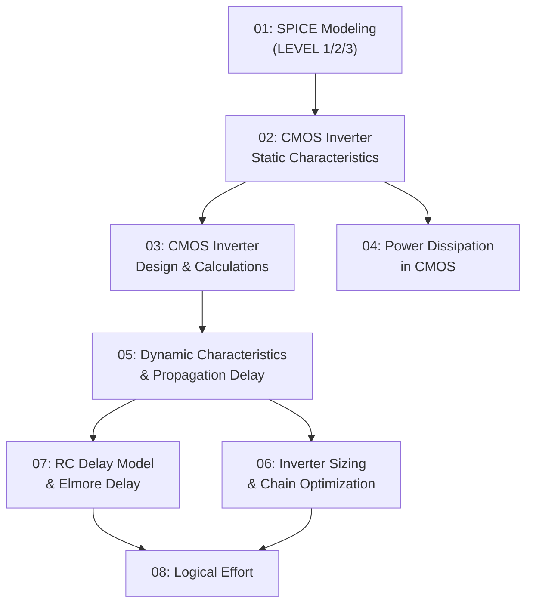

# Low Power VLSI Design (CMOS) - Study Roadmap

## How to Use This Guide

This study guide covers **Module 2** of ECE3005 (Low Power VLSI Design / CMOS VLSI Design). It is organized in a dependency-first order -- each topic builds on the previous one. Budget **8 hours** and follow the suggested study order below.

---

## Concept Dependency Map

---

## Topic Priority Matrix

| # | Topic File | Priority | Complexity | Est. Time | Key Exam Areas |
|---|-----------|----------|------------|-----------|----------------|
| 01 | [SPICE Modeling](./01_spice_modeling.md) | Medium | Low | 30 min | LEVEL 1/2/3 equations, parameters |
| 02 | [CMOS Inverter Static](./02_cmos_inverter_static.md) | **High** | Medium | 60 min | VTC, 5 regions, switching threshold, noise margins |
| 03 | [CMOS Inverter Design](./03_cmos_inverter_design.md) | **High** | High | 60 min | VIL/VIH derivation, kR ratio, Vth design |
| 04 | [Power Dissipation](./04_power_dissipation.md) | **High** | Medium | 45 min | P = CV^2f, static vs dynamic power |
| 05 | [Dynamic Characteristics](./05_dynamic_characteristics.md) | **High** | High | 60 min | Capacitances, tpHL/tpLH, first-order delay |
| 06 | [Inverter Sizing](./06_inverter_sizing.md) | **High** | High | 60 min | Beta-opt, chain sizing, optimal stages |
| 07 | [RC Delay & Elmore](./07_rc_delay_and_elmore.md) | **High** | Medium | 45 min | RC model, Elmore delay, NAND gate delay |
| 08 | [Logical Effort](./08_logical_effort.md) | **High** | High | 60 min | g, p, f, multi-stage, branching effort |
| 09 | [Worked Problems](./09_worked_problems.md) | **Critical** | -- | 60 min | All solved problems from lectures |
| 10 | [Formula Sheet](./10_formula_sheet_ultimate.md) | **Critical** | -- | Reference | Quick-reference for all formulas |

**Total estimated study time: ~8 hours**

---

## Suggested Study Order

### Session 1: Foundation (2.5 hours)
1. Skim `10_formula_sheet_ultimate.md` to see what formulas exist
2. Read `01_spice_modeling.md` (30 min)
3. Read `02_cmos_inverter_static.md` (60 min) -- this is the nucleus of everything
4. Read `03_cmos_inverter_design.md` (60 min) -- heavy derivation, take notes

### Session 2: Power & Dynamics (2 hours)
5. Read `04_power_dissipation.md` (45 min) -- critical for "low power" focus
6. Read `05_dynamic_characteristics.md` (60 min) -- capacitances and delay

### Session 3: Optimization & Effort (2.5 hours)
7. Read `06_inverter_sizing.md` (60 min) -- chain optimization is exam-heavy
8. Read `07_rc_delay_and_elmore.md` (45 min) -- practical delay computation
9. Read `08_logical_effort.md` (60 min) -- systematic delay optimization

### Session 4: Practice (1 hour)
10. Work through `09_worked_problems.md` -- solve before peeking at solutions
11. Final review of `10_formula_sheet_ultimate.md`

---

## Quick Reference: Topic to File Mapping

| If you need to understand... | Go to... |
|------------------------------|----------|
| What SPICE LEVEL 1/2/3 equations mean | [01_spice_modeling.md](./01_spice_modeling.md) |
| How a CMOS inverter works as a switch | [02_cmos_inverter_static.md](./02_cmos_inverter_static.md) |
| What the VTC looks like and its 5 regions | [02_cmos_inverter_static.md](./02_cmos_inverter_static.md) |
| How to calculate switching threshold VM | [02_cmos_inverter_static.md](./02_cmos_inverter_static.md) |
| What noise margins are (NML, NMH) | [02_cmos_inverter_static.md](./02_cmos_inverter_static.md) |
| How to derive VIL and VIH | [03_cmos_inverter_design.md](./03_cmos_inverter_design.md) |
| How to design for a specific Vth using kR | [03_cmos_inverter_design.md](./03_cmos_inverter_design.md) |
| Why power matters and P = CV^2f | [04_power_dissipation.md](./04_power_dissipation.md) |
| What makes up load capacitance | [05_dynamic_characteristics.md](./05_dynamic_characteristics.md) |
| How to compute propagation delay | [05_dynamic_characteristics.md](./05_dynamic_characteristics.md) |
| How to size PMOS vs NMOS for speed | [06_inverter_sizing.md](./06_inverter_sizing.md) |
| How to optimize an inverter chain | [06_inverter_sizing.md](./06_inverter_sizing.md) |
| What Elmore delay is and how to compute it | [07_rc_delay_and_elmore.md](./07_rc_delay_and_elmore.md) |
| What logical effort means for gate delay | [08_logical_effort.md](./08_logical_effort.md) |
| How to find minimum delay in a path | [08_logical_effort.md](./08_logical_effort.md) |
| Any specific formula | [10_formula_sheet_ultimate.md](./10_formula_sheet_ultimate.md) |
