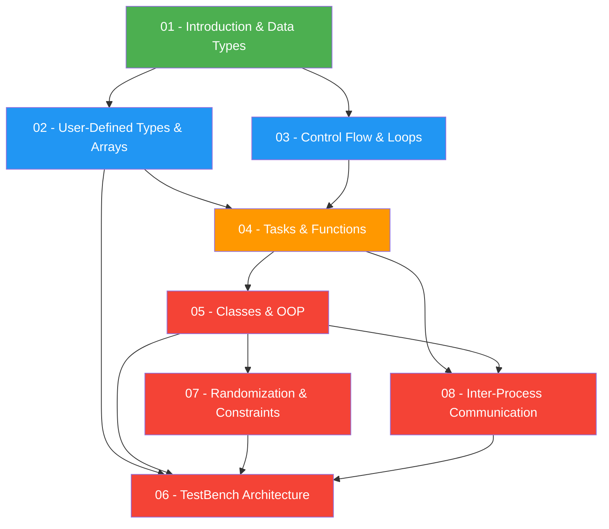

# SystemVerilog Study Guide - Roadmap

## Concept Dependency Map

---

## Topic Priority Matrix

| # | Topic | File | Priority | Est. Time |
|---|---|---|---|---|
| 1 | Introduction & Data Types | [01_introduction_and_data_types](./01_introduction_and_data_types.md) | Medium | 40 min |
| 2 | User-Defined Types & Arrays | [02_user_defined_types_and_arrays](./02_user_defined_types_and_arrays.md) | High | 60 min |
| 3 | Control Flow & Loops | [03_control_flow_and_loops](./03_control_flow_and_loops.md) | Medium | 45 min |
| 4 | Tasks & Functions | [04_tasks_and_functions](./04_tasks_and_functions.md) | High | 30 min |
| 5 | Classes & OOP | [05_classes_and_oop](./05_classes_and_oop.md) | High | 75 min |
| 6 | TestBench Architecture | [06_testbench_architecture](./06_testbench_architecture.md) | High | 45 min |
| 7 | Randomization & Constraints | [07_randomization_and_constraints](./07_randomization_and_constraints.md) | High | 60 min |
| 8 | Inter-Process Communication | [08_interprocess_communication](./08_interprocess_communication.md) | High | 50 min |
| - | Worked Problems | [09_worked_problems](./09_worked_problems.md) | Review | 45 min |
| - | Formula/Syntax Sheet | [10_formula_sheet](./10_formula_sheet.md) | Reference | - |

**Total estimated study time: ~8 hours**

---

## Suggested Study Order

1. **Start here** - [01 Introduction & Data Types](./01_introduction_and_data_types.md) (builds vocabulary)
2. **Then** - [02 User-Defined Types & Arrays](./02_user_defined_types_and_arrays.md) (data structures you will use everywhere)
3. **Then** - [03 Control Flow & Loops](./03_control_flow_and_loops.md) (how code flows)
4. **Then** - [04 Tasks & Functions](./04_tasks_and_functions.md) (code reuse)
5. **Then** - [05 Classes & OOP](./05_classes_and_oop.md) (the big one - spend most time here)
6. **Then** - [07 Randomization & Constraints](./07_randomization_and_constraints.md) (needs OOP)
7. **Then** - [08 Inter-Process Communication](./08_interprocess_communication.md) (needs OOP)
8. **Then** - [06 TestBench Architecture](./06_testbench_architecture.md) (ties everything together)
9. **Finally** - [09 Worked Problems](./09_worked_problems.md) + [10 Formula Sheet](./10_formula_sheet.md)

---

## Quick Reference

| Concept | File | Key Section |
|---|---|---|
| `logic` vs `bit` vs `reg` | [01](./01_introduction_and_data_types.md) | [Data Types](./01_introduction_and_data_types.md#integer-and-logic-data-types) |
| Packed vs Unpacked arrays | [02](./02_user_defined_types_and_arrays.md) | [Fixed Arrays](./02_user_defined_types_and_arrays.md#fixed-arrays-packed-vs-unpacked) |
| Dynamic arrays | [02](./02_user_defined_types_and_arrays.md) | [Dynamic Arrays](./02_user_defined_types_and_arrays.md#dynamic-arrays) |
| `fork`/`join` variants | [03](./03_control_flow_and_loops.md) | [Fork-Join](./03_control_flow_and_loops.md#fork-join) |
| `unique`/`priority` | [03](./03_control_flow_and_loops.md) | [Unique & Priority](./03_control_flow_and_loops.md#unique-and-priority-if-else) |
| Pass by value vs reference | [04](./04_tasks_and_functions.md) | [Argument Passing](./04_tasks_and_functions.md#argument-passing-mechanisms) |
| Inheritance | [05](./05_classes_and_oop.md) | [Inheritance](./05_classes_and_oop.md#inheritance) |
| `$cast` | [05](./05_classes_and_oop.md) | [Dynamic Casting](./05_classes_and_oop.md#dynamic-casting) |
| `rand` vs `randc` | [07](./07_randomization_and_constraints.md) | [Randomization](./07_randomization_and_constraints.md#rand-and-randc) |
| `:=` vs `:/` dist | [07](./07_randomization_and_constraints.md) | [Weighted Distribution](./07_randomization_and_constraints.md#weighted-distribution) |
| Semaphore | [08](./08_interprocess_communication.md) | [Semaphore](./08_interprocess_communication.md#semaphore) |
| Mailbox vs Queue | [08](./08_interprocess_communication.md) | [Mailbox vs Queue](./08_interprocess_communication.md#mailbox-vs-queue) |
