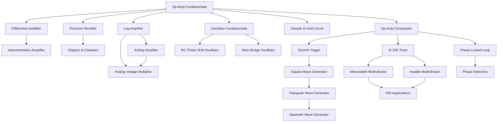

# LICA Study Guide - Roadmap (Module 3 & 4)

## Concept Dependency Map

---

## Topic Priority Matrix

| Priority | Topic | Exam Weight | Complexity | Study File |
|----------|-------|------------|------------|------------|
| HIGH | Instrumentation Amplifier | High | Medium | [02](./02_instrumentation_amplifier.md) |
| HIGH | IC 555 Timer (Mono + Astable) | High | High | [11](./11_ic_555_timer.md) |
| HIGH | Schmitt Trigger | High | Medium | [06](./06_comparator_and_schmitt_trigger.md) |
| HIGH | Waveform Generators | High | Medium | [10](./10_waveform_generators.md) |
| HIGH | PLL | High | High | [13](./13_phase_locked_loop.md) |
| MEDIUM | Precision Rectifier | Medium | Medium | [03](./03_precision_rectifier.md) |
| MEDIUM | Log & Antilog Amplifier | Medium | High | [05](./05_log_and_antilog_amplifier.md) |
| MEDIUM | Oscillators (RC, Wien) | Medium | Medium | [09](./09_oscillators.md) |
| MEDIUM | Comparator | Medium | Low | [06](./06_comparator_and_schmitt_trigger.md) |
| MEDIUM | Differential Amplifier | Medium | Low | [01](./01_differential_amplifier.md) |
| LOW | Sample & Hold | Low | Low | [07](./07_sample_and_hold.md) |
| LOW | Clippers & Clampers | Low | Low | [04](./04_clippers_and_clampers.md) |
| LOW | Analog Multiplier | Low | Medium | [08](./08_analog_voltage_multiplier.md) |
| LOW | 555 Applications | Low | Medium | [12](./12_555_applications.md) |
| CRITICAL | Exam Solutions (Numerical & Derivations) | High | High | [16](./16_exam_solutions.md) |
| CRITICAL | Advanced Circuit Analysis | High | High | [17](./17_advanced_circuit_analysis.md) |

---

## Suggested Study Order (Total: ~12-14 hours)

### Day 1: Foundations (~4 hours)
1. [Differential Amplifier](./01_differential_amplifier.md) - 30 min
2. [Instrumentation Amplifier](./02_instrumentation_amplifier.md) - 45 min
3. [Comparator & Schmitt Trigger](./06_comparator_and_schmitt_trigger.md) - 60 min
4. [Precision Rectifier](./03_precision_rectifier.md) - 45 min
5. [Clippers & Clampers](./04_clippers_and_clampers.md) - 30 min

### Day 2: Analog Processing (~3 hours)
6. [Log & Antilog Amplifier](./05_log_and_antilog_amplifier.md) - 60 min
7. [Sample & Hold](./07_sample_and_hold.md) - 20 min
8. [Analog Voltage Multiplier](./08_analog_voltage_multiplier.md) - 40 min
9. [Oscillators](./09_oscillators.md) - 60 min

### Day 3: Generators & Special ICs (~4 hours)
10. [Waveform Generators](./10_waveform_generators.md) - 60 min
11. [IC 555 Timer](./11_ic_555_timer.md) - 60 min
12. [555 Applications](./12_555_applications.md) - 30 min
13. [Phase Locked Loop](./13_phase_locked_loop.md) - 45 min

### Day 4: Revision (~3 hours)
14. [Worked Problems](./14_worked_problems.md) - 90 min
15. **[Exam Solutions (CRITICAL)](./16_exam_solutions.md)** - 60 min
16. **[Advanced Circuit Analysis (CRITICAL)](./17_advanced_circuit_analysis.md)** - 60 min
17. [Formula Sheet](./15_formula_sheet_ultimate.md) - 60 min
18. Re-do self-check questions from all topic files

---

## Quick Reference Table

| Topic | Key Formula | File |
|-------|-------------|------|
| Diff Amp | $V_o = A_d(V_1 - V_2)$ | [01](./01_differential_amplifier.md) |
| Instrumentation Amp | $V_o = (1 + 2R_1/R)(V_2 - V_1) \cdot R_3/R_2$ | [02](./02_instrumentation_amplifier.md) |
| Precision Rectifier | Eliminates 0.7V diode drop | [03](./03_precision_rectifier.md) |
| Log Amp | $V_o = -\frac{kT}{q}\ln\frac{V_i}{I_s R}$ | [05](./05_log_and_antilog_amplifier.md) |
| Comparator | Open-loop: $V_o = \pm V_{sat}$ | [06](./06_comparator_and_schmitt_trigger.md) |
| Schmitt Trigger | $V_H = V_{UT} - V_{LT}$ | [06](./06_comparator_and_schmitt_trigger.md) |
| RC Osc | $f_0 = \frac{1}{2\pi RC\sqrt{6}}$, Gain = 29 | [09](./09_oscillators.md) |
| Wien Bridge | $f_0 = \frac{1}{2\pi RC}$, Gain = 3 | [09](./09_oscillators.md) |
| Square Wave | $T = 2RC\ln\frac{1+\beta}{1-\beta}$ | [10](./10_waveform_generators.md) |
| 555 Mono | $T = 1.1RC$ | [11](./11_ic_555_timer.md) |
| 555 Astable | $f = \frac{1.44}{(R_A + 2R_B)C}$ | [11](./11_ic_555_timer.md) |
| PLL | Lock range > Capture range | [13](./13_phase_locked_loop.md) |

---

## Video Resources

Since the lecture slides contain many circuit diagrams and derivations in image form, these video resources can supplement your understanding:

| Topic | Recommended Video | Channel |
|-------|------------------|---------|
| Instrumentation Amplifier | Search: "Instrumentation Amplifier 3 op-amp derivation" | Neso Academy |
| 555 Timer Monostable & Astable | Search: "555 timer monostable astable working" | Neso Academy |
| Schmitt Trigger & Comparator | Search: "Schmitt trigger op-amp hysteresis" | Neso Academy |
| PLL Phase Locked Loop | Search: "PLL phase locked loop basics" | Neso Academy |
| Wien Bridge Oscillator | Search: "Wien bridge oscillator derivation" | Neso Academy |
| Log and Antilog Amplifier | Search: "Log amplifier op-amp derivation" | Neso Academy |
| Precision Rectifier | Search: "Precision rectifier super diode" | Neso Academy |
