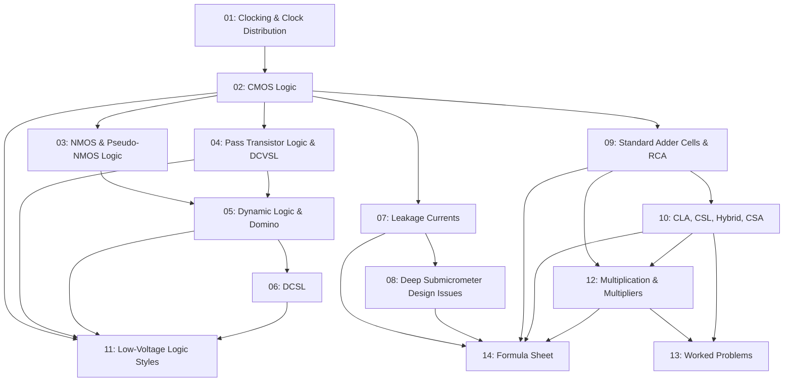

# Low Power VLSI Design - Study Roadmap (Modules 3 & 4)

---

## Concept Dependency Map

---

## Topic Priority Matrix

| Priority | Topic File | Topic | Exam Weight | Complexity |
|----------|------------|-------|-------------|------------|
| HIGH | [01](./01_clocking_and_clock_distribution.md) | Clocking & Clock Distribution | High | Medium |
| HIGH | [02](./02_cmos_logic.md) | CMOS Logic | High | Medium |
| HIGH | [07](./07_leakage_currents.md) | Leakage Currents | Very High | High |
| HIGH | [08](./08_deep_submicrometer_design_issues.md) | Deep Submicrometer Issues | Very High | High |
| HIGH | [09](./09_standard_adder_cells_and_rca.md) | Standard Adder Cells & RCA | Very High | Medium |
| HIGH | [10](./10_cla_csl_hybrid_csa.md) | CLA, CSL, Hybrid, CSA | Very High | High |
| HIGH | [12](./12_multiplication_and_multipliers.md) | Multiplication & Multipliers | Very High | High |
| MEDIUM | [03](./03_nmos_and_pseudo_nmos_logic.md) | NMOS & Pseudo-NMOS Logic | Medium | Low |
| MEDIUM | [04](./04_pass_transistor_logic_and_dcvsl.md) | PTL & DCVSL | Medium | Medium |
| MEDIUM | [05](./05_dynamic_logic_and_domino.md) | Dynamic Logic & Domino | High | Medium |
| MEDIUM | [06](./06_dcsl.md) | DCSL | Medium | Medium |
| MEDIUM | [11](./11_low_voltage_logic_styles.md) | Low-Voltage Logic Styles | Medium | Medium |

---

## Suggested Study Order

### Session 1: Foundations (Estimated: 2 hours)

| Order | File | Topic | Est. Time |
|-------|------|-------|-----------|
| 1 | [01](./01_clocking_and_clock_distribution.md) | Clocking & Clock Distribution | 25 min |
| 2 | [02](./02_cmos_logic.md) | CMOS Logic (PUN/PDN, advantages/disadvantages) | 30 min |
| 3 | [03](./03_nmos_and_pseudo_nmos_logic.md) | NMOS & Pseudo-NMOS Logic | 25 min |
| 4 | [04](./04_pass_transistor_logic_and_dcvsl.md) | Pass Transistor Logic & DCVSL | 30 min |

### Session 2: Dynamic Logic & Leakage (Estimated: 2.5 hours)

| Order | File | Topic | Est. Time |
|-------|------|-------|-----------|
| 5 | [05](./05_dynamic_logic_and_domino.md) | Dynamic Logic & Domino | 30 min |
| 6 | [06](./06_dcsl.md) | DCSL | 20 min |
| 7 | [07](./07_leakage_currents.md) | Leakage Currents (6 mechanisms) | 45 min |
| 8 | [08](./08_deep_submicrometer_design_issues.md) | Deep Submicrometer Issues (10 challenges) | 35 min |

### Session 3: Adders & Multipliers (Estimated: 2.5 hours)

| Order | File | Topic | Est. Time |
|-------|------|-------|-----------|
| 9 | [09](./09_standard_adder_cells_and_rca.md) | HA, FA, RCA | 30 min |
| 10 | [10](./10_cla_csl_hybrid_csa.md) | CLA, CSL, Hybrid, CSA | 40 min |
| 11 | [11](./11_low_voltage_logic_styles.md) | Low-Voltage Logic Styles | 25 min |
| 12 | [12](./12_multiplication_and_multipliers.md) | Multiplication & All Multiplier Types | 45 min |

### Session 4: Consolidation (Estimated: 1 hour)

| Order | File | Topic | Est. Time |
|-------|------|-------|-----------|
| 13 | [13](./13_worked_problems.md) | Worked Problems | 30 min |
| 14 | [14](./14_formula_sheet_ultimate.md) | Formula Sheet Review | 30 min |

**Total Estimated Study Time: ~8 hours**

---

## Quick-Reference: Topic to File Mapping

| Concept | File | Section |
|---------|------|---------|
| Clock distribution power | [01](./01_clocking_and_clock_distribution.md) | #power-dissipation-in-clock-distribution |
| Clock skew | [01](./01_clocking_and_clock_distribution.md) | #clock-skew |
| Setup/Hold violations | [01](./01_clocking_and_clock_distribution.md) | #setup-time-violation |
| PUN/PDN networks | [02](./02_cmos_logic.md) | #pull-up-and-pull-down-networks |
| Strong/Weak logic levels | [04](./04_pass_transistor_logic_and_dcvsl.md) | #strong-and-weak-logic |
| Precharge/Evaluate phases | [05](./05_dynamic_logic_and_domino.md) | #precharge-and-evaluation |
| Domino logic cascading | [05](./05_dynamic_logic_and_domino.md) | #domino-logic |
| Subthreshold leakage | [07](./07_leakage_currents.md) | #subthreshold-leakage |
| DIBL | [07](./07_leakage_currents.md) | #dibl-drain-induced-barrier-lowering |
| GIDL | [07](./07_leakage_currents.md) | #gate-induced-drain-leakage-gidl |
| Half/Full adder | [09](./09_standard_adder_cells_and_rca.md) | #half-adder |
| Ripple Carry Adder | [09](./09_standard_adder_cells_and_rca.md) | #ripple-carry-adder-rca |
| Carry Look-Ahead Adder | [10](./10_cla_csl_hybrid_csa.md) | #carry-look-ahead-adder-cla |
| Carry Save Adder | [10](./10_cla_csl_hybrid_csa.md) | #carry-save-adder-csa |
| CPL/DPL | [11](./11_low_voltage_logic_styles.md) | #complementary-pass-transistor-logic-cpl |
| Braun Multiplier | [12](./12_multiplication_and_multipliers.md) | #braun-multiplier |
| Baugh-Wooley Multiplier | [12](./12_multiplication_and_multipliers.md) | #baugh-wooley-multiplier |
| Booth Multiplier | [12](./12_multiplication_and_multipliers.md) | #booth-multiplier |
| Wallace Tree Multiplier | [12](./12_multiplication_and_multipliers.md) | #wallace-tree-multiplier |
