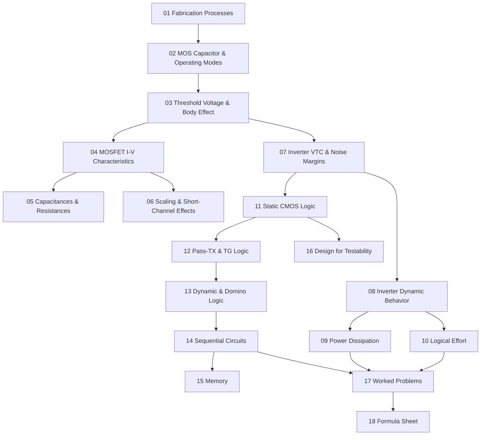

# CMOS VLSI Study Guide Roadmap

This study guide follows the syllabus order but splits the material into atomic, exam-sized concepts. Each note is a self-contained explanation suitable for someone learning the topic for the first time, with derivations, intuition, embedded figures, worked steps, and self-check questions. Lab-only layout-tool tasks are intentionally excluded.

## Learning Path

## Recommended Order

| # | Note | What it covers | Priority |
|---:|---|---|---|
| 01 | [[01_fabrication_processes]] | nMOS / CMOS / twin-tub fab steps, latch-up, integrated R/C, modern processes. | Medium |
| 02 | [[02_mos_capacitor_and_operating_modes]] | Mass action, Fermi/work functions, accumulation–depletion–inversion. | High |
| 03 | [[03_threshold_voltage_and_body_effect]] | Four-term $V_{T0}$ derivation, body effect, channel implants. | High |
| 04 | [[04_mosfet_iv_characteristics]] | Linear, saturation, GCA derivation, channel-length modulation, SPICE levels. | High |
| 05 | [[05_mosfet_capacitances_and_resistances]] | Overlap, gate-channel, junction caps, source/drain resistance. | Medium |
| 06 | [[06_scaling_and_short_channel_effects]] | Constant-field vs constant-voltage scaling, DIBL, sub-Vt, hot carriers, punch-through. | High |
| 07 | [[07_cmos_inverter_vtc_and_noise_margins]] | $V_M$, $V_{IL}$, $V_{IH}$, $NM_L$, $NM_H$, ratio $k_R$ design. | High |
| 08 | [[08_cmos_inverter_dynamic_behavior]] | $0.69RC$ delay, FO4, β optimum, Elmore, intrinsic vs extrinsic. | High |
| 09 | [[09_power_dissipation]] | Dynamic, short-circuit, glitch, leakage components, PDP/EDP. | High |
| 10 | [[10_logical_effort]] | $d=gh+p$, path effort $F=GBH$, optimum stage effort. | High |
| 11 | [[11_static_cmos_logic]] | PUN/PDN, fan-in limits, sizing, progressive sizing, input ordering. | High |
| 12 | [[12_pass_transistor_and_transmission_gate_logic]] | Pseudo-nMOS, DCVSL, PTL, CPL, TG, level restorer. | Medium |
| 13 | [[13_dynamic_and_domino_logic]] | Precharge/evaluate, charge sharing/leakage, Domino, NORA. | High |
| 14 | [[14_sequential_circuits]] | $t_{su}/t_h/t_{c-q}$, latches, registers, C2MOS, TSPC, pipelining, Schmitt. | High |
| 15 | [[15_memory]] | SRAM 6T, DRAM 1T/3T, ROM/EPROM/EEPROM, PLA vs PAL, sense amps. | Medium |
| 16 | [[16_design_for_testability]] | Fault models, controllability/observability, scan, BIST, JTAG, LFSR. | Medium |
| 17 | [[17_worked_problems]] | 16 step-by-step solutions covering common exam patterns. | High |
| 18 | [[18_formula_sheet]] | All formulas with anchor links. | High |

## Exam Strategy

Read 02–04 first — every other module assumes the I-V equations and threshold model. Then 06 (scaling) gives context for why short-channel/leakage matters. Use 07–08 for inverter analysis: both are calculation-heavy and feature in almost every exam. 09–10 are the **low-power VLSI** focus of this course.

Logic styles (11–13) reward comparison: which improves which metric (area, speed, power, signal swing, clocking complexity), and what does it sacrifice? Sequential and memory are mostly definition + cell-schematic recall. Testability is short-answer territory.

When stuck on a problem, ask:

- Which transistors are ON for this input?
- Is the output strongly driven, weakly driven, floating, or precharged?
- What capacitance is being charged/discharged?
- Which current causes the energy loss?
- Is the delay dominated by resistance, capacitance, fan-in, fan-out, or path effort?

## Quick Cross-Reference

| Concept | Main note | Formula sheet anchor |
|---|---|---|
| MOS regions | [[04_mosfet_iv_characteristics]] | [[18_formula_sheet#mos-iv]] |
| Threshold/body effect | [[03_threshold_voltage_and_body_effect]] | [[18_formula_sheet#threshold-and-body-effect]] |
| Capacitances | [[05_mosfet_capacitances_and_resistances]] | [[18_formula_sheet#capacitances]] |
| Scaling | [[06_scaling_and_short_channel_effects]] | [[18_formula_sheet#scaling]] |
| Inverter VTC | [[07_cmos_inverter_vtc_and_noise_margins]] | [[18_formula_sheet#cmos-inverter-dc]] |
| Propagation delay | [[08_cmos_inverter_dynamic_behavior]] | [[18_formula_sheet#delay-and-rc]] |
| Dynamic & leakage power | [[09_power_dissipation]] | [[18_formula_sheet#power]] |
| Logical effort | [[10_logical_effort]] | [[18_formula_sheet#logical-effort]] |
| CMOS gate synthesis | [[11_static_cmos_logic]] | [[18_formula_sheet#logic-gates]] |
| Dynamic logic | [[13_dynamic_and_domino_logic]] | [[18_formula_sheet#dynamic-logic]] |
| Sequential timing | [[14_sequential_circuits]] | [[18_formula_sheet#sequential-timing]] |
| Memory | [[15_memory]] | [[18_formula_sheet#memory]] |
| Testability | [[16_design_for_testability]] | [[18_formula_sheet#testability]] |

## How to Use This Guide

1. Read in order — each note builds on its neighbours.
2. Attempt the **self-check questions** at the bottom of each note before reading the answer.
3. Hit [[17_worked_problems]] only after you've read the relevant theory note for each problem.
4. Keep [[18_formula_sheet]] open as a side reference.
5. The verification checklist is in [[walkthrough]].
