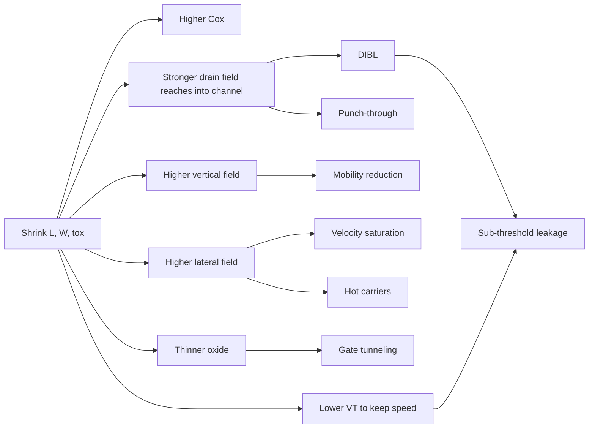

# Scaling and Short-Channel Effects

> Concept: how shrinking dimensions changes the device equations, what stops scaling from working forever, and the catalog of short-channel effects (DIBL, velocity saturation, sub-threshold, hot carriers, gate tunnelling, punch-through, narrow-channel).

## Why Scale at All

The slides motivate scaling with packing density: more transistors per chip → more functionality, lower cost per transistor, often higher speed and lower energy per operation. This is the core of Moore's law as engineering rather than economics.

But the very same shrinkage that gives speed and density also triggers physical effects that ruin ideal MOSFET behaviour. Knowing both sides — the *scaling laws* and the *failure modes* — is the heart of this topic.

---

## Two Classic Scaling Strategies

A scaling factor $S>1$ means linear dimensions are *divided* by $S$ (so $L'=L/S$, $W'=W/S$, $t_{ox}'=t_{ox}/S$, $x_j'=x_j/S$). The two main flavours from the slides:

### Full Scaling (Constant-Field Scaling)

Goal: keep electric fields the same as before. So **all voltages also scale by $1/S$**:

$$
V'=V/S,\quad V_{DD}'=V_{DD}/S,\quad V_T'=V_T/S
$$

Doping must scale as $N_A'=S\cdot N_A$ to keep depletion regions in proportion.

### Constant-Voltage Scaling

Goal: keep external voltages compatible with legacy systems. **Dimensions shrink, voltages stay the same.** Doping has to grow even faster (~$S^2$) to support the higher fields.

This is what really happened from 1980s to ~2000s in industry, until power density forced voltage scaling to resume.

---

## Scaling Trends Table (must-memorise)

| Quantity | Full (constant-field) | Constant-voltage |
|---|---:|---:|
| $L,W,t_{ox},x_j$ | $1/S$ | $1/S$ |
| $V_{DD}, V_T$ | $1/S$ | 1 |
| Doping $N_A,N_D$ | $S$ | $S^2$ |
| $C_{ox}=\epsilon_{ox}/t_{ox}$ | $S$ | $S$ |
| Aspect ratio $W/L$ | 1 | 1 |
| $k=\mu C_{ox}(W/L)$ | $S$ | $S$ |
| $I_D$ (linear or sat) | $1/S$ | $S$ |
| Gate area $WL$ | $1/S^2$ | $1/S^2$ |
| Gate capacitance $C_g=C_{ox}WL$ | $1/S$ | $1/S$ |
| Delay $t_p\propto C V/I$ | $1/S$ | $1/S^2$ |
| Power per device $P=VI$ | $1/S^2$ | $S$ |
| Power density $P/(WL)$ | 1 | $S^3$ |

Reading the table: full scaling is the friendly one — power density stays constant. Constant-voltage scaling is fast (delay ~ $1/S^2$) but power density blows up by $S^3$, which causes thermal and reliability problems and historically forced industry to scale voltages too.

---

## Short-Channel Effects (the failure modes)

Once $L\sim x_j$ or smaller, the gate loses exclusive control of the channel. The drain field reaches into the channel; the source/drain depletion regions can merge; carriers reach saturation velocity; oxide is so thin that electrons tunnel through it. The slides cover seven major effects:

### 1. Velocity Saturation

Drift velocity $v_d=\mu E$ holds only for low fields. Beyond critical field $E_C\sim10^4$ V/cm in silicon, $v_d$ saturates at $v_{sat}\sim 10^7$ cm/s.

Consequences:
- Saturation current loses its $(V_{GS}-V_T)^2$ dependence; becomes near-linear in overdrive (alpha-power law with $\alpha\approx 1.3$).
- Saturation voltage $V_{DSAT}<V_{GS}-V_T$, so devices enter saturation earlier.
- Smaller-than-expected currents in deep-submicron processes.

### 2. Mobility Reduction with Vertical Field

High $V_{GS}$ pushes electrons against the oxide, increasing surface scattering. Effective mobility:

$$
\mu_{eff}=\frac{\mu_{n0}}{1+\theta(V_{GS}-V_T)}
$$

with empirical $\theta$. So even before velocity saturation, mobility *drops* as we squeeze the channel against the oxide.

### 3. Threshold Voltage Roll-off (short-channel effect on $V_{T0}$)

Short channels lose part of their depletion charge to source/drain junctions. Net result:

$$
V_{T0,\text{short}} = V_{T0,\text{long}} - \Delta V_{T0},\qquad \Delta V_{T0}\propto x_j/L
$$

Smaller $L$ ⇒ lower $V_T$ ⇒ higher leakage. Big problem in scaled CMOS. (Detailed formula in [[03_threshold_voltage_and_body_effect]].)

### 4. Drain-Induced Barrier Lowering (DIBL)

The drain electric field reaches into the source-channel junction and lowers the energy barrier electrons must climb. So electrons start spilling from source to drain even before $V_{GS}$ reaches threshold. Effect: $V_T$ depends on $V_{DS}$ (it shouldn't ideally).

$$
\Delta V_T^{DIBL}=-\eta\cdot V_{DS}
$$

with empirical DIBL coefficient $\eta$ in mV/V.

DIBL increases sub-threshold leakage and worsens output conductance (saturation current rises with $V_{DS}$).

### 5. Sub-threshold Conduction

Even for $V_{GS}<V_T$ there is a small but exponential current:

$$
I_{D,sub} = I_0\,e^{(V_{GS}-V_T)/(n V_{th})}\,\!\left(1-e^{-V_{DS}/V_{th}}\right)
$$

with $V_{th}=kT/q\approx 26$ mV and **sub-threshold slope factor** $n\approx 1.0$–1.5.

The **sub-threshold slope** is

$$
S_S = n\cdot V_{th}\cdot\ln 10 \quad(\text{mV/decade})
$$

A perfect long-channel device has $S_S\approx 60$ mV/decade. Real CMOS sees 80–110 mV/decade. Smaller $S_S$ is better — it means leakage drops faster as $V_{GS}$ falls.

### 6. Gate-Oxide Tunnelling

When $t_{ox}$ falls below ~3 nm, electrons tunnel directly through the oxide. Gate becomes a leaky capacitor, contradicting the ideal "no DC gate current" assumption. Forces the industry shift to **high-k dielectrics** (HfO$_2$) and metal gates.

### 7. Hot-Carrier Injection (HCI)

Near the drain, the high electric field accelerates carriers to high kinetic energy. Some get injected into the gate oxide, get trapped, and *permanently* shift $V_T$ — a long-term reliability degradation.

Mitigated by:
- Lightly Doped Drain (LDD) extensions to reduce peak field at the drain edge,
- Lower $V_{DD}$.

### 8. Punch-Through

Source and drain depletion regions can merge for very short $L$. Once they touch, current flows through the bulk independent of the gate. Very high leakage / breakdown.

Mitigations: punch-through stopper implants (deep doping bumps under the channel), or constraining $L$ above some minimum given $V_{DD}$ and doping.

### 9. Narrow-Channel Effect

Symmetric to short-channel: small $W$ raises $V_T$ because the gate must support extra fringing depletion charge sideways under the field oxide. (Detailed formula in [[03_threshold_voltage_and_body_effect]].)

---

## Reliability-Oriented Failure Modes Worth Naming

The slides also list a few process-level failures triggered or accelerated by aggressive scaling:

- **Electromigration**: high current density in narrow metal lines literally drags atoms along, opening voids. Mitigated by current-density rules and copper interconnect.
- **Oxide breakdown**: high $E$ in thin oxide causes catastrophic short.
- **Electrical overstress**: ESD-like events that exceed safe operating area.

---

## Mental Map

Use this to answer broad scaling questions:

---

## Common Exam Mistakes

- Stating constant-voltage scaling as "all voltages stay the same and nothing else changes". Doping needs to scale by $S^2$, fields rise, and power density grows by $S^3$.
- Confusing short-channel $V_T$ roll-off with DIBL. Roll-off is $V_T$ depending on **$L$**; DIBL is $V_T$ depending on **$V_{DS}$**.
- Treating sub-threshold slope as a unitless quantity. It is in mV/decade.
- Believing scaling automatically reduces leakage. It does the opposite — leakage normally *increases*.
- Forgetting velocity saturation in modern problems → ignoring why $I_D$ doesn't grow as a square law.

## Self-Check Questions

1. Under full scaling, why does delay improve only by $1/S$, not faster?
   

Answer
Delay $\propto CV/I$. Under constant-field, $C\to C/S$, $V\to V/S$, $I\to I/S$, so $CV/I$ goes by $(1/S)(1/S)/(1/S)=1/S$.

2. Why is power density preserved under constant-field scaling but not under constant-voltage?
   

Answer
Constant-field: per-device power $\propto V^2 f \to 1/S^2$, area $\to 1/S^2$, so density unchanged. Constant-voltage: per-device current grows by $S$ at the same voltage, so power per device grows by $S$, while area shrinks by $1/S^2$, giving density $\propto S^3$.

3. What's the practical reason VLSI moved to high-k dielectrics?
   

Answer
To keep increasing $C_{ox}$ without making $t_{ox}$ so thin that gate tunnelling current becomes a major leakage source. Higher dielectric constant lets $t_{ox}$ stay thicker for the same $C_{ox}$.

4. Why does sub-threshold leakage couple to $V_{DD}$ scaling decisions?
   

Answer
To preserve speed at lower $V_{DD}$, designers usually lower $V_T$. But $I_{D,sub}\propto e^{-V_T/(n V_{th})}$, so even small $V_T$ reductions multiply leakage by orders of magnitude.

## Concept Links

- Previous: [[05_mosfet_capacitances_and_resistances]]
- Next: [[07_cmos_inverter_vtc_and_noise_margins]]
- Related: [[09_power_dissipation]] (leakage components), [[03_threshold_voltage_and_body_effect]] ($\Delta V_{T0}$)
- Formulas: [[18_formula_sheet#scaling]]
