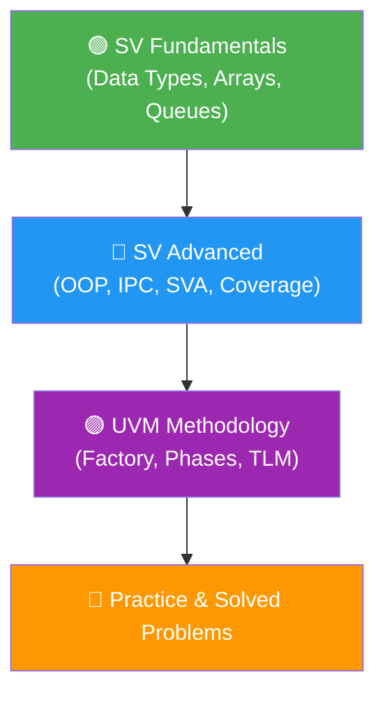

# 📚 HDL Verification Master Roadmap

> Your unified, complete study guide for the **ECE3006 HDL Verification and Methodologies** FAT Examination.

---

## 🗺️ Study Flow

The materials have been consolidated from CAT-1, CAT-2, and FAT into a single sequential flow.

---

## 📂 Directory Structure & Study Order

### 1️⃣ [SV Fundamentals](./01_SV_Fundamentals) (CAT-1)
*Core SystemVerilog concepts needed for testbench creation.*

1. [Introduction to Verification](./01_SV_Fundamentals/01_Introduction.md)
2. [Data Types Deep Dive](./01_SV_Fundamentals/02_Data_Types.md)
3. [Assignments & Delay](./01_SV_Fundamentals/03_Assignments.md)
4. [String Processing](./01_SV_Fundamentals/04_Strings.md)
5. [Enumerations](./01_SV_Fundamentals/05_Enums.md)
6. [Packed vs Unpacked Arrays](./01_SV_Fundamentals/06_Arrays.md)
7. [Queues & Operations](./01_SV_Fundamentals/07_Queues.md)
8. [Structures](./01_SV_Fundamentals/08_Structs.md)
9. [Code Coverage Basics](./01_SV_Fundamentals/09_Code_Coverage.md)

### 2️⃣ [SV Advanced](./02_SV_Advanced) (CAT-2)
*Advanced features required for modern verification (OOP, assertions).*

1. [Deep Dive: Data Types](./02_SV_Advanced/01_Data_Types_Deep_Dive.md)
2. [User-Defined Types & Arrays](./02_SV_Advanced/02_User_Defined_Types_and_Arrays.md)
3. [Control Flow & Fork-Join](./02_SV_Advanced/03_Control_Flow_and_Loops.md)
4. [Tasks vs Functions](./02_SV_Advanced/04_Tasks_and_Functions.md)
5. [Classes & OOP](./02_SV_Advanced/05_Classes_and_OOP.md) *(Critical for UVM!)*
6. [TestBench Architecture](./02_SV_Advanced/06_Testbench_Architecture.md)
7. [Randomization & Constraints](./02_SV_Advanced/07_Randomization_and_Constraints.md)
8. [Inter-Process Communication](./02_SV_Advanced/08_Interprocess_Communication.md)
9. [SystemVerilog Assertions (SVA)](./02_SV_Advanced/09_Assertions_SVA.md)
10. [Functional Coverage](./02_SV_Advanced/10_Functional_Coverage.md)

### 3️⃣ [UVM Methodology](./03_UVM) (FAT)
*Universal Verification Methodology framework.*

1. [UVM Introduction & Factory](./03_UVM/01_UVM_Introduction.md)
2. [Hierarchy & Components](./03_UVM/02_UVM_Hierarchy.md)
3. [TLM Communication](./03_UVM/03_TLM_Communication.md)
4. [UVM Phases](./03_UVM/04_UVM_Phases.md)
5. [Complete Testbench Example](./03_UVM/05_UVM_Testbench_Example.md)

---

## 🎯 Practice & Preparation

When you're ready to test your knowledge, check the **[Practice Problems](./04_Practice_Problems)** folder.

| Resource | Description |
|----------|-------------|
| **[Assignment Solutions](./04_Practice_Problems/01_Assignment_Solutions.md)** | Step-by-step code and theory solutions |
| **[Practice SET Answers](./04_Practice_Problems/02_Practice_SET_Answers.md)** | Extensive coding & output prediction questions |
| **[Quiz F2 Answers](./04_Practice_Problems/03_Quiz_F2_Answers.md)** | Code tracing for coverage and assertions |
| **[Worked Problems](./04_Practice_Problems/04_Worked_Problems.md)** | Extra conceptual examples and edge cases |
| **[CAT-1 Practice Problems](./04_Practice_Problems/05_CAT1_Practice_Problems.md)** | Early-semester problems |
| **[CAT-1 Paper Solutions](./04_Practice_Problems/06_CAT1_Paper_Solutions.md)** | Complete solutions for CAT-1 Feb 2026 |
| **[CAT-2 Paper Solutions](./04_Practice_Problems/07_CAT2_Paper_Solutions.md)** | Complete solutions for CAT-2 March 2026 |

---

## ⚡ Quick Reference

> [!TIP]
> Keep these open during coding or while reviewing right before the exam!

- **[SV Syntax Formula Sheet](./05_Formula_Sheets/01_SV_Formula_Sheet.md)** (Arrays, OOP, Fork-Join, SVA, Coverage syntax)
- **[UVM Formula Sheet](./05_Formula_Sheets/02_UVM_Formula_Sheet.md)** (Factory macros, phases, TLM ports)

---

## 🛠️ Runnable Code

- Check the `06_Code_Examples/` folder for snippets related to Arrays, Queues, Enums, and Strings.
- Check the `07_Lab_Codes/` folder for full Lab Record testbenches.

---

*Prepared for ECE3006 HDL Verification.*
