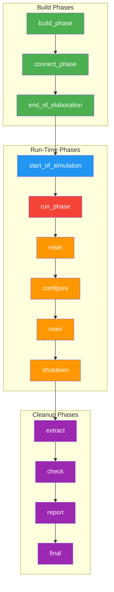

# 04 - UVM Phases

## Learning Objectives

After this section you will understand:
- The three main phase groups: **Build**, **Run-time**, **Cleanup**
- Which phases are functions (zero time) vs tasks (consume time)
- Execution order (top-down vs bottom-up)
- The most commonly used phases and what goes in each
- How to write `build_phase`, `connect_phase`, `run_phase`, and `report_phase`

---

## Phase Overview

> **Conceptual Clarity:** UVM phases are like a choreographed dance. Every component in the testbench must follow the same steps in the same order. This ensures the testbench is fully built before it runs, fully connected before it drives, and fully checked before it reports.



---

## The Three Main Phase Groups

### 1. Build Phases (Functions -- Zero Simulation Time)

| Phase | Execution Order | Purpose |
|---|---|---|
| `build_phase` | **Top-down** | Construct components using the factory |
| `connect_phase` | **Bottom-up** | Make TLM connections between components |
| `end_of_elaboration` | Bottom-up | Final adjustments before simulation starts |

**Why top-down for build?** The parent must exist before it can create its children. Each layer can be configured by the layer above before the child is constructed.

**Why bottom-up for connect?** The innermost components must have their ports ready before the outer components can connect to them.

### 2. Run-Time Phases (Tasks -- Consume Simulation Time)

| Phase | Purpose | Commonly Used? |
|---|---|---|
| `start_of_simulation` | Display banners, topology info | Rarely |
| **`run_phase`** | **Main simulation activity** | **Always** |
| `pre_reset` | Wait for power-good signals | Rarely |
| `reset` | Generate reset, set defaults | Sometimes |
| `post_reset` | Training, rate negotiation | Rarely |
| `pre_configure` | Prepare for DUT configuration | Rarely |
| `configure` | Program DUT and memories | Sometimes |
| `post_configure` | Wait for configuration to propagate | Rarely |
| `pre_main` | Ensure readiness | Rarely |
| **`main`** | **Primary stimulus generation** | Sometimes |
| `post_main` | Finalize main phase | Rarely |
| `pre_shutdown` | Buffer before shutdown | Rarely |
| `shutdown` | Drain remaining data | Sometimes |
| `post_shutdown` | Final active-phase activities | Rarely |

> **Conceptual Clarity:** The `run_phase` and the fine-grained phases (`reset` through `post_shutdown`) execute **in parallel**. The fine-grained phases were added in UVM (from OVM's run phase) for finer control. Most testbenches only use `reset`, `configure`, `main`, and `shutdown`.

**Key:** All `run_phase` sub-phases run in parallel, but the `run_phase` task itself runs concurrently with all of them. Most basic testbenches just use `run_phase`.

### 3. Cleanup Phases (Functions -- Zero Simulation Time)

| Phase | Execution Order | Purpose |
|---|---|---|
| `extract` | Bottom-up | Retrieve data from scoreboards, coverage monitors |
| `check` | Bottom-up | Verify DUT behavior, identify errors |
| `report` | Bottom-up | Display or write simulation results |
| `final` | Bottom-up | Any remaining cleanup actions |

---

## The Most Important Phases (What You Actually Use)

For most testbenches, you only need four phases:

### `build_phase` -- Create Components

```verilog
function void build_phase(uvm_phase phase);
    super.build_phase(phase);    // ALWAYS call super first

    // Create components using factory
    driver = my_driver::type_id::create("driver", this);
    monitor = my_monitor::type_id::create("monitor", this);
    sequencer = my_sequencer::type_id::create("sequencer", this);
endfunction
```

**Rules:**
- Must call `super.build_phase(phase)` first
- Use `type_id::create()`, never `new()`
- Executes **top-down** (test builds env, env builds agents, agents build driver/monitor)

### `connect_phase` -- Wire Up TLM

```verilog
function void connect_phase(uvm_phase phase);
    super.connect_phase(phase);

    // Connect driver to sequencer
    driver.seq_item_port.connect(sequencer.seq_item_export);

    // Connect monitor to scoreboard
    monitor.ap.connect(scoreboard.ap);
endfunction
```

**Rules:**
- Must call `super.connect_phase(phase)`
- Executes **bottom-up** (inner components connect first)
- All components must already exist (build_phase must be complete)

### `run_phase` -- Simulation Activity

```verilog
task run_phase(uvm_phase phase);
    phase.raise_objection(this);    // keep simulation alive

    // Drive signals, generate transactions, monitor DUT
    // ...

    phase.drop_objection(this);     // allow simulation to end
endtask
```

**Rules:**
- This is a **task** (consumes simulation time)
- All `run_phase` tasks across components execute **in parallel**
- Must use `raise_objection` / `drop_objection` to prevent premature simulation end

### `report_phase` -- Print Results

```verilog
function void report_phase(uvm_phase phase);
    // Print pass/fail summaries
    `uvm_info("REPORT", $sformatf("Tests passed: %0d, Failed: %0d",
        pass_count, fail_count), UVM_LOW)
endfunction
```

---

## Complete Phase Example

```verilog
class generic_component extends uvm_component;
    `uvm_component_utils(generic_component)

    function new(string name, uvm_component parent);
        super.new(name, parent);
    endfunction

    function void build_phase(uvm_phase phase);
        super.build_phase(phase);
        // Create sub-components here
    endfunction

    function void connect_phase(uvm_phase phase);
        super.connect_phase(phase);
        // Connect TLM ports here
    endfunction

    task run_phase(uvm_phase phase);
        // Simulation activity here
    endtask

    function void report_phase(uvm_phase phase);
        // Print results here
    endfunction
endclass
```

---

## Objection Mechanism

The objection mechanism controls **when simulation ends**.

```verilog
task run_phase(uvm_phase phase);
    phase.raise_objection(this);    // "I'm not done yet"

    // ... do work ...

    phase.drop_objection(this);     // "I'm done"
endtask
```

- When all objections are dropped across all components, the `run_phase` ends
- If no component raises an objection, simulation ends immediately
- Typically, the **test** or **sequence** raises/drops the objection

> **Conceptual Clarity:** Think of objections like "hands raised in a meeting." As long as anyone has their hand up, the meeting continues. When all hands go down, the meeting ends.

---

## Phase Execution Summary

| Phase | Type | Execution Order | Takes Time? |
|---|---|---|---|
| `build_phase` | function | Top-down | No |
| `connect_phase` | function | Bottom-up | No |
| `end_of_elaboration` | function | Bottom-up | No |
| `start_of_simulation` | function | Bottom-up | No |
| `run_phase` | task | Parallel (all components) | **Yes** |
| `extract` | function | Bottom-up | No |
| `check` | function | Bottom-up | No |
| `report` | function | Bottom-up | No |
| `final` | function | Bottom-up | No |

---

## Common Mistakes

1. **Forgetting `super.build_phase(phase)`** -- The parent class needs to run its build logic first. Without it, the config database and other infrastructure may not work.
2. **Connecting in `build_phase`** -- Components may not exist yet. Connections go in `connect_phase`.
3. **Creating components in `connect_phase`** -- Components must exist before connecting. Creation goes in `build_phase`.
4. **Not using objections in `run_phase`** -- Without `raise_objection`, simulation may end immediately.
5. **Confusing function phases vs task phases** -- Only `run_phase` (and its sub-phases) are tasks that consume simulation time. All others are functions.

---

## Self-Check Questions

**Q1:** Which phases are functions and which are tasks?
> All phases are functions (zero simulation time) **except** `run_phase` and its sub-phases (`reset`, `configure`, `main`, `shutdown`, etc.), which are tasks.

**Q2:** Why does `build_phase` execute top-down but `connect_phase` executes bottom-up?
> `build_phase` is top-down so parent components can configure children before they are constructed. `connect_phase` is bottom-up so inner ports are ready before outer components try to connect to them.

**Q3:** What happens if no component raises an objection in `run_phase`?
> Simulation ends immediately because UVM sees no active work to wait for.

**Q4:** Can you create a component in `connect_phase`?
> Technically yes, but it violates UVM conventions. Components should be created in `build_phase` and connected in `connect_phase`.

**Q5:** Which phase does the driver's `forever begin ... end` loop run in?
> `run_phase`. The driver's main loop that gets transactions from the sequencer and drives DUT signals runs as a task in `run_phase`.

---

## Concept Links

- Previous: [03 - TLM Communication](./03_TLM_Communication.md)
- Next: [05 - Building a UVM Testbench](./05_UVM_Testbench_Example.md)
- Formula Sheet: [06 - Formula Sheet](../05_Formula_Sheets/02_UVM_Formula_Sheet.md#uvm-phases)


