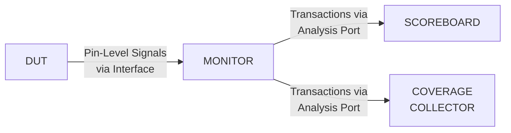

> [!info] Practice SET Details:-
> **Name**: Rikhil Nellimarla
> **Registration** Number: 23BEC7030
> **Course Name**: HDL Verification
> **Slot**: F1 + TF1

---

## Question 1(a): Events with `wait_order`

**Question:** For the following code given for events, discuss about the displayed output.

### Given Code

```verilog
module events_example;
  event ev_A, ev_B, ev_C;
  initial begin
    fork
      begin
        #12
        $display($time, "\t triggering The Event ev_A");
        ->ev_A;
      end
      begin
        #5
        $display($time, "\t triggering The Event ev_C");
        ->ev_C;
      end
      begin
        #8
        $display($time, "\t triggering The Event ev_B");
        ->ev_B;
      end
      begin
        $display($time, "\t waiting for the Event to trigger");
        wait_order(ev_A, ev_C, ev_B);
        $display($time, "\tEvent's triggered Inorder");
      end
    join
  end
endmodule
```

### Answer

**Timeline of events:**

| Time | Action |
|------|--------|
| 0 | 4th thread prints "waiting for the Event to trigger" and starts `wait_order(ev_A, ev_C, ev_B)` |
| 5 | ev_C triggered first |
| 8 | ev_B triggered second |
| 12 | ev_A triggered third |

**`wait_order(ev_A, ev_C, ev_B)`** expects events in order: ev_A → ev_C → ev_B. But the actual trigger order is ev_C (t=5) → ev_B (t=8) → ev_A (t=12). Since ev_C fires before ev_A, the ordering is violated immediately.

**Expected Output:**
```
0	 waiting for the Event to trigger
5	 triggering The Event ev_C
8	 triggering The Event ev_B
12	 triggering The Event ev_A
```

The `wait_order` fails because events were triggered in wrong order (ev_C first instead of ev_A). A runtime error/warning is issued and "Event's triggered Inorder" is **never displayed**.

---

## Question 1(b): Method Overriding and Abstract Classes

**Question:** What do you mean by overriding of a method while extending a sub-class from a base class? Discuss with a suitable example. Also, discuss about an abstract class and its importance.

### Answer

#### Method Overriding

When a child class redefines a method inherited from a parent class with the **same name and signature**, the child's version replaces the parent's. This is **method overriding** — enabling polymorphic behavior.

```verilog
class Animal;
  virtual function void speak();
    $display("Animal speaks");
  endfunction
endclass

class Dog extends Animal;
  function void speak();  // Override
    $display("Dog barks");
  endfunction
endclass

module test;
  initial begin
    Animal a;
    Dog d = new();
    a = d;          // Parent handle points to child
    a.speak();      // Calls Dog's speak() due to virtual
  end
endmodule
```

**Output:** `Dog barks` — The `virtual` keyword enables dynamic dispatch.

#### Abstract Classes

An **abstract class** (declared with `virtual class`) cannot be instantiated directly. It serves as a blueprint for derived classes and can contain **pure virtual methods** that must be implemented by subclasses.

```verilog
virtual class Shape;
  pure virtual function int area();
endclass

class Rectangle extends Shape;
  int w, h;
  function new(int w, h); this.w = w; this.h = h; endfunction
  function int area(); return w * h; endfunction
endclass
```

**Importance:**
1. Enforces a common interface across derived classes
2. Prevents instantiation of incomplete/generic types
3. Enables polymorphism in verification environments (e.g., UVM base classes)

---

## Question 2: Semaphore – Room Access

**Question:** For the following code given for semaphore, discuss about the displayed output.

### Given Code

```verilog
module tb_top;
  semaphore room_key;
  initial begin
    room_key = new(2);  // Two rooms available
    fork
      personX();
      personY();
      #2 personZ();
    join_none
  end

  task getRoom(string name);
    $display("[%0t] %s trying to get the room", $time, name);
    room_key.get(1);
    $display("[%0t] %s got the room", $time, name);
  endtask

  task putRoom(string name);
    $display("[%0t] %s leaving the room", $time, name);
    room_key.put(1);
    $display("[%0t] %s released the room", $time, name);
  endtask

  task personX;
    getRoom("PersonX");
    #10 putRoom("PersonX");
  endtask

  task personY;
    getRoom("PersonY");
    #10 putRoom("PersonY");
  endtask

  task personZ;
    getRoom("PersonZ");
    #10 putRoom("PersonZ");
  endtask
endmodule
```

### Answer

**Semaphore has 2 keys.** PersonX and PersonY start at t=0, PersonZ starts at t=2.

| Time | Event | Keys Available |
|------|-------|---------------|
| 0 | PersonX trying → gets room | 2→1 |
| 0 | PersonY trying → gets room | 1→0 |
| 2 | PersonZ trying → **blocked** (0 keys) | 0 |
| 10 | PersonX leaves → releases key | 0→1 |
| 10 | PersonZ gets room (key available) | 1→0 |
| 10 | PersonY leaves → releases key | 0→1 |
| 20 | PersonZ leaves → releases key | 1→2 |

**Expected Output:**
```
[0] PersonX trying to get the room
[0] PersonX got the room
[0] PersonY trying to get the room
[0] PersonY got the room
[2] PersonZ trying to get the room
[10] PersonX leaving the room
[10] PersonX released the room
[10] PersonZ got the room
[10] PersonY leaving the room
[10] PersonY released the room
[20] PersonZ leaving the room
[20] PersonZ released the room
```

---

## Question 3: `join` vs `join_any` Behavior

**Question:** Modify the given code to replace `join_any` with `join` and observe the behaviour.

### Given Code (with `join_any`)

```verilog
module tb;
  initial begin
    $display("[%0t] Main Thread: Fork join_any going to start", $time);
    fork
      fork
        #50 $display("[%0t] Thread1_0 ...", $time);
        #70 $display("[%0t] Thread1_1 ...", $time);
        begin
          #10 $display("[%0t] Thread1_2 ...", $time);
          #100 $display("[%0t] Thread1_2 finished", $time);
        end
      join_any
      begin
        #5 $display("[%0t] Thread2 ....", $time);
        #10 $display("[%0t] Thread2 finished", $time);
      end
      #20 $display("[%0t] Thread3 finished", $time);
    join_any
    $display("[%0t] Main Thread: Fork join_any has finished", $time);
  end
endmodule
```

### Answer

#### With `join_any` (original)

`join_any` returns as soon as **any one** thread in the fork completes.

- Inner `fork/join_any`: Thread1_2's first statement (#10) finishes first → inner fork returns at t=10
- Outer `fork/join_any`: Three threads — inner fork (done at t=10), Thread2 (#5 done at t=5), Thread3 (#20)
- Thread2's first part finishes at t=5 → outer `join_any` returns at t=5

**Output with `join_any`:**
```
[0] Main Thread: Fork join_any going to start
[5] Thread2 ....
[5] Main Thread: Fork join_any has finished
```

#### Modified with `join` 

Replace both `join_any` with `join`. Now **all** threads must complete.

- Inner `fork/join`: waits for all — Thread1_0 (t=50), Thread1_1 (t=70), Thread1_2 (t=10+100=t=110) → completes at t=110
- Outer `fork/join`: waits for inner fork (t=110), Thread2 (t=5+10=t=15), Thread3 (t=20) → completes at t=110

**Output with `join`:**
```
[0] Main Thread: Fork join_any going to start
[5] Thread2 ....
[10] Thread1_2 ...
[15] Thread2 finished
[20] Thread3 finished
[50] Thread1_0 ...
[70] Thread1_1 ...
[110] Thread1_2 finished
[110] Main Thread: Fork join_any has finished
```

**Key difference:** `join` waits for **all** threads; `join_any` returns after the **first** thread completes.

---

## Question 4(a): Constraint Prediction

**Question:** For the following code, predict the values of "a" by considering constraint.

### Given Code

```verilog
class packet;
  rand bit [3:0] a;
  string str;
  constraint start_a {if(str = "small") a > 5; else a < 5; }
endclass

module fstr;
  initial begin
    packet pkt;
    pkt = new();
    pkt.str = "small";
    repeat(10) begin
      pkt.randomize();
      $display("\t a =%d", pkt.a);
    end
  end
endmodule
```

### Answer

**Note:** The constraint uses `=` (assignment) instead of `==` (comparison): `if(str = "small")`. In SystemVerilog constraints, `=` in an `if` condition acts as assignment, which always evaluates to **true** (non-zero).

Since the condition always evaluates true: **constraint `a > 5` is always active**.

For `bit [3:0] a` (range 0–15), `a > 5` means **a ∈ {6, 7, 8, 9, 10, 11, 12, 13, 14, 15}**.

**Expected Output:** 10 random values from {6, 7, 8, 9, 10, 11, 12, 13, 14, 15}.

```
 a = 6
 a =12
 a = 9
 a =15
 a = 7
 a =11
 a = 8
 a =14
 a =10
 a =13
```

*(Actual values will vary per simulation run, but all will be > 5)*

---

## Question 4(b): Data Hiding – `local` and `protected`

**Question:** Discuss how data hiding is achieved in SystemVerilog using `local` and `protected` access control.

### Answer

Data hiding restricts access to class members, preventing unintended modification.

#### `local` Access

Members declared `local` are accessible **only within the class** that defines them — not even by child classes.

```verilog
class BankAccount;
  local int balance = 1000;
  
  function int getBalance();
    return balance;  // OK - same class
  endfunction
  
  function void deposit(int amt);
    balance += amt;  // OK - same class
  endfunction
endclass

class SavingsAccount extends BankAccount;
  function void tryAccess();
    // balance = 500;  // ERROR! 'local' not visible in child
    deposit(500);      // OK - using public method
  endfunction
endclass
```

#### `protected` Access

Members declared `protected` are accessible within the defining class **and all derived classes**, but not from outside.

```verilog
class Vehicle;
  protected int speed;
  
  function void setSpeed(int s);
    speed = s;
  endfunction
endclass

class Car extends Vehicle;
  function void accelerate();
    speed += 10;  // OK - 'protected' visible in child
  endfunction
endclass

module test;
  initial begin
    Car c = new();
    // c.speed = 50;  // ERROR! 'protected' not visible outside
    c.setSpeed(50);   // OK - using public method
  end
endmodule
```

| Modifier | Same Class | Child Class | Outside |
|----------|-----------|-------------|---------|
| *(default)* | ✅ | ✅ | ✅ |
| `protected` | ✅ | ✅ | ❌ |
| `local` | ✅ | ❌ | ❌ |

---

## Question 5(a): `unique if` vs `priority if`

**Question:** Modify the given code to use `priority if-else` instead of `unique if` and analyse when x = 6.

### Given Code

```verilog
module tb;
  int x = 6;
  
  initial begin
    if (x == 3)
      $display("x is %0d", x);
    else if (x == 5)
      $display("x is %0d", x);
    else
      $display("x is neither 3 nor 5");
    if (x == 3)
      $display("x is %0d", x);
    else if (x == 5)
      $display("x is %0d", x);
    else
      $display("This is the added else statement: x is %0d", x);
  end
endmodule
```

### Answer

#### Output with x = 6:
```
x is neither 3 nor 5
This is the added else statement: x is 6
```

Since x=6 matches neither 3 nor 5, the `else` clause executes in both blocks.

#### `unique if` vs `priority if` Comparison

**`unique if`:**
- Guarantees **exactly one** condition is true
- Simulator issues a **warning** if no condition matches (and no `else`)
- Simulator issues a **warning** if multiple conditions match
- Conditions are evaluated **in parallel** (no priority)

**`priority if`:**
- Conditions are evaluated **in order** (first match wins)
- Simulator issues a **warning** if no condition matches (and no `else`)
- No warning for overlapping conditions (first match takes priority)

```verilog
// With priority if
priority if (x == 3)
  $display("x is 3");
else if (x == 5)
  $display("x is 5");
else
  $display("x is neither 3 nor 5");  // This executes for x=6
```

Adding the `else` clause eliminates the "no matching condition" warning in both cases.

---

## Question 5(b): Structures vs Arrays

**Question:** How is a structure different from an array?

### Answer

| Feature | Structure | Array |
|---------|-----------|-------|
| **Data types** | Can hold **different** data types | All elements must be **same** type |
| **Access** | By **member name** | By **index** |
| **Declaration** | `struct { int a; string b; }` | `int arr[5]` |
| **Use case** | Grouping related but heterogeneous data | Storing collections of homogeneous data |

```verilog
// Structure - heterogeneous
typedef struct {
  string name;
  int    age;
  bit    active;
} Student;

Student s1 = '{"Rikhil", 21, 1};
$display("Name: %s, Age: %0d", s1.name, s1.age);

// Array - homogeneous
int scores[3] = '{85, 92, 78};
$display("Score: %0d", scores[0]);
```

---

## Question 6(a): Role of Monitor in UVM

**Question:** What is the purpose of a monitor in a SystemVerilog UVM testbench? Show interaction with other components.

### Answer

The **Monitor** is a passive component that **observes** DUT signals without driving them. It captures pin-level activity and converts it back into transactions for analysis.

#### Key Responsibilities:
1. **Signal Observation**: Samples DUT interface signals on clock edges
2. **Transaction Reconstruction**: Converts pin-level signals to transaction objects
3. **Broadcasting**: Sends transactions to scoreboard/coverage via analysis ports
4. **Protocol Checking**: Verifies protocol compliance passively



#### Monitor vs Driver

| Aspect | Monitor | Driver |
|--------|---------|--------|
| Role | Passive observer | Active stimulus driver |
| Direction | DUT → Testbench | Testbench → DUT |
| Signals | Reads only | Drives signals |

---

## Question 6(b): Sequencer vs Driver in UVM

### Answer

| Aspect | Sequencer | Driver |
|--------|-----------|--------|
| **Role** | Generates and arbitrates transactions | Converts transactions to pin-level signals |
| **Abstraction** | Transaction level | Signal level |
| **Randomization** | Produces randomized stimulus | No randomization |
| **Connection** | Connects to driver via TLM port | Connects to DUT via virtual interface |

**Randomization influence on Sequencer:** The sequencer uses constrained random verification to generate diverse stimulus. Randomization enables:
- Exploration of corner cases automatically
- Coverage-driven verification (targeting untested scenarios)
- Reproducibility via seed control

---

## Question 7: Dynamic Array – Even Numbers

**Question:** Create a dynamic array containing the first 12 even numbers starting from 4. Perform filtering and transformation operations.

### Solution

```verilog
module q7_even_numbers;

  int evens[];
  int mult4_not8[$];
  int gt10_count = 0;
  int squared[];

  initial begin
    // Create first 12 even numbers from 4: 4,6,8,10,...,26
    evens = new[12];
    foreach (evens[i])
      evens[i] = 4 + (i * 2);

    $display("Original array:");
    foreach (evens[i]) $display("evens[%0d] = %0d", i, evens[i]);

    // (a) Multiples of 4 but not divisible by 8
    foreach (evens[i]) begin
      if (evens[i] % 4 == 0 && evens[i] % 8 != 0)
        mult4_not8.push_back(evens[i]);
    end
    $display("\n(a) Multiples of 4 but not by 8:");
    foreach (mult4_not8[i]) $display("%0d", mult4_not8[i]);

    // (b) Count elements > 10 and double them
    foreach (evens[i]) begin
      if (evens[i] > 10) begin
        gt10_count++;
        evens[i] = evens[i] * 2;
      end
    end
    $display("\n(b) Elements > 10: %0d", gt10_count);
    $display("After doubling:");
    foreach (evens[i]) $display("evens[%0d] = %0d", i, evens[i]);

    // (c) Square of each original element
    squared = new[12];
    // Reset to original first
    foreach (evens[i]) evens[i] = 4 + (i * 2);
    foreach (squared[i])
      squared[i] = evens[i] * evens[i];

    $display("\n(c) Original and Squared:");
    foreach (evens[i])
      $display("evens[%0d] = %0d, squared = %0d", i, evens[i], squared[i]);

    $finish;
  end

endmodule
```

### Expected Output
```
Original array:
evens[0] = 4
evens[1] = 6
evens[2] = 8
evens[3] = 10
evens[4] = 12
evens[5] = 14
evens[6] = 16
evens[7] = 18
evens[8] = 20
evens[9] = 22
evens[10] = 24
evens[11] = 26

(a) Multiples of 4 but not by 8:
4
12
20

(b) Elements > 10: 8
After doubling:
evens[0] = 4
evens[1] = 6
evens[2] = 8
evens[3] = 10
evens[4] = 24
evens[5] = 28
evens[6] = 32
evens[7] = 36
evens[8] = 40
evens[9] = 44
evens[10] = 48
evens[11] = 52

(c) Original and Squared:
evens[0] = 4, squared = 16
evens[1] = 6, squared = 36
evens[2] = 8, squared = 64
evens[3] = 10, squared = 100
evens[4] = 12, squared = 144
evens[5] = 14, squared = 196
evens[6] = 16, squared = 256
evens[7] = 18, squared = 324
evens[8] = 20, squared = 400
evens[9] = 22, squared = 484
evens[10] = 24, squared = 576
evens[11] = 26, squared = 676
```

---

## Question 8: String Processing – Reverse and Consonants

**Question:** Given str1 = "HDL is powerful" and str2 = "SystemVerilog enhances productivity". Reverse both, count consonants, compare.

### Solution

```verilog
module q8_string_processing;

  string str1 = "HDL is powerful";
  string str2 = "SystemVerilog enhances productivity";
  string rev1 = "";
  string rev2 = "";
  int cons1 = 0, cons2 = 0;
  byte c;

  function bit is_consonant(byte ch);
    if ((ch >= "a" && ch <= "z") || (ch >= "A" && ch <= "Z")) begin
      if (ch == "a" || ch == "e" || ch == "i" || ch == "o" || ch == "u" ||
          ch == "A" || ch == "E" || ch == "I" || ch == "O" || ch == "U")
        return 0;
      return 1;
    end
    return 0;
  endfunction

  initial begin
    // (a) Reverse both strings
    for (int i = str1.len()-1; i >= 0; i--)
      rev1 = {rev1, string'(str1[i])};
    for (int i = str2.len()-1; i >= 0; i--)
      rev2 = {rev2, string'(str2[i])};

    $display("str1: %s", str1);
    $display("Reversed: %s", rev1);
    $display("str2: %s", str2);
    $display("Reversed: %s", rev2);

    // (b) Count consonants
    for (int i = 0; i < str1.len(); i++)
      if (is_consonant(str1[i])) cons1++;
    for (int i = 0; i < str2.len(); i++)
      if (is_consonant(str2[i])) cons2++;

    $display("\nConsonants in str1: %0d", cons1);
    $display("Consonants in str2: %0d", cons2);

    // (c) Compare
    if (cons1 > cons2)
      $display("str1 has more consonants, diff = %0d", cons1 - cons2);
    else if (cons2 > cons1)
      $display("str2 has more consonants, diff = %0d", cons2 - cons1);
    else
      $display("Both have equal consonants");

    $finish;
  end
endmodule
```

### Expected Output
```
str1: HDL is powerful
Reversed: lufrewop si LDH
str2: SystemVerilog enhances productivity
Reversed: ytivitcudorp secnahne golireVmetsyS

Consonants in str1: 7
Consonants in str2: 21

str2 has more consonants, diff = 14
```

---


## Question 9: Enum – State Machine

**Question:** Define enum `State` with IDLE=0, START=1, EXECUTE=3, STOP=5, ERROR=7. Print names/values, check if value 5 exists, warn if ERROR is active.

### Solution

```verilog
module q9_state_enum;

  typedef enum int {
    IDLE    = 0,
    START   = 1,
    EXECUTE = 3,
    STOP    = 5,
    ERROR   = 7
  } State;

  State current_state;
  State s;
  bit found = 0;

  initial begin
    // (a) Print all states using loop
    $display("All States:");
    s = s.first();
    for (int i = 0; i < s.num(); i++) begin
      $display("%s = %0d", s.name(), s);
      s = s.next();
    end

    // (b) Check if value 5 exists
    s = s.first();
    for (int i = 0; i < s.num(); i++) begin
      if (s == 5) begin
        found = 1;
        $display("\nValue 5 exists: %s", s.name());
        break;
      end
      s = s.next();
    end
    if (!found) $display("\nValue 5 does NOT exist");

    // (c) Warning if ERROR is active
    current_state = ERROR;
    if (current_state == ERROR)
      $display("\nWARNING: ERROR state is active!");

    $finish;
  end

endmodule
```

### Expected Output
```
All States:
IDLE = 0
START = 1
EXECUTE = 3
STOP = 5
ERROR = 7

Value 5 exists: STOP

WARNING: ERROR state is active!
```

---

## Question 10: Static vs Dynamic Arrays + Queue Operations

**Question:** (a) Differentiate static and dynamic arrays. (b) Queue operations with q1={10,15,20,25} and q2={5,10,15,20}.

### Answer (a): Static vs Dynamic Arrays

| Feature | Static Array | Dynamic Array |
|---------|-------------|---------------|
| **Size** | Fixed at compile time | Set at runtime |
| **Declaration** | `int arr[5];` | `int arr[];` |
| **Memory** | Allocated at compile time | Allocated with `new[]` |
| **Resizing** | Not possible | Use `new[N]` or `new[N](old)` |

```verilog
// Static
int static_arr[4] = '{1, 2, 3, 4};  // Size fixed to 4

// Dynamic
int dyn_arr[];
dyn_arr = new[3];          // Allocate 3 elements
dyn_arr = new[5](dyn_arr); // Resize to 5, preserve old data
```

### Solution (b)

```verilog
module q10_queue_ops;

  int q1[$] = '{10, 15, 20, 25};
  int q2[$] = '{5, 10, 15, 20};
  int q3[$];
  int q4[$];

  initial begin
    $display("Initial:");
    $display("q1 = %p", q1);
    $display("q2 = %p", q2);

    // (1) q3 = last 2 of q1 + first 2 of q2
    q3 = {q1[$-1:$], q2[0:1]};
    $display("\nStep 1 - q3 (last 2 of q1 + first 2 of q2):");
    $display("q3 = %p", q3);  // '{20, 25, 5, 10}

    // (2) Insert 100 at second position, remove last
    q3.insert(1, 100);
    $display("\nStep 2a - After insert 100 at pos 1:");
    $display("q3 = %p", q3);  // '{20, 100, 25, 5, 10}

    q3.delete(q3.size()-1);
    $display("Step 2b - After removing last:");
    $display("q3 = %p", q3);  // '{20, 100, 25, 5}

    // (3) q4 = alternate merge of q1 and q2
    for (int i = 0; i < q1.size(); i++) begin
      q4.push_back(q1[i]);
      if (i < q2.size()) q4.push_back(q2[i]);
    end
    $display("\nStep 3 - q4 (alternate merge):");
    $display("q4 = %p", q4);  // '{10, 5, 15, 10, 20, 15, 25, 20}

    $display("\nFinal State:");
    $display("q1 = %p", q1);
    $display("q2 = %p", q2);
    $display("q3 = %p", q3);
    $display("q4 = %p", q4);

    $finish;
  end

endmodule
```

### Expected Output
```
Initial:
q1 = '{10, 15, 20, 25}
q2 = '{5, 10, 15, 20}

Step 1 - q3 (last 2 of q1 + first 2 of q2):
q3 = '{20, 25, 5, 10}

Step 2a - After insert 100 at pos 1:
q3 = '{20, 100, 25, 5, 10}
Step 2b - After removing last:
q3 = '{20, 100, 25, 5}

Step 3 - q4 (alternate merge):
q4 = '{10, 5, 15, 10, 20, 15, 25, 20}

Final State:
q1 = '{10, 15, 20, 25}
q2 = '{5, 10, 15, 20}
q3 = '{20, 100, 25, 5}
q4 = '{10, 5, 15, 10, 20, 15, 25, 20}
```

---

## Question 11: Dynamic Array – Multiples of 3

**Question:** Create dynamic array with first 10 multiples of 3 starting from 6. Find elements divisible by 6 but not 9. Count elements < 25 and increment by 5.

### Solution

```verilog
module q11_multiples_of_3;

  int arr[];
  int div6_not9[$];
  int lt25_count = 0;

  initial begin
    // First 10 multiples of 3 starting from 6: 6,9,12,15,18,21,24,27,30,33
    arr = new[10];
    foreach (arr[i])
      arr[i] = 6 + (i * 3);

    $display("Original array:");
    foreach (arr[i]) $display("arr[%0d] = %0d", i, arr[i]);

    // (a) Divisible by 6 but not by 9
    foreach (arr[i]) begin
      if (arr[i] % 6 == 0 && arr[i] % 9 != 0)
        div6_not9.push_back(arr[i]);
    end
    $display("\nDivisible by 6 but not 9:");
    foreach (div6_not9[i]) $display("%0d", div6_not9[i]);

    // (b) Count < 25 and increment by 5
    foreach (arr[i]) begin
      if (arr[i] < 25) begin
        lt25_count++;
        arr[i] += 5;
      end
    end
    $display("\nElements < 25: %0d", lt25_count);
    $display("After incrementing by 5:");
    foreach (arr[i]) $display("arr[%0d] = %0d", i, arr[i]);

    $finish;
  end

endmodule
```

### Expected Output
```
Original array:
arr[0] = 6
arr[1] = 9
arr[2] = 12
arr[3] = 15
arr[4] = 18
arr[5] = 21
arr[6] = 24
arr[7] = 27
arr[8] = 30
arr[9] = 33

Divisible by 6 but not 9:
6
12
24
30

Elements < 25: 7
After incrementing by 5:
arr[0] = 11
arr[1] = 14
arr[2] = 17
arr[3] = 20
arr[4] = 23
arr[5] = 26
arr[6] = 29
arr[7] = 27
arr[8] = 30
arr[9] = 33
```

---

## Question 12: Enum – State (duplicate of Q9)

*This question is identical to Question 9. Refer to the solution above.*

---

## Question 13: Role of Monitor + Driver I/O + SV Features

*This is a theory question combining Q6(a), the Driver discussion from Q1(a) of the original assignment, and SV vs Verilog from Q1(b) of the assignment. Refer to those answers.*

---

## Question 14: Enum – Priority Levels

**Question:** Define enum `Priority` with LOW=1, MEDIUM=4, HIGH=6, CRITICAL=9, INVALID=15.

### Solution

```verilog
module q14_priority_enum;

  typedef enum int {
    LOW      = 1,
    MEDIUM   = 4,
    HIGH     = 6,
    CRITICAL = 9,
    INVALID  = 15
  } Priority;

  Priority p;
  Priority current_task;
  bit found = 0;

  initial begin
    // (a) Print all priority levels
    $display("Priority Levels:");
    p = p.first();
    for (int i = 0; i < p.num(); i++) begin
      $display("%s = %0d", p.name(), p);
      p = p.next();
    end

    // (b) Check if value 6 exists
    p = p.first();
    for (int i = 0; i < p.num(); i++) begin
      if (p == 6) begin
        found = 1;
        $display("\nValue 6 exists: %s", p.name());
        break;
      end
      p = p.next();
    end
    if (!found) $display("\nValue 6 does NOT exist");

    // (c) Warning if CRITICAL
    current_task = CRITICAL;
    if (current_task == CRITICAL)
      $display("\nWARNING: Current task priority is CRITICAL!");

    $finish;
  end

endmodule
```

### Expected Output
```
Priority Levels:
LOW = 1
MEDIUM = 4
HIGH = 6
CRITICAL = 9
INVALID = 15

Value 6 exists: HIGH

WARNING: Current task priority is CRITICAL!
```

---

## Question 15: Associative Array – Quiz Scores

*This is identical to Question 9 from the original Assignment. Refer to that solution.*

---

## Question 16: Queue Operations – Q1={12,18,20,28} Q2={6,12,18,24}

### Solution

```verilog
module q16_queue_ops;

  int Q1[$] = '{12, 18, 20, 28};
  int Q2[$] = '{6, 12, 18, 24};
  int Q3[$];
  int Q4[$];

  initial begin
    $display("Initial:");
    $display("Q1 = %p", Q1);
    $display("Q2 = %p", Q2);

    // (1) Q3 = first 2 of Q1 + last of Q2
    Q3 = {Q1[0:1], Q2[$:$]};
    $display("\nStep 1 - Q3:");
    $display("Q3 = %p", Q3);  // '{12, 18, 24}

    // (2) Insert 60 at 3rd position (index 2), remove last
    Q3.insert(2, 60);
    $display("\nStep 2a - After insert 60:");
    $display("Q3 = %p", Q3);  // '{12, 18, 60, 24}

    Q3.delete(Q3.size()-1);
    $display("Step 2b - After remove last:");
    $display("Q3 = %p", Q3);  // '{12, 18, 60}

    // (3) Q4 = alternate merge of Q1 and Q2
    for (int i = 0; i < Q1.size(); i++) begin
      Q4.push_back(Q1[i]);
      if (i < Q2.size()) Q4.push_back(Q2[i]);
    end
    $display("\nStep 3 - Q4 (alternate merge):");
    $display("Q4 = %p", Q4);

    $display("\nFinal:");
    $display("Q1 = %p", Q1);
    $display("Q2 = %p", Q2);
    $display("Q3 = %p", Q3);
    $display("Q4 = %p", Q4);

    $finish;
  end

endmodule
```

### Expected Output
```
Initial:
Q1 = '{12, 18, 20, 28}
Q2 = '{6, 12, 18, 24}

Step 1 - Q3:
Q3 = '{12, 18, 24}

Step 2a - After insert 60:
Q3 = '{12, 18, 60, 24}
Step 2b - After remove last:
Q3 = '{12, 18, 60}

Step 3 - Q4 (alternate merge):
Q4 = '{12, 6, 18, 12, 20, 18, 28, 24}

Final:
Q1 = '{12, 18, 20, 28}
Q2 = '{6, 12, 18, 24}
Q3 = '{12, 18, 60}
Q4 = '{12, 6, 18, 12, 20, 18, 28, 24}
```

---

## Question 17: Function & Task – Prime Sum Check

**Question:** Check whether the sum of two integers is prime using function and task.

### Solution

```verilog
module q17_prime_check;

  // Function version
  function bit is_prime_func(int a, int b);
    int sum = a + b;
    if (sum < 2) return 0;
    for (int i = 2; i * i <= sum; i++)
      if (sum % i == 0) return 0;
    return 1;
  endfunction

  // Task version
  task is_prime_task(int a, int b);
    int sum = a + b;
    bit result = 1;
    if (sum < 2) result = 0;
    else begin
      for (int i = 2; i * i <= sum; i++) begin
        if (sum % i == 0) begin
          result = 0;
          break;
        end
      end
    end
    if (result)
      $display("Task: Sum of %0d + %0d = %0d is PRIME", a, b, sum);
    else
      $display("Task: Sum of %0d + %0d = %0d is NOT PRIME", a, b, sum);
  endtask

  initial begin
    int a = 7, b = 4;
    bit result;

    // Using function
    result = is_prime_func(a, b);
    if (result)
      $display("Function: Sum of %0d + %0d = %0d is PRIME", a, b, a+b);
    else
      $display("Function: Sum of %0d + %0d = %0d is NOT PRIME", a, b, a+b);

    // Using task
    is_prime_task(a, b);

    // Test with another pair
    a = 10; b = 5;
    result = is_prime_func(a, b);
    if (result)
      $display("Function: Sum of %0d + %0d = %0d is PRIME", a, b, a+b);
    else
      $display("Function: Sum of %0d + %0d = %0d is NOT PRIME", a, b, a+b);
    is_prime_task(a, b);

    $finish;
  end

endmodule
```

### Expected Output
```
Function: Sum of 7 + 4 = 11 is PRIME
Task: Sum of 7 + 4 = 11 is PRIME
Function: Sum of 10 + 5 = 15 is NOT PRIME
Task: Sum of 10 + 5 = 15 is NOT PRIME
```

---


## Question 18: Class – Vehicle with Constructors

**Question:** Define class vehicle with parameterized constructor and default constructor.

### Solution

```verilog
module q18_vehicle_class;

  // Parameterized constructor version
  class Vehicle;
    string model;
    string color;
    int mileage;

    function new(string m = "", string c = "", int mi = 0);
      model = m;
      color = c;
      mileage = mi;
    endfunction

    function void display();
      $display("Model: %s, Color: %s, Mileage: %0d", model, color, mileage);
    endfunction

    function void assign_data(string m, string c, int mi);
      model = m;
      color = c;
      mileage = mi;
    endfunction
  endclass

  initial begin
    Vehicle v1, v2, v3, v4;

    // Using parameterized constructor
    $display("=== Parameterized Constructor ===");
    v1 = new("Swift", "White", 22);
    v2 = new("Creta", "Black", 18);
    v1.display();
    v2.display();

    // Using default constructor + assign_data
    $display("\n=== Default Constructor + assign_data ===");
    v3 = new();
    v4 = new();
    v3.assign_data("Swift", "White", 22);
    v4.assign_data("Creta", "Black", 18);
    v3.display();
    v4.display();

    $finish;
  end

endmodule
```

### Expected Output
```
=== Parameterized Constructor ===
Model: Swift, Color: White, Mileage: 22
Model: Creta, Color: Black, Mileage: 18

=== Default Constructor + assign_data ===
Model: Swift, Color: White, Mileage: 22
Model: Creta, Color: Black, Mileage: 18
```

---

## Question 19(a): Packed vs Unpacked Arrays

*Refer to Question 5(b) of the original Assignment for a detailed answer.*

| Aspect | Packed Array | Unpacked Array |
|--------|--------------|----------------|
| Memory | Contiguous bits | Separate elements |
| Syntax | `bit [7:0] a;` (before name) | `bit a[8];` (after name) |
| Arithmetic | Yes | No |
| Slicing | Yes | Limited |

---

## Question 19(b): Monitor vs Sequencer + Randomization

*Refer to Questions 6(a) and 6(b) above for detailed answers.*

---

## Question 20: Queue Operations (qa/qb)

*This is identical to Question 10 of the original Assignment. Refer to that solution.*

---

## Question 21: String Reversal – Function & Task

### Solution

```verilog
module q21_string_reverse;

  function string reverse_func(string s);
    string result = "";
    for (int i = s.len()-1; i >= 0; i--)
      result = {result, string'(s[i])};
    return result;
  endfunction

  task reverse_task(string s);
    string result = "";
    for (int i = s.len()-1; i >= 0; i--)
      result = {result, string'(s[i])};
    $display("Task reversed: %s", result);
  endtask

  initial begin
    string str = "HDL Verification";
    string reversed;

    // Using function
    reversed = reverse_func(str);
    $display("Original: %s", str);
    $display("Function reversed: %s", reversed);

    // Using task
    reverse_task(str);

    $finish;
  end

endmodule
```

### Expected Output
```
Original: HDL Verification
Function reversed: noitacifireV LDH
Task reversed: noitacifireV LDH
```

---

## Question 22: Semaphore – Restaurant Tables

**Question:** 3 tables, multiple customers arriving at different times. Use semaphores.

### Given Code

```verilog
module tb_restaurant;
  semaphore tables;
  initial begin
    tables = new(3);
    fork
      customer("Customer1");
      #3 customer("Customer2");
      #5 customer("Customer3");
      #8 customer("Customer4");
    join_none
  end

  task customer(string name);
    begin
      $display("[%0t] %s is waiting for a table", $time, name);
      tables.get(1);
      $display("[%0t] %s got a table", $time, name);
      #10;
      $display("[%0t] %s is done dining", $time, name);
      tables.put(1);
      $display("[%0t] %s left the table", $time, name);
    end
  endtask
endmodule
```

### Answer

**Semaphore has 3 keys (tables).**

| Time | Event | Keys |
|------|-------|------|
| 0 | Customer1 waiting → gets table | 3→2 |
| 3 | Customer2 waiting → gets table | 2→1 |
| 5 | Customer3 waiting → gets table | 1→0 |
| 8 | Customer4 waiting → **blocked** | 0 |
| 10 | Customer1 done → releases | 0→1 |
| 10 | Customer4 gets table | 1→0 |
| 13 | Customer2 done → releases | 0→1 |
| 15 | Customer3 done → releases | 1→2 |
| 20 | Customer4 done → releases | 2→3 |

### Expected Output
```
[0] Customer1 is waiting for a table
[0] Customer1 got a table
[3] Customer2 is waiting for a table
[3] Customer2 got a table
[5] Customer3 is waiting for a table
[5] Customer3 got a table
[8] Customer4 is waiting for a table
[10] Customer1 is done dining
[10] Customer1 left the table
[10] Customer4 got a table
[13] Customer2 is done dining
[13] Customer2 left the table
[15] Customer3 is done dining
[15] Customer3 left the table
[20] Customer4 is done dining
[20] Customer4 left the table
```

---

## Question 23: Role of Driver + SV Features

*This is identical to Q1(a) and Q1(b) of the original Assignment. Refer to those answers.*

---

## Question 24(a): Data Hiding (local/protected)

*Identical to Q4(b) above. Refer to that answer.*

---

## Question 24(b): Method Overriding & Abstract Classes

*Identical to Q1(b) above. Refer to that answer.*

---

## Question 25: Events with `wait_order`

### Given Code (same as page5_img0 — identical to Q1a)

*This code is the same `events_example` module with `wait_order(ev_A, ev_C, ev_B)`. Refer to Q1(a) answer.*

**Summary:** Events trigger in order ev_C(t=5) → ev_B(t=8) → ev_A(t=12). The `wait_order` expects ev_A first, so it **fails** with a runtime error.

---

## Question 26: Functional Coverage Evaluation

**Question:** Evaluate functional coverage for the following code if randomly generated values of data are from {1, 15, 20, 22}.

### Given Code

```verilog
module tb;
  bit [4:0] mode;
  covergroup cg;
    coverpoint mode {
      bins b1[] = {1, 7, 11, 26};
      bins b2   = {[2:6]};
      bins b3[] = {[8:10], [15:19], 21};
    }
  endgroup
  cg cg_inst = new();
  initial begin
    for (int i = 0; i < 4; i++) begin
      #10 mode = $random;
      cg_inst.sample();
    end
    $display("coverage = %0.2f%%", cg_inst.get_inst_coverage());
  end
endmodule
```

### Answer

**But the question says values are from {1, 15, 20, 22}.**

#### Bin Definitions

| Bin | Values |
|-----|--------|
| `b1[0]` | 1 |
| `b1[1]` | 7 |
| `b1[2]` | 11 |
| `b1[3]` | 26 |
| `b2` | 2,3,4,5,6 |
| `b3[0]` | 8,9,10 |
| `b3[1]` | 15,16,17,18,19 |
| `b3[2]` | 21 |

**Total bins = 8**

#### Evaluation with {1, 15, 20, 22}

| Sample | Value | Bin Hit |
|--------|-------|---------|
| 1 | 1 | `b1[0]` ✅ |
| 2 | 15 | `b3[1]` ✅ |
| 3 | 20 | No bin ❌ |
| 4 | 22 | No bin ❌ |

**Bins hit: 2 out of 8 → Coverage = 2/8 = 25.00%**

```
coverage = 25.00%
```

---

## Question 27: Semaphore – Charger Access

**Question:** For the following semaphore code, discuss the displayed output.

### Given Code

```verilog
module tb_top;
  semaphore charger_key;
  initial begin
    charger_key = new(3);
    fork
      carA();
      carB();
      #2 carC();
    join_none
  end

  task getCharger(string name);
    $display("[%0t] %s is waiting for a charger...", $time, name);
    charger_key.get(1);
    $display("[%0t] %s acquired a charger", $time, name);
  endtask

  task putCharger(string name);
    $display("[%0t] %s finished charging", $time, name);
    charger_key.put(1);
    $display("[%0t] %s released the charger", $time, name);
  endtask

  task carA;
    getCharger("CarA");
    #10 putCharger("CarA");
  endtask

  task carB;
    getCharger("CarB");
    #10 putCharger("CarB");
  endtask

  task carC;
    getCharger("CarC");
    #10 putCharger("CarC");
  endtask
endmodule
```

### Answer

**Semaphore has 3 keys.** All 3 cars can get chargers without blocking.

| Time | Event | Keys |
|------|-------|------|
| 0 | CarA gets charger | 3→2 |
| 0 | CarB gets charger | 2→1 |
| 2 | CarC gets charger | 1→0 |
| 10 | CarA releases | 0→1 |
| 10 | CarB releases | 1→2 |
| 12 | CarC releases | 2→3 |

### Expected Output
```
[0] CarA is waiting for a charger...
[0] CarA acquired a charger
[0] CarB is waiting for a charger...
[0] CarB acquired a charger
[2] CarC is waiting for a charger...
[2] CarC acquired a charger
[10] CarA finished charging
[10] CarA released the charger
[10] CarB finished charging
[10] CarB released the charger
[12] CarC finished charging
[12] CarC released the charger
```

**No blocking occurs** since there are 3 chargers for 3 cars.

---


## Question 28: Events with `wait_order` – Machine Startup

**Question:** For the following event code, discuss the displayed output.

### Given Code

```verilog
module machine_startup;
  event machine1_start, machine2_start, machine3_start;
  initial begin
    fork
      begin
        #3 $display("[%0t] Triggering Machine 2 Start", $time);
        ->machine2_start;
      end
      begin
        #1 $display("[%0t] Triggering Machine 3 Start", $time);
        ->machine3_start;
      end
      begin
        #5 $display("[%0t] Triggering Machine 1 Start", $time);
        ->machine1_start;
      end
      begin
        $display("[%0t] Monitoring startup sequence...", $time);
        wait_order(machine3_start, machine2_start, machine1_start);
        $display("[%0t] All machines started in correct order!", $time);
      end
    join
  end
endmodule
```

### Answer

**Timeline:**

| Time | Event |
|------|-------|
| 0 | "Monitoring startup sequence..." printed, `wait_order(machine3_start, machine2_start, machine1_start)` begins |
| 1 | machine3_start triggered ✅ (1st expected) |
| 3 | machine2_start triggered ✅ (2nd expected) |
| 5 | machine1_start triggered ✅ (3rd expected) |

The actual order matches the expected order perfectly!

### Expected Output
```
[0] Monitoring startup sequence...
[1] Triggering Machine 3 Start
[3] Triggering Machine 2 Start
[5] Triggering Machine 1 Start
[5] All machines started in correct order!
```

**Explanation:** `wait_order` expects machine3 → machine2 → machine1, and they fire at t=1, t=3, t=5 respectively — matching the expected order. So the success message prints at t=5 when the last event fires.

---

## Question 29: SVA Assertion – `$past` with `b |-> ($past(a,2)==1)`

**Question:** Identify where the assertion passes and fails based on signal transitions.

### Given Code

```verilog
module ass_tb3;
  bit clk, a, b;
  always #6 clk = ~clk;
  initial begin
    a=1; b=1;
    #18 a=0; b=1;
    #12 a=1; b=1;
    #12 a=0; b=0;
    #12 a=1; b=0;
    #12 a=0; b=1;
    #12;
    $finish;
  end

  property p2;
    @(posedge clk) b |-> ($past(a,2)==1);
  endproperty

  ast: assert property (p2);
end
endmodule
```

### Answer

Clock period = 12 (posedge at t=6, 18, 30, 42, 54, 66).

**Signal values at each posedge:**

| Posedge | Time | a | b | $past(a,1) | $past(a,2) | Property |
|---------|------|---|---|-----------|-----------|----------|
| 1 | 6 | 1 | 1 | x | x | b=1, $past(a,2)=x ≠ 1 → **FAIL** |
| 2 | 18 | 1 | 1 | 1 | x | b=1, $past(a,2)=x ≠ 1 → **FAIL** |
| 3 | 30 | 1 | 1 | 0 | 1 | b=1, $past(a,2)=1 → **PASS** |
| 4 | 42 | 0 | 0 | 1 | 0 | b=0, vacuous → **PASS** |
| 5 | 54 | 1 | 0 | 0 | 1 | b=0, vacuous → **PASS** |
| 6 | 66 | 0 | 1 | 1 | 0 | b=1, $past(a,2)=0 ≠ 1 → **FAIL** |

**Note:** At signal transitions happening exactly at posedge, the value sampled is the one before the transition (preponed region).

**Summary:** The assertion **passes** at t=30, 42, 54 and **fails** at t=6, 18, 66.

---

## Question 30: Functional Coverage – Opcode with Range Bin

**Question:** Evaluate coverage for opcode values from {0, 2, 4, 6, 8} with a covergroup checking range [4:7].

### Given Code

```verilog
module tb;
  bit [3:0] opcode;
  covergroup cg_opcode(ref bit [3:0] op);
    coverpoint op {
      bins range4_7[] = {[4:7]};
    }
  endgroup

  cg_opcode cg_inst;
  initial begin
    cg_inst = new(opcode);
    for (int i = 0; i < 5; i++) begin
      #10 opcode = $urandom_range(0, 8);
      $display("[%0t] opcode = 0x%0h", $time, opcode);
      cg_inst.sample();
    end
    $display("Coverage = %0.2f%%", cg_inst.get_inst_coverage());
  end
endmodule
```

### Answer

**Bin definition:** `bins range4_7[] = {[4:7]}` creates 4 auto-indexed bins:
- `range4_7[0]` = 4
- `range4_7[1]` = 5
- `range4_7[2]` = 6
- `range4_7[3]` = 7

**Total bins = 4**

If the 5 random samples from {0, 2, 4, 6, 8} are evaluated:

| Value | Bin Hit |
|-------|---------|
| 0 | No bin ❌ |
| 2 | No bin ❌ |
| 4 | `range4_7[0]` ✅ |
| 6 | `range4_7[2]` ✅ |
| 8 | No bin ❌ |

**Bins hit: 2 out of 4 → Coverage = 50.00%**

Values 0, 2, and 8 fall outside the [4:7] range and don't hit any bin. Values 5 and 7 are never sampled, so those bins remain empty.

---

## Question 31: SVA Assertion – `req |-> ##[1:2] ack`

**Question:** Identify pass/fail for the assertion based on signal transitions.

### Given Code

```verilog
module tb_handshake;
  bit clk, req, ack;
  always #5 clk = ~clk;
  initial begin
    clk = 0; req = 0; ack = 0;
    #10 req = 1;
    #10 ack = 1;
    #10 req = 0; ack = 0;
    #10 req = 1;
    #30 ack = 1;
    #10 $finish;
  end

  property p_handshake;
    @(posedge clk) req |-> ##[1:2] ack;
  endproperty

  a_handshake: assert property(p_handshake);
endmodule
```

### Answer

Clock period = 10, posedge at t=5, 15, 25, 35, 45, 55, 65, 75.

**Signal values at posedge:**

| Posedge | Time | req | ack |
|---------|------|-----|-----|
| 1 | 5 | 0 | 0 |
| 2 | 15 | 1 | 0 |
| 3 | 25 | 1 | 1 |
| 4 | 35 | 0 | 0 |
| 5 | 45 | 1 | 0 |
| 6 | 55 | 1 | 0 |
| 7 | 65 | 1 | 1 |
| 8 | 75 | 1 | 1 |

**Property: `req |-> ##[1:2] ack`** — when req is high, ack must be high within 1 or 2 cycles.

| Posedge | req | Check | Result |
|---------|-----|-------|--------|
| t=5 | 0 | Vacuous | **PASS** |
| t=15 | 1 | ack at t=25=1 (##1) → hit | **PASS** |
| t=25 | 1 | ack at t=35=0, t=45=0 → miss | **FAIL** |
| t=35 | 0 | Vacuous | **PASS** |
| t=45 | 1 | ack at t=55=0, t=65=1 (##2) → hit | **PASS** |
| t=55 | 1 | ack at t=65=1 (##1) → hit | **PASS** |
| t=65 | 1 | ack at t=75=1 (##1) → hit | **PASS** |

**Summary:** Assertion fails only at **t=25** because after req=1, ack is 0 at both ##1 (t=35) and ##2 (t=45). All other evaluations pass.

---

## Question 32: Priority If – Health Condition Checker

### Given Code

```verilog
module tb;
  int temp = 98;
  initial begin
    priority if (temp > 102)
      $display("High Fever");
    else if (temp >= 100)
      $display("Moderate Fever");
    else if (temp >= 98)
      $display("Normal");
    else
      $display("Below Normal");
  end
endmodule
```

### Answer

**With temp = 98:**
- temp > 102? No
- temp >= 100? No
- temp >= 98? **Yes** → prints `Normal`

**Output:** `Normal`

**With temp = 96:**
- temp > 102? No
- temp >= 100? No
- temp >= 98? No
- else → prints `Below Normal`

**Output:** `Below Normal`

The `priority if` evaluates conditions top-to-bottom. The `else` clause ensures no unmatched warning.

---

## Question 33: Priority If – Grading System

### Given Code

```verilog
module tb;
  int score = 75;
  initial begin
    priority if (score >= 90)
      $display("Grade A");
    else if (score >= 80)
      $display("Grade B");
    else if (score >= 70)
      $display("Grade C");
    else
      $display("Fail");
  end
endmodule
```

### Answer

**With score = 75:**
- score >= 90? No
- score >= 80? No
- score >= 70? **Yes** → prints `Grade C`

**Output:** `Grade C`

Without the else clause, if no condition matched, `priority if` would issue a runtime warning. Adding `else` prevents this.

---

## Question 34(a): Static vs Dynamic Arrays

*Refer to Question 10(a) above.*

---

## Question 34(b): Sequencer vs Driver + Randomization

*Refer to Question 6(b) above.*

---
