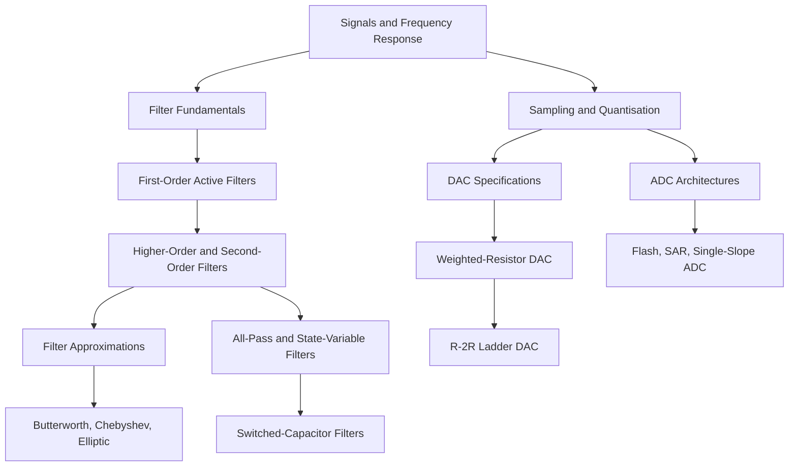

# LICA Study Guide Roadmap

## How to Use This Guide

This guide is built for exam preparation in Linear Integrated Circuit Applications, focused on active filters, DACs, and ADCs. Start with the conceptual topics, then move into design formulas, architectures, and worked problems.

Use this order:

1. Understand what filters and converters do.
2. Memorize the core formulas in [Formula Sheet Ultimate](./10_formula_sheet_ultimate.md).
3. Practice the worked problems in [Worked Problems](./09_worked_problems.md).
4. Revisit common mistakes before the exam.

## Concept Dependency Map

## Topic Priority Matrix

| Topic | Priority | Why It Matters |
| --- | --- | --- |
| First-order LPF, HPF, BPF, BRF | High | Common direct design and frequency-response questions |
| DAC specifications | High | Definitions and numerical error problems are exam-friendly |
| Weighted-resistor and R-2R DAC | High | Circuit operation and formula derivations are likely |
| ADC architectures | High | Easy comparison and block-diagram questions |
| Butterworth and Chebyshev filters | Medium | Important for approximation and order-selection questions |
| State-variable filters | Medium | Frequently asked as universal-filter concept |
| Switched-capacitor filters | Medium | Important IC implementation concept |
| Elliptic and all-pass filters | Low to Medium | Usually conceptual unless formulas are explicitly given |

## Suggested Study Order

| Order | File | Time |
| ---: | --- | ---: |
| 1 | [Filter Fundamentals](./01_filter_fundamentals.md) | 30 min |
| 2 | [First-Order Active Filters](./02_first_order_active_filters.md) | 60 min |
| 3 | [Higher-Order and Second-Order Filters](./03_higher_order_and_second_order_filters.md) | 45 min |
| 4 | [Filter Approximations and Transformations](./04_filter_approximations_and_transformations.md) | 60 min |
| 5 | [All-Pass, State-Variable, and Switched-Capacitor Filters](./05_all_pass_state_variable_and_switched_capacitor_filters.md) | 50 min |
| 6 | [DAC and ADC Fundamentals and Specifications](./06_dac_adc_fundamentals_and_specifications.md) | 45 min |
| 7 | [DAC Architectures](./07_dac_architectures.md) | 45 min |
| 8 | [ADC Architectures](./08_adc_architectures.md) | 35 min |
| 9 | [Worked Problems](./09_worked_problems.md) | 45 min |
| 10 | [Formula Sheet Ultimate](./10_formula_sheet_ultimate.md) | 30 min review |

## Quick Reference

| Need | Go To |
| --- | --- |
| Passive vs active filters | [Filter Fundamentals](./01_filter_fundamentals.md#active-vs-passive-filters) |
| Cutoff frequency design | [First-Order Active Filters](./02_first_order_active_filters.md#cutoff-frequency) |
| Butterworth vs Chebyshev vs Elliptic | [Filter Approximations](./04_filter_approximations_and_transformations.md#comparison-table) |
| DAC accuracy, linearity, monotonicity | [DAC and ADC Fundamentals](./06_dac_adc_fundamentals_and_specifications.md#dac-specifications) |
| Weighted DAC and R-2R ladder | [DAC Architectures](./07_dac_architectures.md) |
| Flash, SAR, single-slope ADC | [ADC Architectures](./08_adc_architectures.md) |
| Exam formulas | [Formula Sheet Ultimate](./10_formula_sheet_ultimate.md) |

## Image Handling

Images are referenced using Obsidian wiki-link syntax. The extracted content includes 267 images, and those assets have been copied from `extracted_content/Images/` into `study_guide/Images/`. Representative image links are included throughout the guide so they resolve through Obsidian attachment lookup.

See [Images README](./Images/README.md) and [Walkthrough](./walkthrough.md#image-verification) for the image verification checklist.
