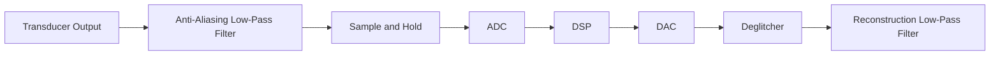

# DAC and ADC Fundamentals and Specifications

## Learning Objectives

After this section, you should be able to:

- Explain analog, sampled, quantized, and digital signals.
- Describe the basic signal chain involving ADC, DSP, and DAC.
- Define major DAC specifications.
- Solve step-size, ideal output, and error problems.

## Ground-Up Explanation

Real-world signals such as sound, temperature, pressure, and light are usually analog. Their amplitude can vary continuously. Digital systems cannot directly process infinite continuous values, so conversion is needed.

An ADC converts an analog signal into a digital code. A DAC converts a digital code back into an analog voltage or current.

The usual signal chain is:

## Key Signal Terms

| Term | Meaning |
| --- | --- |
| Analog signal | Continuous in time and amplitude |
| Sampling | Taking values at discrete time instants |
| Quantisation | Rounding amplitude to finite levels |
| Digital signal | Discrete in time and amplitude |
| Quantisation error | Difference between actual analog value and quantized value |

## DAC Specifications

### Accuracy

Accuracy tells how far the actual DAC output deviates from the ideal expected value for a given digital input.

### Resolution

Resolution is the smallest output change corresponding to a 1-bit change, also called 1 LSB.

For an $n$-bit unipolar DAC:

$$
\boxed{\text{Resolution} = \frac{V_{FS}}{2^n - 1}}
$$

Variables:

- $V_{FS}$: full-scale output voltage
- $n$: number of bits

### Offset Error

Ideally, the DAC output is $0$ V when the digital input is all zeros. Any nonzero output at zero input is offset error.

### Gain Error

Gain error is the slope deviation from the ideal transfer characteristic after offset correction.

$$
\boxed{\text{Gain error} = \text{Full-scale error} - \text{Offset error}}
$$

### Linearity Error

Linearity error is the maximum deviation of actual DAC output from the ideal straight-line transfer curve.

### Integral Nonlinearity

Integral nonlinearity, or INL, is the maximum deviation of actual output from the ideal line after correcting offset and gain.

### Differential Nonlinearity

Differential nonlinearity, or DNL, is the difference between actual step size and ideal 1 LSB step size.

### Monotonicity

A monotonic DAC gives increasing analog output when the digital input increases. If a larger input code produces a smaller output, the DAC is non-monotonic.

### Settling Time

Settling time is the time required for DAC output to settle within +/- 0.5 LSB of its final value after a digital input change.

### Temperature Sensitivity

Temperature sensitivity means output changes with temperature even if the digital input is unchanged.

## Worked Example: DAC Accuracy Error

Given:

- 3-bit DAC
- $V_{FS} = 8$ V
- Input code $101_2$
- Actual output $= 5.9$ V

Find the error.

Step size:

$$
\text{Step size} = \frac{8}{2^3 - 1} = \frac{8}{7} = 1.14\text{ V}
$$

Binary value:

$$
101_2 = 5_{10}
$$

Ideal output:

$$
V_{ideal} = 5(1.14) = 5.7\text{ V}
$$

Absolute error:

$$
V_{error} = 5.9 - 5.7 = 0.2\text{ V}
$$

Error in LSB:

$$
\frac{0.2}{1.14} = 0.175\text{ LSB}
$$

$$
\boxed{V_{error} = 0.2\text{ V} = 0.175\text{ LSB}}
$$

## Common Mistakes

- Using $2^n$ instead of $2^n - 1$ when the source uses full-scale divided by maximum code.
- Confusing resolution with accuracy. Resolution is smallest step; accuracy is closeness to ideal.
- Treating monotonicity and linearity as the same. A DAC can be monotonic but still nonlinear.
- Forgetting units in step-size problems.

## Self-Check Questions

1. What is 1 LSB for a 4-bit DAC with $V_{FS} = 15$ V?

Answer

$$
\text{LSB} = \frac{15}{2^4 - 1} = \frac{15}{15} = 1\text{ V}
$$

2. What does a deglitcher do?

Answer

It reduces unwanted spikes during digital transitions in DAC output.

3. What is quantisation error?

Answer

It is the difference between the true analog value and the nearest quantized digital level.

## Source Images

Representative extracted slide images:

- ![[WINSEM2025-26_ECE3001_ETH_AP2025264001037_2026-04-08_Reference-Material-I_s2_img1.png]]
- ![[WINSEM2025-26_ECE3001_ETH_AP2025264001037_2026-04-08_Reference-Material-I_s3_img1.png]]
- ![[WINSEM2025-26_ECE3001_ETH_AP2025264001037_2026-04-08_Reference-Material-I_s5_img1.png]]
- ![[WINSEM2025-26_ECE3001_ETH_AP2025264001037_2026-04-08_Reference-Material-I_s8_img1.png]]

## Concept Links

- Previous topic: [All-Pass, State-Variable, and Switched-Capacitor Filters](./05_all_pass_state_variable_and_switched_capacitor_filters.md)
- Next topic: [DAC Architectures](./07_dac_architectures.md)
- Formula reference: [DAC and ADC Formulas](./10_formula_sheet_ultimate.md#dac-and-adc-specifications)
