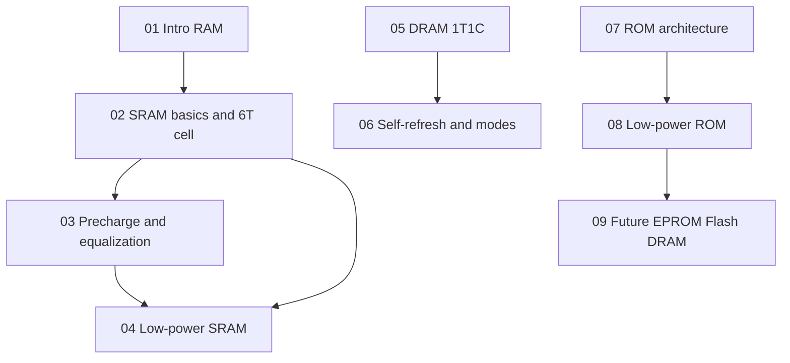

# Module 5 Study Roadmap: Low-Voltage Low-Power Memories

## Learning path (dependencies)

## Topic priority matrix

| Topic | Exam weight (estimate) | Complexity | File |
|-------|------------------------|------------|------|
| 6T SRAM read/write, BL sensing | High | Medium | [02 SRAM](./02_sram_architecture_and_cell.md) |
| Precharge nMOS vs pMOS, equalization | High | Medium | [03 Precharge](./03_precharge_and_equalization.md) |
| DRAM read destructive, refresh, RAS/CAS | High | Medium | [05 DRAM](./05_dram_basics.md) |
| Self-refresh entry (CAS/WE/RAS), sleep | High | Medium | [06 Self-refresh](./06_self_refresh_and_related.md) |
| Low-power SRAM (DWL, pulse, ATD) | Medium | Medium | [04 Low-power SRAM](./04_low_power_sram.md) |
| ROM organization 256x4 example | Medium | Low | [07 ROM](./07_rom_basics.md) |
| Low-power ROM techniques | Medium | Medium | [08 Low-power ROM](./08_low_power_rom_techniques.md) |
| Intro, trends, SDRAM/DDR one-liners | Low–Medium | Low | [01](./01_introduction_ram.md), [09](./09_future_trends.md) |

## Suggested study order and time (single pass)

| Order | File | Time (approx.) |
|-------|------|------------------|
| 1 | [01 Introduction](./01_introduction_ram.md) | 15 min |
| 2 | [02 SRAM](./02_sram_architecture_and_cell.md) | 45 min |
| 3 | [03 Precharge](./03_precharge_and_equalization.md) | 35 min |
| 4 | [04 Low-power SRAM](./04_low_power_sram.md) | 35 min |
| 5 | [05 DRAM](./05_dram_basics.md) | 45 min |
| 6 | [06 Self-refresh](./06_self_refresh_and_related.md) | 35 min |
| 7 | [07 ROM](./07_rom_basics.md) | 25 min |
| 8 | [08 Low-power ROM](./08_low_power_rom_techniques.md) | 40 min |
| 9 | [09 Future trends](./09_future_trends.md) | 20 min |
| 10 | [Formula sheet](./11_formula_sheet_ultimate.md) + [Problems](./10_worked_problems.md) | 45 min |

**Total first pass:** about 4.5 hours (add revision passes as needed).

## Quick reference: topic to file

| Concept | See |
|---------|-----|
| WE, CS, OE | [02 SRAM](./02_sram_architecture_and_cell.md#control-signals) |
| Access time | [02 SRAM](./02_sram_architecture_and_cell.md) |
| Phi_eq, WL low during precharge | [03 Precharge](./03_precharge_and_equalization.md) |
| Active vs standby SRAM power | [04 Low-power SRAM](./04_low_power_sram.md) |
| 1T1C, CBL half-VDD precharge | [05 DRAM](./05_dram_basics.md) |
| RAS held low >100 us | [06 Self-refresh](./06_self_refresh_and_related.md) |
| 8-bit address split 5+3, 32 WL | [07 ROM](./07_rom_basics.md) |
| Selective precharge, difference encoding | [08 Low-power ROM](./08_low_power_rom_techniques.md) |
| MLC flash, Flash+ | [09 Future trends](./09_future_trends.md) |
