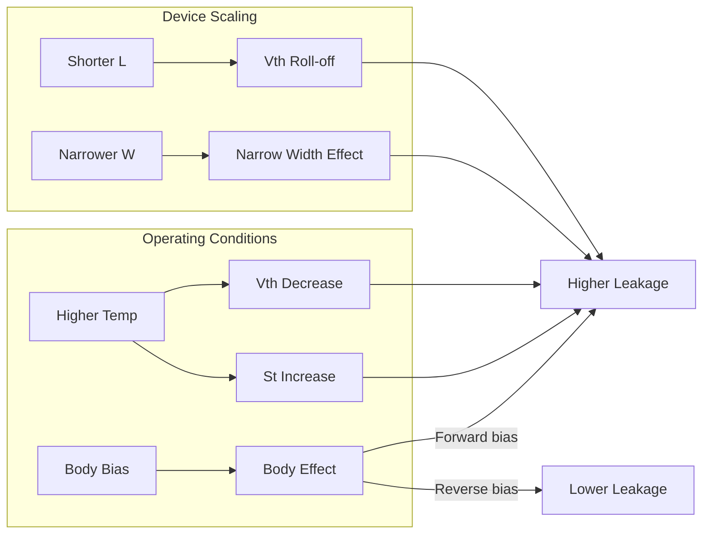

# Second Order Effects in CMOS

## Learning Objectives
After this section, you will understand:
- Threshold voltage roll-off with channel length
- Body effect and its impact on circuits
- Narrow width effect
- Temperature effects on device parameters

---

## Overview

As MOSFET dimensions scale to deep-submicron and nanometer regimes, several non-ideal effects appear that deviate from long-channel behavior. These **second-order effects** affect both power and performance.

```
Second Order Effects
├── Vth Roll-Off       ← Leakage impact
├── Body Effect        ← Circuit design impact  
├── Narrow Width Effect
└── Temperature Effects ← Both power and reliability
```

---

## $V_T$ Roll-Off

### Mechanism

As channel length decreases, threshold voltage **decreases**. This phenomenon is called **$V_T$ roll-off**.

![[vth_rolloff.png]]

### Physical Explanation

In short-channel devices:
1. Source and drain depletion regions extend into the channel
2. Less bulk charge needs to be inverted by the gate
3. More band bending occurs at Si-SiO₂ interface
4. Gate can turn on the device with less voltage

### Consequences

| Effect | Impact |
|--------|--------|
| Lower $V_T$ | Exponentially higher subthreshold leakage |
| $V_T$ variation | Device-to-device mismatch |
| Power increase | Standby power increases |

### $V_T$ Roll-Off Curve

| Channel Length | $V_T$ Behavior |
|----------------|----------------|
| Long | Constant, ideal |
| Moderate | Slight decrease |
| Short | Rapid decrease |
| Very short | Severe roll-off |

---

## Body Effect

### Mechanism

When a **reverse bias** is applied between the source and substrate (body), the threshold voltage increases.

$$\boxed{V_T = V_{T0} + \gamma \left(\sqrt{|2\phi_F + V_{SB}|} - \sqrt{|2\phi_F|}\right)}$$

where:
- $V_{T0}$ = threshold voltage at zero body bias
- $\gamma$ = body effect coefficient
- $\phi_F$ = Fermi potential
- $V_{SB}$ = source-to-body voltage

### Body Effect Coefficient

$$\gamma = \frac{\sqrt{2q \epsilon_{Si} N_A}}{C_{ox}}$$

### Key Points

1. **Reverse body bias ($V_{SB} > 0$):** $V_T$ increases
2. **Zero body bias ($V_{SB} = 0$):** $V_T = V_{T0}$
3. **Forward body bias ($V_{SB} < 0$):** $V_T$ decreases (limited by junction forward bias)

### Applications

| Body Bias | Effect | Use Case |
|-----------|--------|----------|
| Reverse | Higher $V_T$ | Reduce standby leakage |
| Zero | Nominal $V_T$ | Normal operation |
| Forward | Lower $V_T$ | Increase speed (VTCMOS active mode) |

### Circuit Implications

- Stacked transistors experience body effect
- NMOS with source above ground has higher $V_T$
- Affects timing in series-connected devices

---

## Narrow Width Effect

### Mechanism

When gate width is reduced, threshold voltage is modified. There are two types:

### Type 1: Classical Narrow Width Effect
In devices with LOCOS isolation:
- Fringing field causes gate-induced depletion to spread beyond gate edge
- More bulk charge is depleted than expected
- $V_T$ **increases**

$$V_T = V_{fb} + \phi_s + \frac{Q_B + \Delta Q_B}{C_{ox}}$$

![[narrow_width_effect.png]]

### Type 2: Inverse Narrow Width Effect
In devices with trench isolation (STI):
- Depletion layer cannot spread under oxide isolation
- Gate edge effects reduce $V_T$
- $V_T$ **decreases** with narrower width

### Summary

| Isolation Type | Width Effect on $V_T$ |
|----------------|----------------------|
| LOCOS | $V_T$ increases (classical) |
| STI/Trench | $V_T$ decreases (inverse) |

### Impact on Leakage

- Inverse narrow width effect: lower $V_T$ → higher leakage
- Important for narrow transistors in dense layouts

---

## Temperature Effects

### Temperature Dependence of Key Parameters

| Parameter | Temperature Dependence |
|-----------|----------------------|
| $V_T$ | Decreases ~0.8-2 mV/°C |
| Subthreshold slope $S_t$ | Increases linearly |
| Mobility $\mu$ | Decreases (~T^-1.5) |
| $I_{off}$ | Increases ~2× per 10°C |

### Subthreshold Slope vs Temperature

$$S_t = 2.3 \cdot m \cdot \frac{kT}{q}$$

For 0.3 μm technology:
| Temperature | $S_t$ |
|-------------|-------|
| -50°C | 58.2 mV/decade |
| +25°C | 81.9 mV/decade |

### Leakage Current vs Temperature

$$I_{off} \propto e^{-V_T/(mV_t)}$$

Since both $V_T$ decreases and $V_t = kT/q$ increases with temperature, $I_{off}$ increases dramatically.

**Example:** In 0.3 μm technology, $I_{off}$ increases from 0.45 pA to 100 pA (-50°C to +25°C) - a factor of **356×**!

### Two Factors Driving Temperature Increase in Leakage

1. $S_t$ increases linearly with temperature
2. $V_T$ decreases at ~0.8 mV/°C

---

## Combined View of Second Order Effects



---

## Common Mistakes

1. **Ignoring body effect in stacked transistors** - Significant in series devices
2. **Assuming constant $V_T$ across temperature** - Can vary by 100s of mV
3. **Not accounting for narrow width in layout** - Affects matching and leakage
4. **Forgetting process corners** - TT/FF/SS affect all parameters

---

## Self-Check Questions

<details>
<summary>1. Why does Vth roll-off cause increased leakage?</summary>

Subthreshold current depends exponentially on $V_T$:
$$I_{sub} \propto e^{-V_T/(mV_t)}$$

When $V_T$ decreases (roll-off), the exponential term increases dramatically: A 60 mV decrease in $V_T$ increases leakage by ~10×.
</details>

<details>
<summary>2. How can body effect be used for low-power design?</summary>

Body effect can be exploited in VTCMOS technique:
- **Active mode:** Zero or forward body bias for low $V_T$, high speed
- **Standby mode:** Reverse body bias for high $V_T$, low leakage

This allows dynamic control of leakage based on operating mode.
</details>

<details>
<summary>3. Why is temperature management critical for low-power design?</summary>

Higher temperature causes:
- Lower $V_T$ → more leakage
- Higher subthreshold slope → faster leakage increase
- Compounding effect: leakage doubles every ~10°C

Power dissipation causes heating, which increases leakage, which causes more heating → positive feedback loop that can lead to thermal runaway.
</details>

---

## Concept Links

- **Previous:** [Power-Delay Product](./08_power_delay_product.md)
- **Next:** [VTCMOS Circuits](./10_vtcmos_circuits.md)
- **Related:**
  - [Leakage Power](./05_leakage_power.md) - Leakage mechanisms
  - [Short Channel Effects](./07_short_channel_effects.md) - Related device effects
- **Formula Reference:** [Formula Sheet](./16_formula_sheet_ultimate.md#device-equations)

---

## Navigation

| Previous | Current | Next |
|----------|---------|------|
| [PDP and EDP](./08_power_delay_product.md) | Second Order Effects | [VTCMOS](./10_vtcmos_circuits.md) |
