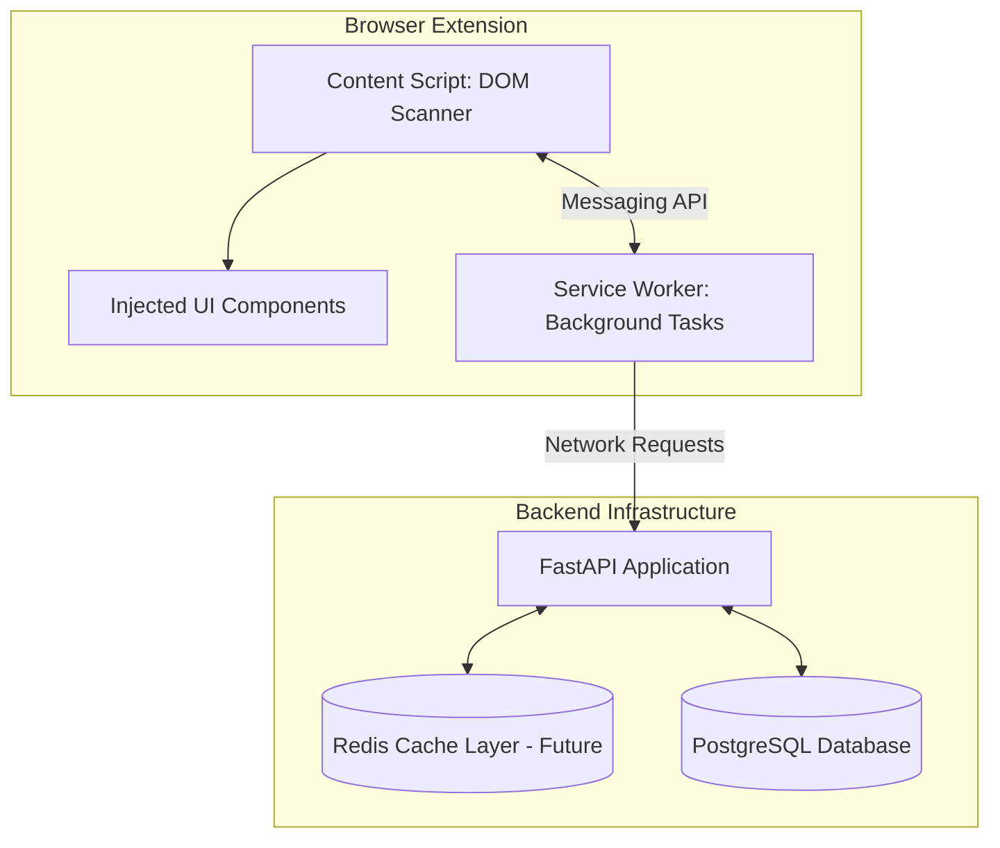
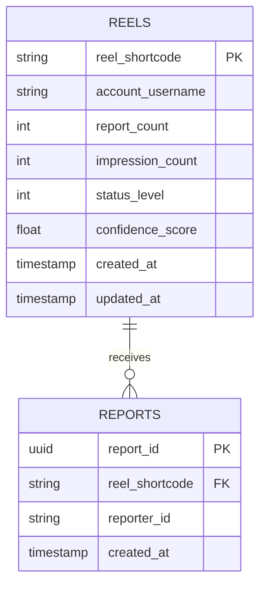

# Comprehensive Project Documentation: AI Reel Flagger

> [!NOTE]
> This document is the definitive guide for developers building the AI Reel Flagger system. It covers the end-to-end architecture, detailed component responsibilities, exact API contracts, and robust strategies for handling web variability and scale.

---

## 1. Executive Summary

**Project Goal**: Build a community-driven browser extension that flags Instagram reels containing AI-generated or AI-assisted media. 

**Core Mechanism**: The platform operates similarly to SponsorBlock. It does NOT block content. Instead, it relies on community consensus (reports relative to impressions) to label reels with warning indicators when thresholds are crossed. 

**Primary Challenge**: Remaining functional despite Instagram's dynamic DOM obfuscation and scaling efficiently to handle high-frequency impression events.

---

## 2. System Architecture Overview

The system is a distributed application consisting of a client-side browser extension, a centralized API, and a relational database.



### 2.1 Component Interactions
1. **Detection**: `Content Script` observes the DOM, finds a reel link, and extracts its shortcode.
2. **Impression Logging**: `Content Script` messages `Service Worker`, which requests `POST /impression` to the backend.
3. **Status Check**: `Service Worker` checks local cache for `reel_id`. If miss, requests `GET /reel-status`. Returns result to `Content Script`.
4. **UI Injection**: `Content Script` injects a warning banner (if flagged) and a "Report AI" button onto the DOM.
5. **Reporting**: User clicks "Report AI". `Content Script` messages `Service Worker`, which sends `POST /report` to the backend.

---

## 3. Browser Extension Specification

The extension targets Manifest V3 (MV3) and utilizes robust DOM traversal rather than brittle CSS selectors.

### 3.1 Content Script (`content.js`)
**Responsibilities**:
- Monitor DOM mutations.
- Extract Reel Identifiers.
- Inject HTML/CSS elements.

**Reel Detection Algorithm**:
Instagram uses obfuscated class names (e.g., `x1y2z3`). The safest way to identify a reel is via structural anchor tags `<a>`.

```javascript
// High-level conceptual logic
const observer = new MutationObserver((mutations) => {
    for (let mutation of mutations) {
        mutation.addedNodes.forEach(node => {
            if (node.nodeType === 1) { // Element node
                const links = node.querySelectorAll('a[href*="/reel/"]');
                links.forEach(link => {
                    const match = link.href.match(/\/reel\/([A-Za-z0-9_-]+)/);
                    if (match && match[1]) {
                        const shortcode = match[1];
                        handleNewReel(shortcode, link.closest('article') || link.parentElement);
                    }
                });
            }
        });
    }
});
observer.observe(document.body, { childList: true, subtree: true });
```

### 3.2 Service Worker (`background.js`)
**Responsibilities**:
- Handle all external HTTP requests to prevent CORS issues in the `Content Script`.
- Manage the unique extension installation ID (`reporter_id`).
- Maintain local caching of reel statuses.

**Local Caching Strategy**:
To avoid spamming `GET /reel-status` while the user scrolls up and down:
- Cache key: `reel_{shortcode}`
- Cache value: `{ status: "stage_2", expires_at: 1698765432 }`
- TTL: 15 minutes.

---

## 4. Backend API Contract

**Tech Stack**: Python, FastAPI, SQLAlchemy (Async), PostgreSQL.

### 4.1 Authentication & Identity
There are no user accounts. Identity is tied to a hashed, unique ID generated by the extension on installation and stored in Chrome Local Storage. All requests must include this `reporter_id`.

### 4.2 Endpoints

#### `POST /impression`
Logs that a reel was visible on the screen.

**Request Body**:
```json
{
  "reel_id": "C6abc123XYZ",
  "reporter_id": "ext_987654321abcd"
}
```
**Behavior**: Increments `impression_count` in the `reels` table. Returns `202 Accepted`.

#### `POST /report`
Submits a user report for AI-generated content.

**Request Body**:
```json
{
  "reel_id": "C6abc123XYZ",
  "reporter_id": "ext_987654321abcd",
  "timestamp": "2023-11-01T12:00:00Z"
}
```
**Behavior**: 
- Validates that `reporter_id` hasn't already reported this `reel_id`.
- Inserts record into `reports`.
- Increments `report_count` in `reels`.
- Returns `201 Created` or `409 Conflict` (if duplicated).

#### `GET /reel-status/{reel_id}`
Retrieves the current flag status of a reel.

**Response Body**:
```json
{
  "reel_id": "C6abc123XYZ",
  "status_level": 2,
  "message": "🤖 Community reports suggest this reel likely contains AI-generated media."
}
```

---

## 5. Database Schema

Using PostgreSQL. The schema is designed to be minimal for the MVP but index-optimized for rapid aggregations.



### Constraints & Indexes:
- **`REPORTS`**: Unique composite index on `(reel_shortcode, reporter_id)` to enforce one report per user per reel at the database level.
- **`REELS`**: Index on `status_level` for fast querying of flagged content.

---

## 6. Flagging Logic & Thresholds

We calculate the **Report Ratio** (`report_count / impression_count`) to determine the `status_level`. 

> [!WARNING]
> Minimum Impressions: Ratios are statistically invalid on low sample sizes. A reel must have at least **100 impressions** before ANY warning stage is applied, even if its ratio is 100%.

| Threshold Formula | Status Level | Extension UI Behavior |
| :--- | :--- | :--- |
| `Impressions < 100` OR `Ratio < 0.01` | `0` (Clean/Unknown) | No UI injected. |
| `Ratio >= 0.01` AND `Ratio < 0.03` | `1` (Suspected) | Inject yellow banner: "⚠ Potentially AI-generated." |
| `Ratio >= 0.03` AND `Ratio < 0.08` | `2` (Likely AI) | Inject orange banner: "🤖 Likely contains AI media." |
| `Ratio >= 0.08` | `3` (Confirmed) | Inject red banner: "⚠ Widely flagged as AI-generated." |

---

## 7. Development Phases

### Phase 1: MVP (The Core Loop)
1. **Extension base**: Setup Manifest V3, Content Script `MutationObserver` targeting `/reel/` URLs.
2. **Backend base**: Scaffold FastAPI and PostgreSQL connection. Implement `POST /report` and `GET /reel-status`.
3. **Integration**: Inject a rudimentary "Flag" button. Test end-to-end report saving and retrieving status. *(Skip impressions for MVP; manually set thresholds).*

### Phase 2: Reliability & The Impression Engine
1. **Impression API**: Implement `POST /impression`.
2. **Algorithms**: Implement the `Ratio` logic. Add minimum impression guards.
3. **Client Caching**: Add `chrome.storage.local` caching in the Service Worker for reel statuses.
4. **Rate Limiting**: Add IP-based and `reporter_id`-based rate limiting to FastAPI (e.g., max 20 reports / hour).

### Phase 3: UI Polish & Community Trust
1. **Frontend Polish**: Match Instagram's UI variables (Dark mode/Light mode, SVG icons) for the injected buttons. 
2. **Reputation Engine**: Track `reporter_id` accuracy. If a reporter frequently flags reels that later hit Stage 3, increase their reporting weight. If they flag clean reels, decrease it.

---

## 8. Scalability & Performance Playbook

As the extension gains traction, the backend will experience massive read/write loads due to the nature of endless scrolling. Implement these sequentially as bottlenecks occur:

### 8.1 Client-Side Batching (Solves Network Spam)
Instead of sending an HTTP request the moment a reel enters the screen, the Service Worker aggregates impressions into a dictionary. Every 3 minutes, it sends a single `POST /impression-batch` request.
```json
{
  "C6abc123XYZ": 2, 
  "D9xyz987ABC": 1
}
```

### 8.2 Client-Side Sampling (Solves Statistical Load)
Track only a randomized percentage of traffic.
```javascript
// Only log 10% of impressions. The statistical ratio remains the same.
if (Math.random() < 0.10) { trackImpression(shortcode); }
```

### 8.3 Redis Counter Layer (Solves Database Write Locks)
Database updates for impressions (`UPDATE reels SET impression_count = impression_count + 1`) are write-heavy and cause row contention.
1. Send all `POST /impression` hits to Redis: `HINCRBY active_reels impressions:C6abc123XYZ 1`
2. A background Celery/rq worker runs every 5 minutes, reads the Redis hash, performs a bulk `UPDATE` on PostgreSQL, and resets the Redis counters. 

---

## 9. Future Machine Learning Integration

While the community drives the initial system, automated classification can augment the dataset:
- **Frame Extraction**: The backend can asynchronously download reels that reach Stage 1 (Suspected).
- **Model Inference**: Run frames through OpenCV/PyTorch models tuned for GAN artifacts or Deepfake anomalies.
- **Hybrid Scoring**: Combine `community_score` and `ml_confidence_score` into a single weighted metric to reach Stage 3 faster.
