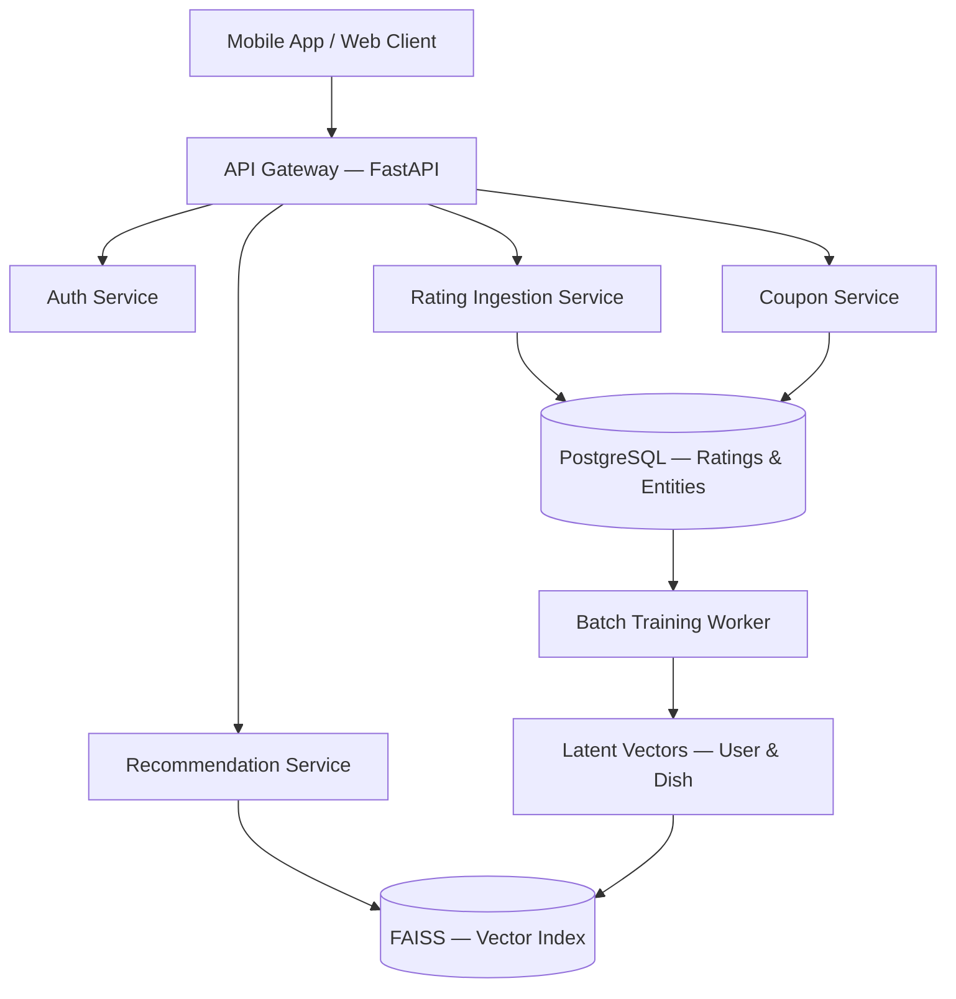
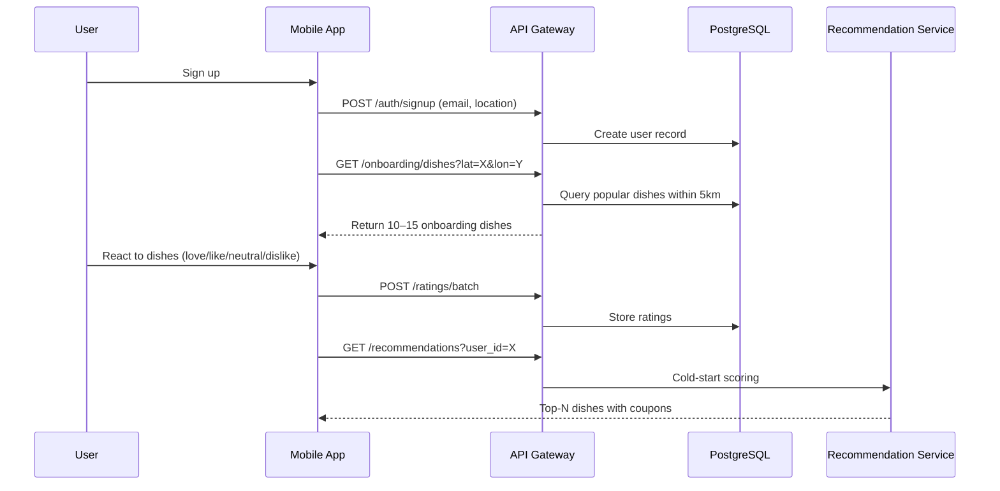
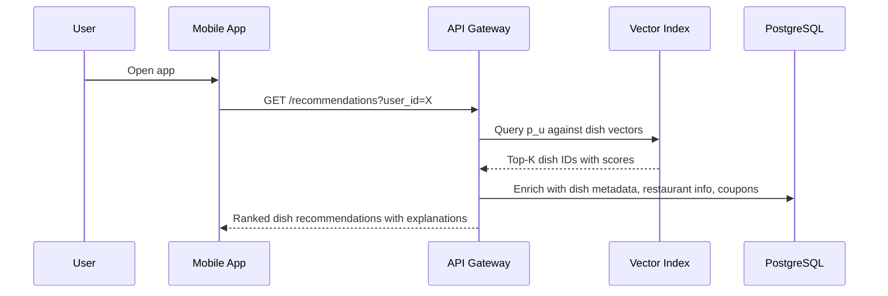
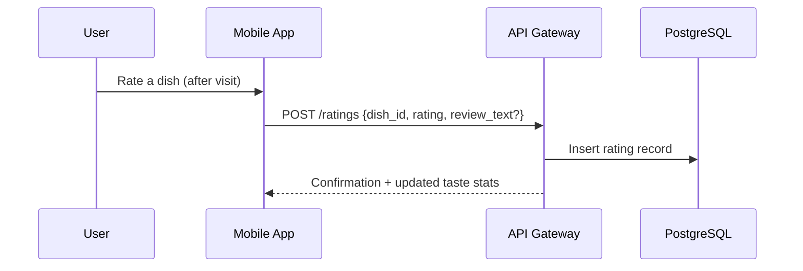
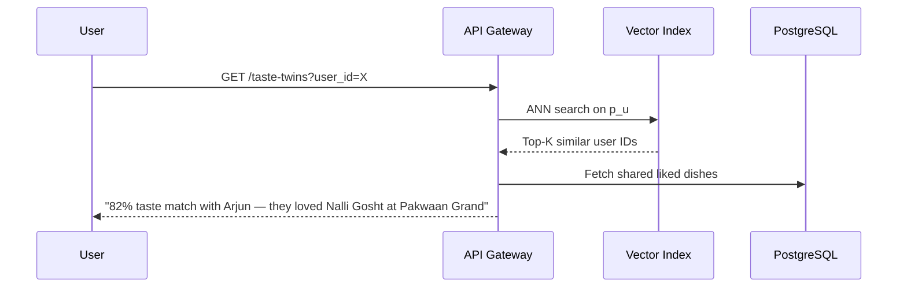

# Clink — System Architecture

## 1. Architecture Overview

Clink's system is designed around a clean separation between **runtime serving** (low-latency recommendation queries) and **offline training** (batch model updates). This separation keeps the user-facing API fast while allowing computationally expensive model training to run asynchronously.



---

## 2. Core Services

### 2.1 API Gateway (FastAPI)

The central entry point for all client requests. Handles routing, request validation, rate limiting, and authentication delegation.

| Responsibility | Detail |
|---|---|
| Framework | FastAPI (Python) |
| Auth | JWT-based, delegated to Auth Service |
| Protocol | REST (JSON), with future gRPC option for internal calls |
| Latency target | < 100ms p95 for recommendation queries |

### 2.2 Auth Service

Handles user registration, login, session management, and token issuance.

- **Sign-up flow** captures: `user_id`, `email/phone`, `lat`, `lon`, `city`
- Location is captured at registration and updated periodically
- JWT tokens with configurable expiry

### 2.3 Rating Ingestion Service

Accepts user reactions to dishes and persists them to PostgreSQL.

**Input schema:**

```json
{
  "user_id": "uuid",
  "dish_id": "uuid",
  "rating": 2,
  "timestamp": "2026-03-16T14:00:00Z",
  "review_text": "optional"
}
```

**Rating values:**

| Value | Meaning |
|---|---|
| `2` | Love |
| `1` | Like |
| `0` | Neutral |
| `-1` | Dislike |

Ratings are append-only. If a user rates the same dish again, the new rating supersedes the old one (tracked via timestamp).

### 2.4 Recommendation Service

The core intelligence layer. Serves two modes:

**Mode 1 — Cold Start (new user, no model data)**

Uses the heuristic scoring function:

$$Score(d) = α · P(d) + β · cosine(u, x_d) + γ · L(d)$$


Where $u$ = user's onboarding taste vector, $x_d$ = dish feature vector.

**Mode 2 — Warm (model trained, vectors available)**

Uses the matrix factorization dot product:


$$Score(u, d) = p_u · q_d$$

Queries the FAISS index for top-K dishes, then applies post-filters (distance, coupon eligibility, already-rated dishes).

### 2.5 Coupon Service

Manages coupon creation, assignment, validation, and redemption.

- Restaurants create coupon templates via the restaurant dashboard
- The recommendation service attaches eligible coupons to recommended dishes
- Redemption is validated at the restaurant via QR code or unique code

### 2.6 Batch Training Worker

An offline process that periodically retrains the recommendation model.

**Pipeline steps:**

```
1. Ingest latest ratings from PostgreSQL
2. Construct (or update) the sparse ratings matrix R
3. Run matrix factorization (SGD)
4. Output user vectors P and dish vectors Q
5. Rebuild FAISS ANN index from P and Q
6. Swap live index with new index (atomic)
```

**Schedule:** Weekly initially, moving to daily as data volume grows.

---

## 3. User Journeys

### 3.1 First-Time User (Cold Start)



**Key decisions:**

- Onboarding dishes are selected for **cuisine diversity** and **local popularity**
- The taste vector is computed immediately from onboarding reactions
- Cold-start recommendations blend popularity, taste similarity, and proximity

### 3.2 Returning User (Warm Path)



**Key decisions:**

- Latent vectors $p_u$ and $q_d$ are pre-computed by the batch worker
- FAISS query is sub-millisecond
- Enrichment (metadata, coupons) adds < 20ms via indexed PostgreSQL queries

### 3.3 Dish Rating Flow



Ratings accumulate until the next batch training run incorporates them.

### 3.4 Taste Twin Discovery



---

## 4. Data Flow

### 4.1 Write Path (Rating Ingestion)

```
User → App → API → PostgreSQL (ratings table)
```

All writes go to PostgreSQL. No direct writes to the vector index.

### 4.2 Training Path (Batch)

```
PostgreSQL (ratings) → Training Worker → P, Q matrices → FAISS Index
```

Training is decoupled from serving. The live system never blocks on training.

### 4.3 Read Path (Recommendations)

```
User → API → FAISS (vector search) → PostgreSQL (enrichment) → Response
```

Vector search provides candidate dish IDs. PostgreSQL enriches them with metadata.

---

## 5. Service Boundaries

| Service | Owns | Depends On |
|---|---|---|
| Auth | Users, sessions, tokens | PostgreSQL |
| Rating Ingestion | Ratings, reactions | PostgreSQL |
| Recommendation | Scoring, ranking, explanations | FAISS, PostgreSQL |
| Coupon | Coupon lifecycle | PostgreSQL |
| Training Worker | Model training, index rebuild | PostgreSQL, FAISS |

**Principle:** Each service owns its own logic but shares the same PostgreSQL instance at MVP stage. As the system scales, these can be separated into independent databases.

---

## 6. Technology Choices

| Component | Technology | Rationale |
|---|---|---|
| API framework | FastAPI | Async, fast, Python ecosystem for ML integration |
| Primary database | PostgreSQL | Relational integrity, JSON support, mature ecosystem |
| Vector index | FAISS | Open-source, battle-tested, supports IVF and HNSW |
| Task queue | Celery + Redis | Reliable batch job scheduling |
| Cache | Redis | Session store, hot data caching |
| Deployment | Docker + single VM | Simplicity for MVP; migrates to k8s later |
| Monitoring | Prometheus + Grafana | Standard observability stack |

---

## 7. Deployment Topology

### MVP (Phase 1)

```
┌─────────────────────────────────────┐
│           Single VM (4 vCPU, 16GB)  │
│                                     │
│  ┌──────────┐  ┌──────────────────┐ │
│  │ FastAPI  │  │ PostgreSQL       │ │
│  │ (uvicorn)│  │                  │ │
│  └──────────┘  └──────────────────┘ │
│                                     │
│  ┌──────────┐  ┌──────────────────┐ │
│  │ Redis    │  │ FAISS (in-proc)  │ │
│  └──────────┘  └──────────────────┘ │
│                                     │
│  ┌──────────────────────────────┐   │
│  │ Celery Worker (batch train)  │   │
│  └──────────────────────────────┘   │
└─────────────────────────────────────┘
```

- Everything on one machine
- FAISS loaded in-process within the recommendation service
- Celery worker runs training weekly via cron
- Estimated cost: ₹3,000–5,000/month on AWS or DigitalOcean

### Scaled (Phase 2+)

```
┌─────────────┐     ┌─────────────────┐     ┌──────────────┐
│ API Servers │────▶│ Managed Postgres│     │ FAISS Server │
│ (2–4 nodes) │     │ (RDS / Supabase)│     │ (dedicated)  │
└─────────────┘     └─────────────────┘     └──────────────┘
       │                                          ▲
       │           ┌─────────────────┐            │
       └──────────▶│ Redis Cluster   │            │
                   └─────────────────┘            │
	                                              │
                   ┌─────────────────┐            │
                   │ Training Worker │────────────┘
                   │ (GPU instance)  │
                   └─────────────────┘
```

---

## 8. API Surface (Key Endpoints)

| Method | Endpoint | Description |
|---|---|---|
| `POST` | `/auth/signup` | User registration with location |
| `POST` | `/auth/login` | Authentication |
| `GET` | `/onboarding/dishes` | Fetch onboarding dishes for location |
| `POST` | `/ratings` | Submit a single rating |
| `POST` | `/ratings/batch` | Submit batch onboarding ratings |
| `GET` | `/recommendations` | Get personalized dish recommendations |
| `GET` | `/taste-twins` | Find taste-similar users |
| `GET` | `/dishes/{id}` | Dish detail with restaurant info |
| `GET` | `/restaurants/{id}` | Restaurant profile |
| `POST` | `/coupons/redeem` | Validate and redeem a coupon |

---

## 9. Reliability and Performance

### Latency budgets

| Operation | Target |
|---|---|
| Cold-start recommendation | < 200ms |
| Warm recommendation (FAISS) | < 50ms |
| Rating submission | < 100ms |
| Taste twin query | < 100ms |

### Failure modes

| Failure | Mitigation |
|---|---|
| FAISS index unavailable | Fall back to cold-start heuristic scoring |
| Training job fails | Serve stale vectors; alert and retry |
| PostgreSQL down | Circuit breaker; return cached recommendations |
| High latency spike | Rate limit; degrade to cached top-N |

### Index freshness

The FAISS index is rebuilt atomically — a new index is built in the background, validated, and then swapped in. Users never see a partially-built index.
