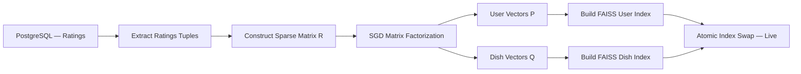

# Clink — Recommendation Engine Deep Dive

## 1. Problem Statement

Given a set of users **U**, a set of dishes **D**, and a sparse matrix of observed reactions **R**, produce a ranked list of dishes for each user that maximizes the probability of a positive dining experience.

The system must handle:

- **Cold start** — new users with zero or minimal rating history
- **Sparsity** — the vast majority of user-dish pairs are unobserved
- **Scalability** — similarity computation must not degrade as the user base grows
- **Explainability** — every recommendation must be accompanied by a human-readable justification

---

## 2. Definitions and Notation

| Symbol                          | Meaning                                       |
| ------------------------------- | --------------------------------------------- |
| $\mathcal{U}$                   | Set of all users                              |
| $\mathcal{D}$                   | Set of all dishes                             |
| $\mathcal{R}$                   | Set of all restaurants                        |
| $R \in \mathbb{R}^{U \times D}$ | Rating matrix                                 |
| $r_{ud}$                        | Observed rating by user $u$ for dish $d$      |
| $\hat{r}_{ud}$                  | Predicted rating                              |
| $\mathbf{p}_u \in \mathbb{R}^K$ | Latent vector for user $u$                    |
| $\mathbf{q}_d \in \mathbb{R}^K$ | Latent vector for dish $d$                    |
| $K$                             | Number of latent dimensions (typically 20–50) |
| $\Omega$                        | Set of observed (user, dish) pairs            |

**Reaction encoding:**

| Reaction | Value |
|---|---|
| Love | +2 |
| Like | +1 |
| Neutral | 0 |
| Dislike | −1 |

---

## 3. Cold Start Strategy

When a user has no history — or the system has no trained model — we rely on a feature-based heuristic pipeline.

### 3.1 Dish Feature Representation

Each dish $d$ is represented as a hand-engineered feature vector:

$$\mathbf{x}_d = \begin{bmatrix} \text{spice\_level} \\ \text{sweetness} \\ \text{richness} \\ \text{cuisine\_encoding} \\ \text{veg\_indicator} \\ \text{price\_band} \\ \text{texture} \end{bmatrix} \in \mathbb{R}^m$$

These features are assigned during dish onboarding (by the restaurant or via manual tagging). They enable meaningful similarity computation even before any collaborative data exists.

### 3.2 Onboarding Flow

When a user signs up at location $(lat, lon)$:

1. Query restaurants within radius $\delta$ (default 5 km):
   $$\mathcal{R}_{local} = \{r \in \mathcal{R} : \text{distance}(r, (lat, lon)) < \delta\}$$

2. Select 10–15 onboarding dishes $\mathcal{D}_{onboard}$ from $\bigcup_{r \in \mathcal{R}_{local}} \mathcal{D}_r$, chosen for:
   - High local popularity
   - Cuisine diversity (not all biryani)
   - Feature coverage (span the feature space)

3. User reacts to each dish:
   $$f_u(d) \in \{-1, 0, 1, 2\}$$

### 3.3 Initial User Taste Vector

Compute the user's taste vector as the reaction-weighted sum of dish features:

$$\mathbf{u} = \sum_{d \in \mathcal{D}_{onboard}} f_u(d) \cdot \mathbf{x}_d$$

Normalize:

$$\mathbf{u} = \frac{\mathbf{u}}{\|\mathbf{u}\|}$$

This gives a unit vector in the dish feature space representing the user's initial preferences.

### 3.4 Cold-Start Scoring Function

For a candidate dish $d$:

$$S(d) = \alpha \cdot P(d) + \beta \cdot \text{cosine}(\mathbf{u}, \mathbf{x}_d) + \gamma \cdot L(d)$$

Where:

- $P(d)$ — **Popularity score**: normalized rating count or redemption rate for dish $d$
- $\text{cosine}(\mathbf{u}, \mathbf{x}_d) = \frac{\mathbf{u} \cdot \mathbf{x}_d}{\|\mathbf{u}\| \|\mathbf{x}_d\|}$ — **Taste similarity**
- $L(d)$ — **Location proximity score**: inverse distance between user and the restaurant serving $d$
- $\alpha + \beta + \gamma = 1$

**Default weights:**

| Weight | Value | Rationale |
|---|---|---|
| $\alpha$ | 0.4 | Popularity is the strongest signal when data is sparse |
| $\beta$ | 0.4 | Taste match based on onboarding reactions |
| $\gamma$ | 0.2 | Proximity matters but should not dominate |

These weights can be tuned as more data is collected.

---

## 4. Collaborative Filtering via Matrix Factorization

Once the system has accumulated sufficient ratings, we switch from heuristics to a learned model.

### 4.1 The Rating Matrix

$$R \in \mathbb{R}^{U \times D}$$

where $R_{ud} = r_{ud}$ if user $u$ has rated dish $d$, and undefined otherwise.

This matrix is **extremely sparse**. With 10,000 users and 50,000 dishes, the matrix has 500 million entries. A typical user might rate 20–50 dishes, giving a density of $< 0.1\%$.

### 4.2 Factorization

We approximate $R$ as the product of two low-rank matrices:

$$R \approx P \cdot Q^T$$

Where:

- $P \in \mathbb{R}^{U \times K}$ — each row $\mathbf{p}_u$ is the latent taste vector for user $u$
- $Q \in \mathbb{R}^{D \times K}$ — each row $\mathbf{q}_d$ is the latent vector for dish $d$

The latent dimensions $K$ (typically 20–50) capture hidden taste factors. These are **not explicitly labeled** — the model discovers them from data. Informally, they might correspond to concepts like:

- Spice tolerance
- Preference for rich/heavy vs. light food
- Street food affinity
- Dessert preference
- Price sensitivity

### 4.3 Prediction

The predicted rating for user $u$ on dish $d$ is:

$$\hat{r}_{ud} = \mathbf{p}_u^T \mathbf{q}_d$$

This is a dot product in the latent space. High values indicate predicted compatibility.

### 4.4 Optimization Objective

We minimize the regularized squared error over observed ratings:

$$\mathcal{L} = \sum_{(u,d) \in \Omega} \left(r_{ud} - \mathbf{p}_u^T \mathbf{q}_d\right)^2 + \lambda \left(\|\mathbf{p}_u\|^2 + \|\mathbf{q}_d\|^2\right)$$

Where:

- $\Omega$ = set of observed (user, dish) pairs
- $\lambda$ = regularization parameter (prevents overfitting)

### 4.5 Stochastic Gradient Descent (SGD)

For each observed rating $(u, d, r_{ud})$:

**Compute error:**
$$e_{ud} = r_{ud} - \mathbf{p}_u^T \mathbf{q}_d$$

**Update user vector:**
$$\mathbf{p}_u \leftarrow \mathbf{p}_u + \eta \left(e_{ud} \cdot \mathbf{q}_d - \lambda \cdot \mathbf{p}_u\right)$$

**Update dish vector:**
$$\mathbf{q}_d \leftarrow \mathbf{q}_d + \eta \left(e_{ud} \cdot \mathbf{p}_u - \lambda \cdot \mathbf{q}_d\right)$$

Where $\eta$ is the learning rate.

**Typical hyperparameters:**

| Parameter | Initial Value | Notes |
|---|---|---|
| $K$ | 30 | Latent dimensions |
| $\eta$ | 0.005 | Learning rate |
| $\lambda$ | 0.02 | Regularization strength |
| Epochs | 20–50 | Passes over the data |

### 4.6 Training Convergence

Monitor RMSE on a held-out validation set:

$$\text{RMSE} = \sqrt{\frac{1}{|\Omega_{val}|} \sum_{(u,d) \in \Omega_{val}} (r_{ud} - \hat{r}_{ud})^2}$$

Stop when validation RMSE plateaus or begins to increase (early stopping).

---

## 5. Recommendation Ranking

Once training is complete, recommendation for user $u$ is:

$$d^* = \arg\max_{d \in \mathcal{D}_{eligible}} \mathbf{p}_u^T \mathbf{q}_d$$

Where $\mathcal{D}_{eligible}$ is the set of dishes satisfying constraints:

- $\text{distance}(r_d, u) < \delta$ (within radius)
- $d \notin \mathcal{D}_{rated}(u)$ (not already rated)
- Optionally: $\text{coupon}(d) = \text{true}$ (has active coupon)

Return the top $N$ dishes sorted by score.

---

## 6. User Similarity — Taste Twins

### 6.1 Cosine Similarity

Given two users $u$ and $v$ with latent vectors $\mathbf{p}_u$ and $\mathbf{p}_v$:

$$\text{Sim}(u, v) = \frac{\mathbf{p}_u \cdot \mathbf{p}_v}{\|\mathbf{p}_u\| \|\mathbf{p}_v\|}$$

Values range from $-1$ (opposite taste) to $+1$ (identical taste).

### 6.2 Taste Twin Selection

$$\text{TasteTwin}(u) = \arg\max_{v \in \mathcal{U} \setminus \{u\}} \text{Sim}(u, v)$$

In practice, return the top $k$ taste twins (e.g., $k = 5$).

---

## 7. Approximate Nearest Neighbor (ANN) Search

### 7.1 The Problem

Naively computing $\text{Sim}(u, v)$ for all pairs is $O(N^2)$, which is infeasible at scale.

With 100,000 users:
- $O(N^2) = 10^{10}$ comparisons per query → **impossible in real-time**

### 7.2 The Solution

Use **Approximate Nearest Neighbor** search to achieve $O(\log N)$ per query.

**Tools:**

| Library | Approach | Best For |
|---|---|---|
| FAISS (Meta) | IVF, PQ, HNSW | General purpose, production-grade |
| ScaNN (Google) | Anisotropic quantization | High-accuracy retrieval |
| Annoy (Spotify) | Random projection trees | Read-heavy, memory-constrained |

**FAISS is the recommended choice** for Clink due to its maturity, Python bindings, and support for both CPU and GPU.

### 7.3 Index Construction

```python
import faiss

# K = latent dimension
index = faiss.IndexFlatIP(K)  # Inner Product (equivalent to cosine for normalized vectors)

# Add all user vectors
index.add(P_normalized)  # P_normalized: numpy array (U × K)
```

For large-scale (> 1M users), use an IVF index:

```python
quantizer = faiss.IndexFlatIP(K)
index = faiss.IndexIVFFlat(quantizer, K, n_clusters)
index.train(P_normalized)
index.add(P_normalized)
```

### 7.4 Query

```python
# Find top-k nearest users for user u
distances, indices = index.search(p_u.reshape(1, -1), k=10)
```

**Complexity:** $O(\log N)$ per query instead of $O(N)$.

---

## 8. Explainability Layer

Recommendations must be **explainable** — users trust recommendations more when they understand *why*.

### 8.1 Explanation Generation

After selecting a recommendation $d$ for user $u$:

1. Find the taste twin:
   $$v = \arg\max_{v} \text{Sim}(u, v)$$

2. Find overlapping liked dishes:
   $$\mathcal{D}_{shared} = \{d_i : r_{u,d_i} > 0 \land r_{v,d_i} > 0\}$$

3. Generate explanation:
   > "People who liked **[shared dishes]** at **[restaurants]** also loved this dish."

### 8.2 Example

User A and User B are taste twins (similarity = 0.87).

Shared likes: Chicken Biryani at Paradise, Dosa at MTR.

User B loved Butter Chicken at restaurant X. User A has not tried it.

**Explanation for User A:**

> "Someone who shares your taste for Paradise Biryani and MTR Dosa loved the Butter Chicken at Restaurant X."

### 8.3 Implementation Notes

- Explainability is a **post-hoc deterministic lookup**, not part of model training
- Explanation quality depends on having enough shared ratings
- Fallback explanation: "This dish matches your taste profile" (for cold-start)

---

## 9. Transition: Cold Start → Collaborative Filtering

The system does not switch abruptly. There is a **blending period**:

$$S_{final}(d) = (1 - w) \cdot S_{cold}(d) + w \cdot S_{collab}(d)$$

Where $w$ increases as:
- The user accumulates more ratings
- The model has been trained on the user's data

**Suggested ramp:**

| User Ratings | $w$ (collab weight) |
|---|---|
| 0–5 | 0.0 (pure cold-start) |
| 6–15 | 0.3 |
| 16–30 | 0.6 |
| 30+ | 1.0 (pure collaborative) |

This ensures recommendations remain reasonable even when there is limited personal data.

---

## 10. Training Pipeline Summary



**Schedule:**

| Stage | Frequency |
|---|---|
| MVP (< 1K users) | Weekly |
| Growth (1K–50K users) | Daily |
| Scale (50K+ users) | Incremental updates + weekly full retrain |

---

## 11. Model Evaluation Metrics

| Metric | What it Measures | Target |
|---|---|---|
| RMSE | Accuracy of predicted vs. actual ratings | < 0.8 on validation set |
| Precision\@K | Fraction of top-K recommendations that are relevant | > 0.3 |
| Recall\@K | Fraction of relevant dishes that appear in top-K | > 0.2 |
| NDCG | Quality of ranking order | > 0.5 |
| Coverage | Fraction of dishes that ever get recommended | > 40% |
| Diversity | How varied the top-K recommendations are | Monitor (no fixed target) |

---

## 12. Summary of Approaches by System Stage

| Stage | Users | Approach | Key Algorithm |
|---|---|---|---|
| Launch | 0–100 | Pure cold-start | Feature vectors + cosine similarity |
| Early | 100–5K | Hybrid blend | Cold-start + early matrix factorization |
| Growth | 5K–50K | Full collaborative | Matrix factorization + FAISS |
| Scale | 50K+ | Advanced | ALS, implicit feedback, graph models |
