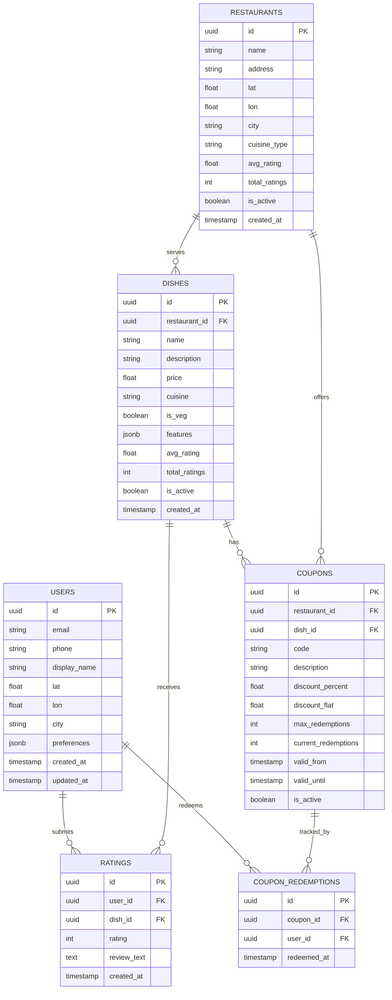

# Clink — Data Model

## 1. Overview

The data model captures five core entity types and their relationships:

- **Users** — diners who discover and rate food
- **Restaurants** — establishments serving dishes
- **Dishes** — individual menu items (the atomic unit of recommendation)
- **Ratings** — user reactions to dishes
- **Coupons** — incentives attached to dishes or restaurants

The model is designed to support:

- Efficient rating ingestion for the recommendation pipeline
- Low-latency enrichment queries during recommendation serving
- Spatial queries for location-based filtering
- Analytical queries for business intelligence

---

## 2. Entity-Relationship Diagram



---

## 3. Table Definitions

### 3.1 `users`

Stores diner profiles and location data.

| Column | Type | Constraints | Notes |
|---|---|---|---|
| `id` | `UUID` | PK, default `gen_random_uuid()` | |
| `email` | `VARCHAR(255)` | UNIQUE, NOT NULL | Primary login identifier |
| `phone` | `VARCHAR(20)` | UNIQUE, NULLABLE | Optional phone login |
| `display_name` | `VARCHAR(100)` | NOT NULL | Shown in taste twin features |
| `password_hash` | `VARCHAR(255)` | NOT NULL | bcrypt or argon2 |
| `lat` | `FLOAT` | NOT NULL | User's primary latitude |
| `lon` | `FLOAT` | NOT NULL | User's primary longitude |
| `city` | `VARCHAR(100)` | NOT NULL | Denormalized for fast filtering |
| `preferences` | `JSONB` | NULLABLE | Dietary preferences, cuisine prefs |
| `onboarding_complete` | `BOOLEAN` | DEFAULT `false` | Has the user completed taste quiz |
| `created_at` | `TIMESTAMP` | DEFAULT `NOW()` | |
| `updated_at` | `TIMESTAMP` | DEFAULT `NOW()` | Auto-updated via trigger |

**Indexes:**

```sql
CREATE INDEX idx_users_city ON users(city);
CREATE INDEX idx_users_location ON users USING GIST (
    ST_SetSRID(ST_MakePoint(lon, lat), 4326)
);
```

### 3.2 `restaurants`

Stores restaurant profiles and location.

| Column | Type | Constraints | Notes |
|---|---|---|---|
| `id` | `UUID` | PK | |
| `name` | `VARCHAR(255)` | NOT NULL | |
| `address` | `TEXT` | NOT NULL | |
| `lat` | `FLOAT` | NOT NULL | |
| `lon` | `FLOAT` | NOT NULL | |
| `city` | `VARCHAR(100)` | NOT NULL | |
| `cuisine_type` | `VARCHAR(100)` | NULLABLE | Primary cuisine category |
| `avg_rating` | `FLOAT` | DEFAULT `0.0` | Denormalized aggregate |
| `total_ratings` | `INTEGER` | DEFAULT `0` | Denormalized count |
| `is_partner` | `BOOLEAN` | DEFAULT `false` | Paying restaurant partner |
| `is_active` | `BOOLEAN` | DEFAULT `true` | |
| `created_at` | `TIMESTAMP` | DEFAULT `NOW()` | |

**Indexes:**

```sql
CREATE INDEX idx_restaurants_city ON restaurants(city);
CREATE INDEX idx_restaurants_location ON restaurants USING GIST (
    ST_SetSRID(ST_MakePoint(lon, lat), 4326)
);
CREATE INDEX idx_restaurants_cuisine ON restaurants(cuisine_type);
```

### 3.3 `dishes`

The atomic unit of the recommendation system.

| Column | Type | Constraints | Notes |
|---|---|---|---|
| `id` | `UUID` | PK | |
| `restaurant_id` | `UUID` | FK → `restaurants.id`, NOT NULL | |
| `name` | `VARCHAR(255)` | NOT NULL | |
| `description` | `TEXT` | NULLABLE | |
| `price` | `DECIMAL(10,2)` | NOT NULL | Price in INR |
| `cuisine` | `VARCHAR(100)` | NOT NULL | e.g., "Hyderabadi", "South Indian" |
| `is_veg` | `BOOLEAN` | NOT NULL | |
| `features` | `JSONB` | NOT NULL | Feature vector for cold-start |
| `avg_rating` | `FLOAT` | DEFAULT `0.0` | Denormalized |
| `total_ratings` | `INTEGER` | DEFAULT `0` | Denormalized |
| `is_active` | `BOOLEAN` | DEFAULT `true` | |
| `created_at` | `TIMESTAMP` | DEFAULT `NOW()` | |

**The `features` column** stores the dish's feature vector used for cold-start recommendations:

```json
{
  "spice_level": 0.8,
  "sweetness": 0.1,
  "richness": 0.7,
  "texture": 0.5,
  "price_band": 2
}
```

**Indexes:**

```sql
CREATE INDEX idx_dishes_restaurant ON dishes(restaurant_id);
CREATE INDEX idx_dishes_cuisine ON dishes(cuisine);
CREATE INDEX idx_dishes_veg ON dishes(is_veg);
CREATE INDEX idx_dishes_features ON dishes USING GIN (features);
```

### 3.4 `ratings`

The core feedback table — every user reaction to a dish is stored here.

| Column | Type | Constraints | Notes |
|---|---|---|---|
| `id` | `UUID` | PK | |
| `user_id` | `UUID` | FK → `users.id`, NOT NULL | |
| `dish_id` | `UUID` | FK → `dishes.id`, NOT NULL | |
| `rating` | `SMALLINT` | NOT NULL, CHECK `rating IN (-1, 0, 1, 2)` | |
| `review_text` | `TEXT` | NULLABLE | Optional text review |
| `source` | `VARCHAR(20)` | DEFAULT `'app'` | `'onboarding'`, `'app'`, `'prompt'` |
| `created_at` | `TIMESTAMP` | DEFAULT `NOW()` | |

**Unique constraint:** One active rating per (user, dish) pair. If a user re-rates, the old row is soft-superseded (latest timestamp wins during training).

```sql
CREATE UNIQUE INDEX idx_ratings_user_dish ON ratings(user_id, dish_id);
CREATE INDEX idx_ratings_user ON ratings(user_id);
CREATE INDEX idx_ratings_dish ON ratings(dish_id);
CREATE INDEX idx_ratings_created ON ratings(created_at);
```

**This is the table that feeds the recommendation engine.** The training pipeline queries:

```sql
SELECT user_id, dish_id, rating
FROM ratings
WHERE created_at > :last_training_timestamp;
```

### 3.5 `coupons`

Coupon definitions created by restaurant partners.

| Column | Type | Constraints | Notes |
|---|---|---|---|
| `id` | `UUID` | PK | |
| `restaurant_id` | `UUID` | FK → `restaurants.id`, NOT NULL | |
| `dish_id` | `UUID` | FK → `dishes.id`, NULLABLE | NULL = applies to whole restaurant |
| `code` | `VARCHAR(50)` | UNIQUE, NOT NULL | Redemption code |
| `description` | `TEXT` | NOT NULL | User-facing description |
| `discount_percent` | `DECIMAL(5,2)` | NULLABLE | Percentage discount |
| `discount_flat` | `DECIMAL(10,2)` | NULLABLE | Flat amount discount (INR) |
| `max_redemptions` | `INTEGER` | NOT NULL | Total allowed redemptions |
| `current_redemptions` | `INTEGER` | DEFAULT `0` | Counter |
| `valid_from` | `TIMESTAMP` | NOT NULL | |
| `valid_until` | `TIMESTAMP` | NOT NULL | |
| `is_active` | `BOOLEAN` | DEFAULT `true` | |
| `created_at` | `TIMESTAMP` | DEFAULT `NOW()` | |

**Indexes:**

```sql
CREATE INDEX idx_coupons_restaurant ON coupons(restaurant_id);
CREATE INDEX idx_coupons_dish ON coupons(dish_id);
CREATE INDEX idx_coupons_active ON coupons(is_active, valid_until);
```

### 3.6 `coupon_redemptions`

Tracks individual coupon usage events.

| Column | Type | Constraints | Notes |
|---|---|---|---|
| `id` | `UUID` | PK | |
| `coupon_id` | `UUID` | FK → `coupons.id`, NOT NULL | |
| `user_id` | `UUID` | FK → `users.id`, NOT NULL | |
| `redeemed_at` | `TIMESTAMP` | DEFAULT `NOW()` | |

```sql
CREATE UNIQUE INDEX idx_redemptions_unique ON coupon_redemptions(coupon_id, user_id);
```

---

## 4. Derived / Computed Tables

These tables are not part of the transactional schema but are produced by the training pipeline.

### 4.1 `user_vectors`

Stores the latent user vectors produced by matrix factorization.

| Column | Type | Notes |
|---|---|---|
| `user_id` | `UUID` | FK → `users.id` |
| `vector` | `FLOAT[]` | Array of K floats |
| `model_version` | `INTEGER` | Training run identifier |
| `created_at` | `TIMESTAMP` | When this vector was computed |

### 4.2 `dish_vectors`

Stores the latent dish vectors.

| Column | Type | Notes |
|---|---|---|
| `dish_id` | `UUID` | FK → `dishes.id` |
| `vector` | `FLOAT[]` | Array of K floats |
| `model_version` | `INTEGER` | Training run identifier |
| `created_at` | `TIMESTAMP` | When this vector was computed |

These vectors are loaded into FAISS at index build time. They also serve as a backup — if the FAISS index is lost, it can be rebuilt from these tables.

---

## 5. Spatial Queries

Location-based filtering is critical for recommendation relevance.

**PostGIS extension** enables spatial indexing and distance queries:

```sql
-- Find restaurants within 5 km of user
SELECT id, name, 
    ST_Distance(
        ST_SetSRID(ST_MakePoint(lon, lat), 4326)::geography,
        ST_SetSRID(ST_MakePoint(:user_lon, :user_lat), 4326)::geography
    ) AS distance_meters
FROM restaurants
WHERE ST_DWithin(
    ST_SetSRID(ST_MakePoint(lon, lat), 4326)::geography,
    ST_SetSRID(ST_MakePoint(:user_lon, :user_lat), 4326)::geography,
    5000  -- 5 km in meters
)
ORDER BY distance_meters;
```

---

## 6. Data Volume Estimates

| Entity | Year 1 (MVP) | Year 2 (Growth) | Year 3 (Scale) |
|---|---|---|---|
| Users | 1K–10K | 10K–100K | 100K–1M |
| Restaurants | 200–500 | 500–5K | 5K–50K |
| Dishes | 2K–5K | 5K–50K | 50K–500K |
| Ratings | 20K–100K | 100K–5M | 5M–100M |
| Coupons | 500–2K | 2K–20K | 20K–200K |

**Storage estimates (PostgreSQL):**

| Table | Avg row size | Year 3 rows | Estimated size |
|---|---|---|---|
| ratings | ~80 bytes | 100M | ~8 GB |
| dishes | ~500 bytes | 500K | ~250 MB |
| users | ~300 bytes | 1M | ~300 MB |
| restaurants | ~400 bytes | 50K | ~20 MB |

PostgreSQL handles this comfortably on a single node with proper indexing.

---

## 7. Future Scaling Considerations

### 7.1 Ratings table partitioning

At 100M+ rows, partition the `ratings` table by `created_at`:

```sql
CREATE TABLE ratings (
    ...
) PARTITION BY RANGE (created_at);

CREATE TABLE ratings_2026_q1 PARTITION OF ratings
    FOR VALUES FROM ('2026-01-01') TO ('2026-04-01');
```

Benefits: faster training queries (scan only recent partitions), easier archival.

### 7.2 Read replicas

Separate read and write traffic:

- **Primary** → rating writes, coupon redemptions
- **Replica** → recommendation enrichment queries, analytics

### 7.3 Caching layer

Hot data in Redis:

- User vectors (avoid DB lookups during recommendation)
- Popular dish metadata (avoid repeated joins)
- Active coupons per restaurant

### 7.4 Event streaming

As the system scales, replace direct DB inserts with an event stream:

```
Rating Event → Kafka → PostgreSQL (batch insert)
                   → Real-time feature store (optional)
```

This decouples the ingestion path from the storage path and enables real-time model updates in the future.
