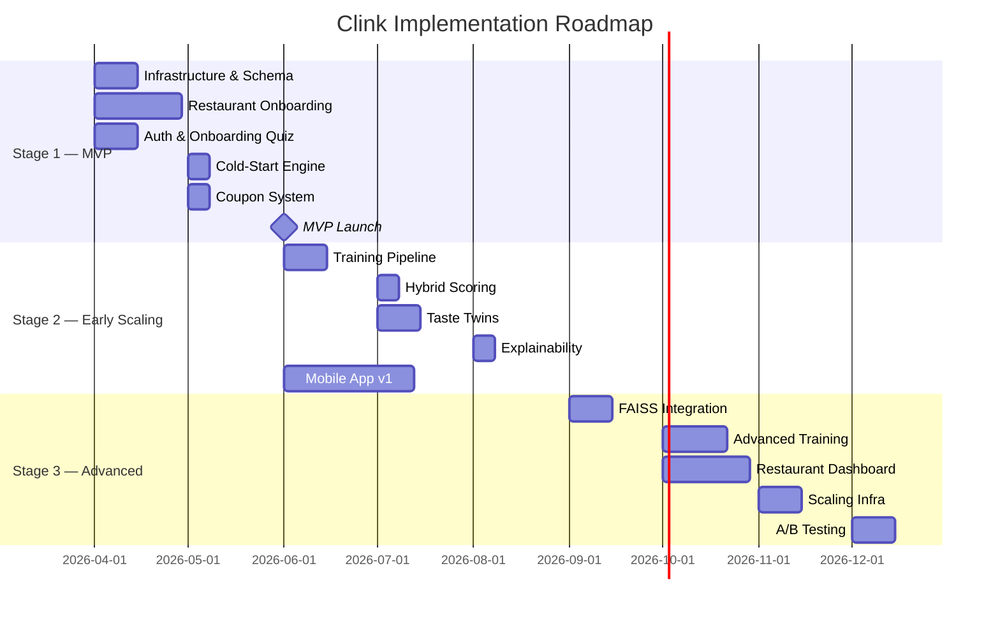

# Clink — Implementation Roadmap

## Overview

This roadmap is organized into three stages, each designed to be **independently deployable and valuable**. The system grows incrementally — each stage builds on the previous one without requiring a rewrite.

| Stage | Timeline | Users | Core Capability |
|---|---|---|---|
| **MVP** | Months 1–3 | 0–1K | Cold-start recommendations + coupons |
| **Early Scaling** | Months 4–8 | 1K–10K | Collaborative filtering + taste twins |
| **Advanced System** | Months 9–18 | 10K–100K+ | ANN search + explainability + analytics |

---

## Stage 1 — MVP (Months 1–3)

**Goal:** Launch a working product in Hyderabad that provides dish-level recommendations and coupon distribution.

### 1.1 Infrastructure Setup

| Task | Details |
|---|---|
| Provision server | Single VM (4 vCPU, 16 GB RAM) — AWS, DigitalOcean, or Hetzner |
| PostgreSQL setup | Single instance with PostGIS extension |
| Redis | Session store and basic caching |
| FastAPI scaffold | Project structure, auth middleware, CORS |
| Docker Compose | Local development and deployment configuration |

**Estimated time:** 1 week

### 1.2 Data Model (Core Tables)

Implement the transactional schema:

- `users` — with location fields and onboarding flag
- `restaurants` — name, location, cuisine type
- `dishes` — linked to restaurants, with `features` JSONB column
- `ratings` — user reactions with source tracking
- `coupons` — restaurant-created incentives
- `coupon_redemptions` — usage tracking

**Estimated time:** 1 week

### 1.3 Restaurant & Dish Onboarding

Manually onboard **50–100 restaurants** in Hyderabad with:

- Restaurant profiles (name, address, GPS coordinates)
- Top 5–10 dishes per restaurant
- Dish feature vectors (spice, sweetness, richness, cuisine, veg/non-veg, price band)

**This is manual, critical work.** The quality of cold-start recommendations depends entirely on the quality of dish feature data.

**Estimated time:** 2 weeks (can run in parallel with development)

### 1.4 Auth & User Onboarding

- Sign-up / login (email + password, or phone OTP)
- Location capture at registration
- Onboarding taste quiz:
  - Fetch 10–15 popular local dishes
  - User swipes: love / like / neutral / dislike / never tried
  - Compute initial taste vector
  - Mark `onboarding_complete = true`

**Estimated time:** 1.5 weeks

### 1.5 Cold-Start Recommendation Engine

Implement the heuristic scoring function:

```
S(d) = α·P(d) + β·cosine(u, x_d) + γ·L(d)
```

- Popularity score: based on total ratings and avg rating in the system
- Taste similarity: cosine between user taste vector and dish feature vector
- Location proximity: inverse distance (PostGIS query)
- Coupon attachment: if top dish has an active coupon, include it

**API endpoint:** `GET /recommendations`

**Estimated time:** 1 week

### 1.6 Coupon System

- Restaurant dashboard (minimal): create coupons, set discount, set validity
- User-facing: coupons displayed on recommended dishes
- Redemption: unique code or QR, validated via API

**Estimated time:** 1 week

### 1.7 MVP Deliverables Checklist

- [ ] User sign-up with location
- [ ] Onboarding taste quiz (10–15 dishes)
- [ ] Cold-start recommendations
- [ ] Coupon display and redemption
- [ ] Restaurant dashboard (basic)
- [ ] 50+ restaurants with dish data
- [ ] Deployed and accessible

---

## Stage 2 — Early Scaling (Months 4–8)

**Goal:** Transition from heuristic recommendations to collaborative filtering. Introduce taste twins and social discovery.

### 2.1 Rating Accumulation

- Prompt users to rate dishes after visiting a restaurant
- Push notification: "How was the Biryani at Paradise?"
- In-app rating flow: single tap (love/like/neutral/dislike)
- Track rating source: `'onboarding'`, `'app'`, `'prompt'`

**Target:** 20+ ratings per active user by end of Stage 2.

### 2.2 Matrix Factorization Training Pipeline

Implement the batch training worker:

1. Extract ratings from PostgreSQL
2. Build sparse matrix $R$
3. Run SGD factorization ($K = 30$, $\eta = 0.005$, $\lambda = 0.02$)
4. Output user vectors $P$ and dish vectors $Q$
5. Store vectors in `user_vectors` and `dish_vectors` tables
6. Schedule via Celery + Redis (weekly cron)

**Library choice:** Start with `surprise` or custom NumPy implementation. Migrate to `implicit` library if implicit feedback is added.

**Estimated time:** 2 weeks

### 2.3 Hybrid Recommendation Blending

Implement the warm-path scoring:

```
S_final(d) = (1 − w) · S_cold(d) + w · S_collab(d)
```

Where $w$ ramps based on user's rating count:

| Ratings | Collab Weight |
|---|---|
| 0–5 | 0.0 |
| 6–15 | 0.3 |
| 16–30 | 0.6 |
| 30+ | 1.0 |

**Estimated time:** 1 week

### 2.4 Taste Twin Feature

- Compute user-user similarity: $\text{cosine}(\mathbf{p}_u, \mathbf{p}_v)$
- Surface top 5 taste twins per user
- Display: "You are 82% taste compatible with Arjun"
- Show overlapping liked dishes as proof

**API endpoint:** `GET /taste-twins`

**Estimated time:** 1.5 weeks

### 2.5 Basic Explainability

- After recommending dish $d$ to user $u$:
  - Find taste twin $v$
  - Find shared liked dishes
  - Generate: "People who liked [shared dishes] also loved this"
- Fallback: "This matches your taste profile"

**Estimated time:** 1 week

### 2.6 Mobile App (v1)

Build or iterate on the consumer-facing app:

- Home feed: recommended dishes with explanations
- Dish detail page: restaurant info, coupon, similar dishes
- Profile page: taste summary, taste twins, rating history
- Rate flow: post-visit rating prompt

**Estimated time:** 4–6 weeks (parallel with backend work)

### 2.7 Stage 2 Deliverables Checklist

- [ ] Matrix factorization training pipeline
- [ ] Hybrid cold/warm recommendation scoring
- [ ] Taste twin discovery and display
- [ ] Basic explainability layer
- [ ] Rating prompts and accumulation
- [ ] Mobile app v1
- [ ] 500+ restaurants onboarded

---

## Stage 3 — Advanced System (Months 9–18)

**Goal:** Scale to 100K+ users. Optimize latency, introduce ANN search, and build analytics for restaurants.

### 3.1 FAISS Integration

- Build FAISS index from user vectors and dish vectors
- Replace brute-force similarity with ANN search
- Support IVF indexing for 100K+ vectors
- Atomic index swapping during retraining

```python
import faiss

index = faiss.IndexIVFFlat(quantizer, K, n_clusters)
index.train(vectors)
index.add(vectors)
```

**Estimated time:** 2 weeks

### 3.2 Advanced Training

- Move from weekly to daily retraining
- Implement incremental updates (fold-in new users without full retrain)
- Experiment with Alternating Least Squares (ALS) for implicit feedback
- Add bias terms to the factorization model:
  $$\hat{r}_{ud} = \mu + b_u + b_d + \mathbf{p}_u^T \mathbf{q}_d$$

**Estimated time:** 3 weeks

### 3.3 Restaurant Analytics Dashboard

Provide restaurants with insights:

- Which dishes are most recommended
- Customer taste profiles (anonymized)
- Coupon redemption rates
- Competitor benchmarking (anonymized)
- Campaign ROI tracking

**Estimated time:** 4 weeks

### 3.4 Scaling Infrastructure

| Component | Change |
|---|---|
| PostgreSQL | Move to managed (RDS / Supabase) + read replica |
| API servers | Horizontal scaling (2–4 nodes behind load balancer) |
| FAISS | Dedicated server or container |
| Training | GPU instance for faster retraining |
| Monitoring | Prometheus + Grafana dashboards |

**Estimated time:** 2 weeks

### 3.5 A/B Testing Framework

- Support multiple recommendation strategies simultaneously
- Route users to different model variants
- Measure: CTR, redemption rate, return visits
- Statistical significance testing before promoting changes

**Estimated time:** 2 weeks

### 3.6 Content Moderation

- Review text moderation (profanity filter, spam detection)
- Fake review detection (abnormal rating patterns)
- Restaurant complaint workflow

**Estimated time:** 1.5 weeks

### 3.7 Stage 3 Deliverables Checklist

- [ ] FAISS ANN search in production
- [ ] Daily model retraining
- [ ] Restaurant analytics dashboard
- [ ] Horizontal API scaling
- [ ] A/B testing framework
- [ ] Content moderation pipeline
- [ ] 5,000+ restaurants across multiple cities

---

## Summary Timeline



---

## Key Dependencies

| Dependency | Risk | Mitigation |
|---|---|---|
| Restaurant onboarding | Slow manual process | Hire part-time field agents; build bulk import tools |
| Dish feature tagging | Quality affects cold-start accuracy | Create tagging guidelines; QA reviews |
| User acquisition (1K) | Cold start is chicken-and-egg | Launch with coupons as primary hook |
| Rating volume | Model needs data to work | Aggressive rating prompts; gamify with taste scores |
| Mobile app quality | User retention depends on UX | Invest in design early; iterate based on feedback |
