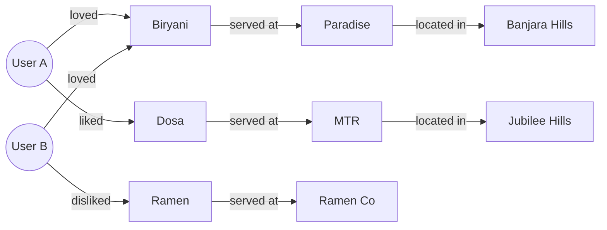
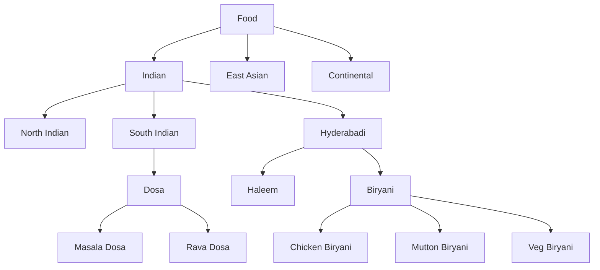

# Clink — Future Research Directions

## Overview

The initial recommendation system (matrix factorization + ANN search) is a **proven, classical approach**. It is the right choice for launch. However, once the system has sufficient data and user traction, several advanced directions can significantly improve recommendation quality, user engagement, and business defensibility.

This document explores four research areas, ordered by practical impact and implementation readiness.

---

## 1. Graph-Based Recommender Systems

### Motivation

The current matrix factorization model treats the rating problem as a flat user-dish matrix. But the real data has **richer structure**:

- Users are connected to dishes via ratings
- Dishes belong to restaurants
- Restaurants have locations and cuisines
- Users have locations and social connections (taste twins)

This is naturally a **heterogeneous graph**.

### The Taste Graph



### Graph Neural Networks (GNNs)

Instead of factorizing a matrix, train a GNN on this graph:

- **Nodes:** users, dishes, restaurants, locations
- **Edges:** ratings, "served at", "located in", "taste twin"
- **Task:** Link prediction — predict missing edges (i.e., which user will like which dish)

**Approaches:**

| Method | Description |
|---|---|
| GraphSAGE | Inductive node embeddings via neighborhood sampling |
| PinSage | Pinterest's scalable GNN for item recommendation |
| LightGCN | Simplified GCN designed specifically for collaborative filtering |
| R-GCN | Relational GCN for heterogeneous graphs with typed edges |

### Why this matters for Clink

- Recommendations become a **graph walk problem**: "What dishes are 2 hops away from User A through positively-rated edges?"
- The model captures transitive preferences: User A → Biryani → Paradise → Seekh Kebab → recommended
- Adding new entity types (cuisine nodes, ingredient nodes) is trivial — just add nodes and edges

### Readiness

| Factor | Status |
|---|---|
| Data requirement | Needs 50K+ ratings across 5K+ users |
| Implementation complexity | High — requires PyTorch Geometric or DGL |
| Infrastructure | GPU training, graph storage (Neo4j or in-memory) |
| Expected impact | Significant improvement in cold-start and cross-entity recommendations |

**Recommendation:** Begin prototyping at Stage 3 (10K+ users). Run as an A/B test against matrix factorization.

---

## 2. LLM-Based Taste Embeddings

### Motivation

The current dish feature vectors are **hand-engineered**: spice level, sweetness, richness, etc. This requires manual tagging and limits the feature space to what we've explicitly defined.

Large Language Models offer an alternative: **generate taste embeddings from natural language descriptions**.

### Approach

1. Each dish has a textual description (name, ingredients, cuisine, restaurant context, user reviews)
2. Pass the text through a pre-trained language model (e.g., `sentence-transformers` or a fine-tuned model)
3. The output embedding captures semantic meaning — including latent taste factors that are hard to hand-engineer

**Example:**

```
Input:  "Hyderabadi Dum Biryani — slow-cooked basmati rice with 
         marinated lamb, saffron, fried onions, and whole spices"

Output: embedding ∈ ℝ^384  (from all-MiniLM-L6-v2)
```

This embedding captures:

- Cuisine (Hyderabadi)
- Cooking method (dum / slow-cooked)
- Protein (lamb)
- Aromatics (saffron, spices)
- Richness (fried onions, marinated)

### Replacing hand-engineered features

| Aspect | Hand-Engineered | LLM Embedding |
|---|---|---|
| Feature dimensions | ~7–10 (explicit) | 384–768 (learned) |
| Coverage | Limited to predefined categories | Captures any textual signal |
| Maintenance | Manual tagging required | Automatic from descriptions |
| Cold-start quality | Decent if tagged well | Potentially much better |
| Interpretability | High (each dimension is named) | Low (latent dimensions) |

### Hybrid approach

Use LLM embeddings for the cold-start path while keeping matrix factorization for the warm path:

$$\mathbf{x}_d^{hybrid} = \text{concat}(\mathbf{x}_d^{manual}, \mathbf{x}_d^{LLM})$$

This gives the best of both worlds: interpretable manual features plus rich semantic features.

### Review embedding

User reviews can also be embedded:

```
"The biryani was too oily but the raita was perfect"
→ embedding captures nuanced preference signal
```

These review embeddings can be aggregated per-user to create a **language-based taste vector** that complements the rating-based latent vector.

### Readiness

| Factor | Status |
|---|---|
| Data requirement | Dish descriptions and/or user reviews |
| Implementation complexity | Low–Medium (pre-trained models available) |
| Infrastructure | CPU-only inference is feasible; GPU for fine-tuning |
| Expected impact | Significant improvement in cold-start and item-cold-start |

**Recommendation:** Can be prototyped at Stage 2. Use `sentence-transformers` for dish embedding. Run A/B test on cold-start recommendations.

---

## 3. Menu Ontology System

### Motivation

Currently, dishes are independent entities. There is no formal understanding of **relationships between dishes**:

- Chicken Biryani and Mutton Biryani are related (same dish family, different protein)
- Gulab Jamun and Rasgulla are related (both are Indian desserts, both are syrup-based)
- "Biryani" at Restaurant A and "Biryani" at Restaurant B may be radically different

Without a structured ontology, the system cannot reason about these relationships.

### Proposed ontology



### Structure

| Level | Example | Purpose |
|---|---|---|
| Cuisine | Indian, East Asian | Broad category |
| Sub-cuisine | Hyderabadi, South Indian | Regional specificity |
| Dish family | Biryani, Dosa, Curry | Grouping similar preparations |
| Variant | Chicken Biryani, Masala Dosa | Specific menu items |

### Benefits

- **Better cold-start:** If a user likes Chicken Biryani, we can infer they might like Mutton Biryani (same family) without needing explicit ratings
- **Smarter exploration:** Recommend across dish families within the same cuisine, rather than random exploration
- **Ingredient reasoning:** If a user dislikes all dishes with coconut, an ontology with ingredient tags enables systematic filtering
- **Normalization:** "Dum Biryani", "Hyderabadi Biryani", and "Kacchi Biryani" can be mapped to the same dish family

### Implementation

1. Build a hierarchical taxonomy of cuisines, sub-cuisines, dish families, and variants
2. Map each dish in the database to its position in the ontology
3. Use ontology distance as a feature in recommendation scoring
4. Allow ingredient-level dietary filtering (allergens, preferences)

### Readiness

| Factor | Status |
|---|---|
| Data requirement | Domain expertise + manual curation |
| Implementation complexity | Medium (taxonomy + mapping) |
| Infrastructure | PostgreSQL (recursive CTEs or materialized paths) |
| Expected impact | Moderate — improves cold-start and exploration quality |

**Recommendation:** Begin building during Stage 2. Start with Hyderabadi cuisine (most data) and expand. This is a **data curation task**, not primarily an engineering task.

---

## 4. Taste Clustering and Persona Discovery

### Motivation

Individual taste vectors are useful for personalization, but there may be **natural clusters** of taste preferences in the user base. Discovering these clusters enables:

- Segment-level recommendations (for users with too few ratings for personalization)
- Market insights for restaurants ("40% of users in your area prefer spicy non-veg — consider adding X")
- Content marketing ("Discover if you're a Biryani Purist or a Fusion Explorer")

### Approach

Apply clustering to the user latent vectors:

$$\{\mathbf{p}_1, \mathbf{p}_2, \dots, \mathbf{p}_U\} \xrightarrow{k\text{-means}} \{C_1, C_2, \dots, C_k\}$$

Each cluster $C_i$ represents a **taste persona**.

### Example personas

| Persona | Characteristics | Representative users |
|---|---|---|
| Biryani Purist | High spice, rice-heavy, traditional Hyderabadi | 35% of Hyderabad users |
| Health-Conscious Explorer | Low-cal, diverse cuisines, salads and bowls | 15% |
| Street Food Enthusiast | Budget-friendly, fried, high variety | 20% |
| Cafe Culture | Coffee, desserts, continental, Instagram-friendly | 18% |
| Home-Style Comfort | Traditional, rice-dal, thali, familiar | 12% |

### Applications

| Use case | How clusters help |
|---|---|
| Cold-start fallback | New user matches to nearest cluster → cluster-level recommendations |
| Restaurant insights | "Your top customer segment is Biryani Purists — here are dishes they want" |
| Marketing | "Take this quiz to find your Food Personality" — viral shareable |
| A/B testing | Test recommendation strategies per persona instead of globally |

### Advanced: temporal clustering

Track how user taste vectors evolve over time:

$$\mathbf{p}_u(t_1) \rightarrow \mathbf{p}_u(t_2) \rightarrow \dots$$

Detect taste drift: "Your preferences have shifted toward healthier options this month."

### Readiness

| Factor | Status |
|---|---|
| Data requirement | 5K+ users with 20+ ratings each |
| Implementation complexity | Low (k-means on existing vectors) |
| Infrastructure | Minimal — runs as part of batch training |
| Expected impact | Medium for recommendations, high for business insights and marketing |

**Recommendation:** Implement at Stage 3. Start with k-means ($k = 5\text{–}10$). Iterate based on business value.

---

## 5. Research Priorities

| Direction | Impact | Effort | Data Needed | Suggested Stage |
|---|---|---|---|---|
| LLM taste embeddings | High | Low–Medium | Dish descriptions | Stage 2 |
| Menu ontology | Medium | Medium | Domain expertise | Stage 2 |
| Taste clustering | Medium–High | Low | 5K+ users | Stage 3 |
| Graph recommenders | High | High | 50K+ ratings | Stage 3 |

---

## 6. Long-Term Vision

The endgame for Clink's recommendation system is a **multimodal taste graph** where:

- Users, dishes, restaurants, cuisines, ingredients, and locations are all **nodes**
- Ratings, visits, taste twins, and geographic proximity are all **edges**
- Recommendations are computed as **learned graph walks**
- Dish descriptions and reviews provide **language-based semantic grounding**
- Taste personas enable **market-level intelligence** for restaurants

This transforms the system from a recommendation engine into a **food intelligence platform** — a much larger and more defensible business.

The data asset — the taste graph — becomes the moat.

> The algorithm is replaceable. The data is not.
