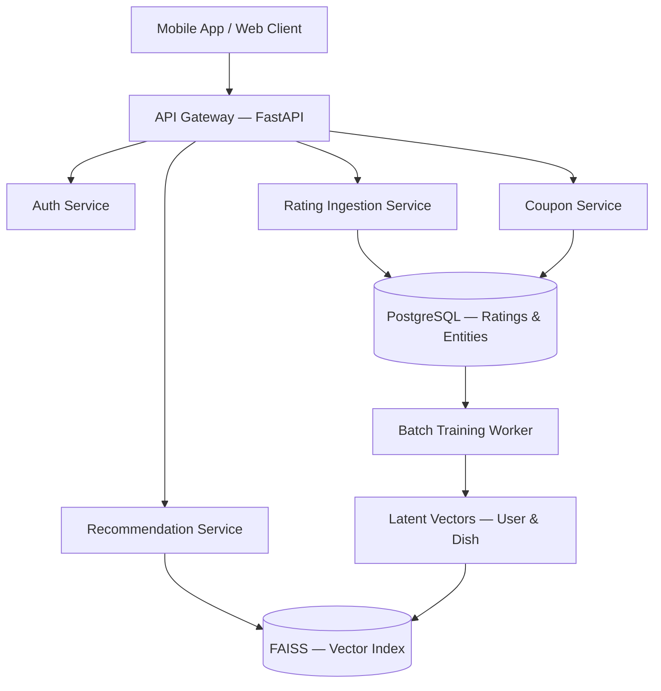
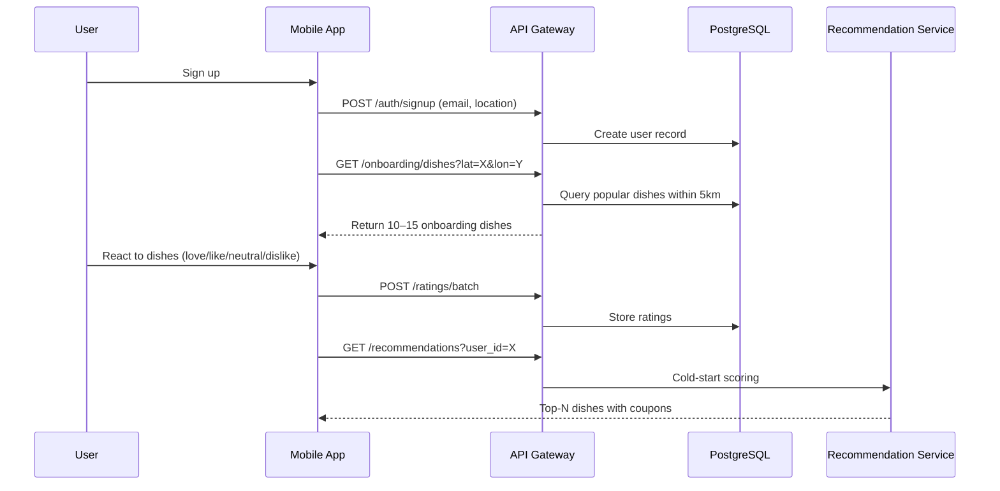
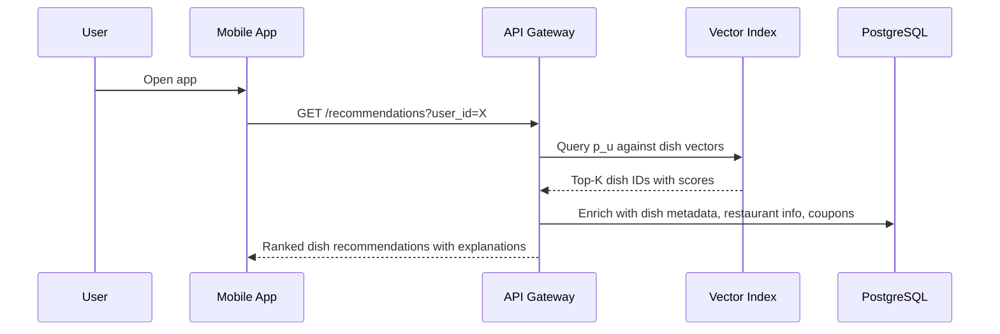
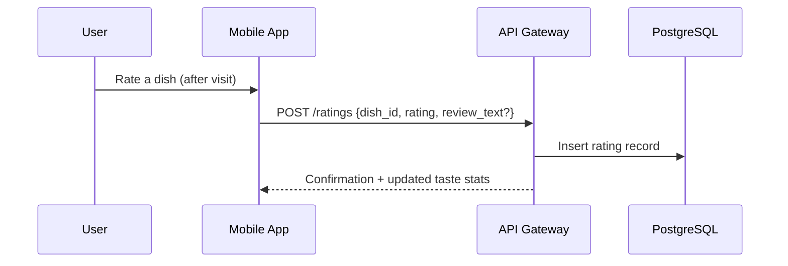
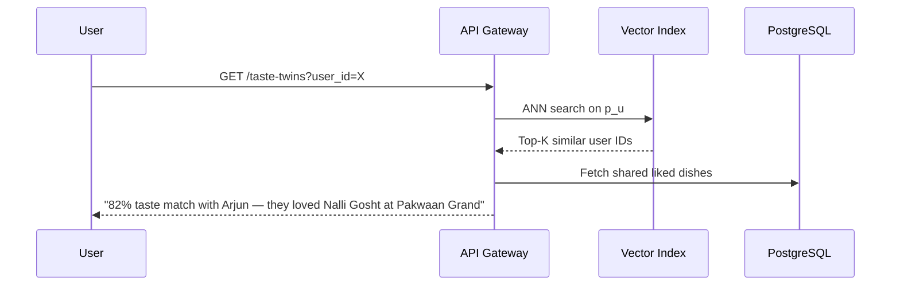
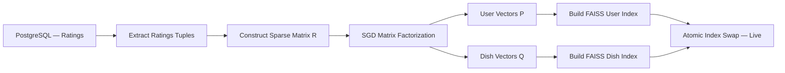
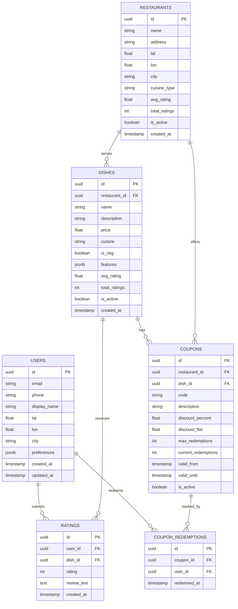
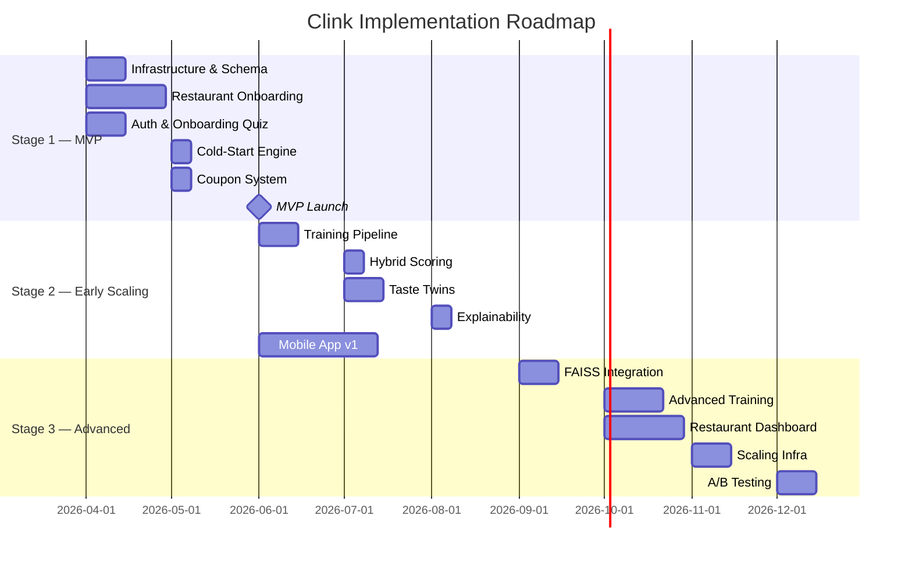
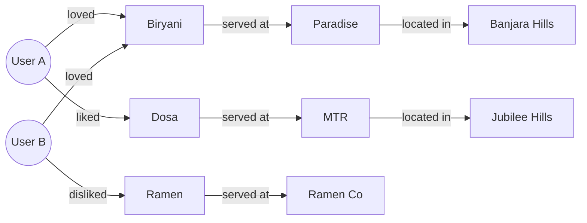
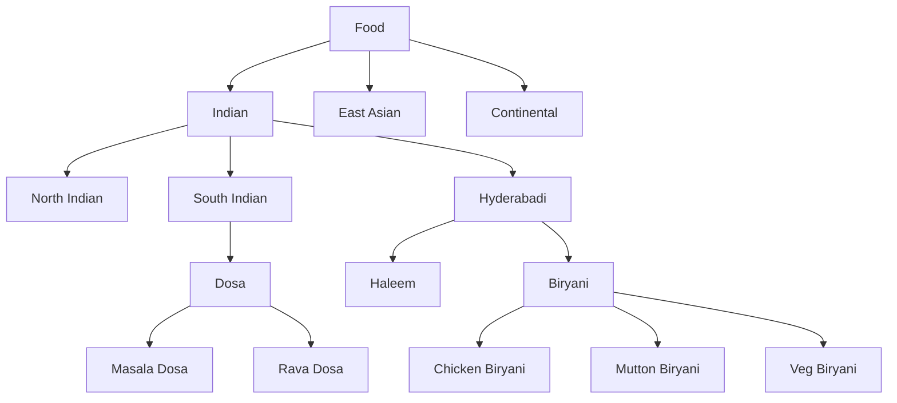

# Clink — System Architecture

## 1. Architecture Overview

Clink's system is designed around a clean separation between **runtime serving** (low-latency recommendation queries) and **offline training** (batch model updates). This separation keeps the user-facing API fast while allowing computationally expensive model training to run asynchronously.



---

## 2. Core Services

### 2.1 API Gateway (FastAPI)

The central entry point for all client requests. Handles routing, request validation, rate limiting, and authentication delegation.

| Responsibility | Detail |
|---|---|
| Framework | FastAPI (Python) |
| Auth | JWT-based, delegated to Auth Service |
| Protocol | REST (JSON), with future gRPC option for internal calls |
| Latency target | < 100ms p95 for recommendation queries |

### 2.2 Auth Service

Handles user registration, login, session management, and token issuance.

- **Sign-up flow** captures: `user_id`, `email/phone`, `lat`, `lon`, `city`
- Location is captured at registration and updated periodically
- JWT tokens with configurable expiry

### 2.3 Rating Ingestion Service

Accepts user reactions to dishes and persists them to PostgreSQL.

**Input schema:**

```json
{
  "user_id": "uuid",
  "dish_id": "uuid",
  "rating": 2,
  "timestamp": "2026-03-16T14:00:00Z",
  "review_text": "optional"
}
```

**Rating values:**

| Value | Meaning |
|---|---|
| `2` | Love |
| `1` | Like |
| `0` | Neutral |
| `-1` | Dislike |

Ratings are append-only. If a user rates the same dish again, the new rating supersedes the old one (tracked via timestamp).

### 2.4 Recommendation Service

The core intelligence layer. Serves two modes:

**Mode 1 — Cold Start (new user, no model data)**

Uses the heuristic scoring function:

$$Score(d) = α · P(d) + β · cosine(u, x_d) + γ · L(d)$$


Where $u$ = user's onboarding taste vector, $x_d$ = dish feature vector.

**Mode 2 — Warm (model trained, vectors available)**

Uses the matrix factorization dot product:


$$Score(u, d) = p_u · q_d$$

Queries the FAISS index for top-K dishes, then applies post-filters (distance, coupon eligibility, already-rated dishes).

### 2.5 Coupon Service

Manages coupon creation, assignment, validation, and redemption.

- Restaurants create coupon templates via the restaurant dashboard
- The recommendation service attaches eligible coupons to recommended dishes
- Redemption is validated at the restaurant via QR code or unique code

### 2.6 Batch Training Worker

An offline process that periodically retrains the recommendation model.

**Pipeline steps:**

```
1. Ingest latest ratings from PostgreSQL
2. Construct (or update) the sparse ratings matrix R
3. Run matrix factorization (SGD)
4. Output user vectors P and dish vectors Q
5. Rebuild FAISS ANN index from P and Q
6. Swap live index with new index (atomic)
```

**Schedule:** Weekly initially, moving to daily as data volume grows.

---

## 3. User Journeys

### 3.1 First-Time User (Cold Start)



**Key decisions:**

- Onboarding dishes are selected for **cuisine diversity** and **local popularity**
- The taste vector is computed immediately from onboarding reactions
- Cold-start recommendations blend popularity, taste similarity, and proximity

### 3.2 Returning User (Warm Path)



**Key decisions:**

- Latent vectors $p_u$ and $q_d$ are pre-computed by the batch worker
- FAISS query is sub-millisecond
- Enrichment (metadata, coupons) adds < 20ms via indexed PostgreSQL queries

### 3.3 Dish Rating Flow



Ratings accumulate until the next batch training run incorporates them.

### 3.4 Taste Twin Discovery



---

## 4. Data Flow

### 4.1 Write Path (Rating Ingestion)

```
User → App → API → PostgreSQL (ratings table)
```

All writes go to PostgreSQL. No direct writes to the vector index.

### 4.2 Training Path (Batch)

```
PostgreSQL (ratings) → Training Worker → P, Q matrices → FAISS Index
```

Training is decoupled from serving. The live system never blocks on training.

### 4.3 Read Path (Recommendations)

```
User → API → FAISS (vector search) → PostgreSQL (enrichment) → Response
```

Vector search provides candidate dish IDs. PostgreSQL enriches them with metadata.

---

## 5. Service Boundaries

| Service | Owns | Depends On |
|---|---|---|
| Auth | Users, sessions, tokens | PostgreSQL |
| Rating Ingestion | Ratings, reactions | PostgreSQL |
| Recommendation | Scoring, ranking, explanations | FAISS, PostgreSQL |
| Coupon | Coupon lifecycle | PostgreSQL |
| Training Worker | Model training, index rebuild | PostgreSQL, FAISS |

**Principle:** Each service owns its own logic but shares the same PostgreSQL instance at MVP stage. As the system scales, these can be separated into independent databases.

---

## 6. Technology Choices

| Component | Technology | Rationale |
|---|---|---|
| API framework | FastAPI | Async, fast, Python ecosystem for ML integration |
| Primary database | PostgreSQL | Relational integrity, JSON support, mature ecosystem |
| Vector index | FAISS | Open-source, battle-tested, supports IVF and HNSW |
| Task queue | Celery + Redis | Reliable batch job scheduling |
| Cache | Redis | Session store, hot data caching |
| Deployment | Docker + single VM | Simplicity for MVP; migrates to k8s later |
| Monitoring | Prometheus + Grafana | Standard observability stack |

---

## 7. Deployment Topology

### MVP (Phase 1)

```
┌─────────────────────────────────────┐
│           Single VM (4 vCPU, 16GB)  │
│                                     │
│  ┌──────────┐  ┌──────────────────┐ │
│  │ FastAPI  │  │ PostgreSQL       │ │
│  │ (uvicorn)│  │                  │ │
│  └──────────┘  └──────────────────┘ │
│                                     │
│  ┌──────────┐  ┌──────────────────┐ │
│  │ Redis    │  │ FAISS (in-proc)  │ │
│  └──────────┘  └──────────────────┘ │
│                                     │
│  ┌──────────────────────────────┐   │
│  │ Celery Worker (batch train)  │   │
│  └──────────────────────────────┘   │
└─────────────────────────────────────┘
```

- Everything on one machine
- FAISS loaded in-process within the recommendation service
- Celery worker runs training weekly via cron
- Estimated cost: ₹3,000–5,000/month on AWS or DigitalOcean

### Scaled (Phase 2+)

```
┌─────────────┐     ┌─────────────────┐     ┌──────────────┐
│ API Servers │────▶│ Managed Postgres│     │ FAISS Server │
│ (2–4 nodes) │     │ (RDS / Supabase)│     │ (dedicated)  │
└─────────────┘     └─────────────────┘     └──────────────┘
       │                                          ▲
       │           ┌─────────────────┐            │
       └──────────▶│ Redis Cluster   │            │
                   └─────────────────┘            │
	                                              │
                   ┌─────────────────┐            │
                   │ Training Worker │────────────┘
                   │ (GPU instance)  │
                   └─────────────────┘
```

---

## 8. API Surface (Key Endpoints)

| Method | Endpoint | Description |
|---|---|---|
| `POST` | `/auth/signup` | User registration with location |
| `POST` | `/auth/login` | Authentication |
| `GET` | `/onboarding/dishes` | Fetch onboarding dishes for location |
| `POST` | `/ratings` | Submit a single rating |
| `POST` | `/ratings/batch` | Submit batch onboarding ratings |
| `GET` | `/recommendations` | Get personalized dish recommendations |
| `GET` | `/taste-twins` | Find taste-similar users |
| `GET` | `/dishes/{id}` | Dish detail with restaurant info |
| `GET` | `/restaurants/{id}` | Restaurant profile |
| `POST` | `/coupons/redeem` | Validate and redeem a coupon |

---

## 9. Reliability and Performance

### Latency budgets

| Operation | Target |
|---|---|
| Cold-start recommendation | < 200ms |
| Warm recommendation (FAISS) | < 50ms |
| Rating submission | < 100ms |
| Taste twin query | < 100ms |

### Failure modes

| Failure | Mitigation |
|---|---|
| FAISS index unavailable | Fall back to cold-start heuristic scoring |
| Training job fails | Serve stale vectors; alert and retry |
| PostgreSQL down | Circuit breaker; return cached recommendations |
| High latency spike | Rate limit; degrade to cached top-N |

### Index freshness

The FAISS index is rebuilt atomically — a new index is built in the background, validated, and then swapped in. Users never see a partially-built index.

# Clink — Recommendation Engine Deep Dive

## 1. Problem Statement

Given a set of users **U**, a set of dishes **D**, and a sparse matrix of observed reactions **R**, produce a ranked list of dishes for each user that maximizes the probability of a positive dining experience.

The system must handle:

- **Cold start** — new users with zero or minimal rating history
- **Sparsity** — the vast majority of user-dish pairs are unobserved
- **Scalability** — similarity computation must not degrade as the user base grows
- **Explainability** — every recommendation must be accompanied by a human-readable justification

---

## 2. Definitions and Notation

| Symbol                          | Meaning                                       |
| ------------------------------- | --------------------------------------------- |
| $\mathcal{U}$                   | Set of all users                              |
| $\mathcal{D}$                   | Set of all dishes                             |
| $\mathcal{R}$                   | Set of all restaurants                        |
| $R \in \mathbb{R}^{U \times D}$ | Rating matrix                                 |
| $r_{ud}$                        | Observed rating by user $u$ for dish $d$      |
| $\hat{r}_{ud}$                  | Predicted rating                              |
| $\mathbf{p}_u \in \mathbb{R}^K$ | Latent vector for user $u$                    |
| $\mathbf{q}_d \in \mathbb{R}^K$ | Latent vector for dish $d$                    |
| $K$                             | Number of latent dimensions (typically 20–50) |
| $\Omega$                        | Set of observed (user, dish) pairs            |

**Reaction encoding:**

| Reaction | Value |
|---|---|
| Love | +2 |
| Like | +1 |
| Neutral | 0 |
| Dislike | −1 |

---

## 3. Cold Start Strategy

When a user has no history — or the system has no trained model — we rely on a feature-based heuristic pipeline.

### 3.1 Dish Feature Representation

Each dish $d$ is represented as a hand-engineered feature vector:

$$\mathbf{x}_d = \begin{bmatrix} \text{spice\_level} \\ \text{sweetness} \\ \text{richness} \\ \text{cuisine\_encoding} \\ \text{veg\_indicator} \\ \text{price\_band} \\ \text{texture} \end{bmatrix} \in \mathbb{R}^m$$

These features are assigned during dish onboarding (by the restaurant or via manual tagging). They enable meaningful similarity computation even before any collaborative data exists.

### 3.2 Onboarding Flow

When a user signs up at location $(lat, lon)$:

1. Query restaurants within radius $\delta$ (default 5 km):
   $$\mathcal{R}_{local} = \{r \in \mathcal{R} : \text{distance}(r, (lat, lon)) < \delta\}$$

2. Select 10–15 onboarding dishes $\mathcal{D}_{onboard}$ from $\bigcup_{r \in \mathcal{R}_{local}} \mathcal{D}_r$, chosen for:
   - High local popularity
   - Cuisine diversity (not all biryani)
   - Feature coverage (span the feature space)

3. User reacts to each dish:
   $$f_u(d) \in \{-1, 0, 1, 2\}$$

### 3.3 Initial User Taste Vector

Compute the user's taste vector as the reaction-weighted sum of dish features:

$$\mathbf{u} = \sum_{d \in \mathcal{D}_{onboard}} f_u(d) \cdot \mathbf{x}_d$$

Normalize:

$$\mathbf{u} = \frac{\mathbf{u}}{\|\mathbf{u}\|}$$

This gives a unit vector in the dish feature space representing the user's initial preferences.

### 3.4 Cold-Start Scoring Function

For a candidate dish $d$:

$$S(d) = \alpha \cdot P(d) + \beta \cdot \text{cosine}(\mathbf{u}, \mathbf{x}_d) + \gamma \cdot L(d)$$

Where:

- $P(d)$ — **Popularity score**: normalized rating count or redemption rate for dish $d$
- $\text{cosine}(\mathbf{u}, \mathbf{x}_d) = \frac{\mathbf{u} \cdot \mathbf{x}_d}{\|\mathbf{u}\| \|\mathbf{x}_d\|}$ — **Taste similarity**
- $L(d)$ — **Location proximity score**: inverse distance between user and the restaurant serving $d$
- $\alpha + \beta + \gamma = 1$

**Default weights:**

| Weight | Value | Rationale |
|---|---|---|
| $\alpha$ | 0.4 | Popularity is the strongest signal when data is sparse |
| $\beta$ | 0.4 | Taste match based on onboarding reactions |
| $\gamma$ | 0.2 | Proximity matters but should not dominate |

These weights can be tuned as more data is collected.

---

## 4. Collaborative Filtering via Matrix Factorization

Once the system has accumulated sufficient ratings, we switch from heuristics to a learned model.

### 4.1 The Rating Matrix

$$R \in \mathbb{R}^{U \times D}$$

where $R_{ud} = r_{ud}$ if user $u$ has rated dish $d$, and undefined otherwise.

This matrix is **extremely sparse**. With 10,000 users and 50,000 dishes, the matrix has 500 million entries. A typical user might rate 20–50 dishes, giving a density of $< 0.1\%$.

### 4.2 Factorization

We approximate $R$ as the product of two low-rank matrices:

$$R \approx P \cdot Q^T$$

Where:

- $P \in \mathbb{R}^{U \times K}$ — each row $\mathbf{p}_u$ is the latent taste vector for user $u$
- $Q \in \mathbb{R}^{D \times K}$ — each row $\mathbf{q}_d$ is the latent vector for dish $d$

The latent dimensions $K$ (typically 20–50) capture hidden taste factors. These are **not explicitly labeled** — the model discovers them from data. Informally, they might correspond to concepts like:

- Spice tolerance
- Preference for rich/heavy vs. light food
- Street food affinity
- Dessert preference
- Price sensitivity

### 4.3 Prediction

The predicted rating for user $u$ on dish $d$ is:

$$\hat{r}_{ud} = \mathbf{p}_u^T \mathbf{q}_d$$

This is a dot product in the latent space. High values indicate predicted compatibility.

### 4.4 Optimization Objective

We minimize the regularized squared error over observed ratings:

$$\mathcal{L} = \sum_{(u,d) \in \Omega} \left(r_{ud} - \mathbf{p}_u^T \mathbf{q}_d\right)^2 + \lambda \left(\|\mathbf{p}_u\|^2 + \|\mathbf{q}_d\|^2\right)$$

Where:

- $\Omega$ = set of observed (user, dish) pairs
- $\lambda$ = regularization parameter (prevents overfitting)

### 4.5 Stochastic Gradient Descent (SGD)

For each observed rating $(u, d, r_{ud})$:

**Compute error:**
$$e_{ud} = r_{ud} - \mathbf{p}_u^T \mathbf{q}_d$$

**Update user vector:**
$$\mathbf{p}_u \leftarrow \mathbf{p}_u + \eta \left(e_{ud} \cdot \mathbf{q}_d - \lambda \cdot \mathbf{p}_u\right)$$

**Update dish vector:**
$$\mathbf{q}_d \leftarrow \mathbf{q}_d + \eta \left(e_{ud} \cdot \mathbf{p}_u - \lambda \cdot \mathbf{q}_d\right)$$

Where $\eta$ is the learning rate.

**Typical hyperparameters:**

| Parameter | Initial Value | Notes |
|---|---|---|
| $K$ | 30 | Latent dimensions |
| $\eta$ | 0.005 | Learning rate |
| $\lambda$ | 0.02 | Regularization strength |
| Epochs | 20–50 | Passes over the data |

### 4.6 Training Convergence

Monitor RMSE on a held-out validation set:

$$\text{RMSE} = \sqrt{\frac{1}{|\Omega_{val}|} \sum_{(u,d) \in \Omega_{val}} (r_{ud} - \hat{r}_{ud})^2}$$

Stop when validation RMSE plateaus or begins to increase (early stopping).

---

## 5. Recommendation Ranking

Once training is complete, recommendation for user $u$ is:

$$d^* = \arg\max_{d \in \mathcal{D}_{eligible}} \mathbf{p}_u^T \mathbf{q}_d$$

Where $\mathcal{D}_{eligible}$ is the set of dishes satisfying constraints:

- $\text{distance}(r_d, u) < \delta$ (within radius)
- $d \notin \mathcal{D}_{rated}(u)$ (not already rated)
- Optionally: $\text{coupon}(d) = \text{true}$ (has active coupon)

Return the top $N$ dishes sorted by score.

---

## 6. User Similarity — Taste Twins

### 6.1 Cosine Similarity

Given two users $u$ and $v$ with latent vectors $\mathbf{p}_u$ and $\mathbf{p}_v$:

$$\text{Sim}(u, v) = \frac{\mathbf{p}_u \cdot \mathbf{p}_v}{\|\mathbf{p}_u\| \|\mathbf{p}_v\|}$$

Values range from $-1$ (opposite taste) to $+1$ (identical taste).

### 6.2 Taste Twin Selection

$$\text{TasteTwin}(u) = \arg\max_{v \in \mathcal{U} \setminus \{u\}} \text{Sim}(u, v)$$

In practice, return the top $k$ taste twins (e.g., $k = 5$).

---

## 7. Approximate Nearest Neighbor (ANN) Search

### 7.1 The Problem

Naively computing $\text{Sim}(u, v)$ for all pairs is $O(N^2)$, which is infeasible at scale.

With 100,000 users:
- $O(N^2) = 10^{10}$ comparisons per query → **impossible in real-time**

### 7.2 The Solution

Use **Approximate Nearest Neighbor** search to achieve $O(\log N)$ per query.

**Tools:**

| Library | Approach | Best For |
|---|---|---|
| FAISS (Meta) | IVF, PQ, HNSW | General purpose, production-grade |
| ScaNN (Google) | Anisotropic quantization | High-accuracy retrieval |
| Annoy (Spotify) | Random projection trees | Read-heavy, memory-constrained |

**FAISS is the recommended choice** for Clink due to its maturity, Python bindings, and support for both CPU and GPU.

### 7.3 Index Construction

```python
import faiss

# K = latent dimension
index = faiss.IndexFlatIP(K)  # Inner Product (equivalent to cosine for normalized vectors)

# Add all user vectors
index.add(P_normalized)  # P_normalized: numpy array (U × K)
```

For large-scale (> 1M users), use an IVF index:

```python
quantizer = faiss.IndexFlatIP(K)
index = faiss.IndexIVFFlat(quantizer, K, n_clusters)
index.train(P_normalized)
index.add(P_normalized)
```

### 7.4 Query

```python
# Find top-k nearest users for user u
distances, indices = index.search(p_u.reshape(1, -1), k=10)
```

**Complexity:** $O(\log N)$ per query instead of $O(N)$.

---

## 8. Explainability Layer

Recommendations must be **explainable** — users trust recommendations more when they understand *why*.

### 8.1 Explanation Generation

After selecting a recommendation $d$ for user $u$:

1. Find the taste twin:
   $$v = \arg\max_{v} \text{Sim}(u, v)$$

2. Find overlapping liked dishes:
   $$\mathcal{D}_{shared} = \{d_i : r_{u,d_i} > 0 \land r_{v,d_i} > 0\}$$

3. Generate explanation:
   > "People who liked **[shared dishes]** at **[restaurants]** also loved this dish."

### 8.2 Example

User A and User B are taste twins (similarity = 0.87).

Shared likes: Chicken Biryani at Paradise, Dosa at MTR.

User B loved Butter Chicken at restaurant X. User A has not tried it.

**Explanation for User A:**

> "Someone who shares your taste for Paradise Biryani and MTR Dosa loved the Butter Chicken at Restaurant X."

### 8.3 Implementation Notes

- Explainability is a **post-hoc deterministic lookup**, not part of model training
- Explanation quality depends on having enough shared ratings
- Fallback explanation: "This dish matches your taste profile" (for cold-start)

---

## 9. Transition: Cold Start → Collaborative Filtering

The system does not switch abruptly. There is a **blending period**:

$$S_{final}(d) = (1 - w) \cdot S_{cold}(d) + w \cdot S_{collab}(d)$$

Where $w$ increases as:
- The user accumulates more ratings
- The model has been trained on the user's data

**Suggested ramp:**

| User Ratings | $w$ (collab weight) |
|---|---|
| 0–5 | 0.0 (pure cold-start) |
| 6–15 | 0.3 |
| 16–30 | 0.6 |
| 30+ | 1.0 (pure collaborative) |

This ensures recommendations remain reasonable even when there is limited personal data.

---

## 10. Training Pipeline Summary



**Schedule:**

| Stage | Frequency |
|---|---|
| MVP (< 1K users) | Weekly |
| Growth (1K–50K users) | Daily |
| Scale (50K+ users) | Incremental updates + weekly full retrain |

---

## 11. Model Evaluation Metrics

| Metric | What it Measures | Target |
|---|---|---|
| RMSE | Accuracy of predicted vs. actual ratings | < 0.8 on validation set |
| Precision\@K | Fraction of top-K recommendations that are relevant | > 0.3 |
| Recall\@K | Fraction of relevant dishes that appear in top-K | > 0.2 |
| NDCG | Quality of ranking order | > 0.5 |
| Coverage | Fraction of dishes that ever get recommended | > 40% |
| Diversity | How varied the top-K recommendations are | Monitor (no fixed target) |

---

## 12. Summary of Approaches by System Stage

| Stage | Users | Approach | Key Algorithm |
|---|---|---|---|
| Launch | 0–100 | Pure cold-start | Feature vectors + cosine similarity |
| Early | 100–5K | Hybrid blend | Cold-start + early matrix factorization |
| Growth | 5K–50K | Full collaborative | Matrix factorization + FAISS |
| Scale | 50K+ | Advanced | ALS, implicit feedback, graph models |
# Clink — Data Model

## 1. Overview

The data model captures five core entity types and their relationships:

- **Users** — diners who discover and rate food
- **Restaurants** — establishments serving dishes
- **Dishes** — individual menu items (the atomic unit of recommendation)
- **Ratings** — user reactions to dishes
- **Coupons** — incentives attached to dishes or restaurants

The model is designed to support:

- Efficient rating ingestion for the recommendation pipeline
- Low-latency enrichment queries during recommendation serving
- Spatial queries for location-based filtering
- Analytical queries for business intelligence

---

## 2. Entity-Relationship Diagram



---

## 3. Table Definitions

### 3.1 `users`

Stores diner profiles and location data.

| Column | Type | Constraints | Notes |
|---|---|---|---|
| `id` | `UUID` | PK, default `gen_random_uuid()` | |
| `email` | `VARCHAR(255)` | UNIQUE, NOT NULL | Primary login identifier |
| `phone` | `VARCHAR(20)` | UNIQUE, NULLABLE | Optional phone login |
| `display_name` | `VARCHAR(100)` | NOT NULL | Shown in taste twin features |
| `password_hash` | `VARCHAR(255)` | NOT NULL | bcrypt or argon2 |
| `lat` | `FLOAT` | NOT NULL | User's primary latitude |
| `lon` | `FLOAT` | NOT NULL | User's primary longitude |
| `city` | `VARCHAR(100)` | NOT NULL | Denormalized for fast filtering |
| `preferences` | `JSONB` | NULLABLE | Dietary preferences, cuisine prefs |
| `onboarding_complete` | `BOOLEAN` | DEFAULT `false` | Has the user completed taste quiz |
| `created_at` | `TIMESTAMP` | DEFAULT `NOW()` | |
| `updated_at` | `TIMESTAMP` | DEFAULT `NOW()` | Auto-updated via trigger |

**Indexes:**

```sql
CREATE INDEX idx_users_city ON users(city);
CREATE INDEX idx_users_location ON users USING GIST (
    ST_SetSRID(ST_MakePoint(lon, lat), 4326)
);
```

### 3.2 `restaurants`

Stores restaurant profiles and location.

| Column | Type | Constraints | Notes |
|---|---|---|---|
| `id` | `UUID` | PK | |
| `name` | `VARCHAR(255)` | NOT NULL | |
| `address` | `TEXT` | NOT NULL | |
| `lat` | `FLOAT` | NOT NULL | |
| `lon` | `FLOAT` | NOT NULL | |
| `city` | `VARCHAR(100)` | NOT NULL | |
| `cuisine_type` | `VARCHAR(100)` | NULLABLE | Primary cuisine category |
| `avg_rating` | `FLOAT` | DEFAULT `0.0` | Denormalized aggregate |
| `total_ratings` | `INTEGER` | DEFAULT `0` | Denormalized count |
| `is_partner` | `BOOLEAN` | DEFAULT `false` | Paying restaurant partner |
| `is_active` | `BOOLEAN` | DEFAULT `true` | |
| `created_at` | `TIMESTAMP` | DEFAULT `NOW()` | |

**Indexes:**

```sql
CREATE INDEX idx_restaurants_city ON restaurants(city);
CREATE INDEX idx_restaurants_location ON restaurants USING GIST (
    ST_SetSRID(ST_MakePoint(lon, lat), 4326)
);
CREATE INDEX idx_restaurants_cuisine ON restaurants(cuisine_type);
```

### 3.3 `dishes`

The atomic unit of the recommendation system.

| Column | Type | Constraints | Notes |
|---|---|---|---|
| `id` | `UUID` | PK | |
| `restaurant_id` | `UUID` | FK → `restaurants.id`, NOT NULL | |
| `name` | `VARCHAR(255)` | NOT NULL | |
| `description` | `TEXT` | NULLABLE | |
| `price` | `DECIMAL(10,2)` | NOT NULL | Price in INR |
| `cuisine` | `VARCHAR(100)` | NOT NULL | e.g., "Hyderabadi", "South Indian" |
| `is_veg` | `BOOLEAN` | NOT NULL | |
| `features` | `JSONB` | NOT NULL | Feature vector for cold-start |
| `avg_rating` | `FLOAT` | DEFAULT `0.0` | Denormalized |
| `total_ratings` | `INTEGER` | DEFAULT `0` | Denormalized |
| `is_active` | `BOOLEAN` | DEFAULT `true` | |
| `created_at` | `TIMESTAMP` | DEFAULT `NOW()` | |

**The `features` column** stores the dish's feature vector used for cold-start recommendations:

```json
{
  "spice_level": 0.8,
  "sweetness": 0.1,
  "richness": 0.7,
  "texture": 0.5,
  "price_band": 2
}
```

**Indexes:**

```sql
CREATE INDEX idx_dishes_restaurant ON dishes(restaurant_id);
CREATE INDEX idx_dishes_cuisine ON dishes(cuisine);
CREATE INDEX idx_dishes_veg ON dishes(is_veg);
CREATE INDEX idx_dishes_features ON dishes USING GIN (features);
```

### 3.4 `ratings`

The core feedback table — every user reaction to a dish is stored here.

| Column | Type | Constraints | Notes |
|---|---|---|---|
| `id` | `UUID` | PK | |
| `user_id` | `UUID` | FK → `users.id`, NOT NULL | |
| `dish_id` | `UUID` | FK → `dishes.id`, NOT NULL | |
| `rating` | `SMALLINT` | NOT NULL, CHECK `rating IN (-1, 0, 1, 2)` | |
| `review_text` | `TEXT` | NULLABLE | Optional text review |
| `source` | `VARCHAR(20)` | DEFAULT `'app'` | `'onboarding'`, `'app'`, `'prompt'` |
| `created_at` | `TIMESTAMP` | DEFAULT `NOW()` | |

**Unique constraint:** One active rating per (user, dish) pair. If a user re-rates, the old row is soft-superseded (latest timestamp wins during training).

```sql
CREATE UNIQUE INDEX idx_ratings_user_dish ON ratings(user_id, dish_id);
CREATE INDEX idx_ratings_user ON ratings(user_id);
CREATE INDEX idx_ratings_dish ON ratings(dish_id);
CREATE INDEX idx_ratings_created ON ratings(created_at);
```

**This is the table that feeds the recommendation engine.** The training pipeline queries:

```sql
SELECT user_id, dish_id, rating
FROM ratings
WHERE created_at > :last_training_timestamp;
```

### 3.5 `coupons`

Coupon definitions created by restaurant partners.

| Column | Type | Constraints | Notes |
|---|---|---|---|
| `id` | `UUID` | PK | |
| `restaurant_id` | `UUID` | FK → `restaurants.id`, NOT NULL | |
| `dish_id` | `UUID` | FK → `dishes.id`, NULLABLE | NULL = applies to whole restaurant |
| `code` | `VARCHAR(50)` | UNIQUE, NOT NULL | Redemption code |
| `description` | `TEXT` | NOT NULL | User-facing description |
| `discount_percent` | `DECIMAL(5,2)` | NULLABLE | Percentage discount |
| `discount_flat` | `DECIMAL(10,2)` | NULLABLE | Flat amount discount (INR) |
| `max_redemptions` | `INTEGER` | NOT NULL | Total allowed redemptions |
| `current_redemptions` | `INTEGER` | DEFAULT `0` | Counter |
| `valid_from` | `TIMESTAMP` | NOT NULL | |
| `valid_until` | `TIMESTAMP` | NOT NULL | |
| `is_active` | `BOOLEAN` | DEFAULT `true` | |
| `created_at` | `TIMESTAMP` | DEFAULT `NOW()` | |

**Indexes:**

```sql
CREATE INDEX idx_coupons_restaurant ON coupons(restaurant_id);
CREATE INDEX idx_coupons_dish ON coupons(dish_id);
CREATE INDEX idx_coupons_active ON coupons(is_active, valid_until);
```

### 3.6 `coupon_redemptions`

Tracks individual coupon usage events.

| Column | Type | Constraints | Notes |
|---|---|---|---|
| `id` | `UUID` | PK | |
| `coupon_id` | `UUID` | FK → `coupons.id`, NOT NULL | |
| `user_id` | `UUID` | FK → `users.id`, NOT NULL | |
| `redeemed_at` | `TIMESTAMP` | DEFAULT `NOW()` | |

```sql
CREATE UNIQUE INDEX idx_redemptions_unique ON coupon_redemptions(coupon_id, user_id);
```

---

## 4. Derived / Computed Tables

These tables are not part of the transactional schema but are produced by the training pipeline.

### 4.1 `user_vectors`

Stores the latent user vectors produced by matrix factorization.

| Column | Type | Notes |
|---|---|---|
| `user_id` | `UUID` | FK → `users.id` |
| `vector` | `FLOAT[]` | Array of K floats |
| `model_version` | `INTEGER` | Training run identifier |
| `created_at` | `TIMESTAMP` | When this vector was computed |

### 4.2 `dish_vectors`

Stores the latent dish vectors.

| Column | Type | Notes |
|---|---|---|
| `dish_id` | `UUID` | FK → `dishes.id` |
| `vector` | `FLOAT[]` | Array of K floats |
| `model_version` | `INTEGER` | Training run identifier |
| `created_at` | `TIMESTAMP` | When this vector was computed |

These vectors are loaded into FAISS at index build time. They also serve as a backup — if the FAISS index is lost, it can be rebuilt from these tables.

---

## 5. Spatial Queries

Location-based filtering is critical for recommendation relevance.

**PostGIS extension** enables spatial indexing and distance queries:

```sql
-- Find restaurants within 5 km of user
SELECT id, name, 
    ST_Distance(
        ST_SetSRID(ST_MakePoint(lon, lat), 4326)::geography,
        ST_SetSRID(ST_MakePoint(:user_lon, :user_lat), 4326)::geography
    ) AS distance_meters
FROM restaurants
WHERE ST_DWithin(
    ST_SetSRID(ST_MakePoint(lon, lat), 4326)::geography,
    ST_SetSRID(ST_MakePoint(:user_lon, :user_lat), 4326)::geography,
    5000  -- 5 km in meters
)
ORDER BY distance_meters;
```

---

## 6. Data Volume Estimates

| Entity | Year 1 (MVP) | Year 2 (Growth) | Year 3 (Scale) |
|---|---|---|---|
| Users | 1K–10K | 10K–100K | 100K–1M |
| Restaurants | 200–500 | 500–5K | 5K–50K |
| Dishes | 2K–5K | 5K–50K | 50K–500K |
| Ratings | 20K–100K | 100K–5M | 5M–100M |
| Coupons | 500–2K | 2K–20K | 20K–200K |

**Storage estimates (PostgreSQL):**

| Table | Avg row size | Year 3 rows | Estimated size |
|---|---|---|---|
| ratings | ~80 bytes | 100M | ~8 GB |
| dishes | ~500 bytes | 500K | ~250 MB |
| users | ~300 bytes | 1M | ~300 MB |
| restaurants | ~400 bytes | 50K | ~20 MB |

PostgreSQL handles this comfortably on a single node with proper indexing.

---

## 7. Future Scaling Considerations

### 7.1 Ratings table partitioning

At 100M+ rows, partition the `ratings` table by `created_at`:

```sql
CREATE TABLE ratings (
    ...
) PARTITION BY RANGE (created_at);

CREATE TABLE ratings_2026_q1 PARTITION OF ratings
    FOR VALUES FROM ('2026-01-01') TO ('2026-04-01');
```

Benefits: faster training queries (scan only recent partitions), easier archival.

### 7.2 Read replicas

Separate read and write traffic:

- **Primary** → rating writes, coupon redemptions
- **Replica** → recommendation enrichment queries, analytics

### 7.3 Caching layer

Hot data in Redis:

- User vectors (avoid DB lookups during recommendation)
- Popular dish metadata (avoid repeated joins)
- Active coupons per restaurant

### 7.4 Event streaming

As the system scales, replace direct DB inserts with an event stream:

```
Rating Event → Kafka → PostgreSQL (batch insert)
                   → Real-time feature store (optional)
```

This decouples the ingestion path from the storage path and enables real-time model updates in the future.

# Clink — Implementation Roadmap

## Overview

This roadmap is organized into three stages, each designed to be **independently deployable and valuable**. The system grows incrementally — each stage builds on the previous one without requiring a rewrite.

| Stage | Timeline | Users | Core Capability |
|---|---|---|---|
| **MVP** | Months 1–3 | 0–1K | Cold-start recommendations + coupons |
| **Early Scaling** | Months 4–8 | 1K–10K | Collaborative filtering + taste twins |
| **Advanced System** | Months 9–18 | 10K–100K+ | ANN search + explainability + analytics |

---

## Stage 1 — MVP (Months 1–3)

**Goal:** Launch a working product in Hyderabad that provides dish-level recommendations and coupon distribution.

### 1.1 Infrastructure Setup

| Task | Details |
|---|---|
| Provision server | Single VM (4 vCPU, 16 GB RAM) — AWS, DigitalOcean, or Hetzner |
| PostgreSQL setup | Single instance with PostGIS extension |
| Redis | Session store and basic caching |
| FastAPI scaffold | Project structure, auth middleware, CORS |
| Docker Compose | Local development and deployment configuration |

**Estimated time:** 1 week

### 1.2 Data Model (Core Tables)

Implement the transactional schema:

- `users` — with location fields and onboarding flag
- `restaurants` — name, location, cuisine type
- `dishes` — linked to restaurants, with `features` JSONB column
- `ratings` — user reactions with source tracking
- `coupons` — restaurant-created incentives
- `coupon_redemptions` — usage tracking

**Estimated time:** 1 week

### 1.3 Restaurant & Dish Onboarding

Manually onboard **50–100 restaurants** in Hyderabad with:

- Restaurant profiles (name, address, GPS coordinates)
- Top 5–10 dishes per restaurant
- Dish feature vectors (spice, sweetness, richness, cuisine, veg/non-veg, price band)

**This is manual, critical work.** The quality of cold-start recommendations depends entirely on the quality of dish feature data.

**Estimated time:** 2 weeks (can run in parallel with development)

### 1.4 Auth & User Onboarding

- Sign-up / login (email + password, or phone OTP)
- Location capture at registration
- Onboarding taste quiz:
  - Fetch 10–15 popular local dishes
  - User swipes: love / like / neutral / dislike / never tried
  - Compute initial taste vector
  - Mark `onboarding_complete = true`

**Estimated time:** 1.5 weeks

### 1.5 Cold-Start Recommendation Engine

Implement the heuristic scoring function:

```
S(d) = α·P(d) + β·cosine(u, x_d) + γ·L(d)
```

- Popularity score: based on total ratings and avg rating in the system
- Taste similarity: cosine between user taste vector and dish feature vector
- Location proximity: inverse distance (PostGIS query)
- Coupon attachment: if top dish has an active coupon, include it

**API endpoint:** `GET /recommendations`

**Estimated time:** 1 week

### 1.6 Coupon System

- Restaurant dashboard (minimal): create coupons, set discount, set validity
- User-facing: coupons displayed on recommended dishes
- Redemption: unique code or QR, validated via API

**Estimated time:** 1 week

### 1.7 MVP Deliverables Checklist

- [ ] User sign-up with location
- [ ] Onboarding taste quiz (10–15 dishes)
- [ ] Cold-start recommendations
- [ ] Coupon display and redemption
- [ ] Restaurant dashboard (basic)
- [ ] 50+ restaurants with dish data
- [ ] Deployed and accessible

---

## Stage 2 — Early Scaling (Months 4–8)

**Goal:** Transition from heuristic recommendations to collaborative filtering. Introduce taste twins and social discovery.

### 2.1 Rating Accumulation

- Prompt users to rate dishes after visiting a restaurant
- Push notification: "How was the Biryani at Paradise?"
- In-app rating flow: single tap (love/like/neutral/dislike)
- Track rating source: `'onboarding'`, `'app'`, `'prompt'`

**Target:** 20+ ratings per active user by end of Stage 2.

### 2.2 Matrix Factorization Training Pipeline

Implement the batch training worker:

1. Extract ratings from PostgreSQL
2. Build sparse matrix $R$
3. Run SGD factorization ($K = 30$, $\eta = 0.005$, $\lambda = 0.02$)
4. Output user vectors $P$ and dish vectors $Q$
5. Store vectors in `user_vectors` and `dish_vectors` tables
6. Schedule via Celery + Redis (weekly cron)

**Library choice:** Start with `surprise` or custom NumPy implementation. Migrate to `implicit` library if implicit feedback is added.

**Estimated time:** 2 weeks

### 2.3 Hybrid Recommendation Blending

Implement the warm-path scoring:

```
S_final(d) = (1 − w) · S_cold(d) + w · S_collab(d)
```

Where $w$ ramps based on user's rating count:

| Ratings | Collab Weight |
|---|---|
| 0–5 | 0.0 |
| 6–15 | 0.3 |
| 16–30 | 0.6 |
| 30+ | 1.0 |

**Estimated time:** 1 week

### 2.4 Taste Twin Feature

- Compute user-user similarity: $\text{cosine}(\mathbf{p}_u, \mathbf{p}_v)$
- Surface top 5 taste twins per user
- Display: "You are 82% taste compatible with Arjun"
- Show overlapping liked dishes as proof

**API endpoint:** `GET /taste-twins`

**Estimated time:** 1.5 weeks

### 2.5 Basic Explainability

- After recommending dish $d$ to user $u$:
  - Find taste twin $v$
  - Find shared liked dishes
  - Generate: "People who liked [shared dishes] also loved this"
- Fallback: "This matches your taste profile"

**Estimated time:** 1 week

### 2.6 Mobile App (v1)

Build or iterate on the consumer-facing app:

- Home feed: recommended dishes with explanations
- Dish detail page: restaurant info, coupon, similar dishes
- Profile page: taste summary, taste twins, rating history
- Rate flow: post-visit rating prompt

**Estimated time:** 4–6 weeks (parallel with backend work)

### 2.7 Stage 2 Deliverables Checklist

- [ ] Matrix factorization training pipeline
- [ ] Hybrid cold/warm recommendation scoring
- [ ] Taste twin discovery and display
- [ ] Basic explainability layer
- [ ] Rating prompts and accumulation
- [ ] Mobile app v1
- [ ] 500+ restaurants onboarded

---

## Stage 3 — Advanced System (Months 9–18)

**Goal:** Scale to 100K+ users. Optimize latency, introduce ANN search, and build analytics for restaurants.

### 3.1 FAISS Integration

- Build FAISS index from user vectors and dish vectors
- Replace brute-force similarity with ANN search
- Support IVF indexing for 100K+ vectors
- Atomic index swapping during retraining

```python
import faiss

index = faiss.IndexIVFFlat(quantizer, K, n_clusters)
index.train(vectors)
index.add(vectors)
```

**Estimated time:** 2 weeks

### 3.2 Advanced Training

- Move from weekly to daily retraining
- Implement incremental updates (fold-in new users without full retrain)
- Experiment with Alternating Least Squares (ALS) for implicit feedback
- Add bias terms to the factorization model:
  $$\hat{r}_{ud} = \mu + b_u + b_d + \mathbf{p}_u^T \mathbf{q}_d$$

**Estimated time:** 3 weeks

### 3.3 Restaurant Analytics Dashboard

Provide restaurants with insights:

- Which dishes are most recommended
- Customer taste profiles (anonymized)
- Coupon redemption rates
- Competitor benchmarking (anonymized)
- Campaign ROI tracking

**Estimated time:** 4 weeks

### 3.4 Scaling Infrastructure

| Component | Change |
|---|---|
| PostgreSQL | Move to managed (RDS / Supabase) + read replica |
| API servers | Horizontal scaling (2–4 nodes behind load balancer) |
| FAISS | Dedicated server or container |
| Training | GPU instance for faster retraining |
| Monitoring | Prometheus + Grafana dashboards |

**Estimated time:** 2 weeks

### 3.5 A/B Testing Framework

- Support multiple recommendation strategies simultaneously
- Route users to different model variants
- Measure: CTR, redemption rate, return visits
- Statistical significance testing before promoting changes

**Estimated time:** 2 weeks

### 3.6 Content Moderation

- Review text moderation (profanity filter, spam detection)
- Fake review detection (abnormal rating patterns)
- Restaurant complaint workflow

**Estimated time:** 1.5 weeks

### 3.7 Stage 3 Deliverables Checklist

- [ ] FAISS ANN search in production
- [ ] Daily model retraining
- [ ] Restaurant analytics dashboard
- [ ] Horizontal API scaling
- [ ] A/B testing framework
- [ ] Content moderation pipeline
- [ ] 5,000+ restaurants across multiple cities

---

## Summary Timeline



---

## Key Dependencies

| Dependency | Risk | Mitigation |
|---|---|---|
| Restaurant onboarding | Slow manual process | Hire part-time field agents; build bulk import tools |
| Dish feature tagging | Quality affects cold-start accuracy | Create tagging guidelines; QA reviews |
| User acquisition (1K) | Cold start is chicken-and-egg | Launch with coupons as primary hook |
| Rating volume | Model needs data to work | Aggressive rating prompts; gamify with taste scores |
| Mobile app quality | User retention depends on UX | Invest in design early; iterate based on feedback |

# Clink — Risks and Unknowns

## Overview

Every recommendation system faces a common set of failure modes. Clink's dish-level taste graph introduces additional risks unique to the food domain. This document catalogs known risks, assesses their severity, and proposes mitigations.

---

## 1. Data Sparsity

### The problem

The rating matrix $R$ is extremely sparse. With 10,000 users and 50,000 dishes:

- Matrix size: 500 million cells
- Typical user rates 20–50 dishes
- **Density: < 0.1%**

Matrix factorization struggles when the matrix is too sparse — there isn't enough signal to learn meaningful latent factors.

### Severity: **High**

This is the most fundamental technical risk. If users don't rate enough dishes, the collaborative filtering model will not converge to useful recommendations.

### Mitigation

| Strategy | Detail |
|---|---|
| Aggressive onboarding | 10–15 dishes rated during onboarding provides a baseline |
| Rating prompts | Push notifications after restaurant visits: "How was the Biryani?" |
| Implicit signals | Track dish views, coupon saves, and time spent on dish pages as weak positive signals |
| Hybrid scoring | Blend cold-start heuristics with collaborative filtering; don't rely on CF alone until ratings are dense enough |
| Geographic clustering | Factorize per-city matrices instead of a single global matrix to increase density |

---

## 2. Low User Engagement with Ratings

### The problem

Users are notoriously reluctant to leave reviews. On most platforms:

- < 5% of users write text reviews
- < 20% of users leave any rating at all
- Most ratings come from extreme experiences (very good or very bad)

### Severity: **High**

Without sufficient rating volume, the recommendation engine has no fuel.

### Mitigation

| Strategy | Detail |
|---|---|
| Frictionless rating UX | Single-tap reaction (love/like/neutral/dislike) — not a 5-star scale, not text-first |
| Taste score gamification | Show users their "taste profile completeness" and encourage filling it |
| Social incentive | "Rate 10 more dishes to unlock your Taste Twin" |
| Coupon gating | "Rate your last visit to unlock your next coupon" (use carefully to avoid resentment) |
| Skip text reviews initially | Don't require text — focus on reaction capture |

---

## 3. Cold Start Chicken-and-Egg

### The problem

The system needs users to have good recommendations. But users need good recommendations to stay engaged. This is a classic two-sided cold start:

- **User cold start:** new users have no ratings → poor recommendations
- **Item cold start:** new dishes have no ratings → never get recommended
- **System cold start:** new system has no data at all

### Severity: **High** (at launch)

### Mitigation

| Cold start type | Strategy |
|---|---|
| User | Onboarding taste quiz produces an immediate taste vector |
| Item | New dishes are boosted via popularity priors and restaurant-level signals |
| System | Initial recommendations are coupon-driven — value proposition is discount, not accuracy |

The key insight: **at launch, the coupon is the product, not the recommendation.** Users come for discounts. Over time, the recommendation quality becomes the retention driver.

---

## 4. Biased Recommendations (Filter Bubbles)

### The problem

Collaborative filtering naturally reinforces existing preferences. If a user likes biryani, the system recommends more biryani. The user never discovers that they might enjoy ramen.

This creates a **filter bubble** — recommendations become repetitive and stale.

### Severity: **Medium**

### Mitigation

| Strategy | Detail |
|---|---|
| Diversity injection | Reserve 20–30% of recommendation slots for "exploration" — dishes outside the user's typical profile |
| Cuisine diversity constraint | Ensure top-N recommendations span at least 3 cuisine types |
| Serendipity scoring | Boost dishes that are popular among taste twins but outside the user's rated cuisines |
| Monitor coverage metric | Track what fraction of dishes ever get recommended — if it drops below 40%, increase exploration |

---

## 5. Fraudulent and Manipulated Reviews

### The problem

Restaurants have strong financial incentives to:

- Generate fake positive reviews for their own dishes
- Generate fake negative reviews for competitors
- Incentivize customers to leave inflated ratings ("5-star review = free dessert")

### Severity: **Medium–High**

A single restaurant flooding the system with fake ratings can distort recommendations for an entire neighborhood.

### Mitigation

| Strategy | Detail |
|---|---|
| Rate limiting | Max 5 ratings per user per day; flag accounts that hit the limit regularly |
| Velocity detection | Flag sudden spikes in ratings for a single dish or restaurant |
| Device fingerprinting | Detect multiple accounts from the same device |
| Review source tracking | Distinguish onboarding ratings, organic ratings, and prompted ratings |
| Statistical outlier detection | If a dish's rating distribution is abnormally concentrated at +2, flag for review |
| Human review queue | Flagged ratings go to a moderator before affecting the model |

---

## 6. Geographic Limitations

### The problem

Clink's value depends on having sufficient restaurant and dish coverage in the user's area. In early stages:

- Coverage will be patchy
- Some neighborhoods will have 50 restaurants; others will have 2
- Users in low-coverage areas will get poor recommendations

### Severity: **Medium**

### Mitigation

| Strategy | Detail |
|---|---|
| Hyper-local launch | Launch in a single well-covered area (e.g., Banjara Hills, Jubilee Hills) before expanding |
| Transparency | If coverage is low, tell the user: "We're expanding in your area — here are popular dishes nearby" |
| Restaurant acquisition focus | Prioritize onboarding restaurants in areas with the most users |
| Adaptive radius | Increase the search radius dynamically if the local area has low density |

---

## 7. Recommendation Fatigue

### The problem

Users have been trained by years of mediocre recommendations on other platforms to **ignore algorithmic suggestions**. The reaction is often:

> "I don't need an app to tell me where to eat."

### Severity: **Medium**

### Mitigation

| Strategy | Detail |
|---|---|
| Social proof framing | Frame recommendations as "someone like you loved this" rather than "the algorithm says" |
| Taste Twin UI | The social hook (Food Twin Score) makes it feel human, not robotic |
| Coupon-first framing | "Here's a deal on something you'd love" — the deal is the hook, the recommendation is the glue |
| High accuracy threshold | Only surface dish recommendations with score > 0.7 — better to show fewer, better recommendations |

---

## 8. Scaling Costs

### The problem

As the system grows, several cost drivers emerge:

| Component | Cost driver |
|---|---|
| Model training | Compute scales with ratings volume |
| FAISS index | Memory scales with user count × K dimensions |
| PostgreSQL | Storage scales with ratings; query load scales with users |
| Infrastructure | More users → more API servers, higher bandwidth |

### Severity: **Low–Medium** (manageable with good architecture)

### Mitigation

| Strategy | Detail |
|---|---|
| Incremental training | Don't retrain from scratch — fold in new ratings incrementally |
| Index quantization | Use PQ (product quantization) in FAISS to reduce memory footprint |
| Table partitioning | Partition ratings by time; archive old partitions |
| Caching | Cache recommendations for returning users (invalidate on new rating or model update) |
| Right-size infrastructure | Don't over-provision; scale reactively with monitoring |

---

## 9. Privacy and Data Sensitivity

### The problem

The system collects:

- User location (GPS coordinates)
- Taste preferences (what they eat, where, how often)
- Social connections (taste twins)

This is sensitive personal data. Mishandling it can cause:

- Regulatory compliance issues
- User trust erosion
- Reputational damage

### Severity: **Medium–High**

### Mitigation

| Strategy | Detail |
|---|---|
| Data minimization | Only collect what the system needs; don't store raw GPS history |
| Anonymized analytics | Restaurant-facing analytics use aggregated, anonymized data |
| Taste twin privacy | Users can opt out of being visible as taste twins |
| Consent management | Clear onboarding consent for data usage |
| Encryption | Encrypt PII at rest and in transit |
| Compliance | Align with India's Digital Personal Data Protection Act (DPDPA) |

---

## 10. Technical Debt and Complexity

### The problem

ML-powered systems are inherently complex. Potential debt areas:

- Feature engineering logic scattered across services
- Model versioning and rollback not implemented
- Training pipeline reliability (what happens when training fails?)
- Stale index serving bad recommendations

### Severity: **Medium**

### Mitigation

| Strategy | Detail |
|---|---|
| Model versioning | Every training run produces a versioned artifact; serve a specific version |
| Fallback path | If FAISS is unavailable, fall back to cold-start heuristics gracefully |
| Monitoring | Alert on training failures, index staleness, and recommendation quality metrics |
| Keep it simple | Resist the temptation to add complexity before the data justifies it |

---

## Risk Summary Matrix

| Risk | Severity | Likelihood | Priority |
|---|---|---|---|
| Data sparsity | High | High | **P0** |
| Low engagement | High | High | **P0** |
| Cold start | High | Certain | **P0** |
| Fraud reviews | Medium–High | Medium | **P1** |
| Privacy compliance | Medium–High | Medium | **P1** |
| Filter bubbles | Medium | Medium | **P1** |
| Geographic limits | Medium | High | **P1** |
| Recommendation fatigue | Medium | Medium | **P2** |
| Scaling costs | Low–Medium | Low | **P2** |
| Technical debt | Medium | Medium | **P2** |

# Clink — Future Research Directions

## Overview

The initial recommendation system (matrix factorization + ANN search) is a **proven, classical approach**. It is the right choice for launch. However, once the system has sufficient data and user traction, several advanced directions can significantly improve recommendation quality, user engagement, and business defensibility.

This document explores four research areas, ordered by practical impact and implementation readiness.

---

## 1. Graph-Based Recommender Systems

### Motivation

The current matrix factorization model treats the rating problem as a flat user-dish matrix. But the real data has **richer structure**:

- Users are connected to dishes via ratings
- Dishes belong to restaurants
- Restaurants have locations and cuisines
- Users have locations and social connections (taste twins)

This is naturally a **heterogeneous graph**.

### The Taste Graph



### Graph Neural Networks (GNNs)

Instead of factorizing a matrix, train a GNN on this graph:

- **Nodes:** users, dishes, restaurants, locations
- **Edges:** ratings, "served at", "located in", "taste twin"
- **Task:** Link prediction — predict missing edges (i.e., which user will like which dish)

**Approaches:**

| Method | Description |
|---|---|
| GraphSAGE | Inductive node embeddings via neighborhood sampling |
| PinSage | Pinterest's scalable GNN for item recommendation |
| LightGCN | Simplified GCN designed specifically for collaborative filtering |
| R-GCN | Relational GCN for heterogeneous graphs with typed edges |

### Why this matters for Clink

- Recommendations become a **graph walk problem**: "What dishes are 2 hops away from User A through positively-rated edges?"
- The model captures transitive preferences: User A → Biryani → Paradise → Seekh Kebab → recommended
- Adding new entity types (cuisine nodes, ingredient nodes) is trivial — just add nodes and edges

### Readiness

| Factor | Status |
|---|---|
| Data requirement | Needs 50K+ ratings across 5K+ users |
| Implementation complexity | High — requires PyTorch Geometric or DGL |
| Infrastructure | GPU training, graph storage (Neo4j or in-memory) |
| Expected impact | Significant improvement in cold-start and cross-entity recommendations |

**Recommendation:** Begin prototyping at Stage 3 (10K+ users). Run as an A/B test against matrix factorization.

---

## 2. LLM-Based Taste Embeddings

### Motivation

The current dish feature vectors are **hand-engineered**: spice level, sweetness, richness, etc. This requires manual tagging and limits the feature space to what we've explicitly defined.

Large Language Models offer an alternative: **generate taste embeddings from natural language descriptions**.

### Approach

1. Each dish has a textual description (name, ingredients, cuisine, restaurant context, user reviews)
2. Pass the text through a pre-trained language model (e.g., `sentence-transformers` or a fine-tuned model)
3. The output embedding captures semantic meaning — including latent taste factors that are hard to hand-engineer

**Example:**

```
Input:  "Hyderabadi Dum Biryani — slow-cooked basmati rice with 
         marinated lamb, saffron, fried onions, and whole spices"

Output: embedding ∈ ℝ^384  (from all-MiniLM-L6-v2)
```

This embedding captures:

- Cuisine (Hyderabadi)
- Cooking method (dum / slow-cooked)
- Protein (lamb)
- Aromatics (saffron, spices)
- Richness (fried onions, marinated)

### Replacing hand-engineered features

| Aspect | Hand-Engineered | LLM Embedding |
|---|---|---|
| Feature dimensions | ~7–10 (explicit) | 384–768 (learned) |
| Coverage | Limited to predefined categories | Captures any textual signal |
| Maintenance | Manual tagging required | Automatic from descriptions |
| Cold-start quality | Decent if tagged well | Potentially much better |
| Interpretability | High (each dimension is named) | Low (latent dimensions) |

### Hybrid approach

Use LLM embeddings for the cold-start path while keeping matrix factorization for the warm path:

$$\mathbf{x}_d^{hybrid} = \text{concat}(\mathbf{x}_d^{manual}, \mathbf{x}_d^{LLM})$$

This gives the best of both worlds: interpretable manual features plus rich semantic features.

### Review embedding

User reviews can also be embedded:

```
"The biryani was too oily but the raita was perfect"
→ embedding captures nuanced preference signal
```

These review embeddings can be aggregated per-user to create a **language-based taste vector** that complements the rating-based latent vector.

### Readiness

| Factor | Status |
|---|---|
| Data requirement | Dish descriptions and/or user reviews |
| Implementation complexity | Low–Medium (pre-trained models available) |
| Infrastructure | CPU-only inference is feasible; GPU for fine-tuning |
| Expected impact | Significant improvement in cold-start and item-cold-start |

**Recommendation:** Can be prototyped at Stage 2. Use `sentence-transformers` for dish embedding. Run A/B test on cold-start recommendations.

---

## 3. Menu Ontology System

### Motivation

Currently, dishes are independent entities. There is no formal understanding of **relationships between dishes**:

- Chicken Biryani and Mutton Biryani are related (same dish family, different protein)
- Gulab Jamun and Rasgulla are related (both are Indian desserts, both are syrup-based)
- "Biryani" at Restaurant A and "Biryani" at Restaurant B may be radically different

Without a structured ontology, the system cannot reason about these relationships.

### Proposed ontology



### Structure

| Level | Example | Purpose |
|---|---|---|
| Cuisine | Indian, East Asian | Broad category |
| Sub-cuisine | Hyderabadi, South Indian | Regional specificity |
| Dish family | Biryani, Dosa, Curry | Grouping similar preparations |
| Variant | Chicken Biryani, Masala Dosa | Specific menu items |

### Benefits

- **Better cold-start:** If a user likes Chicken Biryani, we can infer they might like Mutton Biryani (same family) without needing explicit ratings
- **Smarter exploration:** Recommend across dish families within the same cuisine, rather than random exploration
- **Ingredient reasoning:** If a user dislikes all dishes with coconut, an ontology with ingredient tags enables systematic filtering
- **Normalization:** "Dum Biryani", "Hyderabadi Biryani", and "Kacchi Biryani" can be mapped to the same dish family

### Implementation

1. Build a hierarchical taxonomy of cuisines, sub-cuisines, dish families, and variants
2. Map each dish in the database to its position in the ontology
3. Use ontology distance as a feature in recommendation scoring
4. Allow ingredient-level dietary filtering (allergens, preferences)

### Readiness

| Factor | Status |
|---|---|
| Data requirement | Domain expertise + manual curation |
| Implementation complexity | Medium (taxonomy + mapping) |
| Infrastructure | PostgreSQL (recursive CTEs or materialized paths) |
| Expected impact | Moderate — improves cold-start and exploration quality |

**Recommendation:** Begin building during Stage 2. Start with Hyderabadi cuisine (most data) and expand. This is a **data curation task**, not primarily an engineering task.

---

## 4. Taste Clustering and Persona Discovery

### Motivation

Individual taste vectors are useful for personalization, but there may be **natural clusters** of taste preferences in the user base. Discovering these clusters enables:

- Segment-level recommendations (for users with too few ratings for personalization)
- Market insights for restaurants ("40% of users in your area prefer spicy non-veg — consider adding X")
- Content marketing ("Discover if you're a Biryani Purist or a Fusion Explorer")

### Approach

Apply clustering to the user latent vectors:

$$\{\mathbf{p}_1, \mathbf{p}_2, \dots, \mathbf{p}_U\} \xrightarrow{k\text{-means}} \{C_1, C_2, \dots, C_k\}$$

Each cluster $C_i$ represents a **taste persona**.

### Example personas

| Persona | Characteristics | Representative users |
|---|---|---|
| Biryani Purist | High spice, rice-heavy, traditional Hyderabadi | 35% of Hyderabad users |
| Health-Conscious Explorer | Low-cal, diverse cuisines, salads and bowls | 15% |
| Street Food Enthusiast | Budget-friendly, fried, high variety | 20% |
| Cafe Culture | Coffee, desserts, continental, Instagram-friendly | 18% |
| Home-Style Comfort | Traditional, rice-dal, thali, familiar | 12% |

### Applications

| Use case | How clusters help |
|---|---|
| Cold-start fallback | New user matches to nearest cluster → cluster-level recommendations |
| Restaurant insights | "Your top customer segment is Biryani Purists — here are dishes they want" |
| Marketing | "Take this quiz to find your Food Personality" — viral shareable |
| A/B testing | Test recommendation strategies per persona instead of globally |

### Advanced: temporal clustering

Track how user taste vectors evolve over time:

$$\mathbf{p}_u(t_1) \rightarrow \mathbf{p}_u(t_2) \rightarrow \dots$$

Detect taste drift: "Your preferences have shifted toward healthier options this month."

### Readiness

| Factor | Status |
|---|---|
| Data requirement | 5K+ users with 20+ ratings each |
| Implementation complexity | Low (k-means on existing vectors) |
| Infrastructure | Minimal — runs as part of batch training |
| Expected impact | Medium for recommendations, high for business insights and marketing |

**Recommendation:** Implement at Stage 3. Start with k-means ($k = 5\text{–}10$). Iterate based on business value.

---

## 5. Research Priorities

| Direction | Impact | Effort | Data Needed | Suggested Stage |
|---|---|---|---|---|
| LLM taste embeddings | High | Low–Medium | Dish descriptions | Stage 2 |
| Menu ontology | Medium | Medium | Domain expertise | Stage 2 |
| Taste clustering | Medium–High | Low | 5K+ users | Stage 3 |
| Graph recommenders | High | High | 50K+ ratings | Stage 3 |

---

## 6. Long-Term Vision

The endgame for Clink's recommendation system is a **multimodal taste graph** where:

- Users, dishes, restaurants, cuisines, ingredients, and locations are all **nodes**
- Ratings, visits, taste twins, and geographic proximity are all **edges**
- Recommendations are computed as **learned graph walks**
- Dish descriptions and reviews provide **language-based semantic grounding**
- Taste personas enable **market-level intelligence** for restaurants

This transforms the system from a recommendation engine into a **food intelligence platform** — a much larger and more defensible business.

The data asset — the taste graph — becomes the moat.

> The algorithm is replaceable. The data is not.
