# VLSI Design for Testability — Exam Master Notes

> **Exam:** 5 questions × 10 marks = 50 marks (1 theory + 4 practical)  
> **Sources:** Module-1, PK Lala (*Digital Circuit Testing and Testability*), Book1 = Jha & Kundu (*Testing and Reliable Design of CMOS Circuits*)  
> **Abramovici** (syllabus primary text) is not in your folder — use these three instead.

---

## Quick navigation

| Section | Jump to |
|---------|---------|
| Exam scope | [§0](#0-exam-at-a-glance) |
| Boolean algebra & truth tables | [§1](#1-prerequisites) |
| Theory (likely Q1) | [§2](#2-core-theory) |
| Collapse + ratio | [§3](#3-equivalence-dominance--collapse) |
| Path sensitisation | [§4](#4-path-sensitisation) |
| Boolean difference | [§5](#5-boolean-difference) |
| CMOS NAND/NOR/NOT | [§6](#6-cmos-nand-nor-not) |
| Textbook index | [§7](#7-textbook-index) |
| Exam-day cheat sheet | [§8](#8-exam-day-cheat-sheet) |

---

## 0. Exam at a glance

**From `expected_topics.txt` — what to expect:**

| Q# | Type | Topic |
|----|------|-------|
| 1 | Theory | Fault models, ATPG, testing concepts (Module 1) |
| 2 | Practical | Path sensitisation |
| 3 | Practical | CMOS NAND or NOT |
| 4 | Practical | Equivalence / dominance collapse + ratio |
| 5 | Practical | Boolean difference |

**Explicitly OUT of scope for this exam:** Sequential ATPG, memory March tests, scan chains, BIST, D-algorithm/PODEM/FAN (know they exist; don't study deeply), Book1 Chapter 2 (test invalidation).

---

## 1. Prerequisites

### 1.1 Truth tables (+ non-controlling values for propagation)

The **non-controlling value** is what you set on *side inputs* so a fault effect **passes through** the gate.

| A | B | AND | OR | NAND | NOR | XOR |
|---|---|-----|-----|------|-----|-----|
| 0 | 0 | 0 | 0 | 1 | 1 | 0 |
| 0 | 1 | 0 | 1 | 1 | 0 | 1 |
| 1 | 0 | 0 | 1 | 1 | 0 | 1 |
| 1 | 1 | 1 | 1 | 0 | 0 | 0 |

| Gate | Output | Non-controlling (propagate fault) |
|------|--------|-----------------------------------|
| AND, NAND | AB, (AB)' | other inputs = **1** |
| OR, NOR | A+B, (A+B)' | other inputs = **0** |
| NOT | A' | always propagates |

### 1.2 Boolean algebra (for boolean difference)

| Law | Formula | DFT use |
|-----|---------|---------|
| XOR definition | A⊕B = AB' + A'B | Boolean difference = XOR of two functions |
| De Morgan | (AB)' = A'+B' | NAND/NOR propagation |
| De Morgan | (A+B)' = A'B' | NOR gate reasoning |
| Absorption | A + AB = A | Simplify ∂f/∂xi |
| Consensus | AB + A'C + BC = AB + A'C | Redundancy (theory) |

**Boolean difference core idea:** ∂f/∂xi = 1 means "changing xi flips the output" — the fault effect is *observable*.

---

## 2. Core theory

### 2.1 Vocabulary chain

```
Manufacturing defect  →  Fault (model)  →  Error (wrong logic value)  →  Failure (bad chip)
```

- **Testing:** Is the chip good or bad? (pass/fail)
- **Diagnosis:** Where / why did it fail?

### 2.2 Functional vs structural testing

| | Functional | Structural |
|---|------------|------------|
| View | Black box | White box (gates, wires) |
| Basis | Truth table / spec | Fault models (stuck-at, etc.) |
| Vectors needed | Up to 2^n | ATPG — much smaller set |
| Used for | Design verification | Manufacturing test |

**Why structural wins in VLSI:** millions of gates → exhaustive functional test impossible.

### 2.3 Single stuck-at fault (SSA) model

- Each line can be **s-a-0** or **s-a-1** (never both at once).
- **N lines → 2N faults.**
- Most widely used model; basis for ATPG tools.

| Model | Faults on n lines |
|-------|-----------------|
| Single stuck-at | 2n |
| Multiple stuck-at | 3^n − 1 (exponential — not used in practice) |

### 2.4 ATPG — the four steps (every practical method uses these)

1. **Fault activation (controllability):** Force the faulty line to the *opposite* of its stuck value in the good circuit.
   - s-a-0 → need line = **1** in good circuit
   - s-a-1 → need line = **0** in good circuit
2. **Fault propagation (observability):** Sensitise a path to a primary output.
3. **Fault observation:** Compare output to expected.
4. **Decision:** Different outputs → fault detected.

### 2.5 Other fault models (definitions only)

| Model | One-line definition |
|-------|---------------------|
| Bridging | Two wires shorted (AND-bridge or OR-bridge behaviour) |
| Open | Broken connection; may map to stuck-at or stuck-open in CMOS |
| Delay | Signal arrives too late; gate-delay or path-delay fault |
| Stuck-open (CMOS) | Transistor never conducts → output floats, may retain old value |

### 2.6 Fault coverage & collapse ratio

- **Fault coverage** = (detected faults) / (total faults in list)
- **Collapse ratio** (Module 1 convention) = **(remaining faults after collapse) / (original total)**

Example from Module 1: 15/32 = **0.47 (47%)**.

> Some texts define ratio as *fraction removed* — if unsure in exam, write both and state Module 1 convention.

### 2.7 Checkpoint theorem

**Checkpoints** = primary inputs + fanout stems (+ fanout branches modelled separately).

Every SSA fault is equivalent to or dominated by a fault at a checkpoint — so ATPG targets checkpoints only.

**Fanout rule:** After a split, **stem and each branch are separate fault sites** — do not auto-merge.

### 2.8 Theory question bank (model answers)

**Q: What is a stuck-at fault?**  
A logical fault model where a signal line is permanently fixed at 0 or 1. It approximates many physical defects (opens, shorts). For n lines there are 2n single stuck-at faults.

**Q: Difference between fault equivalence and dominance?**  
Equivalence: two faults have identical detectability — same test set. Dominance: T(F_dominated) ⊂ T(F_dominating) — any test for the dominated fault also detects the dominating one, so the dominated fault can be dropped.

**Q: Why structural testing over functional?**  
Exhaustive functional testing needs 2^n vectors; structural testing with ATPG targets specific faults with far fewer vectors while achieving high fault coverage for manufacturing defects.

**Q: What is controllability / observability?**  
Controllability: ability to set an internal node to a required value from PIs. Observability: ability to observe the effect of a node at a PO. Both are required for fault detection.

**Q: What is DFT?**  
Design for Testability — adding hardware/structure (scan, BIST) during design so chips are easier to test in manufacturing.

**Q: Difference between fault simulation and true-value simulation?**  
True-value simulation verifies correct design behaviour with no faults injected. Fault simulation injects faults and checks which are detected by test vectors; used for fault coverage.

**Q: What is an undetectable fault?**  
A fault that cannot be activated or whose effect cannot be propagated to any PO. Circuits with undetectable faults are redundant w.r.t. that fault.

**Q: What is the checkpoint theorem?**  
All SSA faults are equivalent to or dominated by faults at primary inputs and fanout stems/branches; ATPG need only target these.

**Q: 2n vs 3^n-1 fault models?**  
Single stuck-at: one line stuck, 2n faults — industry standard. Multiple stuck-at: 3^n-1 — exponential, theoretical only.

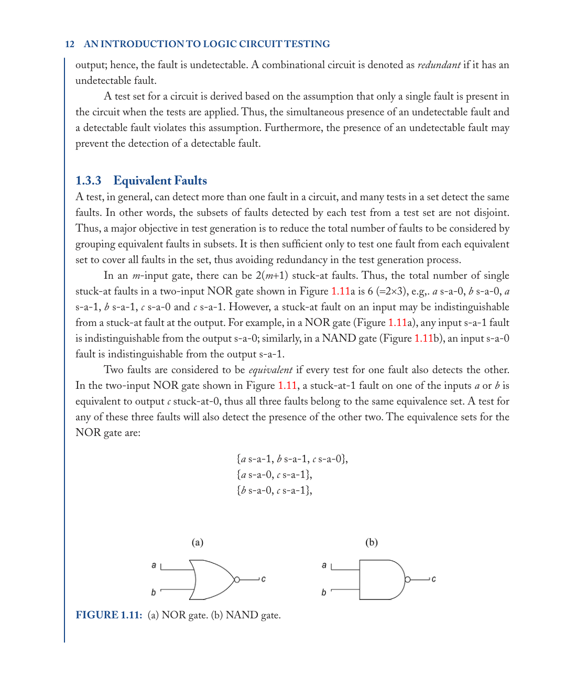

**Fig 1.10 (PK Lala):** α s-a-0 undetectable (cannot set α=1). β s-a-0 activatable but no path to output.

## 3. Equivalence, dominance & collapse

> **Rush reference:** memorise the master table + 6-step algorithm.  
> **When studying:** read the "why" under the table once — it prevents polarity mistakes on NAND/NOR.

### 3.1 Master gate table (memorise)

| Gate | Equivalence — merge these | Dominance — keep output, drop inputs |
|------|---------------------------|--------------------------------------|
| **AND** | A₀ ≡ B₀ ≡ Y₀ | Y₁ dominates A₁, B₁ |
| **NAND** | A₀ ≡ B₀ ≡ Y₁ | Y₀ dominates A₁, B₁ |
| **OR** | A₁ ≡ B₁ ≡ Y₁ | Y₀ dominates A₀, B₀ |
| **NOR** | A₁ ≡ B₁ ≡ Y₀ | Y₁ dominates A₀, B₀ |
| **NOT** | A₀ ≡ Y₁ | — |

(₀ = s-a-0, ₁ = s-a-1. **Drop dominated faults**, keep dominating.)

**Why NAND flips polarity:** NAND inverts AND output. AND equivalence groups s-a-0 faults; after inversion those become **Y s-a-1** equivalence with input s-a-0.

**Memory trick:**

| Type | Equivalence uses… | Dominating output |
|------|-------------------|-------------------|
| Non-inverting (AND, OR) | controlling value: AND→0, OR→1 | AND→Y₁, OR→Y₀ |
| Inverting (NAND, NOR) | same inputs, **output polarity flips** | NAND→Y₀, NOR→Y₁ |

**Per-gate shortcut:** 2(n+1) faults collapse to **n+1** for an n-input gate.

### 3.2 Six-step exam algorithm

| Step | Do this |
|------|---------|
| 1 | Label every fault site (PIs, gate outputs, fanout branches, PO). N sites → F_total = **2N** |
| 2 | Mark each gate type |
| 3 | **Equivalence** collapse per gate (master table) |
| 4 | **Dominance** collapse (master table) |
| 5 | Count remaining faults |
| 6 | **CR = remaining / F_total** |

### 3.3 Worked example — Module 1 end problem

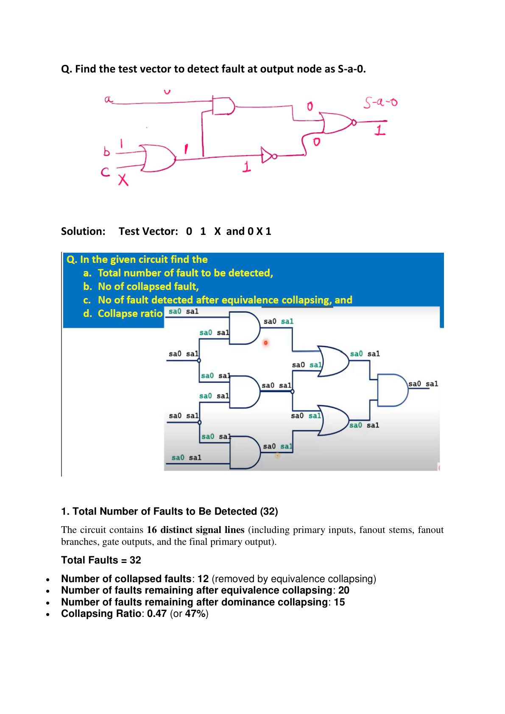

**Given (from Module 1 solution):**

| Stage | Count |
|-------|-------|
| Distinct fault sites | 16 lines |
| Total faults | **32** |
| After equivalence collapse | **20** (12 removed) |
| After dominance collapse | **15** (5 more removed) |
| **Collapse ratio** | **15/32 = 0.47** |

**How to present in exam:**

1. Draw/label all 16 fault sites (PIs + fanout stems + branches + gate outputs + PO).
2. At each gate, apply equivalence table → show "12 faults merged."
3. Apply dominance → show "5 more dropped."
4. State CR = 15/32.

### 3.4 Worked example — 2-input NAND gate alone

6 faults: A₀, A₁, B₀, B₁, Y₀, Y₁

**Equivalence:**
- {A₀, B₀, Y₁} → keep **A₀**
- {A₁, Y₀} → keep **A₁**
- {B₁, Y₀} → covered by A₁ rep for Y₀ side

**Dominance:** Y₀ dominates A₁, B₁ → drop input s-a-1 if Y₀ kept... Apply table: Y₀ dominates A₁, B₁.

**Remaining:** A₀, A₁, B₁ (or similar 3 representatives) → **CR = 3/6 = 0.5**

### 3.5 Worked example — Book1 Example 3.2 (Fig 3.4)

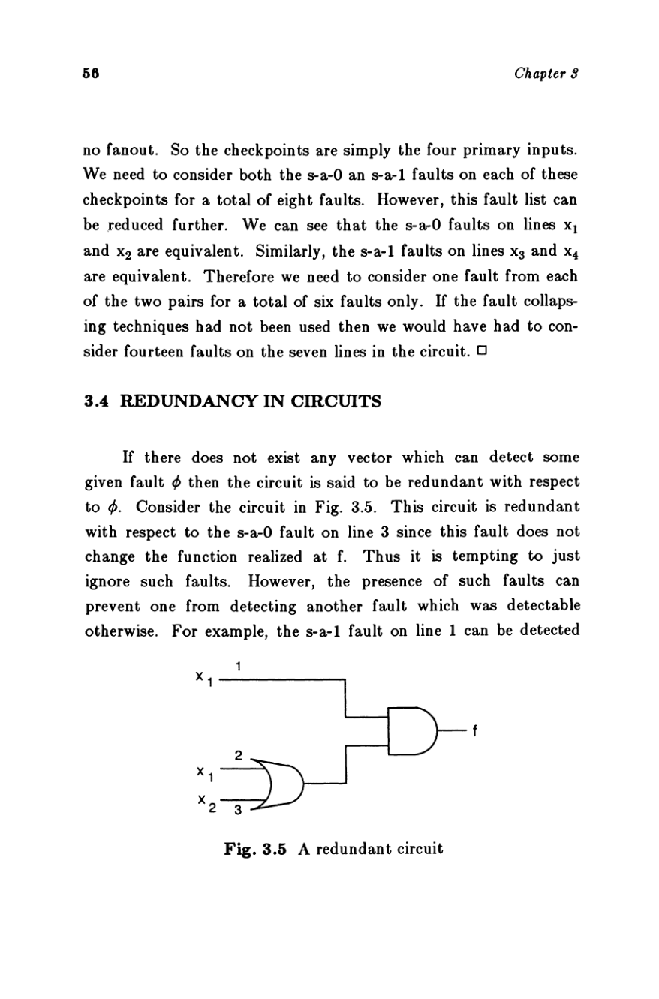

Circuit: X1, X2 → AND → OR ← X3, X4

| Item | Value |
|------|-------|
| Lines | 7 (X1, X2, X3, X4, AND out, OR out f, ...) |
| Total faults | **14** |
| X1 s-a-0 ≡ X2 s-a-0 | equivalent (both force AND low) |
| X3 s-a-1 ≡ X4 s-a-1 | equivalent (both force OR high) |
| After full collapse | **6 faults** |
| **CR** | **6/14 ≈ 0.43** |

**Book1 Problem 3.5 (checkpoints):** No fanout → checkpoints = 4 PIs. Start with 8 faults (4×2), collapse to 6 as above.

### 3.7 Module 1 — other end questions

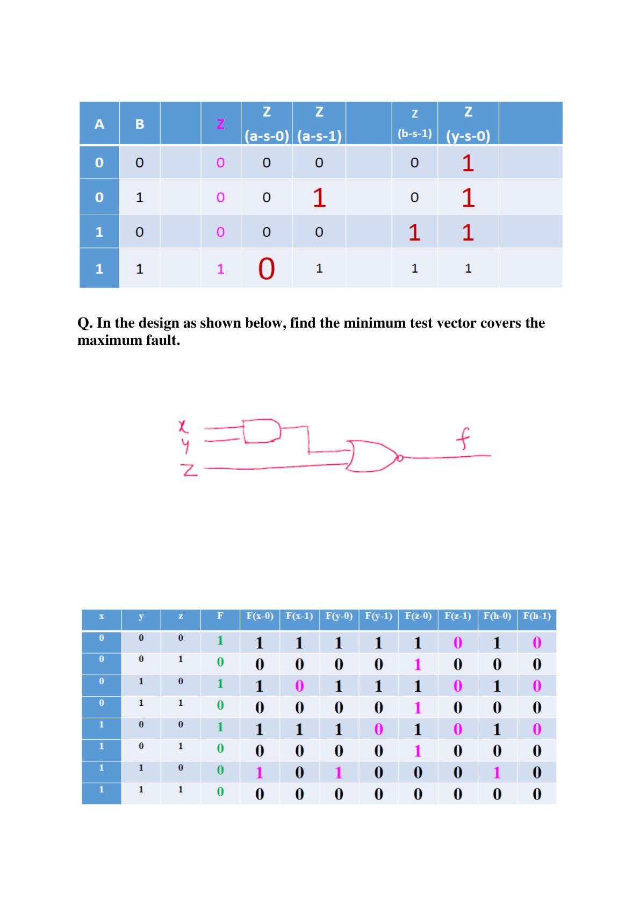

**Q: Output node S s-a-0 — test vectors:** **01X** and **0X1** (from Module 1 solution).


Build fault table / minimal test set from diagram in slide — same method as PK Lala Fig 2.2 fault matrix.

### 3.6 Fanout reminder

```
         ┌──→ branch A (separate fault site)
X (stem) ┤
         └──→ branch B (separate fault site)
```

Do **not** collapse stem fault with branch fault automatically.

---

## 4. Path sensitisation

### 4.1 Method (exam template)

Copy this structure for every problem:

```
Given:     Line X s-a-v
Activate:  Set X = NOT(v) in good circuit  (s-a-0 → need 1; s-a-1 → need 0)
Forward:   Pick path X → PO; set side inputs to NON-CONTROLLING values
Backward:  Assign PIs to satisfy forward requirements
Test:      Input vector (use X or d for don't-cares)
Verify:    Good Z vs Faulty Z — must differ
```

### 4.2 Worked — PK Lala Fig 2.3 (α s-a-1)

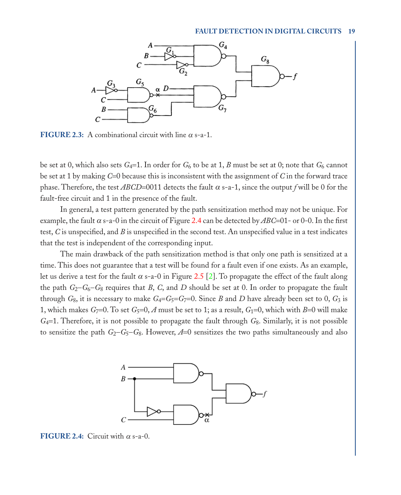

| Step | Detail |
|------|--------|
| Given | Line α s-a-1 |
| Activate | Need α = 0 in good circuit |
| Forward | Propagate α → G7 → G8 → f. Need G4 = 1 (else f forced 1). Need G6 = 1, D = 1, C = 1 |
| Backward | G3 = 1 → A = 0. G6 = 1 → B = 0 (not C = 0 — conflicts with C = 1) |
| **Test** | **ABCD = 0011** |
| Verify | Good f = 0, Faulty f = 1 → detected |

**Ref:** PK Lala §2.1.2, Fig 2.3

### 4.3 Worked — PK Lala Fig 2.4 (α s-a-0)

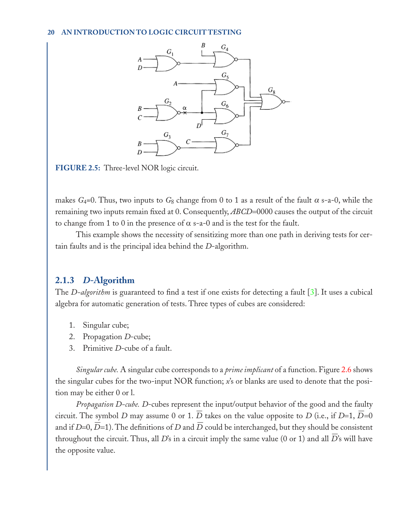

| Step | Detail |
|------|--------|
| Activate | α s-a-0 → need α = 1 |
| Result | **ABC = 01X** or **0X0** (don't-cares shown as X) |

### 4.4 Worked — PK Lala Fig 2.5 (multi-path — when single path fails)


**Fault: α s-a-0 on NOR circuit (Fig 2.5)**

| Attempt | Result |
|---------|--------|
| Path G2→G6→G8 | Need B=C=D=0; then G3=1 → G7=0; need G5=0 → A=1 → G1=0, B=0 → G4=**1** — blocks G8 |
| Path G2→G5→G8 | Similar contradiction |
| **Fix: A=0** | Sensitises two paths; G4=0; two inputs to G8 flip → **ABCD=0000** |

Good f = 1, Faulty f = 0 → **detected**.

**Lesson:** If one path blocks, try PIs so **multiple paths** carry the fault.

### 4.5 Worked — Book1 Fig 3.1 (X3 s-a-0)

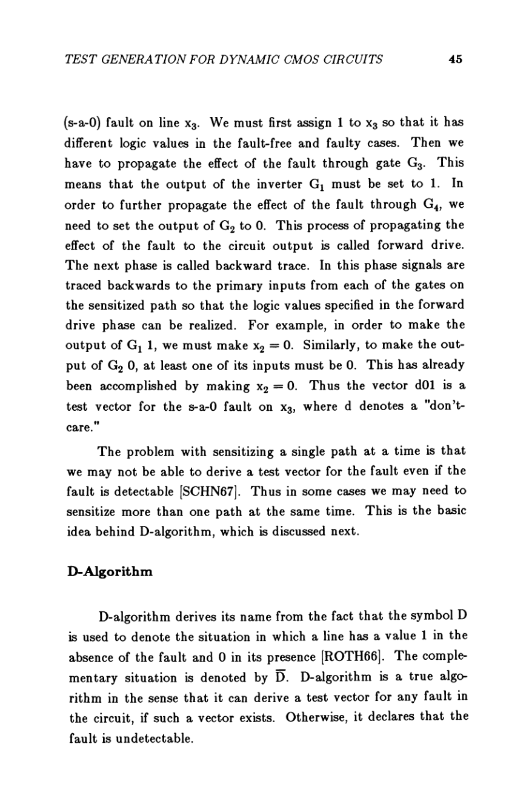

| Step | Detail |
|------|--------|
| Activate | X3 s-a-0 → assign X3 = 1 |
| Forward | Through G3: G1 output = 1. Through G4: G2 output = 0 |
| Backward | G1 = 1 → X2 = 0. G2 = 0 → already have X2 = 0 |
| **Test** | **X1 X2 X3 = d 0 1** (don't-care on X1) |
| Ref | Book1 §3.1 |

### 4.6 Worked — custom 4-input circuit

```
A ──┐     w1 ──┐
    AND      ├── AND ── w3 ──┐
B ──┘          │            OR ── Z
C ───── OR ─ w2┘            │
D ──────────────────────────┘
B ───── NOT ── w4 ──────────┘
```

**Fault: w3 s-a-0**

| Step | Detail |
|------|--------|
| Activate | w3 = 1 in good → w1=1, w2=1 → A=1,B=1, C or D = 1 |
| Propagate | Z = w3 + w4 → need w4 = 0 → B = 1 |
| Test | **A=1, B=1, C=1, D=X** e.g. **1100** |
| Verify | Good Z=1, Faulty Z=0 ✓ |

**Ref:** Practice pattern from session; no textbook figure.

### 4.7 Book1 Problem 3.1

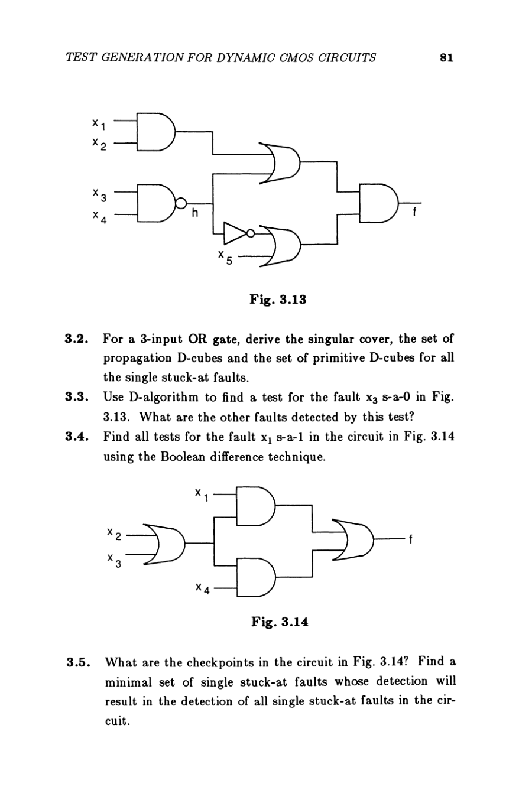

Find test for **h s-a-0** using path sensitisation — use the figure, apply §4.1 template. (Full circuit in PDF p.92.)

---

## 5. Boolean difference

> **Only in Book1** — PK Lala does not cover this.

### 5.1 Formulas

For output function f(X):

$$\frac{\partial f}{\partial x_i} = f|_{x_i=0} \oplus f|_{x_i=1}$$

| Fault on xi | Test condition |
|-------------|----------------|
| xi s-a-0 | xi = 1 **AND** ∂f/∂xi = 1 → **xi · ∂f/∂xi = 1** |
| xi s-a-1 | xi = 0 **AND** ∂f/∂xi = 1 → **xi' · ∂f/∂xi = 1** |

**Internal line h:** write f(h, …), compute ∂f/∂h, apply same pattern with h.

**Fallback:** Build truth table; mark rows where Z ⊕ Z_fault = 1.

### 5.2 Worked — Book1 Example 3.1 (Fig 3.3)

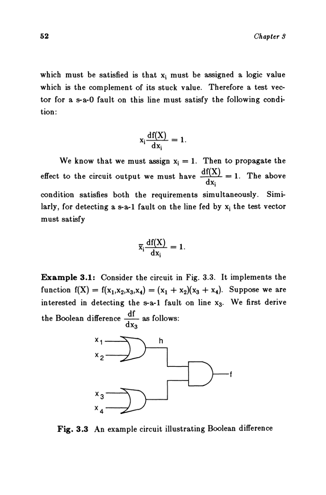

**f = (x1 + x2)(x3 + x4)**

**Fault: x3 s-a-1**

1. Compute boolean difference:
   - f|_{x3=0} = (x1+x2)(x4)
   - f|_{x3=1} = (x1+x2)(1) = x1+x2
   - ∂f/∂x3 = (x1+x2)(x4) ⊕ (x1+x2) = (x1+x2)(x4 ⊕ 1) = **x1 + x2**

2. Test condition for x3 s-a-1: x3' · ∂f/∂x3 = 1 → **x3 = 0** and **x1+x2 = 1**

3. x4 is free when x1+x2=1 → use **d** (don't care)

4. **Vectors: 1d00, d100** (Book1 notation: d = don't care)

**Fault: internal h s-a-0** (h is internal wire in Fig 3.3)

1. Rewrite f substituting h for the subcircuit it drives (see figure).
2. Compute ∂f/∂h; set h = 1 and ∂f/∂h = 1.

**Vectors: 1d1d, 1dd1, dd1d, d1d1**

**Ref:** Book1 §3.2, Example 3.1

### 5.3 Worked — f = (x1 + x2)(x3 + x4) step-by-step (duplicate for practice)

If stuck in exam, use **truth table fallback**:

| x1 | x2 | x3 | x4 | f | f (x3 stuck 1) | f⊕f_fault |
|----|----|----|----|---|----------------|-----------|
| 1 | d | 0 | 0 | 0 | 1 | 1 ✓ test |
| d | 1 | 0 | 0 | 0 | 1 | 1 ✓ test |

Matches **1d00, d100**.

### 5.3 Worked — Book1 Problem 3.4 (X1 s-a-1)

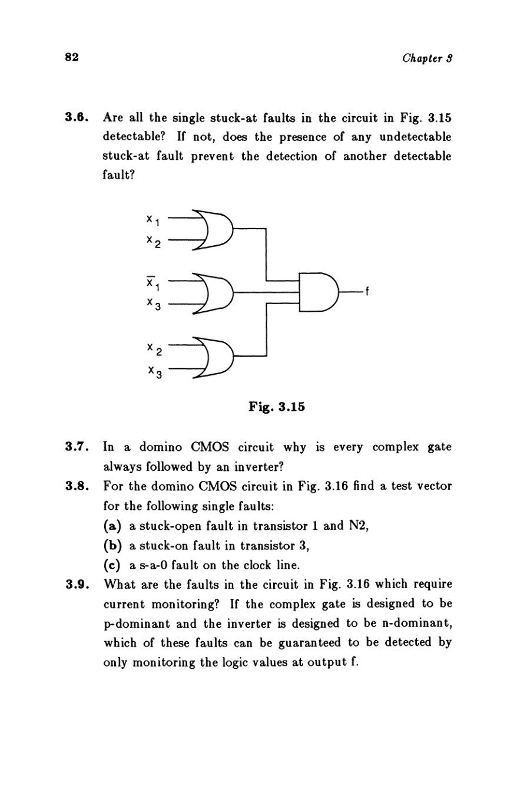

1. Derive f from circuit in Fig 3.14.
2. Compute ∂f/∂x1.
3. Apply x1' · ∂f/∂x1 = 1.
4. List all test vectors.

**Ref:** Book1 Problem 3.4, p.93

### 5.4 Quick practice — f = x1·x2 + x3

**x2 s-a-0:** ∂f/∂x2 = x1 ⊕ 0 = x1. Test: x2=1, x1=1 → **110** (if 3 inputs) or specify x3=X.

---

## 6. CMOS NAND / NOR / NOT

Two levels — know which question you're solving.

### 6.1 Level A — Gate-level stuck-at (most likely)

#### Test vectors — 2-input NAND

| Fault | Activate | Example test |
|-------|----------|--------------|
| A s-a-0 | A=1 | 11 |
| A s-a-1 | A=0 | **01** (PK Lala classic) |
| B s-a-0 | B=1 | 11 |
| B s-a-1 | B=0 | 10 |
| Y s-a-0 | Y=1 | 11 |
| Y s-a-1 | Y=0 | 01 or 10 |

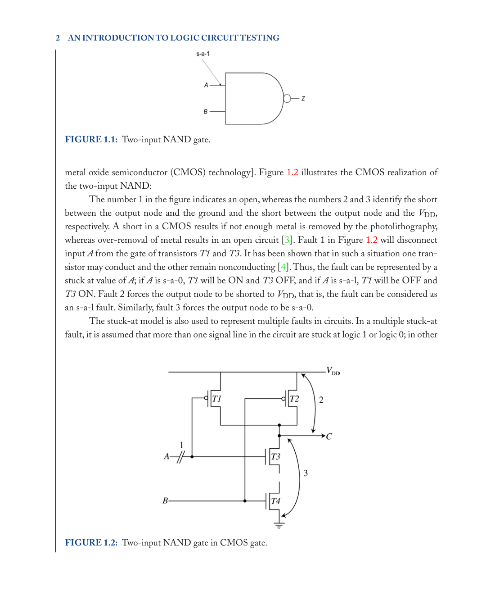

**PK Lala Fig 1.1:** A s-a-1 → good output 1, faulty 0 at AB=**01**.

#### Equivalence sets (same as §3.1)

**NAND:** {A₀,B₀,Y₁}, {A₁,Y₀}, {B₁,Y₀}

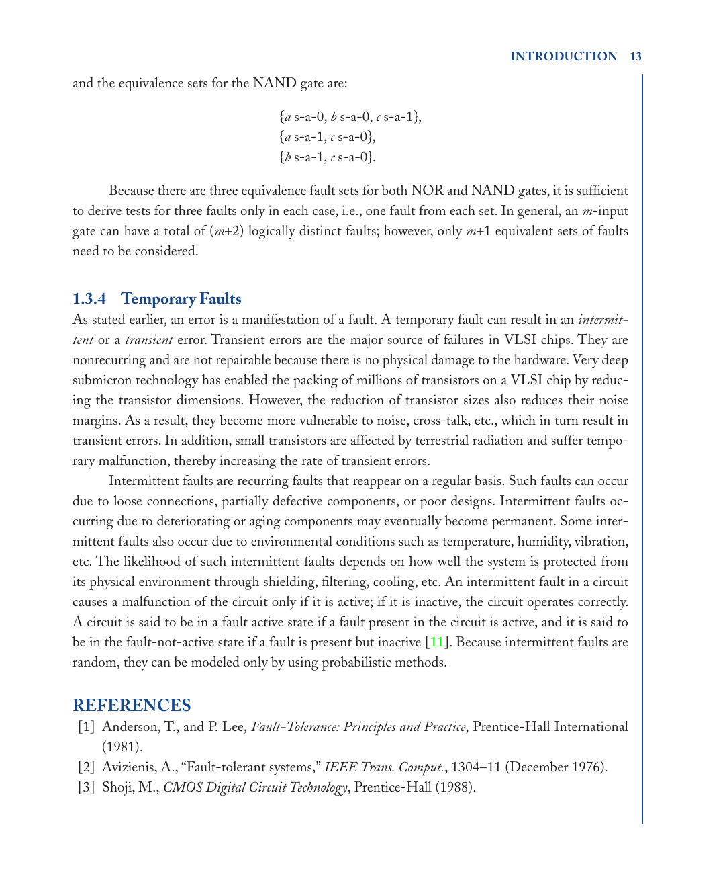

#### NOT / Inverter

- A₀ ≡ Y₁ — single test **A = 1** (Module 1)

### 6.2 Level B — Transistor-level CMOS

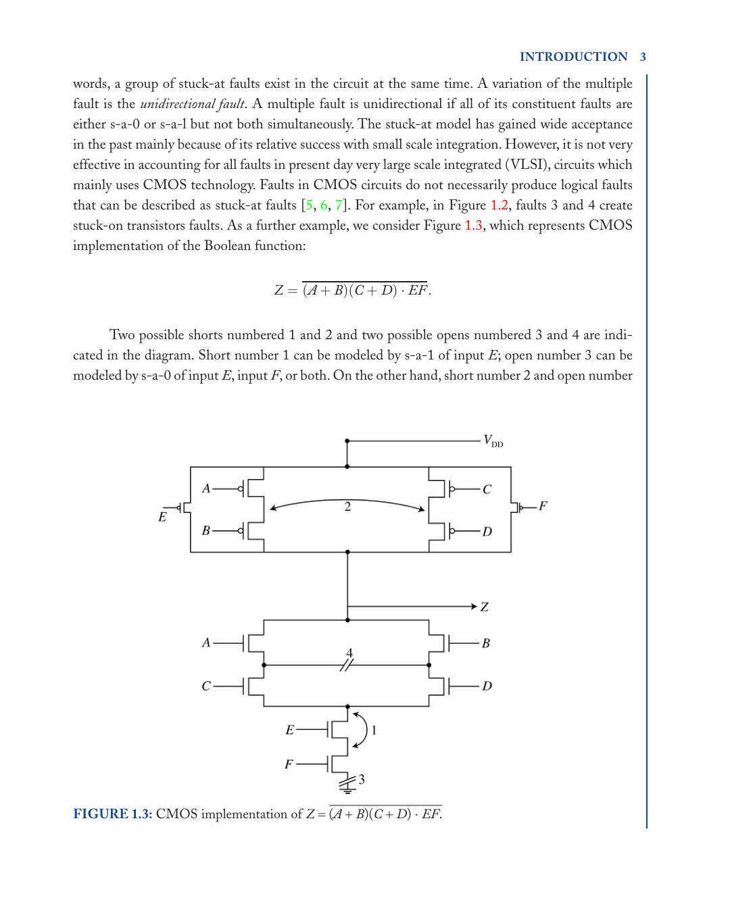

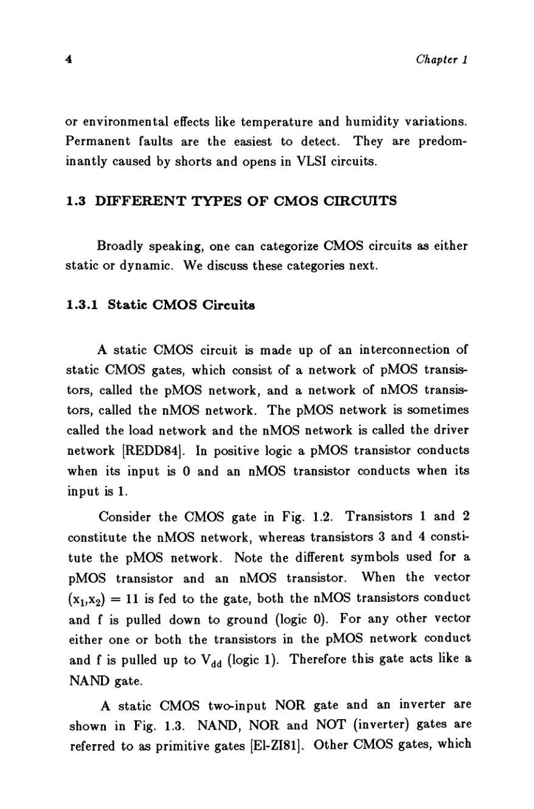

**NAND structure:** p-network **parallel** (pull-up), n-network **series** (pull-down).  
**NOR structure:** p-network **series**, n-network **parallel**.

| Physical defect | Logical model |
|-----------------|---------------|
| Short output to VDD | Y s-a-1 |
| Short output to GND | Y s-a-0 |
| Open on input line | Often A s-a-0 or s-a-1 |
| n-transistor stuck-open | Stuck-open (not plain stuck-at) |

### 6.3 Stuck-open on CMOS NOR (PK Lala Table 1.1)

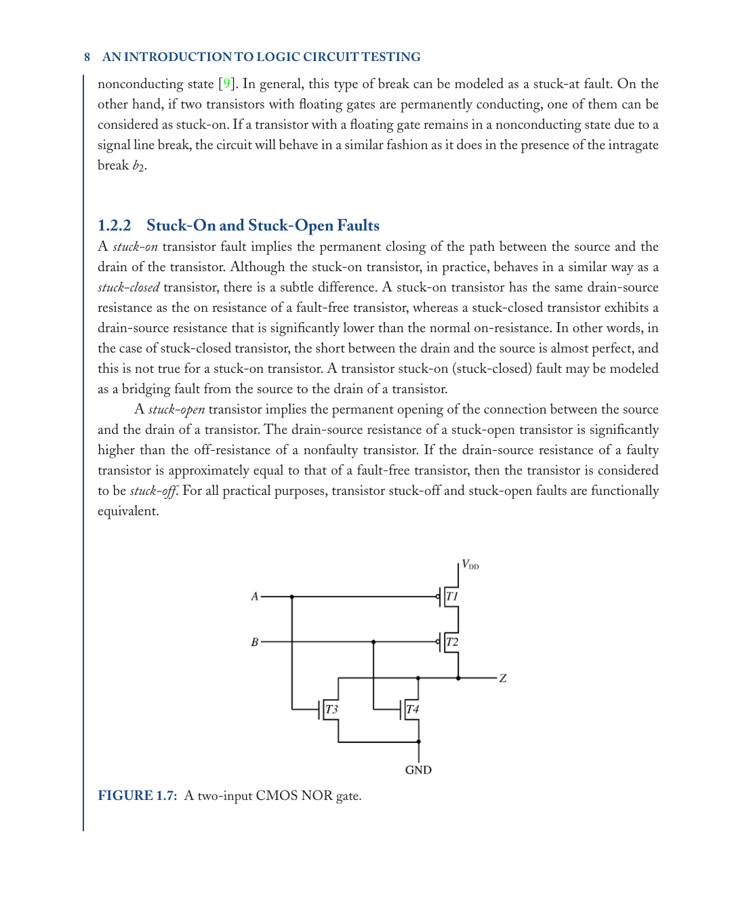

When output **floats**, it may **retain previous value** (Zt) — not the same as stuck-at.

| A | B | Good Z | A stuck-open |
|---|---|--------|--------------|
| 0 | 1 | 0 | 0 |
| 1 | 0 | 0 | **Zt** (keeps old value) |

**Exam:** Gate-level stuck-at is primary. If "open transistor" appears → mention two-pattern test (apply vector 1, then vector 2, check output changed).

### 6.4 Book1 Ch1 problems included

| Problem | Status | Notes |
|---------|--------|-------|
| **1.1** (a) X2 s-a-1 on CMOS NAND | **Study** | Gate-level: find vector where good ≠ faulty |
| **1.1** (b) stuck-open transistor 1 | **Study** | Two-pattern may be needed |
| **1.3** | **Study** | Short n1–n2; logic monitoring vs guaranteed detect |
| **1.4, 1.5** | **Study** | Gate-level model + fault coverage of 001 |
| 1.2, 1.6–1.8 | Skip | Bridging/current, domino, DCVS |
| **Ch 2 all** | Skip | Test invalidation — summary only below |

**Ch 2 one-liner:** Tests derived for CMOS can be *invalidated* by timing, charge sharing, or stuck-open sequential behaviour. Not on your expected topics list.

### 6.5 Book1 Problem 1.1 — CMOS NAND (outline solution)

**Setup:** Two-input static CMOS NAND (Fig 1.13 in Book1 — see PDF; structure in §6.2).

**(a) Stuck-at 1 on line fed by X2 (gate-level):**

| Step | Action |
|------|--------|
| Activate | X2 s-a-1 → need X2 = 0 in good circuit |
| Propagate | NAND: need other input = 1 → X1 = 1 |
| Test | **X1 X2 = 10** |
| Verify | Good Y = 0 (NAND 1,0), Faulty: X2 seen as 1 → NAND(1,1) = 0... check both inputs seen as 1 → Y = 0. Try **01**: Good Y=1, Faulty Y=0 ✓ |

Use gate-level NAND truth table for verification.

**(b) Stuck-open in transistor 1 (pull-down path):**

- Output may **float** — not plain stuck-at.
- Often needs **two-pattern test:** first vector establishes output state, second vector exposes wrong retained value.
- State in exam: "stuck-open → sequential behaviour; may require two-pattern test unlike SSA."

---

## 7. Textbook index

| Topic | PK Lala | Book1 | Module 1 |
|-------|---------|-------|----------|
| Theory / fault models | Ch 1 §1.1–1.3 | Ch 1 §1.2 | Full deck |
| Path sensitisation | §2.1.2, Fig 2.3–2.5 | §3.1, Fig 3.1, Prob 3.1 | — |
| Boolean difference | — | §3.2, Ex 3.1, Prob 3.4 | — |
| Collapse | §1.3.3, Fig 1.11 | §3.3, Ex 3.2, Prob 3.5 | pp.12–14, end Q |
| CMOS | §1.1–1.2, Table 1.1 | §1.3, Prob 1.1 | NOT example |
| Undetectable faults | Fig 1.10 | §3.4 | ATPG section |

**Figure files:** all in [`figures/`](figures/) beside this file — open in Obsidian with "assets" or relative paths.

---

## 8. Exam-day cheat sheet

### Which method?

```
Collapse / ratio question     → §3 master table + 6 steps
Path sensitisation question   → §4 template (activate → forward → backward)
Boolean difference question   → §5 formulas + XOR simplify
CMOS question                 → Gate-level table first; transistor map if schematic shown
Theory question               → §2.8 bank
```

### Common mistakes

| Mistake | Fix |
|---------|-----|
| Activate with same as stuck value | s-a-0 → need 1 in good circuit |
| Wrong non-controlling value | AND/NAND side inputs = 1; OR/NOR = 0 |
| NAND vs AND equivalence polarity | NAND: input s-a-0 ≡ **output s-a-1** |
| Dominance direction | Drop **dominated** (smaller T set), keep **dominating** |
| Fanout | Branches ≠ stem — separate fault sites |
| Collapse ratio | Module 1: **remaining / total**, not removed/total |

### 5-minute pre-exam skim

1. Master gate table (§3.1)
2. Activate rule: s-a-0 → 1, s-a-1 → 0
3. Non-controlling values table (§1.1)
4. Boolean difference: xi · ∂f/∂xi = 1 for s-a-0
5. NAND test A s-a-1 = **01**
6. Module 1 collapse: **15/32 = 0.47**

---

*Good luck. You've got the procedures — exam is applying the template, not inventing new theory.*
