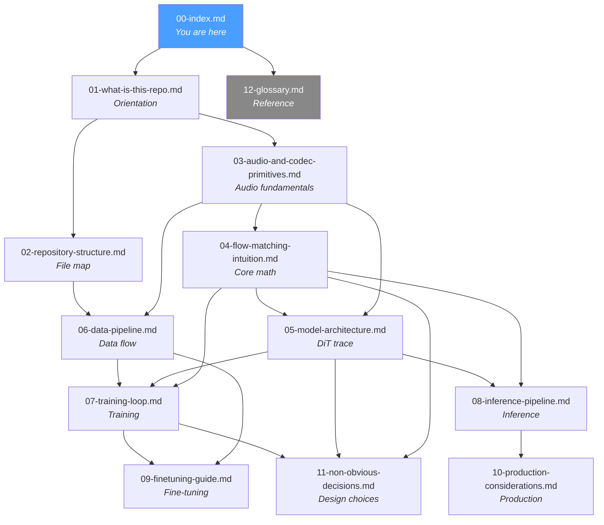

# F5-TTS Study Guide — Index

> [!tip] How to use this guide
> This study guide is designed to be read **with the F5-TTS repository open in another window**. Every claim is grounded in actual code — follow the file paths and line numbers as you read. The guide is written for someone who understands backpropagation and transformers, but has never worked with speech or audio ML.

## Reading Order and Dependency Graph

The files below build on each other. Follow the numbered order. You *can* jump ahead if a file says "no prerequisites beyond 01", but the intended path is sequential.



## File Summary Table

| # | File | What it covers | Time | Prerequisites |
|---|------|---------------|------|---------------|
| 00 | [[00-index]] | This file — reading order, dependency graph | 5 min | None |
| 01 | [[01-what-is-this-repo]] | What F5-TTS solves, how it differs from classical TTS, design philosophy | 30 min | None |
| 02 | [[02-repository-structure]] | Every file and folder — what it does, what imports it, what breaks | 45 min | 01 |
| 03 | [[03-audio-and-codec-primitives]] | Waveforms, sample rates, mel spectrograms, vocoders, codecs, RVQ | 60 min | 01 |
| 04 | [[04-flow-matching-intuition]] | Flow matching math, CFG, Sway Sampling, diffusion comparison | 60 min | 03 |
| 05 | [[05-model-architecture]] | DiT architecture, ConvNeXt V2 text encoder, forward pass with tensor shapes | 90 min | 03, 04 |
| 06 | [[06-data-pipeline]] | Data format, Emilia dataset, Dataset classes, dynamic batching | 60 min | 02, 03 |
| 07 | [[07-training-loop]] | `trainer.py` walkthrough, Accelerate, EMA, LR schedule, checkpoints | 60 min | 04, 05, 06 |
| 08 | [[08-inference-pipeline]] | CLI-to-audio walkthrough, ODE solver, voice cloning, streaming | 60 min | 04, 05 |
| 09 | [[09-finetuning-guide]] | Voice vs language fine-tuning, data requirements, Hinglish step-by-step | 45 min | 06, 07 |
| 10 | [[10-production-considerations]] | Quantization, batching, latency, ONNX, evals, monitoring | 45 min | 08 |
| 11 | [[11-non-obvious-decisions]] | 9 design choices explained for backend engineers | 30 min | 04, 05, 07 |
| 12 | [[12-glossary]] | Every domain-specific term, defined for backend engineers | Reference | None (use alongside any file) |

**Total estimated time: ~9 hours of focused study.**

> [!note] The glossary [[12-glossary]] is designed to be kept open as a reference tab while reading any other file. Jump to it whenever you encounter a term you don't recognize.

## How the Code References Work

Throughout this guide, code references look like this:

```
src/f5_tts/model/cfm.py:L279
```

This means: open the file at `src/f5_tts/model/cfm.py`, go to line 279. All line numbers are from the repository as of the version you cloned.

## What You Will Be Able to Do After

After working through this guide:

1. **Read and modify** any file in the F5-TTS codebase with confidence
2. **Fine-tune** the model on a custom voice or language dataset
3. **Deploy** the model behind a production API with proper batching, monitoring, and evals
4. **Debug** training runs by reading loss curves and identifying common failure modes
5. **Explain** to a colleague why the model uses flow matching instead of diffusion, why it operates on mel spectrograms instead of raw audio, and why the text is byte-tokenized
