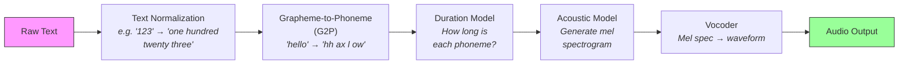
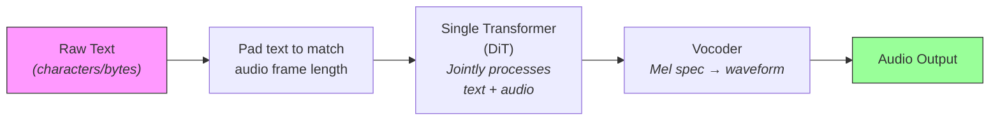

# What Is This Repo?

> [!note] Prerequisites
> None. This is your starting point.

## The Problem F5-TTS Solves

Text-to-Speech (TTS) is the task of turning written text into spoken audio that sounds like a real human. F5-TTS specifically solves **zero-shot voice cloning TTS**: you give it a short clip of someone speaking (3–12 seconds), plus the text you want spoken, and it generates new audio **in that person's voice** saying the new text — without ever having been explicitly trained on that person's voice.

Think of it like this: you hand the system a reference recording and say "speak like this person," and it does.

## How Classical TTS Pipelines Work (and why they're painful)

Before F5-TTS, the dominant approach to TTS was a pipeline of specialized stages. Here's what that looked like:

Each of these stages was a separate trained model or handcrafted system:

1. **Text Normalization**: Convert abbreviations, numbers, dates into spoken form
2. **Grapheme-to-Phoneme (G2P)**: Convert written characters into pronunciation symbols. This requires per-language rules or models — "read" can be /riːd/ or /rɛd/ depending on context
3. **Duration Model**: Predict how many milliseconds each phoneme should last. This is the **alignment problem** — you need to know exactly which audio frames correspond to which text characters
4. **Acoustic Model**: Generate a representation of the audio (usually a mel spectrogram — more on this in [[03-audio-and-codec-primitives]])
5. **Vocoder**: Convert the spectrogram into an actual playable waveform

> [!warning] The Alignment Problem
> The hardest part of classical TTS was step 3: **forced alignment**. The model needed to learn a monotonic mapping from text tokens to audio frames. If alignment broke (which happened often), the output would skip words, repeat words, or produce garbage audio. Systems like Tacotron 2 used attention mechanisms for alignment, which were notoriously fragile. FastSpeech introduced explicit duration prediction, but that required a separate alignment tool (like Montreal Forced Aligner) as a preprocessing step.

## How F5-TTS Sidesteps All of This

F5-TTS throws away most of the pipeline. Here's its approach:

What F5-TTS eliminates:
- ❌ **No G2P**: Text goes in as raw characters (or bytes). The model learns pronunciation implicitly.
- ❌ **No duration model**: The text is simply padded with filler tokens to the same length as the target mel spectrogram. The model decides internally which characters map to which audio frames.
- ❌ **No forced alignment**: Since text and audio are the same length (after padding), there's no alignment problem. The transformer's attention mechanism handles it implicitly.
- ❌ **No text encoder**: Instead of a separate text encoder model, F5-TTS uses a lightweight ConvNeXt V2 block stack to refine character embeddings. This is part of the main model, not a separate component.

> [!tip] Why this matters for you as a backend engineer
> Fewer components = fewer things to deploy, version, and debug. Classical TTS needed 3-5 models coordinated together. F5-TTS needs one model + one vocoder.

## The Three Things This Repo Can Do

1. **Inference (Generate speech)**: Give it reference audio + text → get back new speech in that voice. This is in `src/f5_tts/infer/`.

2. **Fine-tune**: Take the pretrained model and adapt it to a specific voice or language with a small dataset. This is in `src/f5_tts/train/finetune_cli.py`.

3. **Train from scratch**: Train a new model on a large dataset (100K+ hours). This is in `src/f5_tts/train/train.py`. You would only do this if you had massive compute resources.

## Why Flow Matching Instead of Autoregressive or Diffusion?

This deserves a full explanation (see [[04-flow-matching-intuition]]), but here's the executive summary:

| Approach | How it generates | TTS examples | Key problem |
|----------|-----------------|-------------|-------------|
| **Autoregressive** | Generate one audio frame at a time, left-to-right | VALL-E, Tortoise | Slow (sequential), accumulates errors |
| **Diffusion (DDPM)** | Start from noise, iteratively denoise over many steps | Grad-TTS | Needs many steps (~1000), complex math |
| **Flow Matching** | Learn a *straight-line path* from noise to data, walk along it | **F5-TTS**, Voicebox | Fewer steps (~32), simpler training, faster |

Flow matching is conceptually the simplest: you learn a velocity field that moves noise toward real audio along the most direct path possible. At inference time, you start with pure noise and follow the learned velocity field from time 0 to time 1. F5-TTS needs only **32 steps** (called NFE — Number of Function Evaluations) to produce high-quality audio, compared to hundreds or thousands for diffusion.

> [!note] The paper
> F5-TTS was published as [arXiv:2410.06885](https://arxiv.org/abs/2410.06885). The "F5" stands for "Fakes Fluent and Faithful" — it's a playful name. The repo also includes **E2-TTS**, a related model from a different paper that F5-TTS improves upon.

## What Assumptions the Codebase Makes About You

The code assumes you:
- Have **Python ≥ 3.10** and **PyTorch ≥ 2.0**
- Have a **CUDA GPU** for any reasonable inference speed (CPU works but is extremely slow)
- Have **FFmpeg** installed for audio processing
- Know how to use `pip` and (optionally) `conda`
- For training: have access to **multi-GPU** infrastructure with `accelerate` configured

The code does *not* assume you know anything about speech processing, phonetics, or signal processing. All the domain complexity is encapsulated inside the model.

## The Two Models in This Repo

The repo contains two model architectures:

| Model | Backbone | Architecture style | File |
|-------|----------|--------------------|------|
| **F5-TTS** | `DiT` | Diffusion Transformer with concatenated text+audio | `src/f5_tts/model/backbones/dit.py` |
| **E2-TTS** | `UNetT` | Flat U-Net Transformer with skip connections | `src/f5_tts/model/backbones/unett.py` |

F5-TTS (DiT) is the primary model — it trains faster, converges better, and produces higher quality output. E2-TTS (UNetT) is included because F5-TTS builds on the E2-TTS paper's idea, and the repo provides a reproduction.

There's also `MMDiT` (Multi-Modal DiT in `mmdit.py`), inspired by Stable Diffusion 3, which processes text and audio as separate streams with joint attention. It's not used in the default pretrained models.

## Next Steps

- To understand what every file and folder does: [[02-repository-structure]]
- To understand audio fundamentals (what is a mel spectrogram?): [[03-audio-and-codec-primitives]]
- To jump straight to the glossary: [[12-glossary]]
