# Repository Structure

> [!note] Prerequisites
> Read [[01-what-is-this-repo]] first for context on what F5-TTS does.

## Top-Level Layout

```
F5-TTS/
├── src/
│   ├── f5_tts/              # ← All the actual code lives here
│   └── third_party/
│       └── BigVGAN/          # ← Git submodule for the BigVGAN vocoder
├── data/                     # ← Preprocessed training data goes here
├── ckpts/                    # ← Model checkpoints go here
├── pyproject.toml            # ← Package definition, dependencies, CLI entry points
├── Dockerfile                # ← Docker build for inference
├── ruff.toml                 # ← Linter config
└── README.md
```

## The `src/f5_tts/` Package — Full Dependency Tree

This is where everything important lives. Here's the full structure with every file annotated:

```mermaid
graph TD
    subgraph "Model Core"
        INIT["model/__init__.py<br/><i>Exports: CFM, DiT,<br/>UNetT, MMDiT, Trainer</i>"]
        CFM["model/cfm.py<br/><i>Flow matching wrapper.<br/>Training loss + ODE sampling</i>"]
        MODULES["model/modules.py<br/><i>All neural net building blocks:<br/>MelSpec, Attention, DiTBlock,<br/>ConvNeXt, AdaLayerNorm, etc.</i>"]
        UTILS["model/utils.py<br/><i>Tokenizers, masking helpers,<br/>pinyin conversion, EPSS</i>"]
        DATASET["model/dataset.py<br/><i>Dataset classes, DynamicBatchSampler,<br/>collate_fn, load_dataset()</i>"]
        TRAINER["model/trainer.py<br/><i>Training loop with Accelerate,<br/>EMA, checkpoint management</i>"]
    end

    subgraph "Backbones"
        DIT["backbones/dit.py<br/><i>F5-TTS transformer<br/>(DiT architecture)</i>"]
        UNETT["backbones/unett.py<br/><i>E2-TTS transformer<br/>(Flat UNet)</i>"]
        MMDIT["backbones/mmdit.py<br/><i>MM-DiT (Stable Diffusion 3 style)<br/>Separate text/audio streams</i>"]
    end

    subgraph "Inference"
        INFER_UTILS["infer/utils_infer.py<br/><i>Core inference logic:<br/>load model, vocoder,<br/>infer_process(), chunk_text()</i>"]
        INFER_CLI["infer/infer_cli.py<br/><i>CLI entry point</i>"]
        INFER_GRADIO["infer/infer_gradio.py<br/><i>Gradio web UI</i>"]
        SPEECH_EDIT["infer/speech_edit.py<br/><i>Speech editing demo</i>"]
    end

    subgraph "Training"
        TRAIN["train/train.py<br/><i>Hydra-config training script</i>"]
        FINETUNE_CLI["train/finetune_cli.py<br/><i>Fine-tune CLI with argparse</i>"]
        FINETUNE_GRADIO["train/finetune_gradio.py<br/><i>Gradio UI for fine-tuning</i>"]
    end

    subgraph "Data Prep"
        PREP_EMILIA["train/datasets/prepare_emilia.py"]
        PREP_CSV["train/datasets/prepare_csv_wavs.py"]
        PREP_WENET["train/datasets/prepare_wenetspeech4tts.py"]
        PREP_LIBRI["train/datasets/prepare_libritts.py"]
        PREP_LJ["train/datasets/prepare_ljspeech.py"]
    end

    CFM --> MODULES
    CFM --> UTILS
    DIT --> MODULES
    UNETT --> MODULES
    MMDIT --> MODULES
    TRAINER --> CFM
    TRAINER --> DATASET
    INFER_UTILS --> CFM
    INFER_UTILS --> UTILS
    INFER_CLI --> INFER_UTILS
    INFER_GRADIO --> INFER_UTILS
    TRAIN --> CFM
    TRAIN --> DATASET
    TRAIN --> UTILS
    FINETUNE_CLI --> CFM
    FINETUNE_CLI --> DATASET
    PREP_EMILIA --> UTILS

    style CFM fill:#ff6b6b,color:#fff
    style MODULES fill:#ff6b6b,color:#fff
    style DIT fill:#ffa94d,color:#fff
    style TRAINER fill:#ff6b6b,color:#fff
    style INFER_UTILS fill:#51cf66,color:#fff
```



## File-by-File Breakdown

### Model Core (the files you must understand)

#### `model/cfm.py` — The Heart of Everything
**Lines:** 303 | **What it does:** Wraps any backbone transformer into a Conditional Flow Matching model.

Two critical methods:
- **`forward()` (L231-302)**: The training forward pass. Takes mel spectrogram + text, samples a random time step `t`, creates a noised interpolation `φ = (1-t)·noise + t·mel`, asks the transformer to predict the flow (velocity), and computes MSE loss against the true flow.
- **`sample()` (L83-229)**: The inference method. Starts from pure Gaussian noise, uses an ODE solver (`torchdiffeq.odeint`) to walk from t=0 to t=1 using the learned velocity field.

**What imports it:** `model/__init__.py`, `trainer.py`, `infer/utils_infer.py`, `train/train.py`, `train/finetune_cli.py`
**What breaks if deleted:** Everything. The entire training and inference pipeline.

```python
# cfm.py:L279 — The core of flow matching in one line
φ = (1 - t) * x0 + t * x1  # interpolate between noise (x0) and data (x1)
flow = x1 - x0              # the true velocity: just the direction from noise to data
```

#### `model/modules.py` — All the Neural Network Lego Bricks
**Lines:** 863 | **What it does:** Contains every neural network component used across all backbones.

Key classes:

| Class | Line | Purpose |
|-------|------|---------|
| `MelSpec` | L112 | Converts raw waveform to mel spectrogram (see [[03-audio-and-codec-primitives]]) |
| `SinusPositionEmbedding` | L157 | Sinusoidal position encoding for timestep |
| `ConvPositionEmbedding` | L175 | Convolutional position encoding (replaces standard positional encoding) |
| `ConvNeXtV2Block` | L252 | Facebook's ConvNeXt V2 — used to encode text in F5-TTS |
| `GRN` | L236 | Global Response Normalization (from ConvNeXt V2 paper) |
| `RMSNorm` | L286 | Root Mean Square normalization |
| `AdaLayerNorm` | L312 | Adaptive Layer Norm — how timestep conditions each transformer block |
| `FeedForward` | L353 | Standard MLP with GELU |
| `Attention` | L371 | Multi-head attention with optional joint processing |
| `AttnProcessor` | L451 | Attention computation (supports torch SDPA and flash_attn) |
| `JointAttnProcessor` | L563 | Joint attention for MM-DiT (text + audio attend together) |
| `DiTBlock` | L711 | One transformer block: AdaLN → Attention → FFN with gating |
| `MMDiTBlock` | L763 | One MM-DiT block: separate text/audio streams, joint attention |
| `TimestepEmbedding` | L852 | Converts scalar timestep → embedding vector via SinusPos + MLP |

**What imports it:** `cfm.py`, `dit.py`, `unett.py`, `mmdit.py`, `dataset.py`
**What breaks if deleted:** Everything.

#### `model/utils.py` — Tokenization and Helper Functions
**Lines:** 219 | **What it does:** Text tokenization, masking utilities, and the EPSS timestep schedule.

Key functions:
- **`list_str_to_tensor()` (L92)**: The UTF-8 byte tokenizer. Converts text strings to byte sequences (values 0-255). This is the "default" tokenizer — no vocabulary needed.
- **`list_str_to_idx()` (L99)**: Character-level tokenizer using a custom vocabulary file (used with pinyin tokenization).
- **`convert_char_to_pinyin()` (L148)**: Converts Chinese characters to pinyin (romanized pronunciation) using `rjieba` + `pypinyin`. This is why Chinese works — the model sees pinyin, not hanzi.
- **`get_tokenizer()` (L112)**: Factory function to load the right tokenizer.
- **`get_epss_timesteps()` (L205)**: Empirically Pruned Step Sampling — predefined non-uniform timestep schedules that outperform uniform spacing.

**What imports it:** `cfm.py`, `dataset.py`, `trainer.py`, `infer/utils_infer.py`
**What breaks if deleted:** All tokenization and text processing.

#### `model/dataset.py` — Data Loading and Batching
**Lines:** 335 | **What it does:** Dataset classes, the dynamic batch sampler, and collation.

Key classes:
- **`HFDataset` (L17)**: Wraps a HuggingFace `datasets.Dataset`. Used for datasets in HF format.
- **`CustomDataset` (L82)**: Loads from preprocessed Arrow files + duration JSON. The primary dataset class used for training.
- **`DynamicBatchSampler` (L170)**: Groups samples by audio length so that each batch has roughly the same total number of frames. This is critical — see [[11-non-obvious-decisions]].
- **`collate_fn()` (L313)**: Pads mel spectrograms to the same length within a batch and returns the batch dict.

**What imports it:** `trainer.py`, `train.py`, `finetune_cli.py`
**What breaks if deleted:** All training data loading.

#### `model/trainer.py` — The Training Loop
**Lines:** 443 | **What it does:** Manages the full training lifecycle using HuggingFace Accelerate.

Key responsibilities:
- Sets up `Accelerator` for multi-GPU distributed training (L57-68)
- Maintains an EMA (Exponential Moving Average) copy of the model on the main process (L107)
- Learning rate schedule: linear warmup → linear decay (L316-326)
- Checkpoint save/load with rotation (L150-263)
- The actual training loop with gradient accumulation (L363-438)

**What imports it:** `model/__init__.py`, `train/train.py`, `train/finetune_cli.py`
**What breaks if deleted:** All training. Inference still works.

---

### Backbone Architectures (the transformer part)

#### `backbones/dit.py` — F5-TTS's Transformer ⭐
**Lines:** 371 | **This is the model architecture used by the pretrained F5-TTS checkpoints.**

Key classes:
- **`TextEmbedding` (L33)**: Embeds character/byte tokens → vectors, then refines with ConvNeXt V2 blocks (the key innovation over E2-TTS).
- **`InputEmbedding` (L145)**: Concatenates noised audio + conditioning audio + text embedding → projects to model dimension.
- **`DiT` (L170)**: The main transformer. Stack of `DiTBlock`s with rotary position embeddings.

Architecture hyperparameters for `F5TTS_v1_Base`:
```yaml
dim: 1024          # model dimension
depth: 22          # number of transformer blocks
heads: 16          # attention heads 
ff_mult: 2         # feedforward expansion factor (inner_dim = 2048)
text_dim: 512      # text embedding dimension
conv_layers: 4     # ConvNeXt V2 blocks for text
```

**What imports it:** `model/__init__.py`
**What breaks if deleted:** F5-TTS inference and training (E2-TTS still works).

#### `backbones/unett.py` — E2-TTS's Flat U-Net Transformer
**Lines:** 308 | **E2-TTS reproduction.** Same idea as DiT but with U-Net style skip connections.

The key difference: the first half of transformer layers save their outputs, and the second half receive skip connections from the first half (concatenated and projected). This is the "Flat-UNet" from the E2-TTS paper.

**What imports it:** `model/__init__.py`
**What breaks if deleted:** E2-TTS inference and training. F5-TTS still works.

#### `backbones/mmdit.py` — Multi-Modal DiT
**Lines:** 263 | **Experimental.** Text and audio are processed as separate embedding streams, then interact via joint attention (like SD3's MMDiT). Not used in default pretrained models.

**What imports it:** `model/__init__.py`
**What breaks if deleted:** Nothing in the default setup.

---

### Inference (files a production engineer cares about most)

#### `infer/utils_infer.py` — Core Inference Logic
**Lines:** 620 | **The most important file for production deployment.**

Key functions:
- **`load_vocoder()` (L106)**: Loads Vocos or BigVGAN vocoder from HuggingFace or local path.
- **`load_model()` (L238)**: Loads a model checkpoint (constructs CFM + loads weights).
- **`preprocess_ref_audio_text()` (L298)**: Preprocesses reference audio — clips to ≤12s, removes silence edges, optionally transcribes with Whisper.
- **`infer_process()` (L384)**: High-level inference: chunk text → call `infer_batch_process()`.
- **`infer_batch_process()` (L440)**: The actual inference loop — runs the ODE solver, then the vocoder, with cross-fade stitching for long outputs.
- **`chunk_text()` (L73)**: Splits long text into sentence-sized chunks for sequential generation.

Key global constants (L52-65):
```python
target_sample_rate = 24000    # hertz
n_mel_channels = 100          # frequency bins
hop_length = 256              # samples per frame
nfe_step = 32                 # ODE solver steps
cfg_strength = 2.0            # classifier-free guidance weight
sway_sampling_coef = -1.0     # Sway Sampling coefficient
```

#### `infer/infer_cli.py` — Command Line Interface
**Lines:** 389 | Parses CLI args and TOML config, loads model + vocoder, runs inference.

#### `infer/infer_gradio.py` — Gradio Web Interface
**Lines:** ~1700 | Full Gradio app with TTS, multi-speaker, and voice chat tabs.

#### `api.py` — Python API
**Lines:** 165 | Clean Python API wrapper class `F5TTS` for programmatic use.

---

### Training

#### `train/train.py` — From-Scratch Training Script
**Lines:** 82 | Uses Hydra to load YAML config, then constructs model → trainer → dataset → calls `trainer.train()`.

#### `train/finetune_cli.py` — Fine-tuning CLI
**Lines:** 215 | Argparse-based fine-tuning script. Downloads pretrained checkpoint, copies it as `pretrained_*`, then resumes training.

#### `train/finetune_gradio.py` — Fine-tuning Gradio UI
**Lines:** ~2300 | Full Gradio app for fine-tuning with dataset preparation built in.

---

### Configuration Files

```
configs/
├── F5TTS_v1_Base.yaml    # ← Current best model (what you should use)
├── F5TTS_v1_Small.yaml   # ← Smaller variant
├── F5TTS_Base.yaml       # ← Original F5-TTS (v0)
├── F5TTS_Small.yaml      # ← Original small variant
├── E2TTS_Base.yaml       # ← E2-TTS reproduction
└── E2TTS_Small.yaml      # ← E2-TTS small variant
```

Each YAML defines: model architecture, dataset settings, optimizer hyperparameters, checkpoint strategy, and logging.

---

### Data Preparation Scripts

| Script | Dataset | Size |
|--------|---------|------|
| `prepare_emilia.py` | Emilia (ZH+EN in-the-wild speech) | ~95K hours |
| `prepare_wenetspeech4tts.py` | WenetSpeech4TTS (ZH) | Large |
| `prepare_libritts.py` | LibriTTS (EN audiobook) | ~585 hours |
| `prepare_ljspeech.py` | LJSpeech (EN single speaker) | ~24 hours |
| `prepare_csv_wavs.py` | Any custom CSV dataset | Variable |

---

## Which Files You Need to Modify vs. Treat as Black Box

### 🔧 Must-modify for production
- `infer/utils_infer.py` — You'll wrap the inference logic in your API
- `api.py` — Or use this directly as your Python API
- Config `.yaml` files — To adjust model/inference parameters

### 🔧 Must-modify for fine-tuning
- `train/finetune_cli.py` — Adjust training hyperparameters
- `train/datasets/prepare_csv_wavs.py` — Prepare your custom dataset
- Data `vocab.txt` — If adding a new language with pinyin tokenizer

### 📦 Treat as black box
- `model/modules.py` — Neural net building blocks (don't touch unless doing architecture research)
- `model/cfm.py` — Flow matching logic (extremely well-tested, unlikely to need changes)
- `model/backbones/*.py` — Transformer architectures (pretrained weights depend on exact architecture)

> [!warning] Changing anything in the backbone files
> If you change layer dimensions, add/remove layers, or modify the forward pass in `dit.py`, `unett.py`, or `mmdit.py`, all pretrained checkpoints become incompatible. These files define the exact computational graph that the saved weights correspond to.

## Next Steps

- Understand the audio fundamentals this model operates on: [[03-audio-and-codec-primitives]]
- Understand the core math: [[04-flow-matching-intuition]]
- Trace the model forward pass: [[05-model-architecture]]
