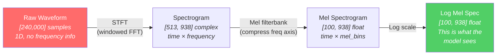
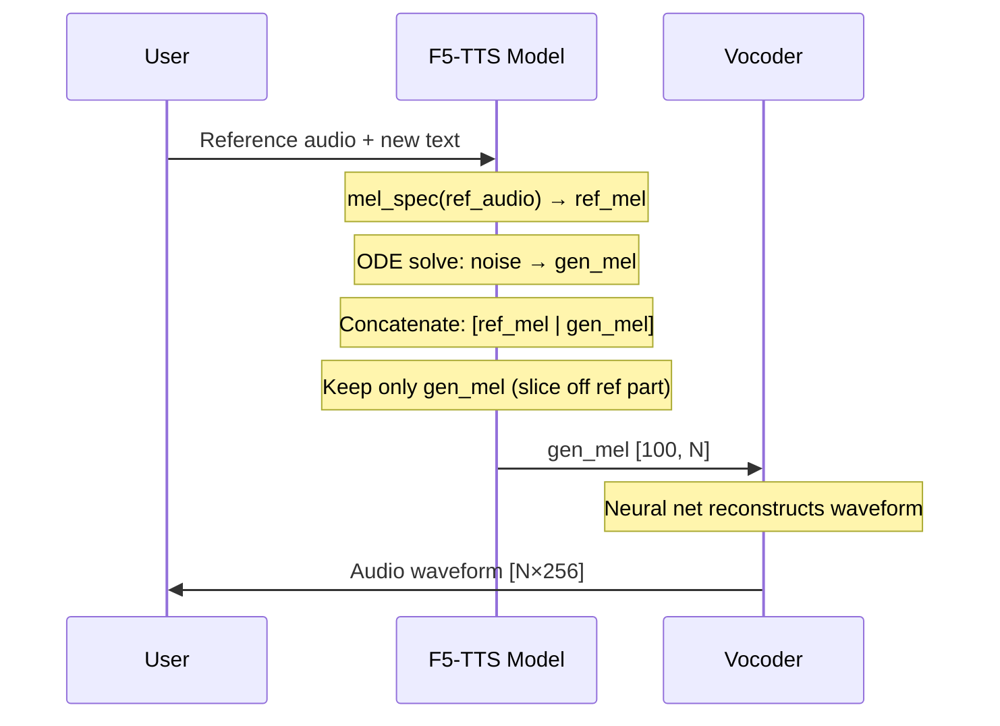
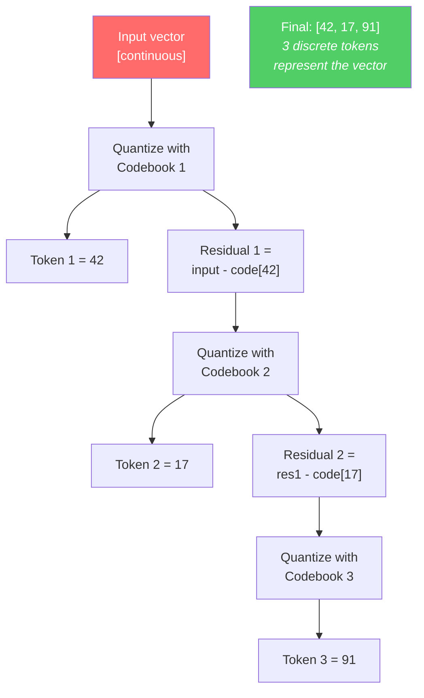
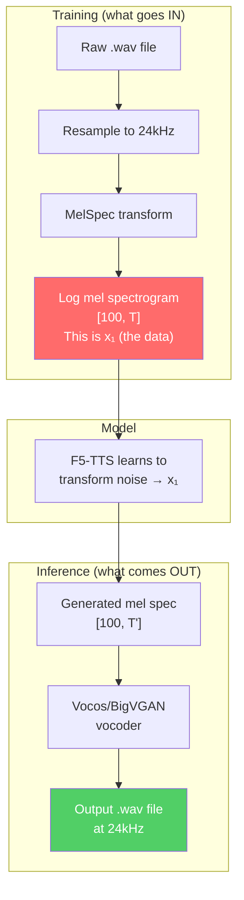

# Audio and Codec Primitives

> [!note] Prerequisites
> Read [[01-what-is-this-repo]] for context. This is the most foreign domain chapter for a backend engineer. Take your time.

This chapter covers the audio concepts you need to understand before touching any F5-TTS code. None of this is ML — it's signal processing fundamentals that the ML is built on top of.

## What Is a Waveform?

Audio is a pressure wave traveling through air. When a microphone records sound, it measures this pressure at regular intervals and stores each measurement as a number. This sequence of numbers is a **waveform** — it's a 1D array of floats.

```
waveform = [0.01, 0.03, 0.05, 0.04, 0.02, -0.01, -0.04, ...]
```

Each number is called a **sample**. The range is typically `[-1.0, 1.0]`.

## What Is Sample Rate and Why 24kHz?

The **sample rate** is how many samples per second the microphone records. Common values:

| Sample Rate | Use Case | Quality |
|-------------|----------|---------|
| 8,000 Hz | Phone calls | Barely intelligible |
| 16,000 Hz | Voice assistants | Decent speech |
| **24,000 Hz** | **F5-TTS uses this** | **Good speech quality** |
| 44,100 Hz | CD audio, music | High quality |
| 48,000 Hz | Professional audio/video | Studio quality |

**Why 24kHz for F5-TTS?** By the Nyquist theorem, a 24kHz sample rate can represent frequencies up to 12kHz. Human speech is mostly below 8kHz, so 24kHz captures it well. Going higher (like 44.1kHz) would double the data size and compute cost for marginal quality improvement in speech.

You can see this constant defined in several places:
```python
# src/f5_tts/infer/utils_infer.py:L52
target_sample_rate = 24000
```

**What this means for tensor shapes**: A 10-second audio clip at 24kHz is a tensor of shape `[240000]` (or `[1, 240000]` with a channel dimension). That's a lot of numbers for the model to process directly.

## What Is a Mel Spectrogram (and Why Models Don't Work on Raw Audio)

A raw waveform is a terrible input for a neural network because:
1. It's **extremely long** — 10s of audio = 240,000 numbers at 24kHz
2. It has **no frequency structure** — the network would have to learn the Fourier transform from scratch
3. Adjacent samples are **highly correlated** — there's massive redundancy

Instead, we transform the waveform into a **mel spectrogram** — a 2D representation where:
- **X-axis** = time (but in longer "frames" instead of individual samples)
- **Y-axis** = frequency (but in "mel-spaced" frequency bands that match human hearing)
- **Value** = how loud each frequency band is at that moment in time



### Step 1: Short-Time Fourier Transform (STFT)

The waveform is split into overlapping "windows" (short chunks), and for each window, we compute the Fourier transform to get the frequency content. Key parameters:

```python
# src/f5_tts/infer/utils_infer.py:L53-56
n_mel_channels = 100   # number of mel frequency bins
hop_length = 256       # samples between adjacent windows
win_length = 1024      # samples per window
n_fft = 1024           # FFT size
```

- **`hop_length = 256`**: We slide the window 256 samples forward each step. At 24kHz, each hop = 256/24000 ≈ 10.67ms. So a 10s clip becomes 10 × 24000/256 ≈ **938 frames**. This is a **93.75× compression** from the raw waveform.
- **`win_length = 1024`**: Each window is 1024 samples (≈42.7ms). Windows overlap because hop < win.
- **`n_fft = 1024`**: Produces 513 frequency bins (n_fft/2 + 1).

### Step 2: Mel Filterbank

Humans perceive pitch on a roughly logarithmic scale — the difference between 100Hz and 200Hz sounds much bigger than 5000Hz and 5100Hz. The **mel scale** maps frequencies to match this perception, and a **mel filterbank** is a set of triangular filters that compress the 513 frequency bins down to just **100 mel bins**.

The mel filterbank formula:

$$M(f) = 2595 \cdot \log_{10}\left(1 + \frac{f}{700}\right)$$

This converts frequency $f$ in Hz to the mel scale $M(f)$. The inverse:

$$f = 700 \cdot \left(10^{M/2595} - 1\right)$$

The mel spectrogram is computed by multiplying the power spectrum by the mel filterbank matrix:

$$\text{mel\_spec} = W_{\text{mel}} \cdot |STFT(x)|$$

where $W_{\text{mel}}$ is a `[100, 513]` matrix of triangular filter weights.

### Step 3: Log Compression

Finally, we take the log of the mel spectrogram. This is because loudness perception is also logarithmic — the difference between 1 and 10 watts sounds similar to 10 and 100 watts.

$$\text{log\_mel} = \log(\max(\text{mel\_spec}, \epsilon))$$

where $\epsilon$ is a small constant (like $10^{-5}$) to avoid $\log(0)$.

### Where This Happens in Code

The mel spectrogram extraction has two backends in `src/f5_tts/model/modules.py`:

**Vocos backend** (default, L80-109):
```python
# modules.py:L107-108
mel = vocos_mel_stft_cache[key](waveform)  # torchaudio.transforms.MelSpectrogram
mel = mel.clamp(min=1e-5).log()
```

**BigVGAN backend** (L35-77):
```python
# modules.py:L74-75
mel_spec = torch.matmul(mel_basis, spec)    # mel filterbank multiplication
mel_spec = torch.log(torch.clamp(mel_spec, min=1e-5))
```

Both are wrapped in the `MelSpec` class (L112-151), which the rest of the codebase uses.

> [!tip] Key takeaway for tensor shapes
> A 10-second audio clip at 24kHz becomes a mel spectrogram of shape `[100, 938]`. In this codebase, it's typically transposed to `[938, 100]` (time-first) before being fed to the transformer. So the "sequence length" dimension for the transformer is **time steps** (frames), and the "feature dimension" is **mel channels** (100).

## What Is a Vocoder?

The mel spectrogram is a **lossy** representation — you can go from waveform → mel spec easily (it's just matrix math), but you **cannot perfectly go back**. The mel filterbank throws away phase information and compresses frequencies.

A **vocoder** is a neural network trained to reconstruct a plausible waveform from a mel spectrogram. It's an "inverse" mel spec → waveform converter, but it *generates* the missing information (phase, fine frequency detail) rather than truly inverting the transform.


F5-TTS supports two vocoders:

| Vocoder | Type | Quality | Speed | Used by default? |
|---------|------|---------|-------|-----------------|
| **Vocos** | Fourier-based | Good | Fast | ✅ Yes |
| **BigVGAN** | GAN-based | Slightly better | Slower | No (optional) |

The vocoder is loaded in `src/f5_tts/infer/utils_infer.py:L106-145`:
```python
# For Vocos:
vocoder = Vocos.from_hparams(config_path)
vocoder.load_state_dict(state_dict)

# For BigVGAN:
vocoder = bigvgan.BigVGAN.from_pretrained("nvidia/bigvgan_v2_24khz_100band_256x")
```

> [!warning] The vocoder is NOT part of F5-TTS
> F5-TTS generates mel spectrograms. The vocoder is a separate, frozen, pretrained model that converts those spectrograms to audio. During F5-TTS training, only the transformer is trained — the vocoder is never touched. During inference, both models run in sequence.

### How Audio Reconstruction Works in Inference



This happens in `src/f5_tts/infer/utils_infer.py:L507-513`:
```python
generated = generated[:, ref_audio_len:, :]   # slice off reference portion
generated = generated.permute(0, 2, 1)         # [B, T, 100] → [B, 100, T]
if mel_spec_type == "vocos":
    generated_wave = vocoder.decode(generated)  # mel → waveform
elif mel_spec_type == "bigvgan":
    generated_wave = vocoder(generated)
```

## What Are Neural Audio Codecs? (EnCodec, DAC, Mimi)

> [!note] F5-TTS does NOT use audio codecs — but you'll encounter them in TTS literature, so you should understand what they are and why F5-TTS chose differently.

A **neural audio codec** is a neural network that compresses audio into a sequence of discrete tokens (integers), similar to how a tokenizer compresses text. The most well-known ones:

| Codec | Creator | Approach |
|-------|---------|----------|
| **EnCodec** | Meta | Encode audio → discrete tokens at various bitrates |
| **DAC** | Descript | Similar to EnCodec, improved quality |
| **Mimi** | Kyutai | Used in Moshi for real-time conversation |

These codecs use **Residual Vector Quantization (RVQ)** — explained below.

### What Is RVQ (Residual Vector Quantization)?

Imagine you want to compress a continuous vector (like an audio frame's embedding) into a sequence of discrete tokens. One approach:

1. Maintain a **codebook** of prototype vectors (like k-means centroids)
2. Find the nearest codebook entry to your input → that's your first token
3. Compute the **residual** (error between input and codebook entry)
4. Find the nearest codebook entry to the residual → that's your second token
5. Compute the residual of the residual → repeat



Each additional "layer" of quantization captures finer detail. Models like VALL-E use these discrete tokens as their audio representation — they generate audio by predicting codec token sequences, similar to how LLMs predict text token sequences.

### Why F5-TTS Uses Mel Spectrograms Instead of Codec Tokens

| Aspect | Mel Spectrogram (F5-TTS) | Discrete Codec Tokens (VALL-E, etc.) |
|--------|-------------------------|--------------------------------------|
| **Representation** | Continuous floats | Discrete integers |
| **Quantization error** | None (no quantization) | Present (lossy compression) |
| **Generates with** | Flow matching (continuous) | Autoregressive (token-by-token) |
| **Vocoder needed?** | Yes (mel → waveform) | Codec decoder (tokens → waveform) |
| **Quality ceiling** | Higher (no quantization bottleneck) | Lower (limited by codebook size) |
| **Training** | Simpler (MSE loss on continuous values) | Complex (multi-codebook prediction) |

> [!tip] The practical bottom line
> F5-TTS uses mel spectrograms because they're continuous, which plays nicely with flow matching (a continuous generative process). Codec-based models discretize audio first, then use autoregressive generation (like language models), which is slower and introduces quantization artifacts. F5-TTS avoids both problems.

## Summary: The Audio Pipeline in F5-TTS



## Next Steps

- Now that you understand mel spectrograms, learn how the model transforms noise into them: [[04-flow-matching-intuition]]
- Or see how the code converts raw audio to mel specs for training: [[06-data-pipeline]]
- Reference any term: [[12-glossary]]
