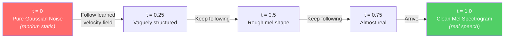
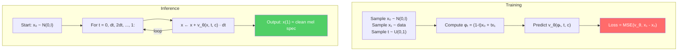

# Flow Matching Intuition

> [!note] Prerequisites
> Read [[03-audio-and-codec-primitives]] first — you need to know what a mel spectrogram is. You should also be comfortable with the idea that neural networks can be trained to approximate functions via gradient descent.

This is the mathematical core of F5-TTS. We'll build intuition from scratch, then connect every formula to actual code.

## The Generative Modeling Problem in TTS

Here's what we want: given text and a reference voice, generate a mel spectrogram that (a) says the right words and (b) sounds like the reference speaker.

In ML terms, we want to learn the **conditional distribution** $p(\mathbf{x} \mid \text{text}, \text{ref\_audio})$, where $\mathbf{x}$ is a mel spectrogram. We need to be able to **sample** from this distribution — i.e., generate new mel spectrograms that could plausibly come from it.

The problem: we have training examples (pairs of text + audio), but we don't know the formula for this distribution. We only have samples from it.

## Flow Matching: The Core Idea

Imagine you have two piles of sand:
- **Pile A**: Random noise (Gaussian distributed)
- **Pile B**: Real mel spectrograms (from your training data)

Flow matching learns a **vector field** — think of it as a set of arrows at every point in space — that tells each grain of sand in Pile A which direction to move to end up in Pile B. If you follow these arrows from time $t=0$ (noise) to time $t=1$ (data), you transform noise into a realistic mel spectrogram.



Formally, we define a time-dependent path $\phi_t(\mathbf{x})$ that **interpolates** between noise $\mathbf{x}_0$ and data $\mathbf{x}_1$:

$$\phi_t(\mathbf{x}) = (1 - t) \cdot \mathbf{x}_0 + t \cdot \mathbf{x}_1$$

This is a straight line from noise to data. At $t=0$, you're at pure noise. At $t=1$, you're at the real data.

This is exactly what the code does in `src/f5_tts/model/cfm.py:L278-280`:
```python
t = time.unsqueeze(-1).unsqueeze(-1)  # shape: [batch, 1, 1]
φ = (1 - t) * x0 + t * x1            # interpolation
flow = x1 - x0                        # the true velocity
```

> [!tip] Why "flow matching" and not something else?
> The name comes from the fact that we're matching (learning) a flow (a continuous transformation). Unlike diffusion models that add noise gradually and learn to reverse the process, flow matching directly learns the transport map from noise to data. The path is a straight line — the simplest possible path.

## The Conditional Flow Matching Loss

Here's the training objective. It's beautifully simple:

$$\mathcal{L}_{\text{CFM}} = \mathbb{E}_{t \sim U(0,1), \, \mathbf{x}_0 \sim \mathcal{N}(0,I), \, \mathbf{x}_1 \sim p_{\text{data}}} \left[ \left\| v_\theta(\phi_t, t, c) - (\mathbf{x}_1 - \mathbf{x}_0) \right\|^2 \right]$$

Let's unpack every term:

| Symbol | What it is | Code reference |
|--------|-----------|----------------|
| $t \sim U(0,1)$ | Random timestep, uniformly sampled from 0 to 1 | `cfm.py:L274`: `time = torch.rand((batch,), ...)` |
| $\mathbf{x}_0 \sim \mathcal{N}(0,I)$ | Pure Gaussian noise | `cfm.py:L271`: `x0 = torch.randn_like(x1)` |
| $\mathbf{x}_1 \sim p_{\text{data}}$ | A real mel spectrogram from the dataset | `cfm.py:L268`: `x1 = inp` |
| $\phi_t = (1-t)\mathbf{x}_0 + t\mathbf{x}_1$ | The noised interpolation at time $t$ | `cfm.py:L279`: `φ = (1 - t) * x0 + t * x1` |
| $v_\theta(\phi_t, t, c)$ | The model's predicted velocity at this point | `cfm.py:L294-296`: `pred = self.transformer(x=φ, ...)` |
| $\mathbf{x}_1 - \mathbf{x}_0$ | The true velocity (just the direction from noise to data) | `cfm.py:L280`: `flow = x1 - x0` |
| $c$ | Conditioning: text + reference audio | Passed as `text` and `cond` args |
| $\left\|\cdot\right\|^2$ | Mean squared error | `cfm.py:L299`: `loss = F.mse_loss(pred, flow, ...)` |

In plain English: at each training step, we:
1. Take a real mel spectrogram ($\mathbf{x}_1$) and sample random noise ($\mathbf{x}_0$)
2. Pick a random time $t$ between 0 and 1
3. Create the noised version $\phi_t$ by interpolating
4. Ask the network: "given this noisy thing at time $t$, what direction should we move?"
5. Compute the error between the network's answer and the true answer ($\mathbf{x}_1 - \mathbf{x}_0$)

The full training forward pass in code (`cfm.py:L231-302`):
```python
def forward(self, inp, text, *, lens=None, noise_scheduler=None):
    # inp is the mel spectrogram (x1)
    x1 = inp
    x0 = torch.randn_like(x1)                    # sample noise
    time = torch.rand((batch,), ...)              # sample timestep
    
    t = time.unsqueeze(-1).unsqueeze(-1)
    φ = (1 - t) * x0 + t * x1                    # interpolation
    flow = x1 - x0                                # true velocity
    
    # Mask out a random span for infilling training
    cond = torch.where(rand_span_mask[..., None], torch.zeros_like(x1), x1)
    
    pred = self.transformer(x=φ, cond=cond, text=text, time=time, ...)
    
    loss = F.mse_loss(pred, flow, reduction="none")
    loss = loss[rand_span_mask]                   # only compute loss on the masked (generated) part
    return loss.mean(), cond, pred
```

> [!warning] The masking is crucial
> Notice `rand_span_mask` on L261-265. During training, the model doesn't generate the entire mel spectrogram. Instead, a **random span** of the audio is masked out, and the model only has to "infill" that span. The unmasked parts serve as conditioning (like the reference audio at inference time). This is how the model learns to generate audio that sounds consistent with its conditioning.

## The ODE That the Model Learns to Solve

At inference time, we don't have the true data $\mathbf{x}_1$ — that's what we're trying to generate. Instead, we start at $\mathbf{x}_0$ (pure noise) and solve an Ordinary Differential Equation (ODE):

$$\frac{d\mathbf{x}}{dt} = v_\theta(\mathbf{x}(t), t, c)$$

with initial condition $\mathbf{x}(0) = \mathbf{x}_0 \sim \mathcal{N}(0,I)$.

This says: at each moment in time, move in the direction the model tells you. Starting from noise, you follow the velocity field until you arrive at $t=1$, which should be a clean mel spectrogram.

The ODE is solved numerically using `torchdiffeq.odeint` in `cfm.py:L218`:
```python
trajectory = odeint(fn, y0, t, **self.odeint_kwargs)
sampled = trajectory[-1]  # take the final state at t=1
```

Where `fn` is the velocity function that calls the transformer:
```python
def fn(t, x):
    pred = self.transformer(x=x, cond=step_cond, text=text, time=t, ...)
    return pred
```



## How Flow Matching Differs from Diffusion (DDPM / Score Matching)

If you've heard of Stable Diffusion, DALL-E, etc., those use **diffusion models**. Here's how they compare:

| Aspect | Diffusion (DDPM) | Flow Matching (F5-TTS) |
|--------|-------------------|----------------------|
| **Forward process** | Gradually add noise over many steps | Single-step linear interpolation |
| **Noise schedule** | Complex (cosine, linear, etc.) | Not needed — path is a straight line |
| **What model predicts** | The noise $\epsilon$ that was added | The velocity $v = \mathbf{x}_1 - \mathbf{x}_0$ |
| **Inference steps** | 20-1000 steps | 16-32 steps |
| **Loss function** | $\|\epsilon_\theta - \epsilon\|^2$ | $\|v_\theta - v\|^2$ |
| **Training math** | $\mathbf{x}_t = \sqrt{\bar\alpha_t}\mathbf{x}_0 + \sqrt{1-\bar\alpha_t}\epsilon$ | $\phi_t = (1-t)\mathbf{x}_0 + t\mathbf{x}_1$ |
| **Inference math** | Reverse SDE or DDIM ODE | Forward ODE |

The practical advantage of flow matching: **simpler math, fewer steps, faster inference.** The straight-line path means the ODE is "easy" to solve — you can get away with a simple Euler solver in very few steps.

## Classifier-Free Guidance (CFG)

**Problem**: The model is conditioned on text and reference audio. Without extra encouragement, it might produce audio that's technically correct but bland and unfaithful to the conditioning.

**Solution**: Classifier-Free Guidance (CFG). At inference time, the model makes **two predictions**:
1. A **conditioned** prediction (with text + audio): $v_\text{cond}$
2. An **unconditioned** prediction (text and audio zeroed out): $v_\text{uncond}$

Then we amplify the difference:

$$v_\text{guided} = v_\text{uncond} + (1 + w) \cdot (v_\text{cond} - v_\text{uncond})$$

where $w$ is the **guidance strength** (called `cfg_strength` in the code, default 2.0).

Intuition: "I know what generic audio looks like (`v_uncond`). I know what audio conditioned on this specific text and voice looks like (`v_cond`). Let me push *extra hard* in the direction that makes it more specific."

This happens in `cfm.py:L180-191`:
```python
# Two forward passes packed together for efficiency
pred_cfg = self.transformer(x=x, cond=step_cond, text=text, time=t,
                            cfg_infer=True, ...)  # runs cond+uncond together
pred, null_pred = torch.chunk(pred_cfg, 2, dim=0)
return pred + (pred - null_pred) * cfg_strength    # guided velocity
```

> [!warning] CFG requires two forward passes
> This is why inference is roughly 2× more expensive than a single forward pass. The batch is doubled internally (conditioned + unconditioned versions), both are processed simultaneously, then the results are combined. See [[11-non-obvious-decisions]] for more on this.

During **training**, CFG is prepared by randomly dropping the conditioning:
```python
# cfm.py:L286-291
drop_audio_cond = random() < self.audio_drop_prob  # 30% of the time
if random() < self.cond_drop_prob:                  # 20% of the time
    drop_audio_cond = True
    drop_text = True  # drop both text and audio
```

This teaches the model to produce reasonable output even without conditioning, which is needed for the unconditioned prediction at inference time.

## Sway Sampling: Better Quality Without Retraining

**Problem**: With uniform timestep spacing (t = 0, 0.03, 0.06, ..., 1.0), the ODE solver spends equal effort at all parts of the path. But the early parts (near noise) need more refinement than the later parts (near data).

**Solution**: **Sway Sampling** warps the timestep schedule so more steps are concentrated near $t=0$ (noise) and $t=1$ (data), with fewer in the middle where the path is smooth.

The formula (`cfm.py:L216`):

$$t_{\text{sway}} = t + s \cdot (\cos(\frac{\pi}{2} t) - 1 + t)$$

where $s$ is the `sway_sampling_coef` (default $-1.0$).

```python
# cfm.py:L215-216
if sway_sampling_coef is not None:
    t = t + sway_sampling_coef * (torch.cos(torch.pi / 2 * t) - 1 + t)
```

With $s = -1$, this pushes timesteps toward the endpoints. The result: the same number of steps (e.g., 32) produces noticeably better audio because more computation is spent where it matters most.

> [!tip] This is free quality
> Sway Sampling is applied only at inference time. It requires no retraining, no new model weights — just a different timestep schedule. You could apply it to *any* flow matching model.

## EPSS: Empirically Pruned Step Sampling

For even better low-NFE results, the codebase includes **EPSS** (Empirically Pruned Step Sampling), which uses hand-tuned timestep positions discovered by experimentation:

```python
# src/f5_tts/model/utils.py:L205-218
def get_epss_timesteps(n, device, dtype):
    dt = 1 / 32
    predefined_timesteps = {
        5:  [0, 2, 4, 8, 16, 32],
        6:  [0, 2, 4, 6, 8, 16, 32],
        10: [0, 2, 4, 6, 8, 12, 16, 20, 24, 28, 32],
        16: [0, 1, 2, 3, 4, 5, 6, 7, 8, 10, 12, 14, 16, 20, 24, 28, 32],
        ...
    }
```

Notice how the steps are concentrated in the early region (0, 1, 2, 3, 4, 5, ...) and sparse in the later region (..., 20, 24, 28, 32). This matches the intuition: early denoising steps matter more.

## Summary

| Concept | One-sentence summary | Code location |
|---------|---------------------|---------------|
| Flow matching | Learn a velocity field that transports noise to data along a straight line | `cfm.py:L278-280` |
| CFM loss | MSE between predicted velocity and true velocity | `cfm.py:L299` |
| ODE solve | Start from noise, follow the velocity field to generate audio | `cfm.py:L218` |
| CFG | Amplify the difference between conditioned and unconditioned predictions | `cfm.py:L180-191` |
| Sway Sampling | Non-uniform timestep spacing for better quality at same cost | `cfm.py:L215-216` |
| EPSS | Hand-tuned timestep positions for low-step generation | `utils.py:L205-218` |

## Next Steps

- See how these concepts manifest in the actual neural network architecture: [[05-model-architecture]]
- Or see the training loop that optimizes this loss: [[07-training-loop]]
- Reference any term: [[12-glossary]]
