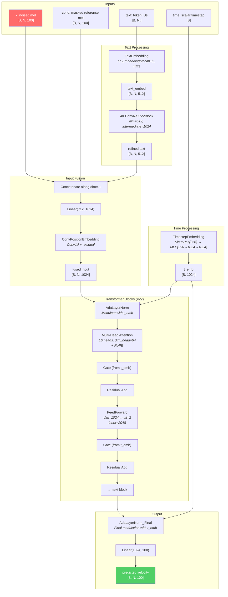

# Model Architecture

> [!note] Prerequisites
> Read [[03-audio-and-codec-primitives]] (mel spectrograms) and [[04-flow-matching-intuition]] (what the model is learning). This chapter traces the actual forward pass through the F5-TTS DiT architecture.

## Architecture Overview

F5-TTS uses a **Diffusion Transformer (DiT)** — a transformer that has been adapted for flow matching / diffusion by conditioning each layer on a timestep. The full model is defined across two files:
- `src/f5_tts/model/backbones/dit.py` — The top-level `DiT` class
- `src/f5_tts/model/modules.py` — All the building blocks

Here's the full forward pass as a Mermaid diagram with tensor shapes annotated for `F5TTS_v1_Base`:



## What Is a DiT (Diffusion Transformer)?

A standard transformer (like in GPT or BERT) processes a sequence of tokens and outputs transformed tokens. A **DiT** adds one critical feature: **timestep conditioning**. At every layer, the transformer's behavior is modulated by the current timestep $t$, which tells the model "how noisy is the input right now?"

This conditioning happens through **Adaptive Layer Normalization (AdaLN)**, which we'll cover below. The idea is from the DiT paper by Facebook/Meta and was adapted for Stable Diffusion 3.

## Component-by-Component Walkthrough

### 1. TimestepEmbedding — How the model knows the noise level

**File:** `modules.py:L852-862`

The timestep $t \in [0, 1]$ is a single float. It needs to become a rich vector that can modulate every layer. This happens in two steps:

```python
class TimestepEmbedding(nn.Module):
    def __init__(self, dim, freq_embed_dim=256):
        self.time_embed = SinusPositionEmbedding(freq_embed_dim)  # scalar → [256]
        self.time_mlp = nn.Sequential(
            nn.Linear(freq_embed_dim, dim),  # [256] → [1024]
            nn.SiLU(),
            nn.Linear(dim, dim)              # [1024] → [1024]
        )
    
    def forward(self, timestep):  # [B]
        time_hidden = self.time_embed(timestep)  # [B, 256]
        time = self.time_mlp(time_hidden)         # [B, 1024]
        return time
```

The `SinusPositionEmbedding` (`modules.py:L157-169`) converts the scalar timestep into a 256-dim vector using sinusoidal frequencies (same math as the original Transformer positional encoding, but applied to a scalar time instead of position):

$$\text{emb}_{2i} = \sin\left(\frac{1000 \cdot t}{10000^{2i/d}}\right), \quad \text{emb}_{2i+1} = \cos\left(\frac{1000 \cdot t}{10000^{2i/d}}\right)$$

> [!tip] Why sinusoidal?
> Sinusoidal embeddings give the model a smooth, continuous representation of time. Nearby timesteps get similar embeddings, and the output has rich frequency content that the subsequent MLP can reshape.

### 2. TextEmbedding — ConvNeXt V2 text encoder

**File:** `dit.py:L33-139`

This is a key innovation of F5-TTS over E2-TTS. Text tokens go through:

**Step 1: Embedding lookup** (`dit.py:L38`):
```python
self.text_embed = nn.Embedding(text_num_embeds + 1, text_dim)  # e.g., (2544, 512)
```
Note: token IDs are shifted up by +1 (`dit.py:L87`: `text = text + 1`) so that the original 0 padding becomes index 0 (a filler token), and actual vocab starts at index 1.

**Step 2: Pad/truncate to match audio length** (`dit.py:L95-96`):
```python
text = text[:, :max_seq_len]  # truncate if text is longer than audio
text = F.pad(text, (0, max_seq_len - text.shape[1]), value=0)  # pad with filler
```

> [!warning] This is the "no alignment" trick
> The text sequence is padded with zeros (filler tokens) to exactly match the mel spectrogram's time dimension. The model figures out which text tokens align with which audio frames purely through attention. No explicit duration model or forced alignment needed.

**Step 3: Add sinusoidal positional encoding** (`dit.py:L117-120`):
```python
freqs = self.freqs_cis[:max_seq_len, :]  # precomputed freq table
text = text + freqs
```

**Step 4: Refine with 4 ConvNeXt V2 blocks** (`dit.py:L123-129`):
```python
for block in self.text_blocks:
    text = block(text)
    text = text.masked_fill(text_mask.unsqueeze(-1).expand(...), 0.0)
```

The ConvNeXt V2 blocks (`modules.py:L252-280`) are 1D convolutions that give the text representation local context — each token can "see" its neighbors through a kernel size of 7. This helps the model learn character-level patterns (like "th" often being a single phoneme) without needing an explicit phoneme converter.

```python
class ConvNeXtV2Block(nn.Module):
    def __init__(self, dim, intermediate_dim, dilation=1):
        self.dwconv = nn.Conv1d(dim, dim, kernel_size=7, groups=dim, ...)  # depthwise
        self.norm = nn.LayerNorm(dim)
        self.pwconv1 = nn.Linear(dim, intermediate_dim)  # expand
        self.act = nn.GELU()
        self.grn = GRN(intermediate_dim)                  # Global Response Norm
        self.pwconv2 = nn.Linear(intermediate_dim, dim)   # compress back
```

**Output shape:** `[B, N, 512]` — same time dimension as the mel spectrogram.

### 3. InputEmbedding — Fusing everything together

**File:** `dit.py:L145-164`

Now we combine three things into a single sequence:
- Noised mel spectrogram $\phi_t$: `[B, N, 100]`
- Conditioned (reference) mel spectrogram: `[B, N, 100]`
- Text embedding: `[B, N, 512]`

```python
class InputEmbedding(nn.Module):
    def __init__(self, mel_dim, text_dim, out_dim):
        self.proj = nn.Linear(mel_dim * 2 + text_dim, out_dim)  # Linear(712, 1024)
        self.conv_pos_embed = ConvPositionEmbedding(dim=out_dim)
    
    def forward(self, x, cond, text_embed, drop_audio_cond=False):
        if drop_audio_cond:
            cond = torch.zeros_like(cond)          # for CFG: zero out conditioning
        x = self.proj(torch.cat((x, cond, text_embed), dim=-1))  # [B,N,712] → [B,N,1024]
        x = self.conv_pos_embed(x) + x             # convolutional positional embedding
        return x
```

The concatenation is `[100 + 100 + 512 = 712]` → projected to `[1024]`.

> [!note] Why concatenation instead of addition?
> In DiT, the text embedding is concatenated with the audio, not added. This preserves all information and lets the projection layer learn how to combine them. Addition would force the text and audio to live in the same vector space, which they don't naturally do since they have different dimensions.

### 4. Transformer Blocks — The main computation

**File:** `modules.py:L711-757`

Each of the 22 `DiTBlock` layers does:

```python
class DiTBlock(nn.Module):
    def forward(self, x, t, mask=None, rope=None):
        # 1. Adaptive LayerNorm — modulate with timestep
        norm, gate_msa, shift_mlp, scale_mlp, gate_mlp = self.attn_norm(x, emb=t)
        
        # 2. Multi-head self-attention with RoPE
        attn_output = self.attn(x=norm, mask=mask, rope=rope)
        
        # 3. Gated residual for attention
        x = x + gate_msa.unsqueeze(1) * attn_output
        
        # 4. Modulated FFN
        norm = self.ff_norm(x) * (1 + scale_mlp[:, None]) + shift_mlp[:, None]
        ff_output = self.ff(norm)
        
        # 5. Gated residual for FFN
        x = x + gate_mlp.unsqueeze(1) * ff_output
        
        return x
```

#### AdaLayerNorm — The timestep conditioning mechanism

**File:** `modules.py:L312-326`

This is how the timestep controls the transformer. The time embedding $t\_\text{emb}$ produces **6 modulation parameters** per layer:

```python
class AdaLayerNorm(nn.Module):
    def __init__(self, dim):
        self.linear = nn.Linear(dim, dim * 6)  # 1024 → 6144
    
    def forward(self, x, emb=None):
        emb = self.linear(self.silu(emb))
        shift_msa, scale_msa, gate_msa, shift_mlp, scale_mlp, gate_mlp = torch.chunk(emb, 6, dim=1)
        x = self.norm(x) * (1 + scale_msa[:, None]) + shift_msa[:, None]
        return x, gate_msa, shift_mlp, scale_mlp, gate_mlp
```

The 6 parameters are:
| Parameter | What it does |
|-----------|-------------|
| `scale_msa` | Scales the attention input (multiplicative) |
| `shift_msa` | Shifts the attention input (additive) |
| `gate_msa` | Controls how much attention output is added to residual |
| `scale_mlp` | Scales the FFN input |
| `shift_mlp` | Shifts the FFN input |
| `gate_mlp` | Controls how much FFN output is added to residual |

> [!tip] Why gating?
> The gates (`gate_msa`, `gate_mlp`) are initialized to zero (see `dit.py:L264-268`). This means at the start of training, each transformer block is an identity function — the output equals the input. The model gradually "turns on" each block as training progresses. This stabilizes training significantly.

#### The Attention Operation

**File:** `modules.py:L371-556`

Standard multi-head scaled dot-product attention with Rotary Position Embeddings (RoPE):

$$\text{Attention}(Q, K, V) = \text{softmax}\left(\frac{Q K^T}{\sqrt{d_k}}\right) V$$

where $Q = xW_Q$, $K = xW_K$, $V = xW_V$, and $d_k = 64$ (the per-head dimension).

For `F5TTS_v1_Base`: 16 heads × 64 dim_head = 1024 total.

RoPE is applied to Q and K before the attention computation (`modules.py:L498-509`):
```python
if rope is not None:
    freqs, xpos_scale = rope
    query = apply_rotary_pos_emb(query, freqs, q_xpos_scale)
    key = apply_rotary_pos_emb(key, freqs, k_xpos_scale)
```

The actual attention uses PyTorch's `scaled_dot_product_attention` (with optional Flash Attention backend):
```python
x = F.scaled_dot_product_attention(query, key, value, attn_mask=attn_mask,
                                    dropout_p=0.0, is_causal=False)
```

> [!warning] `is_causal=False`
> Unlike GPT, this attention is **not causal**. Every position can attend to every other position — the model sees the entire sequence (text + audio) bidirectionally. This is possible because we're not generating autoregressively; flow matching generates the entire output simultaneously.

### 5. Output Projection

**File:** `dit.py:L230-231, L367-368`

After all 22 transformer blocks:

```python
x = self.norm_out(x, t)        # AdaLayerNorm_Final: one more timestep modulation
output = self.proj_out(x)       # Linear(1024, 100): project back to mel dimension
```

The output is a predicted velocity `[B, N, 100]` — the same shape as the input mel spectrogram. This velocity is what the ODE solver uses during inference (see [[04-flow-matching-intuition]]).

## Key Hyperparameters

From `src/f5_tts/configs/F5TTS_v1_Base.yaml:L25-37`:

| Parameter | Value | What it controls |
|-----------|-------|-----------------|
| `dim` | 1024 | Model hidden dimension — every transformer block works in this space |
| `depth` | 22 | Number of transformer blocks (stacked sequentially) |
| `heads` | 16 | Number of attention heads (each sees 64-dim slices) |
| `ff_mult` | 2 | FFN inner dimension = 1024 × 2 = 2048 |
| `text_dim` | 512 | Text embedding dimension (before fusion with audio) |
| `conv_layers` | 4 | Number of ConvNeXt V2 blocks for text refinement |
| `mel_dim` | 100 | Mel spectrogram channels (input and output dimension) |
| `text_num_embeds` | ~2543 | Vocabulary size (depends on tokenizer — pinyin has ~2543) |

The model has approximately **335M parameters** (you can verify with `src/f5_tts/scripts/count_params_gflops.py`).

## CFG at the Architecture Level

During inference with CFG (`dit.py:L337-346`), the model packs the conditioned and unconditioned inputs into a single doubled batch:

```python
if cfg_infer:
    x_cond = self.get_input_embed(x, cond, text, drop_audio_cond=False, drop_text=False, ...)
    x_uncond = self.get_input_embed(x, cond, text, drop_audio_cond=True, drop_text=True, ...)
    x = torch.cat((x_cond, x_uncond), dim=0)    # [B,N,1024] → [2B,N,1024]
    t = torch.cat((t, t), dim=0)                  # [B,1024] → [2B,1024]
```

This doubles the batch size but avoids two separate forward passes.

## Text Embedding Caching

**File:** `dit.py:L284-314`

Since text doesn't change between ODE solver steps, the text embedding is computed once and cached:

```python
def get_input_embed(self, x, cond, text, ..., cache=True):
    if self.text_cond is None or not cache:
        text_embed = self.text_embed(text, seq_len=seq_len, drop_text=drop_text)
        if cache:
            if drop_text:
                self.text_uncond = text_embed
            else:
                self.text_cond = text_embed
```

This saves ~4 ConvNeXt V2 forward passes per ODE step — a meaningful speedup.

## Weight Initialization — Zero Init

**File:** `dit.py:L264-274`

A critical detail: all AdaLN and output projection weights are initialized to **zero**:

```python
def initialize_weights(self):
    for block in self.transformer_blocks:
        nn.init.constant_(block.attn_norm.linear.weight, 0)
        nn.init.constant_(block.attn_norm.linear.bias, 0)
    nn.init.constant_(self.norm_out.linear.weight, 0)
    nn.init.constant_(self.proj_out.weight, 0)
    nn.init.constant_(self.proj_out.bias, 0)
```

> [!warning] Why zero init matters
> With zero-initialized AdaLN gates, every DiTBlock starts as an identity function. The model output is initially all zeros (since `proj_out` weights are zero too). This means the predicted velocity starts as zero, and the ODE solver doesn't move the noise — which is the correct "I don't know anything yet" state. As training progresses, the model gradually learns to predict non-zero velocities. This avoids catastrophic early training instability.

## Next Steps

- See how training data is prepared and batched: [[06-data-pipeline]]
- See how this architecture is trained: [[07-training-loop]]
- See how inference uses this architecture: [[08-inference-pipeline]]
