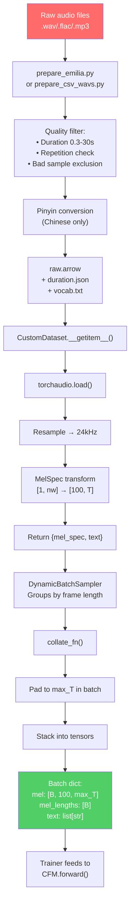

# Data Pipeline

> [!note] Prerequisites
> Read [[02-repository-structure]] (file locations) and [[03-audio-and-codec-primitives]] (mel spectrograms).

This chapter covers everything about how data flows from raw audio files on disk to training-ready tensors on GPU.

## What Format Does Training Data Need to Be In?

F5-TTS expects preprocessed data in an **Apache Arrow** format (HuggingFace Datasets library). Each row contains:

| Field | Type | Description |
|-------|------|-------------|
| `audio_path` | string | Absolute path to the `.wav` / `.flac` / `.mp3` file |
| `text` | string or list[str] | The transcript (if pinyin tokenizer: a list of pinyin tokens) |
| `duration` | float | Duration of the audio in seconds |

Additionally, a separate `duration.json` file stores all durations as a list for the `DynamicBatchSampler`:
```json
{"duration": [3.45, 2.10, 5.67, ...]}
```

And a `vocab.txt` file maps characters/pinyin tokens to indices (one per line):
```
 
a
b
c
...
zhuang4
```

> [!warning] Space is index 0
> The first line of `vocab.txt` must be a space character. Index 0 is reserved as the "unknown/filler" token. See `utils.py:L129`: `assert vocab_char_map[" "] == 0`.

The final on-disk structure looks like:
```
data/
└── Emilia_ZH_EN_pinyin/
    ├── raw.arrow          # The dataset rows
    ├── duration.json      # All durations for batch sampling
    └── vocab.txt          # Character-to-index mapping
```

## The Emilia Dataset

The pretrained F5-TTS model was trained on **Emilia**, a large-scale in-the-wild multilingual dataset:

| Stat | Value |
|------|-------|
| Languages | Chinese (ZH) + English (EN) |
| Total duration | ~95,000 hours |
| Sample count | ~37.8 million utterances |
| Source | In-the-wild speech (podcasts, videos, etc.) |
| License | CC-BY-NC (non-commercial) |

> [!warning] License implication
> Because Emilia is CC-BY-NC, the pretrained F5-TTS models are also CC-BY-NC licensed. You **cannot use them commercially** without training your own model on commercially-licensed data. The code itself is MIT licensed, so you can use the code commercially.

## Walkthrough: `prepare_emilia.py`

**File:** `src/f5_tts/train/datasets/prepare_emilia.py`

This script processes raw Emilia downloads into the Arrow format. Here's what each step does:

### Step 1: Read JSONL metadata (L111-143)

Each audio directory contains a `.jsonl` file where each line is:
```json
{"wav": "EN_B00013/EN_B00013_S00001.wav", "text": "Hello world", "duration": 3.45, "language": "en"}
```

### Step 2: Quality filtering (L122-137)

Bad samples are filtered out:
```python
# Hardcoded exclusion lists for known bad samples
out_zh = {"ZH_B00041_S06226", ...}  # 6 bad Chinese samples
out_en = {"EN_B00013_S00913", ...}  # ~60 bad English samples

# Character filters — remove samples with Japanese characters in Chinese data
zh_filters = ["い", "て"]
en_filters = ["ا", "い", "て"]

# Repetition filter
if repetition_found(text):  # catches "hahahahaha..." type transcriptions
    continue
```

The `repetition_found()` function (`utils.py:L191-199`) checks if any 2-character pattern appears more than 10 times:
```python
def repetition_found(text, length=2, tolerance=10):
    pattern_count = defaultdict(int)
    for i in range(len(text) - length + 1):
        pattern = text[i : i + length]
        pattern_count[pattern] += 1
    for pattern, count in pattern_count.items():
        if count > tolerance:
            return True
    return False
```

### Step 3: Pinyin conversion (L138-139)

If using the pinyin tokenizer, Chinese characters are converted to pinyin:
```python
if tokenizer == "pinyin":
    text = convert_char_to_pinyin([text], polyphone=polyphone)[0]
```

This converts e.g. "你好世界" → `[" ni3", " hao3", " shi4", " jie4"]` using the `pypinyin` library. English text passes through unchanged (it's already Latin characters).

### Step 4: Write Arrow file (L181-184)
```python
with ArrowWriter(path=f"{save_dir}/raw.arrow") as writer:
    for line in tqdm(result, desc="Writing to raw.arrow ..."):
        writer.write(line)
    writer.finalize()
```

### Step 5: Save durations and vocabulary (L187-196)
```python
# Duration JSON for DynamicBatchSampler
with open(f"{save_dir}/duration.json", "w") as f:
    json.dump({"duration": duration_list}, f)

# Vocabulary file
with open(f"{save_dir}/vocab.txt", "w") as f:
    for vocab in sorted(text_vocab_set):
        f.write(vocab + "\n")
```

## The Dataset Classes

### `CustomDataset` — The primary dataset class

**File:** `dataset.py:L82-166`

```python
class CustomDataset(Dataset):
    def __getitem__(self, index):
        row = self.data[index]
        audio_path = row["audio_path"]
        text = row["text"]
        duration = row["duration"]
        
        # Filter: skip if too short (<0.3s) or too long (>30s)
        if not (0.3 <= duration <= 30):
            index = (index + 1) % len(self.data)  # try next sample
            
        # Load audio
        audio, source_sample_rate = torchaudio.load(audio_path)
        if audio.shape[0] > 1:
            audio = torch.mean(audio, dim=0, keepdim=True)  # mono
        
        # Resample if needed
        if source_sample_rate != self.target_sample_rate:
            audio = self._resamplers[source_sample_rate](audio)
        
        # Convert to mel spectrogram
        mel_spec = self.mel_spectrogram(audio)
        mel_spec = mel_spec.squeeze(0)  # [1, 100, T] → [100, T]
        
        return {"mel_spec": mel_spec, "text": text}
```

> [!note] Duration filtering
> Samples shorter than 0.3s or longer than 30s are skipped (L137-138). This is a crucial quality filter — very short samples don't contain enough context, and very long samples cause OOM errors due to the quadratic attention cost.

### `get_frame_len()` — How the sampler knows audio lengths

```python
def get_frame_len(self, index):
    return self.durations[index] * self.target_sample_rate / self.hop_length
```

This converts seconds → mel spectrogram frames. For a 10s clip: `10 × 24000 / 256 = 937.5 frames`.

## Dynamic Batch Sampling

**File:** `dataset.py:L170-241`

This is one of the most important classes for training efficiency. Speech datasets have **wildly varying sequence lengths** — one sample might be 0.5s (47 frames) and another 28s (2625 frames).

Normal batching (fixed batch size) would cause either:
- **Massive padding waste**: short samples padded to the longest sample's length
- **OOM crashes**: if a batch happens to contain several long samples

`DynamicBatchSampler` solves this:

```python
class DynamicBatchSampler(Sampler):
    def __init__(self, sampler, frames_threshold, max_samples=0, ...):
        # Step 1: Sort all samples by frame length
        indices = []
        for idx in self.sampler:
            indices.append((idx, data_source.get_frame_len(idx)))
        indices.sort(key=lambda elem: elem[1])
        
        # Step 2: Greedily pack into batches
        batch = []
        batch_frames = 0
        for idx, frame_len in indices:
            if batch_frames + frame_len <= self.frames_threshold \
               and (max_samples == 0 or len(batch) < max_samples):
                batch.append(idx)
                batch_frames += frame_len
            else:
                batches.append(batch)
                batch = [idx]
                batch_frames = frame_len
```

Each batch has at most `frames_threshold` total frames (default 38,400 for F5TTS_v1_Base). This means:
- A batch of short clips might have 50+ samples
- A batch of long clips might have only 2-3 samples
- But each batch uses roughly the same amount of GPU memory

> [!tip] Why this is important for production too
> If you ever build a batch inference API for TTS, you'll face the same variable-length problem. The `DynamicBatchSampler` pattern — sort by length, pack greedily — is the standard solution.

## Collation Function

**File:** `dataset.py:L313-334`

The `collate_fn` takes a list of samples from `CustomDataset.__getitem__()` and pads them into uniform tensors:

```python
def collate_fn(batch):
    mel_specs = [item["mel_spec"].squeeze(0) for item in batch]
    mel_lengths = torch.LongTensor([spec.shape[-1] for spec in mel_specs])
    max_mel_length = mel_lengths.amax()
    
    # Pad all mel specs to the longest in this batch
    padded_mel_specs = []
    for spec in mel_specs:
        padded_spec = F.pad(spec, (0, max_mel_length - spec.size(-1)), value=0)
        padded_mel_specs.append(padded_spec)
    
    mel_specs = torch.stack(padded_mel_specs)
    text = [item["text"] for item in batch]
    
    return dict(
        mel=mel_specs,            # [B, 100, max_T]
        mel_lengths=mel_lengths,  # [B] — actual lengths (for masking)
        text=text,                # list of strings/lists
        text_lengths=...,
    )
```

> [!note] `mel_lengths` is essential
> This tensor records each sample's actual (unpadded) length. It's used by the model to create attention masks so the padded zeros don't influence computation. See `cfm.py:L256-258`.

## Complete Data Pipeline Flowchart



## How to Add a New Language Dataset

Here are the exact steps:

1. **Prepare a CSV** with columns `audio_file|text` (pipe-separated, with header):
   ```csv
   audio_file|text
   /path/to/audio1.wav|This is the transcript
   /path/to/audio2.wav|Another transcript
   ```

2. **Run the CSV preparation script**:
   ```bash
   python src/f5_tts/train/datasets/prepare_csv_wavs.py /path/to/metadata.csv /path/to/output
   ```

3. **Choose your tokenizer**:
   - **`byte`** tokenizer: Works for any language out-of-the-box (vocab size 256, no vocab.txt needed). Simpler but slightly less efficient.
   - **`char`** tokenizer: Character-level, requires a `vocab.txt` extracted from your data. Better for languages with small character sets.
   - **`pinyin`** tokenizer: Only for Chinese. Converts hanzi to pinyin for better pronunciation coverage.

4. **If using char/pinyin tokenizer**, the preparation script generates `vocab.txt`. Make sure the first line is a space character.

5. **For fine-tuning** (not training from scratch): If using the pretrained model's vocabulary, **do not change `vocab.txt`**. The embedding layer dimensions must match the checkpoint. If you must add new characters (e.g., for a new script), you need to resize the embedding layer and adjust the checkpoint accordingly.

> [!warning] Vocabulary mismatch is a silent failure
> If your `vocab.txt` doesn't match what the model was trained with, inference will produce wrong pronunciations but won't crash. The model will just map your new characters to wrong embedding vectors. Always use the same `vocab.txt` as the pretrained model unless you're training from scratch.

## Next Steps

- See how this data is consumed by the training loop: [[07-training-loop]]
- Understand the fine-tuning workflow: [[09-finetuning-guide]]
