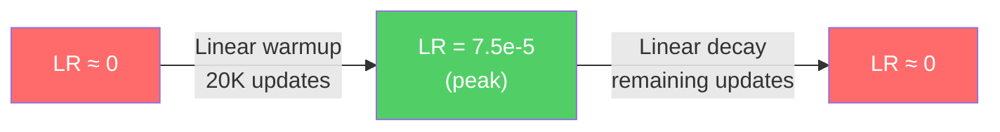
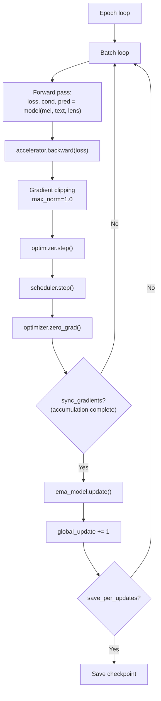

# Training Loop

> [!note] Prerequisites
> Read [[04-flow-matching-intuition]] (the loss function), [[05-model-architecture]] (the model), and [[06-data-pipeline]] (the data).

This chapter walks through `src/f5_tts/model/trainer.py` completely — every line of the training loop explained.

## What Does Accelerate Do?

**HuggingFace Accelerate** is a library that wraps PyTorch training for multi-GPU and mixed-precision support. Instead of writing raw `torch.distributed` code, you:

1. Create an `Accelerator` object
2. Call `accelerator.prepare(model, optimizer, dataloader)` — it handles DDP wrapping, gradient syncing, FP16 casting, etc.
3. Replace `loss.backward()` with `accelerator.backward(loss)`

```python
# trainer.py:L57-68
ddp_kwargs = DistributedDataParallelKwargs(find_unused_parameters=True)
self.accelerator = Accelerator(
    log_with=logger if logger == "wandb" else None,
    kwargs_handlers=[ddp_kwargs],
    gradient_accumulation_steps=grad_accumulation_steps,
    **accelerate_kwargs,
)
```

> [!note] `find_unused_parameters=True`
> This is needed because the CFG training randomly drops text or audio conditioning. When conditioning is dropped, the corresponding embedding parameters have no gradient for that step. Without this flag, DDP would deadlock waiting for gradient synchronization on unused parameters.

## The EMA Model

**File:** `trainer.py:L107-108`

```python
if self.is_main:
    self.ema_model = EMA(model, include_online_model=False, **ema_kwargs)
    self.ema_model.to(self.accelerator.device)
```

EMA (Exponential Moving Average) maintains a **shadow copy** of the model weights that evolves as a smoothed version of the training weights:

$$\theta_{\text{EMA}}^{(t)} = \beta \cdot \theta_{\text{EMA}}^{(t-1)} + (1 - \beta) \cdot \theta_{\text{train}}^{(t)}$$

where $\beta$ is the decay rate (typically 0.9999).

**Why EMA?**
- Training weights oscillate due to SGD noise. EMA smooths these oscillations.
- EMA weights generalize better — they represent an "average" of many recent training states.
- **At inference time, the EMA weights are used, not the training weights.** See `infer/utils_infer.py:L209-216` where checkpoint loading extracts `ema_model_state_dict`.

The EMA is updated after every optimizer step in the training loop:
```python
# trainer.py:L387-388
if self.accelerator.sync_gradients:
    if self.is_main:
        self.ema_model.update()
```

> [!warning] EMA is only on the main process
> Because EMA is only used for inference (not for computing gradients), it only needs to exist on one GPU. This saves memory on all other GPUs.

## Learning Rate Schedule

**File:** `trainer.py:L316-326`

The schedule is **linear warmup → linear decay**:

```python
warmup_updates = self.num_warmup_updates * self.accelerator.num_processes
total_updates = math.ceil(len(train_dataloader) / self.grad_accumulation_steps) * self.epochs
decay_updates = total_updates - warmup_updates

warmup_scheduler = LinearLR(self.optimizer, start_factor=1e-8, end_factor=1.0,
                             total_iters=warmup_updates)
decay_scheduler = LinearLR(self.optimizer, start_factor=1.0, end_factor=1e-8,
                            total_iters=decay_updates)
self.scheduler = SequentialLR(self.optimizer,
                               schedulers=[warmup_scheduler, decay_scheduler],
                               milestones=[warmup_updates])
```



For `F5TTS_v1_Base.yaml`:
- `learning_rate = 7.5e-5`
- `num_warmup_updates = 20000`
- Warmup is multiplied by `num_processes` (GPUs) to keep warmup duration constant regardless of GPU count

> [!tip] Why the warmup scale by GPU count?
> Accelerate splits batches across GPUs. With 8 GPUs, each GPU sees `total_batches/8` batches. For the warmup to take the same wall-clock time, we multiply the warmup steps by 8.

## Gradient Accumulation

```python
# trainer.py:L39
grad_accumulation_steps=1  # default
```

When set to >1, the optimizer only steps after accumulating gradients from multiple batches. This effectively increases batch size without proportionally increasing memory. The Accelerator handles this via `with self.accelerator.accumulate(self.model)`.

## The Training Loop — Line by Line



Here's the inner loop with annotations (`trainer.py:L363-438`):

```python
for batch in current_dataloader:
    with self.accelerator.accumulate(self.model):
        text_inputs = batch["text"]
        mel_spec = batch["mel"].permute(0, 2, 1)  # [B, 100, T] → [B, T, 100]
        mel_lengths = batch["mel_lengths"]
        
        # Forward pass — this calls CFM.forward() which:
        #   1. Samples random noise x0
        #   2. Samples random timestep t
        #   3. Creates interpolation φ = (1-t)x0 + t*mel
        #   4. Creates random infill mask
        #   5. Runs transformer to predict velocity
        #   6. Computes MSE loss on masked region only
        loss, cond, pred = self.model(
            mel_spec, text=text_inputs, lens=mel_lengths,
            noise_scheduler=self.noise_scheduler
        )
        
        self.accelerator.backward(loss)
        
        # Clip gradients to prevent explosion
        if self.max_grad_norm > 0 and self.accelerator.sync_gradients:
            self.accelerator.clip_grad_norm_(self.model.parameters(), self.max_grad_norm)
        
        self.optimizer.step()
        self.scheduler.step()
        self.optimizer.zero_grad()
    
    # Only count as an "update" when gradients are actually synced
    if self.accelerator.sync_gradients:
        if self.is_main:
            self.ema_model.update()
        global_update += 1
```

## The Flow Matching Loss — Traced Through Code

Let's follow exactly what happens inside `self.model(mel_spec, text=text_inputs, lens=mel_lengths)`:

1. **`CFM.forward()`** (`cfm.py:L231-302`):
   - Raw mel comes in as `[B, T, 100]`
   - If it were raw waveform, it would be converted to mel first (L240-243), but the trainer already provides mel

2. **Create masks** (L256-265):
   ```python
   mask = lens_to_mask(lens, length=seq_len)  # True where audio is real, False for padding
   frac_lengths = uniform(0.7, 1.0)  # randomly mask 70-100% of the audio
   rand_span_mask = mask_from_frac_lengths(lens, frac_lengths)  # the infill region
   ```

3. **Sample noise and timestep** (L271-274):
   ```python
   x0 = torch.randn_like(x1)                    # Gaussian noise, same shape as mel
   time = torch.rand((batch,), dtype=dtype, ...)  # uniform t ∈ [0, 1]
   ```

4. **Interpolate** (L278-280):
   ```python
   φ = (1 - t) * x0 + t * x1    # noised version
   flow = x1 - x0                # true velocity
   ```

5. **Create conditioning** (L283):
   ```python
   cond = torch.where(rand_span_mask[..., None], torch.zeros_like(x1), x1)
   # Inside the masked span: zeros (the model must generate this)
   # Outside the masked span: real audio (conditioning context)
   ```

6. **CFG training drops** (L286-291):
   ```python
   drop_audio_cond = random() < 0.3  # 30% chance: zero out audio conditioning
   if random() < 0.2:                 # 20% chance: zero out everything
       drop_audio_cond = True
       drop_text = True
   ```

7. **Transformer forward pass** (L294-296):
   ```python
   pred = self.transformer(x=φ, cond=cond, text=text, time=time,
                            drop_audio_cond=drop_audio_cond, drop_text=drop_text, mask=mask)
   ```

8. **Loss computation** (L299-300):
   ```python
   loss = F.mse_loss(pred, flow, reduction="none")  # per-element MSE
   loss = loss[rand_span_mask]  # only count loss inside the masked (generated) region
   return loss.mean()
   ```

## Checkpoint Saving and Resumption

### Saving (`trainer.py:L150-183`)

Checkpoints contain:
```python
checkpoint = dict(
    model_state_dict=self.accelerator.unwrap_model(self.model).state_dict(),
    optimizer_state_dict=self.optimizer.state_dict(),
    ema_model_state_dict=self.ema_model.state_dict(),
    scheduler_state_dict=self.scheduler.state_dict(),
    update=update,
)
```

Two save patterns:
- **`model_last.pt`**: Saved every `last_per_updates` (default 5000). Overwritten each time. For crash recovery.
- **`model_{update}.pt`**: Saved every `save_per_updates` (default 50000). Persistent. For rollback.

Optional: `keep_last_n_checkpoints` rotates old numbered checkpoints to save disk space.

### Loading (`trainer.py:L185-263`)

On start, the trainer looks for the most recent checkpoint:
1. First checks for `model_last.pt`
2. Then for the highest-numbered `model_*.pt`
3. Then for `pretrained_*.pt` or `.safetensors` files (for fine-tuning)

## What Does a Healthy Training Run Look Like?

### Loss values
- **Start**: Loss starts high (~1.0-2.0) and drops rapidly in the first few thousand updates
- **Converging**: Loss gradually decreases to ~0.03-0.08 range over hundreds of thousands of updates
- **Converged**: Loss plateaus. For the full Emilia dataset, final loss is around 0.03-0.05

### Things to watch for

| Symptom | Problem | Solution |
|---------|---------|----------|
| Loss stays flat from the start | Learning rate too low, or data loading broken | Check LR, check that mel specs aren't all zeros |
| Loss explodes (NaN or >10) | Learning rate too high, or bad data sample | Reduce LR, add gradient clipping, check data |
| Loss drops then rises | Overfitting (especially during fine-tuning) | Reduce epochs, increase data, add regularization |
| Loss oscillates wildly | Batch size too small | Increase `batch_size_per_gpu` or `grad_accumulation_steps` |
| Generated samples are whispered/breathy | EMA weights dominating too early in fine-tuning | Try `use_ema=False` for early fine-tuning checkpoints |

### Logging

The trainer logs to Weights & Biases (if configured) or TensorBoard:
```python
# trainer.py:L394-400
self.accelerator.log(
    {"loss": loss.item(), "lr": self.scheduler.get_last_lr()[0]},
    step=global_update
)
```

Sample audio can also be logged per checkpoint if `log_samples=True` (L408-437).

## Next Steps

- See how inference uses the trained model: [[08-inference-pipeline]]
- See how to fine-tune on custom data: [[09-finetuning-guide]]
