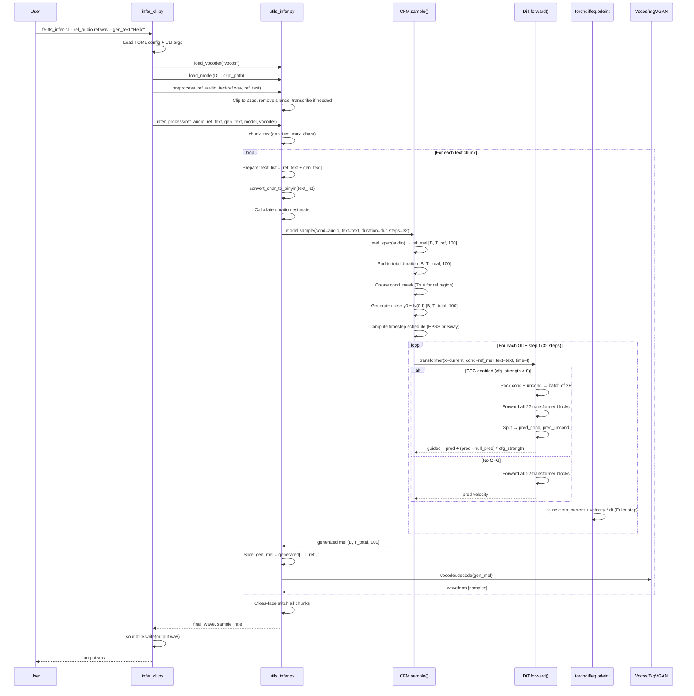
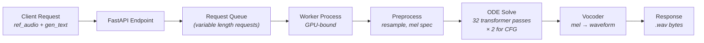

# Inference Pipeline

> [!note] Prerequisites
> Read [[04-flow-matching-intuition]] (ODE solving, CFG) and [[05-model-architecture]] (the DiT forward pass).

This chapter traces exactly what happens from the moment you run `f5-tts_infer-cli` to the moment audio comes out of your speakers.

## End-to-End Sequence Diagram



## Step 1: Loading Models

**File:** `infer/infer_cli.py:L254-301`

```python
# Load vocoder (separate frozen model)
vocoder = load_vocoder(vocoder_name="vocos", ...)

# Load TTS model config
model_cfg = OmegaConf.load(f"configs/{model}.yaml")
model_cls = get_class(f"f5_tts.model.{model_cfg.model.backbone}")  # → DiT class

# Download checkpoint if not local
ckpt_file = str(cached_path("hf://SWivid/F5-TTS/F5TTS_v1_Base/model_1250000.safetensors"))

# Construct and load model
ema_model = load_model(model_cls, model_arc, ckpt_file, ...)
```

The `load_model()` function (`utils_infer.py:L238-276`):
1. Loads the custom vocabulary file
2. Constructs a `CFM(transformer=DiT(...))` instance
3. Loads checkpoint weights (EMA weights by default)
4. Casts to appropriate dtype (float16 for CUDA with compute capability ≥ 7)

## Step 2: Preprocessing Reference Audio

**File:** `utils_infer.py:L298-378`

```python
def preprocess_ref_audio_text(ref_audio_orig, ref_text, ...):
    aseg = AudioSegment.from_file(ref_audio_orig)
    
    # Clip to max 12 seconds (using silence detection for smart clipping)
    non_silent_segs = silence.split_on_silence(aseg, min_silence_len=1000, ...)
    # ... keep adding segments until >12s ...
    
    # Remove silence at edges
    aseg = remove_silence_edges(aseg) + AudioSegment.silent(duration=50)
    
    # If no ref_text provided, transcribe with Whisper
    if not ref_text.strip():
        ref_text = transcribe(ref_audio)  # Uses whisper-large-v3-turbo
    
    # Ensure text ends with period
    if not ref_text.endswith(". "):
        ref_text += ". "
    
    return ref_audio, ref_text
```

> [!warning] The 12-second limit
> Reference audio longer than 12s is clipped. The model was trained on utterances up to 30s total (reference + generated). If your reference is 12s, you get ~18s for generation. If your reference is longer, quality degrades because total length approaches the 30s training limit.

## Step 3: Text Chunking

**File:** `utils_infer.py:L73-102, L384-434`

Long generated text is split into chunks at sentence boundaries:

```python
def chunk_text(text, max_chars=135):
    sentences = re.split(r'(?<=[;:,.!?])\s+|(?<=[；：，。！？])', text)
    # Greedily pack sentences into chunks of max_chars
```

The `max_chars` is dynamically calculated based on reference audio duration:
```python
# utils_infer.py:L404
max_chars = int(len(ref_text.encode("utf-8")) / (audio.shape[-1] / sr) 
                * (22 - audio.shape[-1] / sr) * speed)
```

This ensures each chunk generates roughly 22 seconds of total audio (ref + gen), staying well under the 30s limit.

## Step 4: The ODE Solve (The Core Generation)

**File:** `cfm.py:L83-229`

This is `CFM.sample()` — the inference method:

### 4a. Prepare conditioning
```python
# Convert ref audio waveform to mel spectrogram
cond = self.mel_spec(cond)           # [B, 100, T_ref]
cond = cond.permute(0, 2, 1)         # [B, T_ref, 100]

# Pad to total duration
cond = F.pad(cond, (0, 0, 0, max_duration - cond_seq_len), value=0.0)
# Now cond is [B, T_total, 100] with zeros where we want to generate
```

### 4b. Create the conditioning mask
```python
cond_mask = lens_to_mask(lens)       # True for reference region
step_cond = torch.where(cond_mask, cond, torch.zeros_like(cond))
# Reference region: real mel values. Generation region: zeros.
```

### 4c. Generate initial noise
```python
y0 = []
for dur in duration:
    if exists(seed):
        torch.manual_seed(seed)       # deterministic per-sample
    y0.append(torch.randn(dur, self.num_channels, device=self.device, dtype=...))
y0 = pad_sequence(y0, padding_value=0, batch_first=True)
```

### 4d. Compute timestep schedule
```python
if use_epss:
    t = get_epss_timesteps(steps, ...)   # hand-tuned non-uniform steps
else:
    t = torch.linspace(0, 1, steps + 1, ...)   # uniform steps
if sway_sampling_coef is not None:
    t = t + sway_sampling_coef * (torch.cos(torch.pi / 2 * t) - 1 + t)
```

### 4e. Solve the ODE
```python
trajectory = odeint(fn, y0, t, method="euler")
sampled = trajectory[-1]  # final state at t=1
```

Where `fn` is the velocity function with CFG:
```python
def fn(t, x):
    if cfg_strength < 1e-5:
        pred = self.transformer(x=x, cond=step_cond, text=text, time=t, ...)
        return pred
    
    # CFG: run cond and uncond together
    pred_cfg = self.transformer(x=x, ..., cfg_infer=True, ...)
    pred, null_pred = torch.chunk(pred_cfg, 2, dim=0)
    return pred + (pred - null_pred) * cfg_strength
```

### 4f. Replace reference region with original
```python
out = torch.where(cond_mask, cond, out)  # keep reference audio unchanged
```

## Step 5: Vocoder Conversion

```python
# utils_infer.py:L507-513
generated = generated[:, ref_audio_len:, :]   # slice off reference region
generated = generated.permute(0, 2, 1)         # [B, T, 100] → [B, 100, T]

if mel_spec_type == "vocos":
    generated_wave = vocoder.decode(generated)  # [B, 100, T] → [B, 1, T*256]
elif mel_spec_type == "bigvgan":
    generated_wave = vocoder(generated)          # same conversion
```

## Step 6: Cross-fade Stitching

For long text split into multiple chunks, the generated waveforms are stitched with cross-fading (`utils_infer.py:L549-585`):

```python
cross_fade_samples = int(cross_fade_duration * target_sample_rate)  # 0.15s × 24000 = 3600 samples

# Overlap regions
prev_overlap = prev_wave[-cross_fade_samples:]
next_overlap = next_wave[:cross_fade_samples]

# Linear fade
fade_out = np.linspace(1, 0, cross_fade_samples)
fade_in = np.linspace(0, 1, cross_fade_samples)
cross_faded = prev_overlap * fade_out + next_overlap * fade_in

# Stitch
final = np.concatenate([prev_wave[:-cross_fade_samples], cross_faded, next_wave[cross_fade_samples:]])
```

## ODE Solver Choices and NFE

The **ODE solver method** determines how we numerically integrate the velocity field:

| Method | NFE per step | Quality | Speed |
|--------|-------------|---------|-------|
| `euler` (default) | 1 | Good at 32 steps | Fastest |
| `midpoint` | 2 | Better per-step | 2× slower per step |

**NFE** (Number of Function Evaluations) is the total number of transformer forward passes during generation. With Euler and 32 steps, NFE = 32. With midpoint and 32 steps, NFE = 64.

```python
# cfm.py:L39-42
odeint_kwargs: dict = dict(
    method="euler"  # 'midpoint'
)
```

> [!tip] The quality-speed tradeoff
> Reducing NFE from 32 to 16 roughly halves inference time but slightly reduces quality. For batch processing where latency isn't critical, use 32. For real-time applications, 16 with EPSS timesteps gives surprisingly good results.

## How Voice Cloning Works Mechanically

There's no special "voice cloning" mechanism. The model is doing **conditional infilling**:

1. The reference audio's mel spectrogram occupies the first `T_ref` frames
2. The generation region is padded with zeros after `T_ref`
3. The text is `ref_text + gen_text` (concatenated)
4. The model's job: fill in the zeros to produce mel frames that (a) say `gen_text` and (b) sound consistent with the reference mel spec

The model learned this by training on random infilling (see [[07-training-loop]] — the `rand_span_mask`). At inference, we just set the mask to be "keep the reference, generate the rest."

```
[ reference mel spec | zeros to fill ← model generates this ]
[ ref_text tokens    | gen_text tokens                       ]
                     ↑ cond_mask boundary
```

## RTF vs Latency

| Metric | Definition | Typical value |
|--------|-----------|---------------|
| **RTF** (Real-Time Factor) | `generation_time / audio_duration` | 0.15 (F5-TTS) |
| **Latency** | Wall clock time from request to first audio byte | ~1-3 seconds |

RTF 0.15 means generating 10 seconds of audio takes 1.5 seconds. But the total latency includes model loading, preprocessing, etc. For production, latency matters more than RTF for user experience.

## Streaming Inference

**File:** `utils_infer.py:L528-538`

For real-time use, the `infer_batch_process()` function supports a `streaming=True` mode that yields audio chunks as they are generated:

```python
def infer_single_process_streaming(gen_text):
    generated_wave, generated = _infer_basic(gen_text)
    for j in range(0, len(generated_wave), chunk_size):
        yield generated_wave[j : j + chunk_size], target_sample_rate
```

This is used by the socket server (`src/f5_tts/socket_server.py`) for real-time voice synthesis.

> [!warning] Streaming trade-off
> Each text chunk generates independently, so there may be slight inconsistencies between chunks. The cross-fade stitching (non-streaming mode) handles this better but requires all chunks to be generated before playback.

## Serving Behind a FastAPI Endpoint

If you want to serve F5-TTS as a production API, here's what you'd need:



Key considerations:
1. **Concurrency**: The GPU is the bottleneck. You can batch multiple requests together using the model's batch dimension, but requests will have different durations (requiring dynamic padding).
2. **Model loading**: Load model once at startup, keep in GPU memory (~700MB at FP16).
3. **Vocoder memory**: Vocos is tiny (~35MB). BigVGAN is larger (~112MB).
4. **Request timeout**: Generation time is proportional to output audio length. A 30s audio clip with 32 NFE takes ~4.5s on an A100.
5. **Streaming**: Use WebSocket or Server-Sent Events for streaming audio delivery.

## Next Steps

- Learn how to fine-tune: [[09-finetuning-guide]]
- Production deployment details: [[10-production-considerations]]
