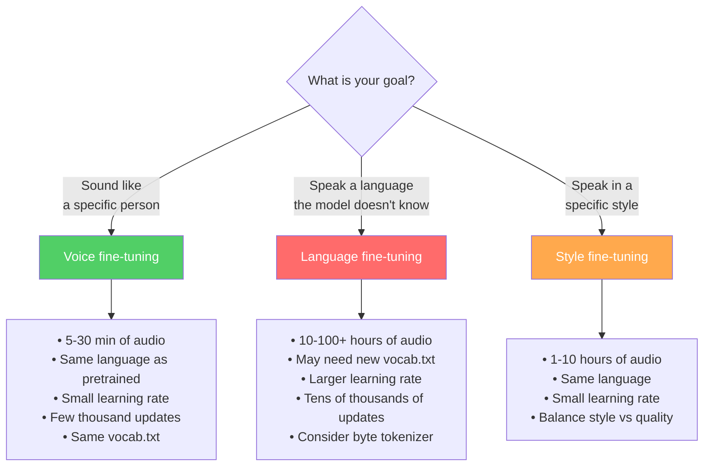
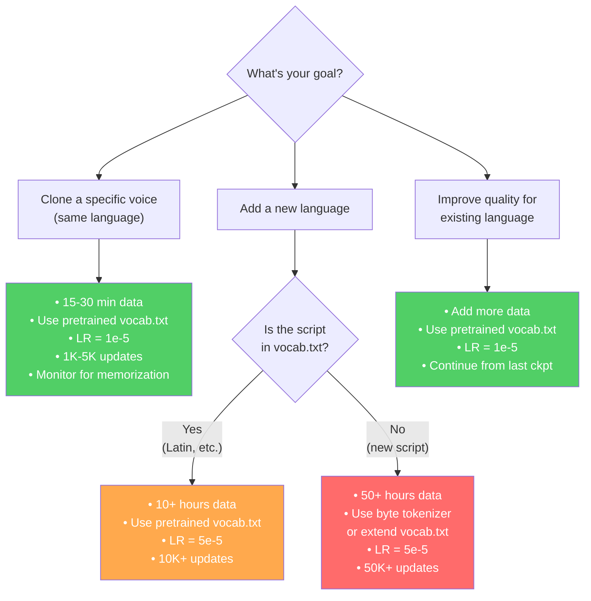

# Fine-Tuning Guide

> [!note] Prerequisites
> Read [[06-data-pipeline]] (data format), [[07-training-loop]] (training mechanics).

This chapter is a practical guide to fine-tuning F5-TTS on your own data.

## New Voice vs New Language — What's the Difference?



| Aspect | Voice fine-tuning | Language fine-tuning |
|--------|-------------------|---------------------|
| Goal | Sound like person X | Speak language Y |
| Data needed | 5-30 minutes | 10-100+ hours |
| Vocabulary changes? | No | Possibly yes |
| Risk of forgetting | Low (few changes) | Medium (lots of changes) |
| Updates | 1,000 - 5,000 | 10,000 - 100,000+ |
| Learning rate | 1e-5 (small) | 1e-5 to 5e-5 |
| Pretrained checkpoint | Required | Required |

## Data Quantity and Quality Requirements

### For voice cloning fine-tuning
- **Minimum**: 5 minutes of clean, single-speaker audio
- **Recommended**: 15-30 minutes
- **Quality**: Studio-quality recording, no background noise, consistent mic distance
- **Format**: Single speaker, natural speech (not reading robotically)

### For language fine-tuning
- **Minimum**: 10 hours (basic quality)
- **Recommended**: 50-100+ hours
- **Quality**: Clean audio with accurate transcriptions
- **Diversity**: Multiple speakers, varied content, natural speech

### For both: quality > quantity
- Audio should be clipped to 3-30 second utterances
- Transcriptions must be accurate (ASR transcription errors will degrade quality)
- Consistent audio quality (don't mix phone recordings with studio recordings)

## Step-by-Step: Fine-Tuning on Custom Voice Data

### Step 1: Prepare your data CSV

Create a CSV file with pipe-separated columns:
```csv
audio_file|text
/absolute/path/to/clip001.wav|This is the first sentence.
/absolute/path/to/clip002.wav|Here is another sentence.
```

> [!warning] Paths must be absolute
> Relative paths will break. Use full absolute paths.

### Step 2: Run the data preparation script

```bash
python src/f5_tts/train/datasets/prepare_csv_wavs.py \
    /path/to/metadata.csv \
    /path/to/output_dir
```

This generates:
- `output_dir/raw.arrow` — The dataset
- `output_dir/duration.json` — Duration list
- `output_dir/vocab.txt` — Character vocabulary

### Step 3: Run fine-tuning

```bash
f5-tts_finetune-cli \
    --exp_name F5TTS_v1_Base \
    --dataset_name /path/to/output_dir \
    --learning_rate 1e-5 \
    --batch_size_per_gpu 3200 \
    --batch_size_type frame \
    --max_samples 64 \
    --epochs 100 \
    --num_warmup_updates 200 \
    --save_per_updates 500 \
    --last_per_updates 200 \
    --finetune \
    --tokenizer custom \
    --tokenizer_path /path/to/output_dir/vocab.txt
```

### What happens under the hood

From `finetune_cli.py:L88-103`:
```python
if args.exp_name == "F5TTS_v1_Base":
    model_cls = DiT
    model_cfg = dict(dim=1024, depth=22, heads=16, ff_mult=2, text_dim=512, conv_layers=4)
    
    if args.finetune:
        if args.pretrain is None:
            # Downloads the pretrained checkpoint from HuggingFace
            ckpt_path = str(cached_path("hf://SWivid/F5-TTS/F5TTS_v1_Base/model_1250000.safetensors"))
        else:
            ckpt_path = args.pretrain
```

The pretrained checkpoint is copied to your output directory with a `pretrained_` prefix (`finetune_cli.py:L141-151`):
```python
if args.finetune:
    file_checkpoint = "pretrained_" + os.path.basename(ckpt_path)
    file_checkpoint = os.path.join(checkpoint_path, file_checkpoint)
    if not os.path.isfile(file_checkpoint):
        shutil.copy2(ckpt_path, file_checkpoint)
```

This ensures the trainer can find and load pretrained weights on the first run, then save its own checkpoints alongside.

## Fine-Tuning Script Parameters Explained

| Parameter | Default | What it does |
|-----------|---------|-------------|
| `--exp_name` | `F5TTS_v1_Base` | Which model architecture to use |
| `--dataset_name` | `Emilia_ZH_EN` | Path to preprocessed dataset directory |
| `--learning_rate` | `1e-5` | Peak learning rate (small for fine-tuning) |
| `--batch_size_per_gpu` | `3200` | Total frames per GPU per batch |
| `--batch_size_type` | `frame` | Use frame-based dynamic batching |
| `--max_samples` | `64` | Maximum number of utterances per batch |
| `--epochs` | `100` | Number of passes through the dataset |
| `--num_warmup_updates` | `20000` | Updates for LR warmup |
| `--save_per_updates` | `50000` | Save numbered checkpoint every N updates |
| `--last_per_updates` | `5000` | Save `model_last.pt` every N updates |
| `--finetune` | flag | Enable fine-tuning (downloads pretrained ckpt) |
| `--pretrain` | None | Custom path to pretrained checkpoint |
| `--tokenizer` | `pinyin` | Tokenizer type: `pinyin`, `char`, `custom` |
| `--tokenizer_path` | None | Path to vocab.txt (required for `custom`) |
| `--log_samples` | flag | Generate audio samples at each checkpoint |
| `--logger` | None | `wandb`, `tensorboard`, or None |
| `--bnb_optimizer` | flag | Use 8-bit Adam (saves memory) |

> [!tip] Recommended fine-tuning settings for voice cloning
> ```bash
> --learning_rate 1e-5
> --batch_size_per_gpu 3200
> --epochs 100       # will likely stop early
> --num_warmup_updates 200
> --save_per_updates 500
> --last_per_updates 200
> --log_samples       # to listen to quality per checkpoint
> ```

## What Layers Are Frozen vs Trained?

By default, **nothing is frozen** — all parameters are trainable during fine-tuning. The small learning rate and pretrained initialization are what prevent catastrophic forgetting.

There is no built-in mechanism for layer freezing in the F5-TTS codebase. If you wanted to freeze specific layers (e.g., only train the text embedding), you would need to manually set `param.requires_grad = False` in the fine-tuning script.

> [!note] Why no freezing?
> The F5-TTS architecture is highly integrated — text, audio, and time conditioning all interact in every block. Freezing any one component (like the text encoder) while Training another (like the audio decoder) would create a mismatch. The whole model needs to co-adapt.

## How Do You Know When to Stop?

### What overfitting looks like in TTS

TTS overfitting is different from classification overfitting. The generated audio doesn't sound "wrong" — it sounds like it's **memorizing** specific utterances:

| Sign | What you hear | What to do |
|------|---------------|------------|
| **Loss keeps decreasing** but audio quality stops improving | Generated speech is technically low-loss but sounds flat/robotic | Stop training |
| **Generated audio sounds exactly like a training sample** | The model is memorizing, not generalizing | Reduce epochs, add more data |
| **Mispronounced words in new text** | The model has forgotten general pronunciation | You've gone too far — use an earlier checkpoint |
| **Reference speaker's voice is perfect but inflection is monotone** | Overfitting to speaker timbre but losing prosody | Balance dataset with more diverse content |

### Practical monitoring

1. **Listen to samples at every checkpoint** — use `--log_samples` flag
2. **Test with text NOT in the training data** — if it sounds bad but training text sounds good, you're overfitting
3. **Watch the loss curve** — it should decrease and plateau. If it goes below 0.01, you're likely memorizing

## The Vocab File — When to Modify

The `vocab.txt` maps characters to integer indices. Changing it means changing the meaning of every token the model has learned.

| Scenario | Do you change vocab.txt? |
|----------|-------------------------|
| Fine-tuning on English voice | No — use the pretrained vocab.txt |
| Fine-tuning on Chinese voice | No — use the pretrained vocab.txt |
| Adding a new language with Latin script (French, Spanish) | Maybe — if special characters (é, ñ) aren't in vocab. Use `byte` tokenizer instead |
| Adding a new script (Hindi, Arabic, Thai) | Yes — or use `byte` tokenizer which handles everything |

> [!tip] The byte tokenizer is your safest option for new languages
> The `byte` tokenizer (`list_str_to_tensor` in `utils.py:L92-95`) converts text to UTF-8 bytes (values 0-255). It works for ANY language without any vocab.txt. The trade-off: it's less efficient (each character becomes 1-4 tokens) and doesn't have pinyin-level pronunciation hints for Chinese.

## Step-by-Step: Fine-Tuning on Hinglish (Hindi-English Code-Switched)

This is a real-world example of language fine-tuning.

### 1. Data sources
- **IndicTTS** dataset (Hindi): ~10 hours of studio-recorded Hindi
- **Kathbath** dataset: Hindi conversational speech
- **Custom recordings**: Hindi-English code-switched speech

### 2. Preprocessing decisions
- **Tokenizer**: Use `byte` tokenizer — it handles both Devanagari and Latin scripts
- **Transliteration**: Do NOT transliterate Hindi to Latin script. The byte tokenizer handles Unicode natively, and the model should learn from native script for better pronunciation

### 3. Prepare the data
```bash
# Combine all audio+transcript pairs into a single CSV
python scripts/combine_hinglish_data.py --output /data/hinglish_metadata.csv

# Prepare the dataset
python src/f5_tts/train/datasets/prepare_csv_wavs.py \
    /data/hinglish_metadata.csv \
    /data/hinglish_dataset
```

### 4. Config changes needed
Since we're using the `byte` tokenizer, which has vocab_size=256, the embedding layer size changes:

```bash
f5-tts_finetune-cli \
    --exp_name F5TTS_v1_Base \
    --dataset_name /data/hinglish_dataset \
    --learning_rate 5e-5 \
    --batch_size_per_gpu 3200 \
    --epochs 50 \
    --num_warmup_updates 2000 \
    --save_per_updates 2000 \
    --finetune \
    --tokenizer custom \
    --tokenizer_path /data/hinglish_dataset/vocab.txt
```

> [!warning] Vocab size mismatch
> If you use a different vocab size than the pretrained model was trained with (pinyin vocab ~2543), the `text_embed` layer dimensions won't match. You'll need to either: (a) initialize a new text embedding layer (losing pretrained text knowledge) or (b) use the same vocab.txt as the pretrained model and add new characters at the end. Option (b) preserves existing character knowledge.

### 5. Evaluate
- Test with pure Hindi sentences
- Test with pure English sentences
- Test with code-switched sentences ("Yeh meeting bahut important hai, please notes le lena")

## Decision Flowchart



> [!warning] EMA weights and early fine-tuning
> From `src/f5_tts/train/README.md`: "The `use_ema = True` might be harmful for early-stage finetuned checkpoints (which goes just few updates, thus ema weights still dominated by pretrained ones)." If your fine-tuned model sounds identical to the pretrained model, try loading with `use_ema=False`.

## Next Steps

- Deploy your fine-tuned model: [[10-production-considerations]]
- Understand why certain design choices were made: [[11-non-obvious-decisions]]
