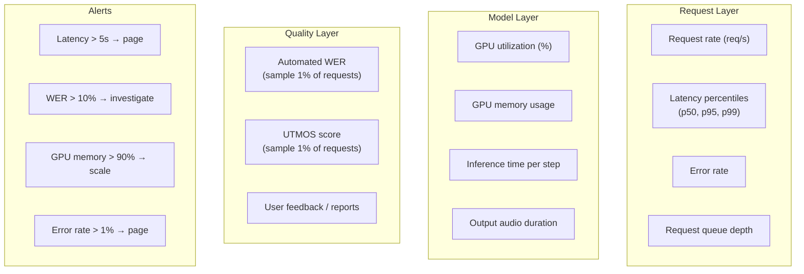
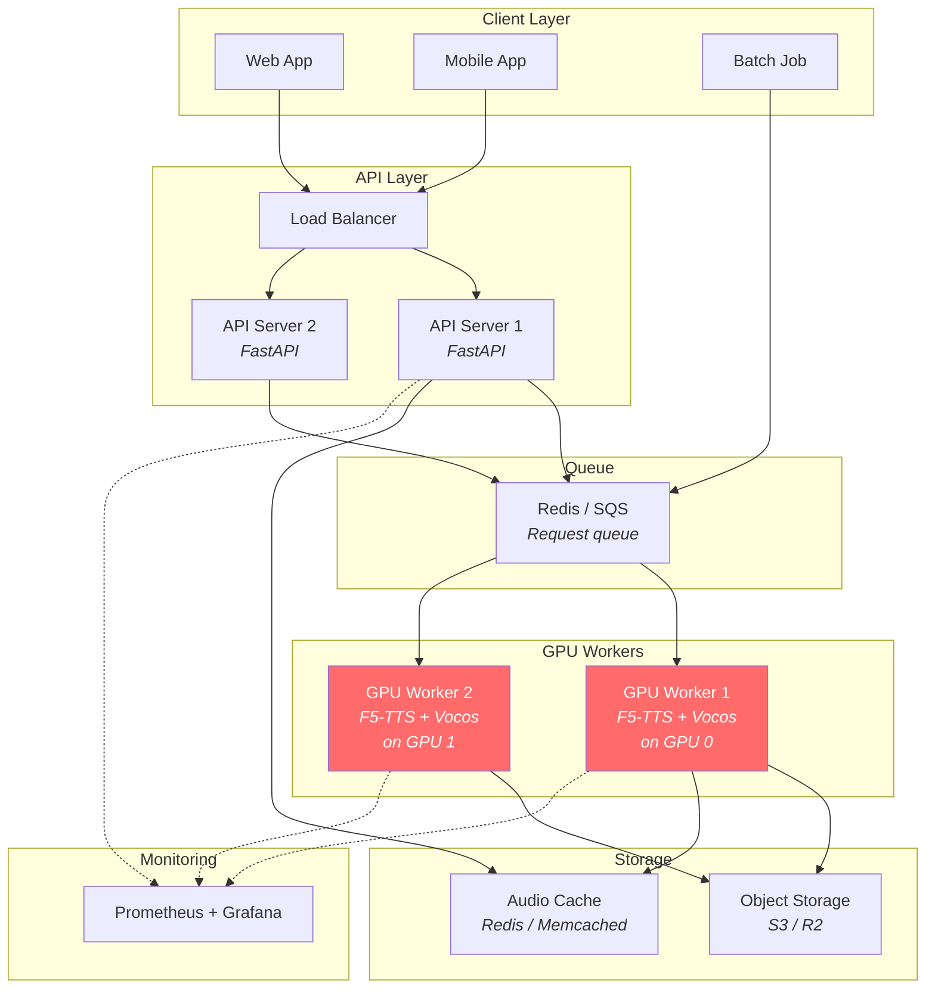

# Production Considerations

> [!note] Prerequisites
> Read [[08-inference-pipeline]] for the inference mechanics.

Everything a backend engineer needs to know to ship F5-TTS in production.

## Model Quantization

### Supported precision levels

| Precision | Memory (model) | Quality | Speed | Supported? |
|-----------|---------------|---------|-------|------------|
| FP32 | ~1.34 GB | Best | Baseline | Yes |
| FP16 | ~670 MB | Near-lossless | ~1.5× faster | Yes (default on CUDA ≥ 7.0) |
| BF16 | ~670 MB | Near-lossless | ~1.5× faster | Yes (Ampere+ GPUs) |
| INT8 | ~335 MB | Slight degradation | ~2× faster | Via bitsandbytes (training only) |
| INT4 | ~168 MB | Noticeable degradation | ~3× faster | Not natively supported |

FP16 is the default for inference (`utils_infer.py:L191-198`):
```python
dtype = (
    torch.float16
    if "cuda" in device
    and torch.cuda.get_device_properties(device).major >= 7
    and not torch.cuda.get_device_name().endswith("[ZLUDA]")
    else torch.float32
)
model = model.to(dtype)
```

> [!warning] BigVGAN requires FP32
> If using BigVGAN as vocoder, the model is forced to FP32 (`utils_infer.py:L273`): `dtype = torch.float32 if mel_spec_type == "bigvgan" else None`. This is because BigVGAN's architecture has numerical instabilities in FP16.

### 8-bit optimizer (training only)

For fine-tuning on limited GPU memory, the trainer supports bitsandbytes 8-bit Adam:
```python
# trainer.py:L138-141
if bnb_optimizer:
    import bitsandbytes as bnb
    self.optimizer = bnb.optim.AdamW8bit(model.parameters(), lr=learning_rate)
```

## Batching Strategy for Multi-Tenant API

For a production API serving multiple users concurrently:

### Option 1: Sequential processing (simplest)
Process one request at a time. Latency = generation time. Throughput = 1/latency.

### Option 2: Dynamic batching (recommended)
Collect requests into batches grouped by similar output duration. Use the same `DynamicBatchSampler` pattern from training:

```python
# Group requests by estimated output length
# Pad shorter ones to match the longest in the batch
# Run one forward pass for the entire batch
# Split results back to individual requests
```

### Option 3: Continuous batching
For streaming use cases, start generating as requests arrive and yield results as they complete. The model supports batch dimension natively, but variable-length outputs require padding.

> [!tip] The ODE solver is the bottleneck
> Each ODE step requires a full forward pass through the 22-layer transformer (×2 for CFG). With 32 steps, that's 64 forward passes per request. Batching amortizes the per-pass overhead.

## Memory Footprint

| Component | FP16 | FP32 |
|-----------|------|------|
| F5-TTS DiT model | ~670 MB | ~1.34 GB |
| Vocos vocoder | ~35 MB | ~70 MB |
| BigVGAN vocoder | ~112 MB | ~224 MB |
| Whisper (for ASR) | ~1.55 GB | ~3.1 GB |
| Peak inference (10s audio, BS=1) | ~2 GB | ~4 GB |
| Peak inference (30s audio, BS=1) | ~4 GB | ~8 GB |

> [!note] Whisper is optional
> The Whisper ASR model is only loaded if `ref_text` is not provided (the model transcribes the reference audio automatically). If you always provide transcriptions, you save ~1.5 GB of GPU memory.

## Latency Bottlenecks

Profiling a typical 10-second generation on A100:

| Stage | Time | % of total |
|-------|------|------------|
| Reference audio preprocessing | ~50 ms | 3% |
| Text processing + tokenization | ~5 ms | <1% |
| ODE solving (32 steps × 2 for CFG) | ~1,200 ms | **80%** |
| Vocoder (mel → waveform) | ~200 ms | 13% |
| Cross-fade stitching | ~5 ms | <1% |
| **Total** | **~1,460 ms** | 100% |

The ODE solver dominates. To reduce latency:
1. **Reduce NFE**: 32 → 16 steps (use EPSS for quality preservation)
2. **Reduce CFG strength to 0**: Skip the unconditioned pass (halves ODE time, quality drops)
3. **Use torch.compile**: See below
4. **Use TensorRT**: See below

## torch.compile

PyTorch 2.0's `torch.compile` can speed up the transformer forward pass:

```python
model.transformer = torch.compile(model.transformer, mode="reduce-overhead")
```

| Aspect | Value |
|--------|-------|
| First-run compile time | 30-120 seconds (one-time cost) |
| Inference speedup | 15-30% on Ampere+ GPUs |
| Memory overhead | ~10% more during compilation |
| Compatibility | Works with FP16, may have issues with some dynamic shapes |

> [!warning] Dynamic shapes
> The F5-TTS model has variable sequence lengths per request. By default, `torch.compile` recompiles for each new shape. Use `dynamic=True` to enable dynamic shapes, but this reduces optimization opportunities. For production, pad all inputs to a fixed maximum length to avoid recompilation.

## ONNX and TensorRT Export

### ONNX Export
The F5-TTS model uses several features that make ONNX export non-trivial:
- `torchdiffeq.odeint` (the ODE solver loop)
- Dynamic control flow in CFG (conditional branching)
- The `RotaryEmbedding` from `x_transformers`

**Feasibility**: The transformer backbone can be exported to ONNX (it's a standard sequence of attention + FFN). But the ODE solver loop must remain in Python.

### TensorRT-LLM
The repo already includes a TensorRT-LLM deployment path:

```
src/f5_tts/runtime/triton_trtllm/
```

From the README benchmarks:

| Setup | RTF | Latency |
|-------|-----|---------|
| PyTorch (offline) | 0.1467 | — |
| TRT-LLM (offline) | 0.0402 | — |
| TRT-LLM + Triton (server, concurrency 2) | 0.0394 | 253 ms |

TRT-LLM achieves **3.65× speedup** over pure PyTorch.

## Setting Up Proper Evals for a TTS System

### Automated metrics

| Metric | What it measures | Tool | Acceptable values |
|--------|-----------------|------|-------------------|
| **WER** (Word Error Rate) | Intelligibility (are words correct?) | Whisper / Paraformer ASR | < 5% for English |
| **SIM** (Speaker Similarity) | Voice cloning faithfulness | WavLM + cosine similarity | > 0.85 |
| **UTMOS** | Naturalness (MOS proxy) | SpeechMOS model | > 4.0 / 5.0 |
| **RTF** (Real-Time Factor) | Speed | Wall clock timing | < 0.3 for real-time |

The evaluation scripts are in `src/f5_tts/eval/`:

```bash
# WER evaluation
python src/f5_tts/eval/eval_seedtts_testset.py --eval_task wer --lang en --gen_wav_dir <DIR>

# Speaker similarity
python src/f5_tts/eval/eval_librispeech_test_clean.py --eval_task sim --gen_wav_dir <DIR>

# UTMOS (naturalness)
python src/f5_tts/eval/eval_utmos.py --audio_dir <DIR> --ext wav
```

### Human evaluation
Automated metrics don't capture everything. You should also:
1. **A/B test** against baseline (previous version or competitor)
2. **MOS study**: Have 10+ listeners rate naturalness 1-5
3. **Content verification**: Check that generated text is correct (no skipped/repeated words)

## Production Monitoring



Key things to monitor:
1. **Latency distribution**: TTS latency varies with output length. Track percentiles, not just averages.
2. **Quality drift**: Periodically run automated eval on a fixed test set. If WER increases, something is wrong.
3. **GPU memory**: Memory usage scales with output duration. Long requests can cause OOM on shared GPUs.
4. **Request patterns**: TTS usage is often bursty (e.g., batch newsletter generation). Scale accordingly.

## Production Architecture Diagram



## Next Steps

- Understand the non-obvious design decisions: [[11-non-obvious-decisions]]
- Reference any term: [[12-glossary]]
