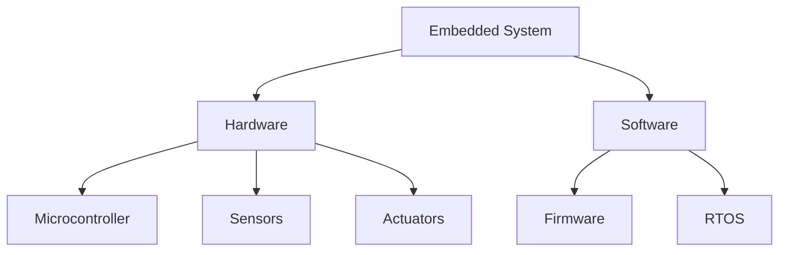
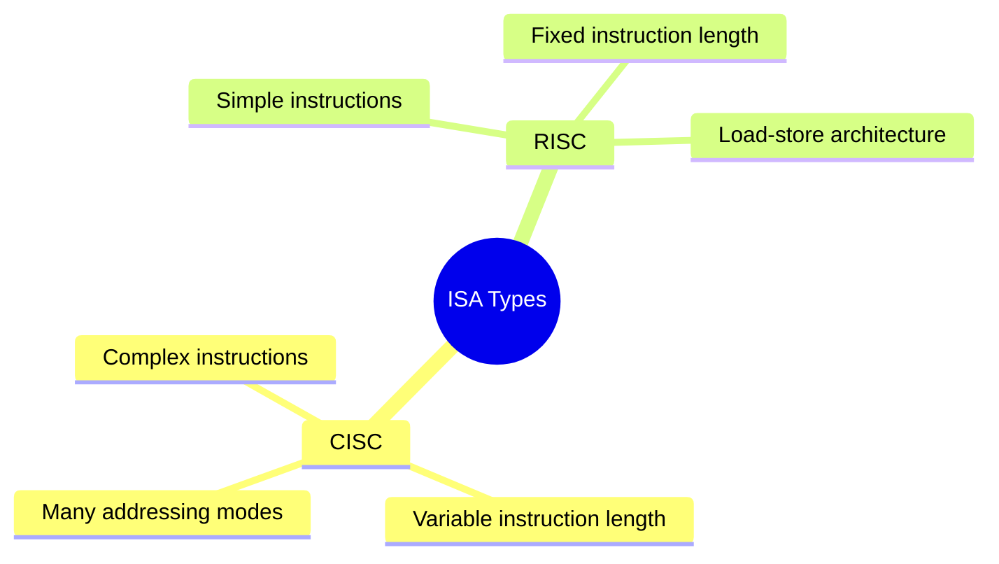

# 🔧 Introduction to Microprocessor Systems
## Core Concepts Overview

![[microprocessor-evolution-timeline.excalidraw]]
^Consider adding an Excalidraw timeline here showing evolution from 4004 to modern processors^

### What is a Microprocessor? 
A microprocessor is an integrated circuit that contains all the functions of a central processing unit of a computer, including:
- Control Unit
- Arithmetic Logic Unit (ALU)
- Registers
- Other associated components

> [!INFO]
> The first commercial microprocessor was the Intel 4004, released in 1971. It was a 4-bit processor with 2,300 transistors.

![[basic-microprocessor-block-diagram.png]]
^Add a block diagram showing basic microprocessor architecture^

---

## 💻 Embedded Systems

### Key Characteristics
1. **Dedicated function** within a larger system
2. **Real-time** computing constraints
3. **Resource-constrained** environments

> [!NOTE]
> Embedded systems are found everywhere - from simple digital watches to complex aircraft control systems.

---

## 🎛️ Microcontrollers

### Comparison with Microprocessors

| Feature | Microcontroller | Microprocessor |
|---------|----------------|----------------|
| Integration | High (CPU + Memory + I/O) | CPU only |
| Cost | Lower | Higher |
| Power Consumption | Lower | Higher |
| System Complexity | Lower | Higher |

![[microcontroller-architecture.excalidraw]]
^Add detailed microcontroller architecture diagram^

---

## 💾 Memory Types

### Primary Memory
- **RAM (Random Access Memory)**
	- SRAM (Static RAM)
	- DRAM (Dynamic RAM)
- **ROM (Read Only Memory)**
	- PROM
	- EPROM
	- EEPROM
	- Flash Memory

$$
\text{Memory Access Time} = \text{Cycle Time} + \text{Latency}
$$
^Add LaTeX equation for memory timing calculations^

> [!TIP]
> Memory hierarchy plays a crucial role in system performance optimization.

![[memory-hierarchy-pyramid.png]]
^Add memory hierarchy pyramid image^

---

## 🏗️ Microprocessor Architecture Classification

### CISC vs RISC

> [!EXAMPLE]
> **CISC Example**: x86 architecture
> **RISC Example**: ARM architecture

![[cisc-vs-risc-comparison.excalidraw]]
^Add comparative diagram of CISC vs RISC execution^

### Memory Interface Based Classification

1. **Von Neumann Architecture**
2. **Harvard Architecture**
3. **Modified Harvard Architecture**

![[memory-interface-architectures.png]]
^Add comparison diagram of different memory interface architectures^

---

## 🚀 Performance Comparison

### Key Metrics
- **MIPS** (Million Instructions Per Second)
- **CPI** (Cycles Per Instruction)
- **Clock Speed**

$$
\text{Performance} = \frac{\text{Instructions}}{\text{Program}} \times \frac{\text{Cycles}}{\text{Instruction}} \times \frac{\text{Time}}{\text{Cycle}}
$$
^Add LaTeX equation for performance calculation^

---

## 🛠️ Software Development Tools

### Development Environment
- **Assemblers**
- **Compilers**
- **Linkers**
- **IDEs**

---

## 🔍 Debugging Tools and Techniques

### Common Debugging Methods
1. **In-Circuit Emulation (ICE)**
2. **JTAG Debugging**
3. **Logic Analyzers**

> [!WARNING]
> Always ensure proper hardware protection when using debugging tools!

![[debugging-setup-diagram.png]]
^Add diagram showing typical debugging setup^

---

## 📚 Related Resources and Links

- [[Microprocessor Architecture Deep Dive]]
- [[Memory Systems and Hierarchy]]
- [[Debugging Best Practices]]
- [[Performance Optimization Techniques]]

> [!TIP]
> This note connects well with:
> - Computer Architecture
> - Digital Electronics
> - Operating Systems
