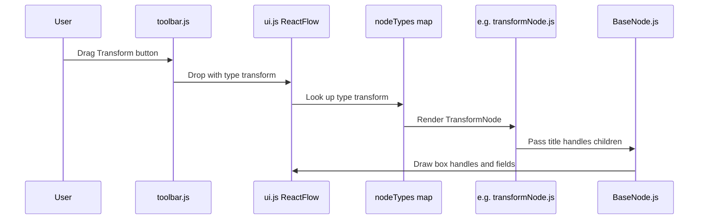

# Part 1: Node Abstraction

This document explains Part 1 of the VectorShift assessment: creating a reusable node abstraction, refactoring the four starter nodes, and adding five new AI-pipeline demo nodes.

Written for someone with **no frontend background** — backend concepts are used as analogies where helpful.

---

## What the assignment asked for

From the assessment PDF:

1. Create an **abstraction** so you do not copy-paste entire files when adding new nodes
2. **Refactor** the four existing nodes (Input, LLM, Output, Text) to use it
3. Add **five new nodes** to prove the abstraction is flexible
4. Do not worry too much about what the new nodes actually *do* — they are demos

**Judged on:** code architecture and design.

---

## Is VectorShift like Zapier / Make / n8n?

**Similar in UX, different in purpose.**

| | Zapier / Make / n8n | VectorShift |
|---|---|---|
| **How it looks** | Drag nodes, connect wires | Same |
| **Typical nodes** | "Gmail trigger", "HTTP request", "Slack" | **Input, Text, LLM, Output** |
| **What flows** | App integrations, JSON events | **Text and prompts through AI steps** |
| **Who uses it** | Ops teams automating SaaS | **Non-technical users building AI pipelines** |

VectorShift is closer to **Flowise / Langflow** (AI pipeline builders) than to a full Zapier clone.

Our five new nodes borrow **ideas** from automation tools (IF, merge, split, wait) but are named for **AI data pipelines**, not CRM integrations.

---

## Big picture: how a node appears on screen



**In plain English:**

1. Toolbar buttons are draggable stickers labeled with a **type string** (e.g. `"transform"`).
2. When you drop on the canvas, React Flow creates a node with that type.
3. React Flow looks up the type in a **registry** (`nodeTypes`) to find which React component to render.
4. That component (e.g. `TransformNode`) is thin — it mostly configures `BaseNode`.
5. `BaseNode` draws the shared box, connection ports, and title.

---

## Frontend concepts (minimal glossary)

| Term | Backend analogy | Meaning here |
|------|-----------------|--------------|
| **React component** | Like a class or template that renders UI | A function that returns HTML-like **JSX** |
| **Props** | Constructor arguments / request params | Data passed *into* a component from its parent |
| **JSX** | — | HTML-ish syntax inside JavaScript: `<div>...</div>` |
| **State** | Instance field that triggers re-render | `useState` — when user types, value updates and UI refreshes |
| **children** | Nested content / body | Whatever you put between `<BaseNode>...</BaseNode>` tags |
| **Handle** | API port / socket | Small dot on a node where you drag connection wires |
| **nodeTypes** | Route → handler registry | Map from type string to component: `{ transform: TransformNode }` |

---

## The problem we fixed (duplication)

Before Part 1, every node file repeated the same pattern:

```jsx
<div style={{ width: 200, height: 80, border: '1px solid black' }}>
  <span>Title</span>
  {/* custom fields */}
  <Handle type="source" position={Position.Right} id={`${id}-output`} />
</div>
```

Adding a 6th node meant copying all of that again. The abstraction pulls the repeated shell into **one place**.

---

## What we built

### File structure

```
frontend/src/nodes/
  BaseNode.js          ← shared shell + handle rendering
  fields.js            ← tiny LabeledInput / LabeledSelect helpers
  inputNode.js         ← refactored
  outputNode.js        ← refactored
  llmNode.js           ← refactored
  textNode.js          ← refactored
  conditionNode.js     ← NEW
  mergeNode.js         ← NEW
  transformNode.js     ← NEW
  splitNode.js         ← NEW
  delayNode.js         ← NEW
  index.js             ← exports all nodes from one place
```

Also updated:

- [`frontend/src/ui.js`](../frontend/src/ui.js) — `nodeTypes` registry (9 types)
- [`frontend/src/toolbar.js`](../frontend/src/toolbar.js) — 9 draggable buttons

---

## BaseNode — the core abstraction

**File:** [`frontend/src/nodes/BaseNode.js`](../frontend/src/nodes/BaseNode.js)

**What it does:** Renders the outer box, title, connection handles, and a slot for custom content.

**Props:**

| Prop | Type | Purpose |
|------|------|---------|
| `id` | string | React Flow node id — used to build handle ids |
| `title` | string | Header label ("Input", "Transform", etc.) |
| `handles` | array | Connection port definitions |
| `children` | JSX | Node-specific body (inputs, dropdowns) |
| `style` | object | Optional style override (for Part 3 text resize later) |

**Handle config** (each item in the `handles` array):

```javascript
{
  type: 'source',           // 'source' = output (right side flow out)
                            // 'target' = input (flow in)
  position: Position.Right, // which side of the box
  idSuffix: 'output',       // becomes `${id}-output` as the handle id
  style: { top: '33%' },    // optional — stagger multiple handles vertically
}
```

**Why handle ids matter:** When you connect two nodes, React Flow stores `sourceHandle` and `targetHandle` using these ids. We kept the **same ids** on refactored nodes so existing connection behavior is unchanged.

**Part 3 note:** `textNode.js` will later pass a **dynamic** `handles` array (one per `{{variable}}`). `BaseNode` already accepts `handles` as a prop — no change needed to the abstraction.

---

## fields.js — small helpers

**File:** [`frontend/src/nodes/fields.js`](../frontend/src/nodes/fields.js)

Two tiny components to avoid repeating `<label><input /></label>` in every node:

- `LabeledInput` — text or number input with a label
- `LabeledSelect` — dropdown with a label

Not a design system — just deduplication, same idea as a shared form helper in backend code.

---

## Refactored nodes (before vs after)

### Before (`inputNode.js` — 47 lines)

The file contained: border div, title, two fields, one Handle — all inline.

### After (`inputNode.js` — ~30 lines)

```javascript
export const InputNode = ({ id, data }) => {
  const [currName, setCurrName] = useState(...);
  const [inputType, setInputType] = useState(...);

  return (
    <BaseNode
      id={id}
      title="Input"
      handles={[{ type: 'source', position: Position.Right, idSuffix: 'value' }]}
    >
      <LabeledInput label="Name" value={currName} onChange={...} />
      <LabeledSelect label="Type" value={inputType} onChange={...} options={...} />
    </BaseNode>
  );
};
```

**What stayed the same:**

- Handle id: `${id}-value`
- Default name and type values
- Visual appearance (still 200×80 black border via BaseNode)

| Node | Handles |
|------|---------|
| Input | 1 source (right): `value` |
| Output | 1 target (left): `value` |
| LLM | 2 targets (left): `system`, `prompt` + 1 source (right): `response` |
| Text | 1 source (right): `output` |

---

## Five new AI-pipeline demo nodes

These show the abstraction handles different shapes. None execute real logic — they are UI demos.

| Node | File | Automation analog | Handles | Field |
|------|------|-------------------|---------|-------|
| **Condition** | `conditionNode.js` | n8n IF | 1 in, 2 out (true/false) | If expression |
| **Merge** | `mergeNode.js` | n8n Merge | 2 in, 1 out | Mode: Concat / JSON |
| **Transform** | `transformNode.js` | n8n Set | 1 in, 1 out | Rule text |
| **Split** | `splitNode.js` | n8n Split | 1 in, 2 out (A/B) | Split by: Token / Line |
| **Delay** | `delayNode.js` | n8n Wait | 1 in, 1 out | Delay (ms) |

**Type strings** (used in toolbar + registry):

`condition`, `merge`, `transform`, `split`, `delay`

**Example pipeline for your screen recording:**

```
Input → Text → Transform → LLM → Condition → Output
              ↘ Merge ↗
```

Shows an AI workflow story, not a CRM automator.

---

## The registry pattern (nodeTypes)

**File:** [`frontend/src/ui.js`](../frontend/src/ui.js)

```javascript
const nodeTypes = {
  customInput: InputNode,
  llm: LLMNode,
  customOutput: OutputNode,
  text: TextNode,
  condition: ConditionNode,
  merge: MergeNode,
  transform: TransformNode,
  split: SplitNode,
  delay: DelayNode,
};
```

React Flow reads this map when rendering the canvas. The **key** must match:

1. The `type` on the draggable toolbar button
2. The `type` stored when a node is dropped (see `onDrop` in `ui.js`)

If you add a 10th node and forget to register it here, you'll get a blank or error node on the canvas.

**Backend analogy:** This is like a URL router table — `"/transform"` → `TransformHandler`.

---

## How to add a 10th node (3 steps)

1. **Create** `frontend/src/nodes/myNode.js`:

```javascript
import { Position } from 'reactflow';
import { BaseNode } from './BaseNode';

export const MyNode = ({ id }) => (
  <BaseNode
    id={id}
    title="My Node"
    handles={[
      { type: 'target', position: Position.Left, idSuffix: 'input' },
      { type: 'source', position: Position.Right, idSuffix: 'output' },
    ]}
  >
    <span>Hello</span>
  </BaseNode>
);
```

2. **Export** from `index.js` and **register** in `ui.js` `nodeTypes`.
3. **Add** `<DraggableNode type="myNode" label="My Node" />` in `toolbar.js`.

Done — no changes to `BaseNode` required.

---

## What we did NOT change

| Skipped | Why |
|---------|-----|
| Styling / Tailwind | Part 2 — you'll drive design separately |
| Part 3 text resize / `{{var}}` handles | Separate part |
| Zustand `updateNodeField` | Starter nodes keep local state only |
| Backend | New nodes are frontend-only; Submit still sends all nodes/edges |

---

## How to verify

```bash
cd frontend
npm install
npm start
```

1. All **9 toolbar buttons** drag onto the canvas
2. **Original 4 nodes** still connect (same handle positions)
3. **Merge / Condition / Split** show multiple handles on left or right
4. **Transform / Delay** work in a simple A → B chain
5. **Submit** still returns correct `num_nodes` (Part 4)

Build check (optional):

```bash
npm run build
```

---

## Files changed (quick index)

| File | Change |
|------|--------|
| `nodes/BaseNode.js` | Created — shared abstraction |
| `nodes/fields.js` | Created — input/select helpers |
| `nodes/inputNode.js` | Refactored to use BaseNode |
| `nodes/outputNode.js` | Refactored |
| `nodes/llmNode.js` | Refactored |
| `nodes/textNode.js` | Refactored |
| `nodes/conditionNode.js` | Created |
| `nodes/mergeNode.js` | Created |
| `nodes/transformNode.js` | Created |
| `nodes/splitNode.js` | Created |
| `nodes/delayNode.js` | Created |
| `nodes/index.js` | Created — central exports |
| `ui.js` | Registered 9 node types |
| `toolbar.js` | Added 5 new draggable buttons |

---

## Screen recording talking points (Part 1, ~2 min)

1. **Problem:** Four nodes duplicated box/handle/title code.
2. **Solution:** `BaseNode` + thin per-node config files.
3. **Demo:** Add Condition/Merge/etc. in ~25 lines each.
4. **Registry:** `nodeTypes` in `ui.js` — type string → component.
5. **Product fit:** AI pipeline nodes, not Zapier integrations.
6. **Extensibility:** Part 3 will pass dynamic handles into the same `BaseNode`.

---

## Related docs

- [Part 4: Backend Integration](part-4-backend-integration.md) — Submit button and DAG validation
- [Docs index](README.md)
