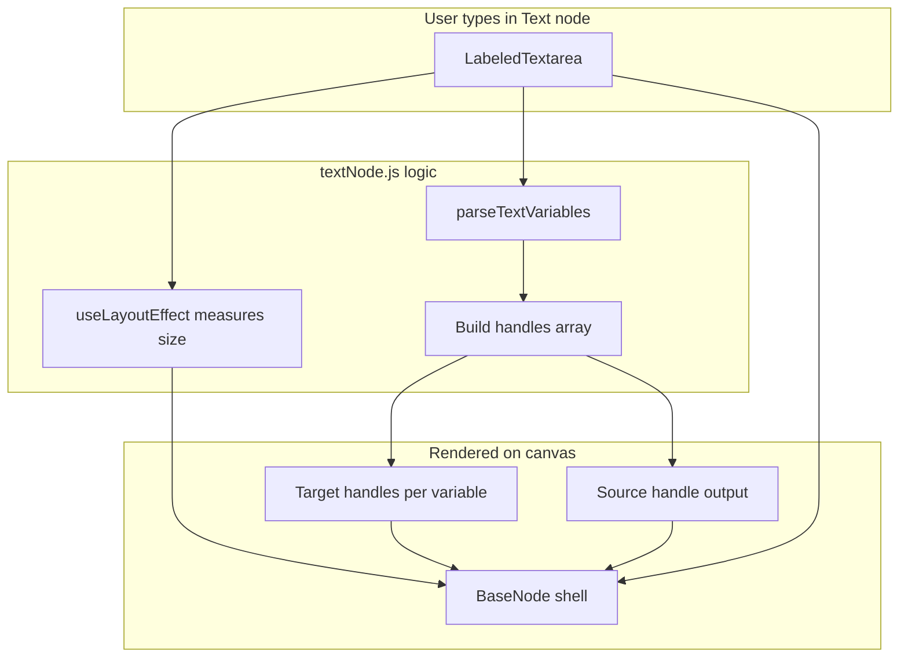

# Part 3: Text Node Logic

This document explains Part 3 of the VectorShift assessment: making the Text node auto-resize and dynamically create input handles when you type `{{variable}}` syntax.

Written for someone with **no frontend background**.

---

## Why does the assignment care about the Text node?

The PDF does **not** ask you to build a full executor. Part 3 is a **frontend challenge** about dynamic UI:

1. **Auto-resize** — prove you can measure DOM and react to user input.
2. **`{{variable}}` handles** — prove you understand React Flow's dynamic ports.

**What the Text node is for in a real pipeline** (n8n / VectorShift mental model):

The Text node is a **prompt template** — static copy with holes for upstream data. You wire multiple branches into those holes, then send the composed string to an LLM.

```
Input (name: "Rikhil") ──► Text {{name}} summarize: {{topic}} ◄── Input (topic: "aglets")
                                      │
                                      ▼
                                    LLM prompt
```

That is the same idea as n8n's expression fields or a "Set" node that builds a string before an AI step. Part 3 tests whether you can **expose each `{{variable}}` as a connectable port** on the canvas. Our run endpoint (Part 5) substitutes those variables at execution time.

| Assessment part | Text node responsibility |
|-----------------|--------------------------|
| Part 3 (required) | Resize + dynamic left handles in the UI |
| Part 5 (extra) | `{{var}}` substitution when the pipeline runs |

---

## What the assignment asked for

From the assessment PDF, improve the Text node in two ways:

1. **Auto-resize** — the node's width and height should change as the user types more text, so content stays visible.
2. **Variable handles** — when the user types a valid JavaScript variable name inside double curly braces (e.g. `{{input}}` or `{{ userName }}`), create a new **input handle on the left** of the Text node for each variable.

The right-side **output** handle stays — text still flows out to the next node (e.g. LLM).

---

## Big picture



**In plain English:** every keystroke updates the text state. React re-runs the component, which (1) measures how big the textarea needs to be, (2) scans the text for `{{variables}}`, and (3) tells `BaseNode` how many left-side ports to draw.

---

## Frontend concepts you need here

| Term | Plain English |
|------|----------------|
| **input** | Single-line text box (what Text node used before) |
| **textarea** | Multi-line text box — can grow taller |
| **useState** | Holds `currText` in memory; typing updates it and re-renders the UI |
| **useRef** | A pointer to the real DOM textarea element so we can measure its size |
| **useLayoutEffect** | Runs right after the DOM updates, before the screen paints — used to measure textarea dimensions |
| **target handle** | Input port (left side) — wires flow *into* the node |
| **source handle** | Output port (right side) — wires flow *out* |
| **re-render** | When `currText` changes, React runs `TextNode` again → handles and size recalculate |

**Backend analogy:** `parseTextVariables` is like a pure validation function (no I/O). `textNode.js` is the controller that calls it and builds the response (handles + dimensions).

---

## File 1: `parseTextVariables.js`

**Path:** [`frontend/src/nodes/parseTextVariables.js`](../frontend/src/nodes/parseTextVariables.js)

**What it does:** Scans a string and returns unique variable names found in `{{ }}`.

```javascript
const VARIABLE_PATTERN = /\{\{\s*([a-zA-Z_$][a-zA-Z0-9_$]*)\s*\}\}/g;

export function parseTextVariables(text) {
  // Returns e.g. ['input', 'name'] in order of first appearance
}
```

**Regex breakdown (don't panic):**

| Piece | Meaning |
|-------|---------|
| `\{\{` | Literal `{{` |
| `\s*` | Optional spaces |
| `([a-zA-Z_$]...)` | Capture group — the variable name |
| `[a-zA-Z_$]` | First char: letter, `_`, or `$` |
| `[a-zA-Z0-9_$]*` | Rest: letters, digits, `_`, `$` |
| `\s*` | Optional spaces before closing |
| `\}\}` | Literal `}}` |

**Examples:**

| Text | Result | Why |
|------|--------|-----|
| `Hello` | `[]` | No `{{ }}` |
| `{{input}}` | `['input']` | One valid variable |
| `{{ input }}` | `['input']` | Spaces allowed inside braces |
| `{{input}} and {{name}}` | `['input', 'name']` | Two variables |
| `{{input}} {{input}}` | `['input']` | Duplicates removed |
| `{{123bad}}` | `[]` | `123` invalid start for JS identifier |
| `{{in` | `[]` | Incomplete — no closing `}}` |

**Why a separate file:** Same idea as `dag_validator.py` on the backend — testable logic, not mixed with UI.

---

## File 2: `LabeledTextarea` in `fields.js`

**Path:** [`frontend/src/nodes/fields.js`](../frontend/src/nodes/fields.js)

**What changed:** Added a multi-line field with `forwardRef` so `textNode.js` can attach a ref for measuring.

```javascript
export const LabeledTextarea = forwardRef(({ label, value, onChange }, ref) => (
  <textarea ref={ref} ... />
));
```

**`forwardRef`:** Normally child components hide their DOM nodes. `forwardRef` lets the parent pass a `ref` through to the actual `<textarea>` — needed for `scrollWidth` / `scrollHeight` measurement.

**Styles on textarea:**
- `resize: 'none'` — user can't drag-resize manually (the node auto-resizes instead)
- `overflow: 'hidden'` — no scrollbar inside the tiny box
- `width: '100%'` — fills the node after size is computed

---

## File 3: `textNode.js` (main logic)

**Path:** [`frontend/src/nodes/textNode.js`](../frontend/src/nodes/textNode.js)

### Auto-resize

```javascript
const MIN_WIDTH = 200;
const MIN_HEIGHT = 80;

useLayoutEffect(() => {
  const el = textareaRef.current;
  el.style.width = 'auto';
  el.style.height = 'auto';
  const width = Math.max(MIN_WIDTH, el.scrollWidth + 24);
  const height = Math.max(MIN_HEIGHT, el.scrollHeight + 24);
  el.style.width = '100%';
  setSize({ width, height });
}, [currText]);
```

**Steps:**
1. Temporarily set textarea to `auto` size so the browser reports true content dimensions.
2. Read `scrollWidth` and `scrollHeight` (how much space the text needs).
3. Enforce minimum 200×80 (same as original node).
4. Save size to state → passed to `BaseNode` via `style` prop.
5. Reset textarea to `width: 100%` so it fills the node.

**Why `useLayoutEffect` not `useEffect`?** Layout effect runs before paint, reducing visible flicker when the box jumps size.

### Dynamic handles

```javascript
const variables = parseTextVariables(currText);

const inputHandles = variables.map((name, index) => ({
  type: 'target',
  position: Position.Left,
  idSuffix: name,                    // handle id becomes text-1-input
  style: { top: `${...}%` },         // stack vertically on the left
}));

const handles = [
  ...inputHandles,
  { type: 'source', position: Position.Right, idSuffix: 'output' },
];
```

**Handle ids:** For `{{input}}` on node `text-1`, the left handle id is `text-1-input`. When you connect Input → Text, React Flow stores that id on the edge.

**Multiple variables:** Handles are spaced evenly down the left edge (same idea as LLM's two prompt handles).

### Connection to Part 1

Part 1 built `BaseNode` to accept a **dynamic** `handles` array and `style` override. Part 3 only changes `textNode.js` — no redesign of the abstraction.

---

## File 4: Minor `BaseNode.js` tweak

Added `boxSizing: 'border-box'` so width/height include the border when measuring. Prevents the box being slightly too small.

---

## What we did NOT build

| Skipped | Why |
|---------|-----|
| Part 2 styling | Separate part |
| Replacing variables at runtime | Out of scope — UI only |
| Removing orphan edges when a variable is deleted | React Flow may leave stale edges; acceptable for assignment |
| Saving text to Zustand store | Not required by PDF |
| Backend changes | Text logic is frontend-only |

---

## How to verify

```bash
cd frontend
npm start
```

1. Drag **Text** node → should show **one left handle** (default `{{input}}`)
2. Connect **Input** output → Text `input` handle
3. Add `{{name}}` in text → **second left handle** appears
4. Delete `{{name}}` → handle goes away
5. Type a long paragraph → node **grows**
6. Delete text → node shrinks toward 200×80
7. Type `{{123}}` → no new handle (invalid)
8. Connect Text **output** → LLM **prompt** — still works
9. **Submit** — text node counted in `num_nodes`

---

## Files changed

| File | Change |
|------|--------|
| `nodes/parseTextVariables.js` | Created — regex parser |
| `nodes/fields.js` | Added `LabeledTextarea` |
| `nodes/textNode.js` | Resize + dynamic handles |
| `nodes/BaseNode.js` | `boxSizing: 'border-box'` |

---

## Screen recording talking points (~1–2 min)

1. **Problem:** Fixed-size single-line input; no variables as connection points.
2. **Parser:** Show `parseTextVariables.js` and type `{{input}}` / `{{name}}` in the app.
3. **Handles:** Left ports appear per variable; output on the right unchanged.
4. **Resize:** Type more text — node grows; delete — shrinks.
5. **Part 1 payoff:** Same `BaseNode`; only `textNode` got smarter.

---

## Related docs

- [Part 1: Node Abstraction](part-1-node-abstraction.md) — `BaseNode` design
- [Part 4: Backend Integration](part-4-backend-integration.md) — Submit flow
- [Docs index](README.md)
