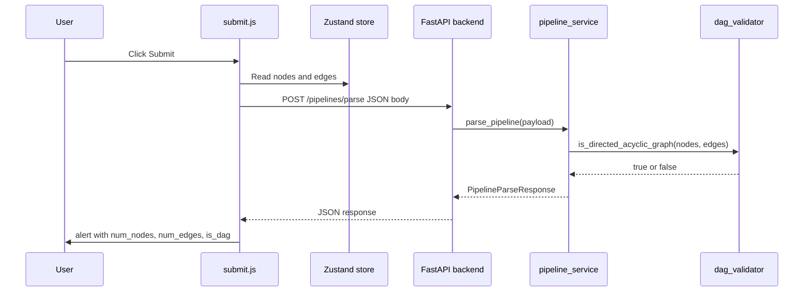

# Part 4: Backend Integration

This document explains the backend work for Part 4 of the VectorShift assessment: connecting the React pipeline editor to a FastAPI backend that counts nodes/edges and checks whether the pipeline is a **DAG** (Directed Acyclic Graph).

---

## What the assignment asked for

From the assessment PDF:

1. **Frontend:** When the user clicks Submit, send the current `nodes` and `edges` to the backend.
2. **Backend:** Implement `POST /pipelines/parse` to:
   - Count how many nodes are in the pipeline
   - Count how many edges are in the pipeline
   - Check if the graph is a DAG (no directed cycles)
3. **Response format:** exactly this JSON shape:

```json
{
  "num_nodes": 3,
  "num_edges": 2,
  "is_dag": true
}
```

4. **Frontend again:** Show an `alert()` with those three values in a readable way.

That is the full scope. No database, no auth, no saving pipelines — just parse and return stats.

---

## Big picture: what happens when you click Submit



**In plain English:** the canvas already holds your graph in memory (Zustand). Submit packages that graph as JSON, sends it to Python, Python does the math, and the browser shows you the result.

---

## Project layout (backend)

```
backend/
  main.py                 # Entry point for uvicorn (re-exports app)
  pyproject.toml          # Dependencies and pytest config
  app/
    main.py               # FastAPI app, CORS, router mounting
    core/
      config.py           # Settings (CORS origins, app name)
    api/v1/
      api.py              # Combines all domain routers
    domains/pipelines/
      router/             # HTTP layer — URL + method
      controller/         # Thin orchestration
      service/            # Business logic + DAG algorithm
      schemas/            # Pydantic request/response models
    tests/                # Unit + API tests
```

### Why this structure?

The assessment only needs one endpoint, but the code is organized in layers similar to a production backend (like your Visibl project):

| Layer | File | Responsibility |
|-------|------|----------------|
| Router | `pipeline_router.py` | HTTP: path, method, request/response types |
| Controller | `pipeline_controller.py` | Glue between router and service |
| Service | `pipeline_service.py` | Business rules: count nodes/edges, call DAG check |
| Validator | `dag_validator.py` | Pure graph algorithm (easy to unit test) |
| Schemas | `pipeline.py` | Data shapes validated by Pydantic |

**Why not put everything in `main.py`?**

- DAG logic can be tested without starting a web server
- If you later add a database, only the service layer changes
- Reviewers see you understand separation of concerns

**Why no CRUD layer?**

CRUD (Create, Read, Update, Delete against a database) only makes sense when data is persisted. This endpoint is **stateless** — it receives a graph, computes results, and returns them. Nothing is saved. A fake CRUD layer would be unnecessary boilerplate.

---

## Layer-by-layer walkthrough

### 1. Schemas (`app/domains/pipelines/schemas/pipeline.py`)

**What:** Pydantic models that describe the JSON the API accepts and returns.

**Why Pydantic?**

- Validates incoming JSON automatically (wrong types → 422 error)
- Documents the API in OpenAPI/Swagger (`/docs`)
- Gives you typed Python objects instead of raw dicts

**Key models:**

```python
class Node(BaseModel):
    id: str
    type: str
    position: dict[str, float] = ...
    data: dict[str, Any] = ...

class Edge(BaseModel):
    id: str
    source: str      # node id where the edge starts
    target: str      # node id where the edge ends
    sourceHandle: str | None = None
    targetHandle: str | None = None

class PipelineParseRequest(BaseModel):
    nodes: list[Node]
    edges: list[Edge]

class PipelineParseResponse(BaseModel):
    num_nodes: int
    num_edges: int
    is_dag: bool
```

**`extra="ignore"` on Node and Edge:** React Flow sends more fields than we strictly need (e.g. `width`, `height`, `selected`). Ignoring extras means the backend does not break when the frontend sends a richer object.

---

### 2. Router (`app/domains/pipelines/router/pipeline_router.py`)

**What:** Defines the HTTP endpoint.

```python
@router.post("/parse", response_model=PipelineParseResponse)
async def parse_pipeline_route(payload: PipelineParseRequest):
    return await pipeline_controller.parse_pipeline(payload)
```

**Why `POST` not `GET`?**

- The body contains the full pipeline (can be large)
- GET requests should not carry heavy payloads in the body
- The original stub incorrectly used `GET` + form data; the assignment expects JSON over POST

**Why `async def`?**

Even though this handler does not await I/O today, async keeps the same interface you'd use with a database or external API later. FastAPI runs async routes efficiently.

**URL:** `POST http://localhost:8000/pipelines/parse` — matches the assessment doc exactly (no `/api/v1` prefix).

---

### 3. Controller (`app/domains/pipelines/controller/pipeline_controller.py`)

**What:** One function that forwards the request to the service.

```python
async def parse_pipeline(payload: PipelineParseRequest) -> PipelineParseResponse:
    return await pipeline_service.parse_pipeline(payload)
```

**Why exist at all?**

In a larger app, the controller might:

- Resolve auth / permissions
- Map domain exceptions to HTTP errors
- Coordinate multiple services

Here it is thin on purpose, but it keeps the router free of business logic — same pattern as Visibl's `ingestion_controller`.

---

### 4. Service (`app/domains/pipelines/service/pipeline_service.py`)

**What:** The "business logic" for this feature.

```python
async def parse_pipeline(payload: PipelineParseRequest) -> PipelineParseResponse:
    num_nodes = len(payload.nodes)
    num_edges = len(payload.edges)
    is_dag = dag_validator.is_directed_acyclic_graph(payload.nodes, payload.edges)
    return PipelineParseResponse(num_nodes=..., num_edges=..., is_dag=...)
```

**Design choices:**

| Choice | Reason |
|--------|--------|
| `num_nodes = len(nodes)` | Assignment says count nodes in the pipeline |
| `num_edges = len(edges)` | Count all edges sent by frontend, including orphan edges |
| Delegate DAG to `dag_validator` | Single responsibility; algorithm is testable in isolation |

---

### 5. DAG validator (`app/domains/pipelines/service/dag_validator.py`)

**What:** Answers "does this directed graph have a cycle?"

**What is a DAG?**

- **Directed:** edges have a direction (A → B is not the same as B → A)
- **Acyclic:** you cannot follow edges and return to a node you already visited

Pipelines should be DAGs because cycles mean infinite loops (node A feeds B feeds A forever).

**Algorithm: Kahn's algorithm (topological sort)**

High-level steps:

1. Build an adjacency list: for each edge `source → target`, record that `target` is a child of `source`
2. Count **in-degree** for each node (how many edges point into it)
3. Start with all nodes that have in-degree 0 (nothing points into them)
4. Repeatedly remove a node from the graph and decrease in-degrees of its neighbors
5. If you removed every node → no cycle → **DAG**
6. If nodes remain → there is a cycle → **not a DAG**

**Edge cases handled:**

| Scenario | `is_dag` |
|----------|----------|
| 0 nodes, 0 edges | `true` |
| 1 node, 0 edges | `true` |
| Linear chain A → B → C | `true` |
| Cycle A → B → A | `false` |
| Self-loop A → A | `false` |
| Two disconnected chains, no cycle | `true` |

**Orphan edges:** If an edge references a node id that does not exist in `nodes`, it is **skipped for cycle detection** but still counted in `num_edges`. Example: edge `a → missing` does not create a cycle among real nodes.

**Why not use NetworkX?**

NetworkX would work, but ~30 lines of pure Python is easier to explain in an interview and avoids an extra dependency for one function.

---

### 6. App setup (`app/main.py` + `app/core/config.py`)

**What `app/main.py` does:**

- Creates the FastAPI application
- Adds **CORS middleware** so `http://localhost:3000` (React) can call `http://localhost:8000` (Python)
- Mounts the API router
- Exposes `GET /` → `{"Ping": "Pong"}` as a health check

**Why CORS?**

Browsers block requests from one origin (port 3000) to another (port 8000) unless the server explicitly allows it. Without CORS, Submit would fail in the browser even if the backend logic is correct.

**Config (`config.py`):**

Uses `pydantic-settings` so allowed origins and app name can come from environment variables later. Defaults include `http://localhost:3000`.

**Root `backend/main.py`:**

```python
from app.main import app
```

The assessment says to run `uvicorn main:app --reload` from `/backend`. This one-liner keeps that command working while the real app lives in the `app/` package.

---

## Frontend piece (`frontend/src/submit.js`)

You asked mainly about backend, but Part 4 is a full integration — here is the frontend side in brief.

**What changed:**

The Submit button used to do nothing. Now it:

1. Reads `nodes` and `edges` from the Zustand store (global React state for the canvas)
2. `fetch` POSTs them as JSON to the backend
3. Shows `alert()` with the response or an error message

**Zustand:** A small state library. `useStore` subscribes to `nodes` and `edges` so Submit always sends the current canvas. It was used in the starter code but missing from `package.json` — `zustand` was added so `npm install` works.

**`shallow`:** Avoids re-rendering when unrelated store fields change — a small React performance pattern.

---

## API contract reference

### Request

```
POST /pipelines/parse
Content-Type: application/json
```

```json
{
  "nodes": [
    {
      "id": "text-1",
      "type": "text",
      "position": { "x": 100, "y": 200 },
      "data": { "id": "text-1", "nodeType": "text" }
    }
  ],
  "edges": [
    {
      "id": "reactflow__edge-text-1output-llm-1prompt",
      "source": "text-1",
      "target": "llm-1",
      "sourceHandle": "text-1-output",
      "targetHandle": "llm-1-prompt"
    }
  ]
}
```

### Response (200 OK)

```json
{
  "num_nodes": 1,
  "num_edges": 1,
  "is_dag": true
}
```

### Validation error (422)

Sent when the body is malformed (e.g. `nodes` is a string instead of a list).

---

## How to run and verify

### Install and start backend

```bash
cd backend
pip install -e ".[dev]"
uvicorn main:app --reload
```

- API: http://localhost:8000
- Interactive docs: http://localhost:8000/docs (try POST `/pipelines/parse` here)

### Install and start frontend

```bash
cd frontend
npm install
npm start
```

- App: http://localhost:3000

### Manual test

1. Drag a few nodes onto the canvas
2. Connect them with edges (drag from a handle on one node to another)
3. Click **Submit**
4. You should see an alert like:

```
Nodes: 3
Edges: 2
Is DAG: true
```

5. Create a cycle (e.g. A → B → A) and submit again — `Is DAG` should be `false`

### Automated tests

```bash
cd backend
pytest -v
```

**12 tests** cover:

- DAG validator edge cases (`test_dag_validator.py`)
- Full HTTP flow (`test_pipeline_api.py`)

---

## What we deliberately did NOT build

| Skipped | Why |
|---------|-----|
| Database / SQLite | Assignment does not require persistence |
| CRUD repositories | Nothing to store or retrieve |
| Auth / API keys | Out of scope |
| Redis, background jobs | Out of scope |
| `/api/v1` URL prefix | Assessment uses `/pipelines/parse` directly |
| `networkx` | Pure Python DAG check is sufficient |

If Albert or Alex asks "how would you extend this?" in Step 3, you can say: add a `pipelines` table, CRUD in a repository layer, and call the same `dag_validator` from the service before saving.

---

## Files changed for Part 4 (quick index)

| File | Role |
|------|------|
| `backend/main.py` | Uvicorn entry point |
| `backend/pyproject.toml` | Dependencies |
| `backend/app/main.py` | FastAPI app + CORS |
| `backend/app/core/config.py` | Settings |
| `backend/app/api/v1/api.py` | Router aggregation |
| `backend/app/domains/pipelines/schemas/pipeline.py` | Pydantic models |
| `backend/app/domains/pipelines/router/pipeline_router.py` | HTTP route |
| `backend/app/domains/pipelines/controller/pipeline_controller.py` | Controller |
| `backend/app/domains/pipelines/service/pipeline_service.py` | Service |
| `backend/app/domains/pipelines/service/dag_validator.py` | DAG algorithm |
| `backend/app/tests/test_dag_validator.py` | Unit tests |
| `backend/app/tests/test_pipeline_api.py` | API tests |
| `frontend/src/submit.js` | Submit button + fetch + alert |
| `frontend/package.json` | Added `zustand` dependency |

---

## Screen recording talking points (backend section)

Use these when you record your walkthrough for Albert:

1. **Architecture:** Router → controller → service → validator; testable layers even for one endpoint.
2. **No database:** Stateless parse; CRUD would come later if pipelines were saved.
3. **DAG:** Show `dag_validator.py` and explain Kahn's algorithm in one sentence: "peel off nodes with no incoming edges; if any remain, there's a cycle."
4. **Pydantic:** Open `/docs`, show request/response schemas.
5. **Tests:** Run `pytest`, mention cycle vs acyclic cases.
6. **CORS:** Why localhost:3000 needs permission to call localhost:8000.

---

## Glossary (if you're new to the frontend terms)

| Term | Meaning |
|------|---------|
| **Node** | A box on the canvas (Input, LLM, Text, etc.) |
| **Edge** | A connection line between two nodes |
| **Handle** | The small connector dot on a node used to draw edges |
| **Zustand** | Library holding `nodes` and `edges` in memory for the React app |
| **React Flow** | Library that renders the drag-and-drop canvas |
| **CORS** | Browser security rule; backend must whitelist the frontend origin |
| **DAG** | Directed graph with no cycles — valid pipeline shape |

---

## Next parts (not documented yet)

- **Part 1:** Reusable `BaseNode` abstraction + 5 new node types
- **Part 2:** UI styling (Tailwind or similar)
- **Part 3:** Text node auto-resize + `{{variable}}` dynamic handles

Docs for those will be added to this folder as each part is completed.
